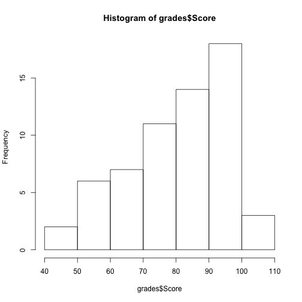
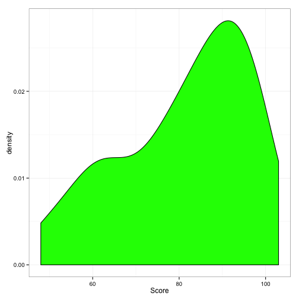

### Grades from the First Opportunity to Excel


```r
grades <- read.csv("../Data/GT1.csv")
str(grades)
```

```
## 'data.frame':	61 obs. of  1 variable:
##  $ Score: int  101 101 97 97 97 96 96 96 95 93 ...
```

```r
hist(grades$Score)
library(ggplot2)
```

 

```r
ggplot(data = grades, aes(x = Score)) + geom_density(fill = "green") + theme_bw()
```

 

```r
median(grades$Score)
```

```
## [1] 85
```

```r
IQR(grades$Score)
```

```
## [1] 22
```

```r
sd(grades$Score)
```

```
## [1] 14.85
```

