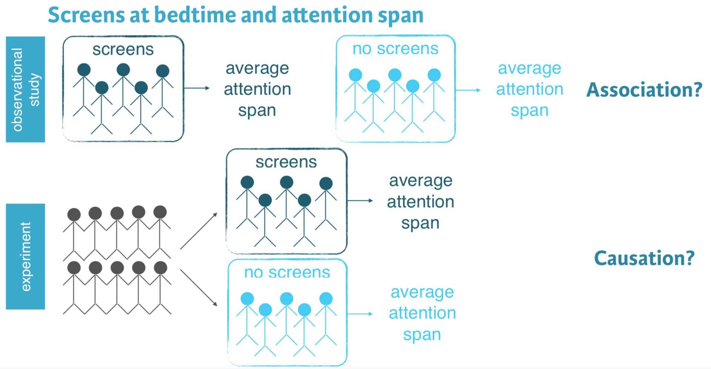
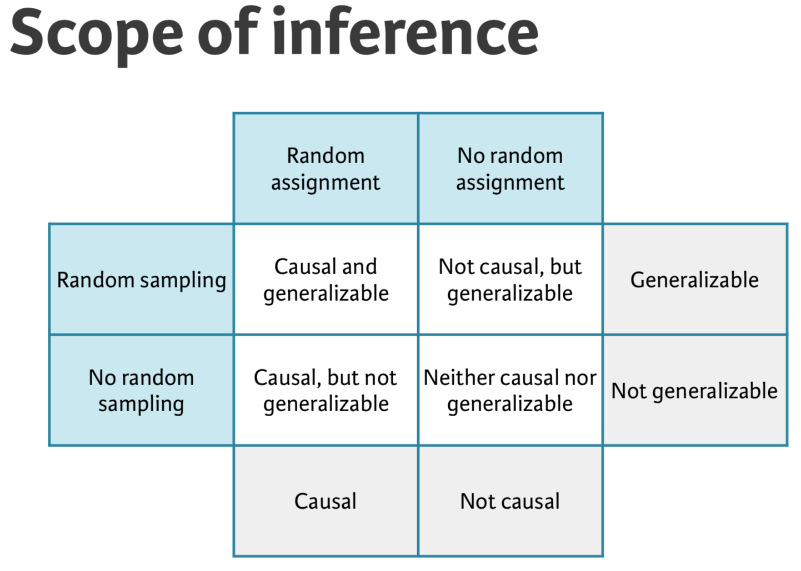

```{r label = "setup", include = FALSE}
knitr::opts_chunk$set(echo = TRUE, comment = NA, message = FALSE, warning = FALSE)
```

# Chapter One

What is **Data**?

> Data is any collection of numbers, characters, images, or other items that provide information about something. 

For **Data** to be useful, you should be able to answer **Who** and **What** at a minimum.  --- Better to be able to answer who, what, when, where, why, and how.

### High School and Beyond

* Use `head()` and `tail()`
* Use `str()`
* If on PC to insert R code chunk use `CTRL ALT I`
* If on a MAC to insert R code chunk use `ALT COMMAND I`

```{r}
library(openintro)
head(hsb2, n = 3)
str(hsb2)
```

* Using `datatable()` from `DT`

```{r, echo = FALSE}
library(DT)
datatable(hsb2)
```

### Tables

```{r}
table(hsb2$schtyp)
# or
xtabs(~schtyp, data = hsb2)
```

### Use `filter()` to subset (part of `dplyr`)

```{r}
library(dplyr)
hsb2_public <- hsb2 %>% 
  filter(schtyp == "public")
table(hsb2_public$schtyp)
# or
xtabs(~schtyp, data = hsb2_public)
```
### Drop (unused) levels

```{r}
hsb2_public$schtyp <- droplevels(hsb2_public$schtyp)
table(hsb2_public$schtyp)
# Or
xtabs(~schtyp, data = hsb2_public)
```

### Discretizing a variable

#### Average reading score

```{r}
(avg_read <- mean(hsb2$read))

hsb2_mine <- hsb2 %>%
  mutate(read_cat = ifelse(read < avg_read, 
                           "below average", 
                           "at or above average")) %>% 
  select(id, read, read_cat)
DT::datatable(hsb2_mine)
```


```{r, fig.align = "center"}
library(ggplot2)
ggplot(data = hsb2, aes(x = science, y = math, color = prog)) + 
  geom_point() + 
  geom_smooth(method = "lm", se = FALSE) + 
  theme_bw()
```

# Chapter 2

## Types of studies

* Observational study:
  + collect data in a way that does not directly interfere with how the data arise
  + Only association can be inferred
  
* Experiment:
  + Randomly assign subject to various treatments
  + Causation can be inferred

```{r, echo = FALSE}

```

```{r, echo = FALSE}

```

## Simpson's Paradox

### Number of males and females admitted

The goal of this exercise is to determine the numbers of male and female applicants who got admitted and rejected. Specifically, we want to find out how many males are admitted and how many are rejected. And similarly we want to find how many females are admitted and how many are rejected.

To do so we will use the `count()` function from the `dplyr` package.

In one step, `count()` groups the data and then tallies the number of observations in each level of the grouping variable. These counts are available under a new variable called `n`.

Pass the gender and admission status columns to `count()` on the `ucb_admit` dataset (created below) to count how many of each gender are admitted and how many are rejected.

```{r}
# Creating ucb_admit
UCB <- as.data.frame(UCBAdmissions)
ucb_admit <- vcdExtra::expand.dft(UCB)
#
ucb_counts <- ucb_admit %>%
  count(Gender, Admit)
# View result
ucb_counts
# Spread
library(tidyr)
ucb_counts %>% 
  spread(Admit, n)
```

### Proportion of males admitted overall

Next we will calculate the percentage of males and percentage of females admitted, by creating a new variable, called `prop` (short for proportion) based off of the counts calculated in the previous exercise and using the `mutate()` from the `dplyr` package.

Proportions for each row of the data frame we created in the previous exercise (`ucb_counts`) can be calculated as `n / sum(n)`. Note that since the data are grouped by gender, `sum(n)` will be calculated for males and females separately.

* Group the data by gender (`group_by()`)
* Create the new variable described above, `prop`, the proportion of males and females admitted.
* Filter the data for those who are admitted so that the resulting data frame only contains proportions of males and females who are admitted.
* Which gender has a higher admission rate, male or female?


```{r}
ucb_counts %>%
  # Group by gender
  group_by(Gender) %>%
  # Create new variable
  mutate(prop = n / sum(n)) %>%
  # Filter for admitted
  filter(Admit == "Admitted")
```

```{r}
ucb_admit %>%
  # Table of counts of admission status and gender
  count(Admit, Gender) %>%
  # Spread output across columns based on admission status
  spread(Admit, n) %>%
  # Create new variable
  mutate(Perc_Admit = Admitted / (Admitted + Rejected))  
```

**Note:** Males have the higher admission rate!  Is this sex discrimination?

## Proportion of males admitted for each department

Finally we will make a table similar to the one we constructed earlier, except we will first group the data by department. The goal is to compare the proportions of male admitted students across departments.

Proportions for each row of the data frame we create can be calculated as `n / sum(n)`. Note that since the data are grouped by department and gender, `sum(n)` will be calculated for males and females separately for each department.

Assign `ucb_admission_counts` as the `count()` of `ucb_admit` by department, gender, and admission status.

```{r}
ucb_admission_counts <- ucb_admit %>%
  count(Dept, Gender, Admit)
# See the result
ucb_admission_counts  
```

* Group `ucb_admission_counts` by department then gender.
* Add a new column, `prop`, which is the ratio of those admitted or rejected by department and gender.
* Filter the rows for males and for those who are admitted.


```{r}
ucb_admission_counts  %>%
  # Group by department, then gender
  group_by(Dept, Gender) %>%
  # Create new variable
  mutate(prop = n/sum(n)) %>%
  # Filter for male and admitted
  filter(Gender == "Male", Admit == "Admitted")
```

**Note:**  The proportion of males admitted varies wildly between departments!

```{r}
ND2 <- ucb_admission_counts  %>%
  # Group by department, then gender
  group_by(Dept, Gender) %>%
  # Create new variable
  mutate(prop = n/sum(n)) %>% 
  filter(Admit == "Admitted")
ND2
library(ggplot2)
ggplot(data = ND2, aes(x = Dept, y = prop, fill = Gender)) +
  geom_bar(stat = "identity", position = "dodge") + 
  theme_bw()
```


```{r}
ND <- UCB %>% 
  group_by(Dept, Gender) %>% 
  mutate(prop = Freq/sum(Freq)) %>% 
  filter(Admit == "Admitted")
ND
```

```{r}
ggplot(data = ND, aes(x = Dept, y = prop, fill = Gender)) +
  geom_bar(stat = "identity", position = "dodge") + 
  theme_bw()
```

# Why sample?

* Why not take a census?


## Using `gapminder`

```{r}
library(gapminder)
gapminder
```


## Sampling

```{r}
set.seed(123)
library(openintro)
library(dplyr)
data(county)
county_noDC <- county %>% 
  filter(state != "District of Columbia") %>% 
  droplevels()
county_srs <- county_noDC %>% 
  sample_n(size = 150)
glimpse(county_srs)
```

```{r}
county_srs %>% 
  group_by(state) %>% 
  count()
```

## Stratified sampling

```{r}
set.seed(123)
county_str <- county_noDC %>% 
  group_by(state) %>% 
  sample_n(size = 3)
glimpse(county_str)
```

### Simple random sample in R

Suppose we want to collect some data from a sample of eight states. A list of all states and the region they belong to (Northeast, Midwest, South, West) are given in the `us_regions` data frame.

```{r}
load("./DATA/us_regions.RData")
head(us_regions)
```

* Use simple random sampling to select eight states from `us_regions`. Save this sample in a data frame called `states_srs`.

* Count the number of states from each region in your sample.

```{r}
set.seed(2)
states_srs <- us_regions %>% 
  sample_n(size = 8)
#
states_srs %>% 
  count(region)
```

Notice that this strategy may select an unequal number of states from each region. In the next exercise, you'll implement stratified sampling to be sure to select an equal number of states from each region.

## Stratified sample in R

In the previous exercise, we took a simple random sample of eight states. However, we did not have any control over how many states from each region got sampled. The goal of stratified sampling in this context is to have control over the number of states sampled from each region. Our goal for this exercise is to sample an equal number of states from each region.

* Use stratified sampling to select a total of eight states, where each stratum is a region. Save this sample in a data frame called `states_str`.

* Count the number of states from each region in your sample to confirm that each region is represented equally in your sample.

```{r}
states_str <- us_regions %>% 
  group_by(region) %>% 
  sample_n(size = 2)
states_str
states_str %>% 
  count(region)
```

In this stratified sample, each stratum (i.e. Region) is represented equally.

## Principles of experimental design

* **Control:** compare treatment of interest to a control group
* **Randomize:** randomly assign subjects to treatments
* **Replicate:** collect a sufficiently large sample within a study, or replicate the entire study
* **Block:** account for the potential effect of confounding variables

**Explanatory** variables are conditions you can impose on the experimental units, while **Blocking** variables are characteristics that the experimental units come with that you would like to control.

In random sampling, we use **stratifying** to control for a variable.  In random assignment, we use **blocking** to achieve the same goal.

# Chapter 4

## Inspect the data

The purpose of this chapter is to give you an opportunity to apply and practice what you've learned on a real world dataset. For this reason, we'll provide a little less guidance than usual.

```{r, echo = FALSE}
load("./DATA/evals.RData")
```

The data from the study described in the video are available in your workspace as `evals`. Let's take a look!

```{r}
str(evals)
glimpse(evals)
```

> Note that this is an observational study!

The data from this study were gathered by **randomly sampling** classes.

### Identify variable types

It's always useful to start your exploration of a dataset by identifying variable types. The results from this exercise will help you design appropriate visualizations and calculate useful summary statistics later in your analysis.

* Explore the `evals` data once again with the following goals in mind: (1) Identify each variable as numerical or categorical. (2) If numerical, determine if it is discrete or continuous. (3) If categorical, determine if it is ordinal or not.

* We've created a vector of variable names in the editor called `cat_vars`. To test your understanding of the data, remove the names of any variables that are not categorical.


```{r}
# Remove non-factor variables from this vector
cat_vars <- c("score", "rank", "ethnicity", "gender", "language", "age", "cls_students", "cls_level", "cls_profs", "cls_credits", "bty_avg", "pic_outfit", "pic_color")
cat_vars <- c("rank", "ethnicity", "gender", "language",   "cls_level", "cls_profs", "cls_credits", "pic_outfit", "pic_color")
```

### Recode a variable

The `cls_students` variable in `evals` tells you the number of students in the class. Suppose instead of the exact number of students, you're interested in whether the class is

* "small" (18 students or fewer),
* "midsize" (19 - 59 students), or
* "large" (60 students or more).

* Recode the `cls_students` variable into a new variable, `cls_type`, using `case_when()`. This new variable should have three levels as described above. Save the resulting data frame (with the new variable) as `evals`.

* What type of variable is `cls_type`? (factor)

```{r}
# Recode cls_students as cls_type: evals
evals <- evals %>%
  mutate(cls_type = ifelse(cls_students <= 18, "small", 
                      ifelse(cls_students <= 59, "midsize", "large"))) 

xtabs(~cls_type, data = evals) 
evals %>%
 count(cls_type)
```

### Create a scatterplot

The `bty_avg` variable shows the average beauty rating of the professor by the six students who were asked to rate the attractiveness of these faculty. The `score` variable shows the average professor evaluation score, with 1 being very unsatisfactory and 5 being excellent.

* Use `ggplot()` to create a scatterplot displaying the relationship between these two variables.

* How would you describe the relationship apparent in this visualization?

```{r}
library(ggplot2)
ggplot(data = evals, aes(x = bty_avg, y = score)) +
  geom_point() +
  theme_bw()
```

### Create a scatterplot, with an added layer

Suppose you are interested in evaluating how the relationship between a professor's attractiveness and their evaluation score varies across different class types (small, midsize, and large).

* Recreate your visualization from the previous exercise, but this time coloring the points by class type.

* How would you describe the relationship apparent in this visualization?

```{r}
library(ggplot2)
ggplot(data = evals, aes(x = bty_avg, y = score, color = cls_type)) +
  geom_point() +
  theme_bw() + 
  labs(x = "Average Beauty Score") + 
  geom_smooth(se = FALSE)
```

