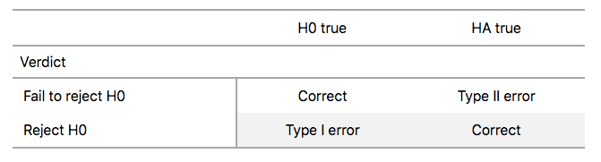

```{r setup, include=FALSE}
knitr::opts_chunk$set(echo = TRUE, comment = NA, warning = FALSE, message = FALSE, fig.align='center')
```


# Topics for the next three weeks

## By the end of week 13:  


- Theory-based confidence intervals (CI for difference in Means, CI for proportions, and coverage probabilities)
- Bootstrap $t$ Confidence Interval 
- Hypothesis Testing: Promotion activity, understanding hypothesis tests
- Conducting and interpreting hypothesis testing

# Theory-based confidence intervals


## Needed packages


```{r}
library(tidyverse)
library(moderndive)
library(infer)
library(resampledata)
library(PASWR2)
```


## Confidence Intervals for a Difference in Means

Let $X$ and $Y$ be random variables with $X\sim N(\mu_1, \sigma_1)$ and $Y\sim N(\mu_2, \sigma_2)$. Then:
$$X-Y\sim N\left(\mu_1-\mu_2, \sqrt{\frac{\sigma_1^2}{n_1}+\frac{\sigma_2^2}{n_2}}\right)$$

Of course, in practice we usually do not know the population variances, so we will plug in the sample variances. As in the single-sample case, we call this a $t$ statistic:
 $$T=\frac{(\bar{X}-\bar{Y})-(\mu_X-\mu_Y)}{\sqrt{\frac{S^2_X}{n_X}+\frac{S^2_Y}{n_Y}}}$$

The exact distribution of this statistic is an unsolved problem. It does, however, have approximately a $t$ distribution if the populations are normal. 
 

## Confidence Intervals for a Difference in Means

The difficult part is the degrees of freedom. The degrees of freedom are given with Welch’s approximation:
$$\nu=\frac{\left(\frac{S^2_X}{n_X}+\frac{S^2_Y}{n_Y}\right)^2}{\frac{\left(\frac{S^2_X}{n_X}\right)^2}{n_X-1}+\frac{\left(\frac{S^2_Y}{n_Y}\right)^2}{n_Y-1}}.$$

- If $X_i\sim N(\mu_X, \sigma_X)$, $i=1, \ldots, n_X$ and $Y_j\sim N(\mu_Y, \sigma_Y)$, $j=1, \ldots, n_Y$ then an approximate $(1-\alpha)\times 100\%$ confidence interval for $\mu_X-\mu_Y$ is given by:

$$\scriptstyle CI_{1-\alpha}(\mu_X-\mu_Y)=\left(\bar{X}-\bar{Y}-t_{1-\alpha/2;\nu}\times \sqrt{\frac{S_X^2+S_Y^2}{n_X+n_Y}},\bar{X}-\bar{Y}+t_{1-\alpha/2;\nu}\times \sqrt{\frac{S_X^2+S_Y^2}{n_X+n_Y}}\right)$$


## Example 1


\begin{tcolorbox}
Construct a $90\%$ confidence interval for $\mu_X-\mu_Y$ using the information in `CALCULUS` which provides the assessment scores for students enrolled in a biostatistics course according to whether they had completed a calculus course prior to enrolling in the biostatistics course. Before constructing a confidence interval, one should verify the assumptions needed to have a valid confidence interval. In this case we need to check for normality of both samples.
\end{tcolorbox}


## Example 1

\small
```{r, out.height = '50%', out.width = '70%'}
ggplot(data = CALCULUS, aes(sample = score, color = calculus)) + 
  stat_qq() + 
  stat_qq_line() +
  theme_bw()
```
\normalsize


## Example 1


\small
```{r}
CALCULUS %>% 
  group_by(calculus) %>% 
  summarize(Mean = mean(score), n = n(), SD = sd(score))
```
\normalsize

Because of the degrees of freedom, it is easier to use technology to get the CI. 


## Example 1

\tiny
```{r}
t.test(score ~ calculus, data = CALCULUS, conf.level = 0.90)
t.test(score ~ calculus, data = CALCULUS, conf.level = 0.90)$conf.int -> TTCI
TTCI
```
\normalsize


## Example 1

Compare to bootstrap CI:
\tiny
```{r}
library(infer)
CI <- CALCULUS %>% 
  specify(score ~ calculus) %>% 
  generate(reps = 1000, type = "bootstrap") %>% 
  calculate(stat = "diff in means", order = c("No", "Yes"))
get_ci(CI, level = 0.90)
# Compare to Theoretical T CI below
TTCI
```
\normalsize


## Confidence Intervals for a Difference in Means

- If the confidence interval for the difference in means contains 0, then we cannot rule out the possibility that the means might be the same, $\mu_X-\mu_Y=0$ or, equivalently, $\mu_X=\mu_Y$.


- Skewness is less of an issue for the two-sample $t$ confidence intervals than for one-sample intervals, because the skewness from the two samples tends to cancel out. 

    - In particular, if the populations have the same skewness and variance and the sample sizes are equal, then the skewness cancels out exactly, and the distribution of $t$ statistics can be very close to a $t$ distribution even for quite small samples.


## Example 2


\begin{tcolorbox}
Consider the weights of boy and girl babies born in Texas in 2004. Construct a $95\%$ $t$ confidence interval for the mean difference in weights (boys -girls).
\end{tcolorbox}


We will use the `TXBirths2004` from the `resampledata` package.


## Example 2

\tiny
```{r, out.height = '50%',out.width = '70%'}
Texas <- TXBirths2004
ggplot(data = Texas, aes(x = Weight)) + 
  geom_histogram(fill = "blue", color = "black") + 
  facet_grid(rows = vars(Gender)) + 
  theme_bw()
```
\normalsize


## Example 2

\tiny
```{r, out.height = '60%',out.width = '80%'}
ggplot(data = Texas, aes(sample = Weight)) + 
  stat_qq(color = rgb(0, 0, 1, 0.15)) + 
  facet_grid(rows = vars(Gender)) + 
  theme_bw()
```
\normalsize


## Example 2

\tiny
```{r}
t.test(Weight ~ Gender, data = Texas)
Texas$Gender <- factor(Texas$Gender, levels = c("Male", "Female"))
t.test(Weight ~ Gender, data = Texas)
```
\normalsize


## Confidence Intervals for Proportions

\begin{tcolorbox}
In 2010, according to an AP-Gfk Poll conducted on October 13-18, $59\%$ of 846 likely voters responded that they felt things in this country were heading in the wrong direction (http:www.ap-gfkpoll.com/poll.archive.html). 
\end{tcolorbox}


- Let $X$ denote the number of likely voters in a sample of size $n$ who think the country is headed in the wrong direction.

- We assume $X$ is binomial, $X\sim Bin(n, p)$. 

- We know that the proportion of likely voters, $\hat{p}=\frac{X}{n}$ is an unbiased estimator of $p$ and for large $n$. 
$$Z=\frac{\hat{p}-p}{\sqrt{\frac{p(1-p)}{n}}}$$
is approximately standard normal.


## Confidence Intervals for Proportions

Thus: 
$$P\left(-z_{1-\alpha/2}<\frac{\hat{p}-p}{\sqrt{\frac{p(1-p)}{n}}}<z_{1-\alpha/2}\right)\approx 1-\alpha $$
This gives:
$$\frac{\hat{p}-p}{\sqrt{\frac{p(1-p)}{n}}}=\pm z_{\alpha/2}$$

At this point the different methods diverge. 

## The Wald method 

The traditional Wald method completes the algebra to the following step before making an approximation:

$$CI_{1 - \alpha}(p) = \hat{p}\pm z_{\alpha/2}\sqrt{\frac{p(1-p)}{n}}$$


At this point the Wald method replaces the population values $p$ and $q$ in the right side of the equation with their approximations $\hat{p}$ and $\hat{q}$ to obtain the traditional Wald confidence interval formula for a proportion:
$$CI_{1 - \alpha}(p)=\hat{p}\pm z_{\alpha/2}\sqrt{\frac{\hat{p}(1-\hat{p})}{n}}$$


## The Wald method 

\begin{tcolorbox}
In 2010, according to an AP-Gfk Poll conducted on October 13-18, $59\%$ of 846 likely voters responded that they felt things in this country were heading in the wrong direction (http:www.ap-gfkpoll.com/poll.archive.html). Find a $95\%$ confidence interval. 
\end{tcolorbox}

\begin{tcolorbox}
For a $95\%$ confidence interval using $\hat{p}=0.59$, $n=846$ and $z_{\alpha/2}=1.96$ , we have
$$0.59\pm 1.96\sqrt{\frac{0.59(0.41)}{846}}=(0.5569,0.6231)$$
\end{tcolorbox}


## The Wald method 

\small
```{r}
x <- 0.59*846
n <- 846
phat <- x/n
phat + c(-1, 1)*qnorm(.975)*sqrt(phat*(1 - phat)/n)
library(binom)
binom.confint(x = .59*846, n = 846, methods = "asymptotic")
```
\normalsize

## The Agresti-Coull Interval for a Proportion

Agresti and Coull (1998) considered the $95\%$ confidence interval for which the 0.975 quantile is $z_{0.975}\approx1.96$, and hence $z^2_{0.975}\approx 4$

- If $X$ denotes the number of successes in a sample of size $n$, let $\tilde{X}=X+2$, $\tilde{n}=n+4$, and $\tilde{p}=\frac{\tilde{X}}{\tilde{n}}$. 

Then the $(1-\alpha)\times 100$ confidence interval is given by:
$$CI_{1 - \alpha}(p) = \tilde{p}\pm z_{\alpha/2}\sqrt{\frac{\tilde{p}(1-\tilde{p})}{\tilde{n}}}$$


## The Agresti-Coull Interval for a Proportion

\begin{tcolorbox}
In 2010, according to an AP-Gfk Poll conducted on October 13-18, $59\%$ of 846 likely voters responded that they felt things in this country were heading in the wrong direction (http:www.ap-gfkpoll.com/poll.archive.html). Find a $95\%$ confidence interval. 
\end{tcolorbox}

\begin{tcolorbox}
For a $95\%$ confidence interval using $\hat{p}=0.59$, $n=846$ and $z_{\alpha/2}=1.96$ , we have $\tilde{X}=0.59(846)+2=501.14$, $\tilde{n}=846+4=850$ and $\tilde{p}=0.5896$
$$CI_{1 - \alpha}(p)=0.5896\pm 1.96\sqrt{\frac{0.5896(0.4104)}{850}}=(0.5565,0.6226)$$
\end{tcolorbox}


## The Agresti-Coull Interval for a Proportion

\small
```{r}
xtilde <- 0.59*846 + 2
ntilde <- 846 + 4
ptilde <- xtilde/ntilde
ptilde + c(-1, 1)*qnorm(.975)*sqrt(ptilde*(1 - ptilde)/ntilde)
# Or
binom.confint(x = .59*846, n = 846, methods = "ac")
```
\normalsize


## Wilson Score method

The Wilson Score method does not make the approximation to the equation below
$$CI_{1 - \alpha}(p)=\hat{p}\pm z_{\alpha/2}\sqrt{\frac{p(1-p)}{n}}$$

The result is more involved algebra (which involves solving a quadratic equation), and a more complicated solution.

- The result is the Wilson Score confidence interval for a proportion:
$$CI_{1-\alpha}(p)=\frac{\hat{p}+\frac{z^2_{\alpha/2}}{2n}\pm z_{\alpha/2}\sqrt{\frac{\hat{p}(1-\hat{p})}{n}+\frac{z^2_{\alpha/2}}{4n^2}}}{1+\frac{z^2_{\alpha/2}}{n}}$$


## Wilson Score method


\begin{tcolorbox}
In 2010, according to an AP-Gfk Poll conducted on October 13-18, $59\%$ of 846 likely voters responded that they felt things in this country were heading in the wrong direction (http:www.ap-gfkpoll.com/poll.archive.html). Find a $95\%$ confidence interval. 
\end{tcolorbox}

\begin{tcolorbox}
For a $95\%$ confidence interval using $\hat{p}=0.59$, and $n=846$ we have:
$$p=\frac{0.59+\frac{1.96^2}{2(846)}\pm 1.96\sqrt{\frac{0.59(0.41)}{846}+\frac{1.96^2}{4(846^2)}}}{1+\frac{1.96^2}{846}}=(0.5565,0.6227)$$
\end{tcolorbox}


## Wilson Score method

\tiny
```{r}
prop.test(x = 499.14, n = 846, conf.level = 0.95, correct = FALSE)
# Or
binom.confint(x = .59*846, n = 846, methods = "wilson")
```
\normalsize


## Example 


\begin{tcolorbox}
A political candidate prepares to conduct a survey to gauge voter support for his candidacy for senator. He would like a confidence interval with an error of at most $4\%$, with $95\%$ confidence. How large should the sample size be for the survey? 
\end{tcolorbox}


\begin{tcolorbox}
Solution:  Since the Agresti-Coull interval is symmetric, the margin of error is $1.96\sqrt{\frac{\tilde{p}(1-\tilde{p})}{\tilde{n}}}$. Thus, we want to solve for $\tilde{n}$ in 
$$1.96\sqrt{\frac{\tilde{p}(1-\tilde{p})}{\tilde{n}}}\leq 0.04$$
Unfortunately, we do not know $\tilde{p}$. If we did, the candidate would not need to conduct the survey! We will use $\tilde{p}=0.5$ since this will maximize the expression under the radical sign. 

\end{tcolorbox}


## Example 

\tiny
```{r, out.height = '40%', out.width = '60%'}
ptilde <- seq(0, 1, length = 1000)
fptilde <- sqrt(ptilde*(1 - ptilde))
plot(ptilde, fptilde, type = "l", ylab = "", xlab =expression(tilde(p)))
```
\normalsize

$$1.96\sqrt{\frac{0.5(1-0.5)}{\tilde{n}}}\leq 0.04$$


## Example 

Solving for $\tilde{n}$ yields
$$\left(\frac{1.96(0.5)}{0.04}\right)^2\leq \tilde{n} \implies \tilde{n}\geq 600.25$$

Then
$$n\geq 596.25$$
\tiny
```{r}
ntilde <- (1.96*(0.5)/0.04)^2
n <- ntilde - 4
n <- ceiling(n)
n
```
\normalsize


## Coverage Probabilities of Binomial Confidence Intervals

- Suppose a new process for making a prescription drug is in development.

    - Of $n=30$ trial batches made with the current version of the process, 
    - $X=24$ batches give satisfactory results. 
    - Then $\hat{p}=24/30=0.8$ estimates the population proportion $p=P(Success)$ of satisfactory batches with the current version of the process. 
    
- Wondering how near $\hat{p}$ might be to $p$, the investigators use the Wald CI method:
$$CI_{1 - \alpha}(p) =\hat{p}\pm z_{\alpha/2}\sqrt{\frac{\hat{p}(1-\hat{p})}{n}}$$

to obtain the approximate $95\%$ confidence interval $0.8 \pm 0.1431355$ or $(0.6568645, 0.9431355)$

## Coverage Probabilities of Binomial Confidence Intervals

The question is whether a $95\%$ level of confidence in the resulting interval is warranted. 

- If the Wald CI method is used repeatedly, in what proportion of instances does it yield an interval that covers the true value $p$? 

    - If Wald CI method is valid here, then the simple answer ought to be $95\%$.
    - Unfortunately, there is no simple answer to this question. It turns out that the coverage probability depends on the value of $p$. 


## Coverage Probabilities of Binomial Confidence Intervals

- Now choose a particular value of $p$, say $p=0.8$, so that 

    - $X$ has a binomial distribution with $n=30$ trials and probability of success $(p=0.8)$. 
    - $X\sim Bin(n=30, p=0.8)$.
    - The vector of prob of the 31 probabilities $P(X=x)$, $X=0, 1, \ldots, 30$ in this distribution is found. 

- Next, we determine which of the 31 confidence intervals cover the value $p=0.8$.

    -  Finally, the coverage probability is computed: It is the sum of the probabilities corresponding to values of $x$ that yield intervals covering $p$.


## Coverage Probabilities of Binomial Confidence Intervals

\tiny
```{r}
alpha <- 0.05
n <- 30   # number of trials
x <- 0:n  
sp <- x/n # sample proportion
m.err <- qnorm(1 - alpha/2)*sqrt(sp*(1 - sp)/n)
lcl <- sp - m.err
ucl <- sp + m.err
pp <- 0.8   # pp = P(Success)
prob <- dbinom(x, n, pp)
cover <- (pp >= lcl) & (pp <= ucl)  # vector of 0s and 1s
RES <- round(cbind(x, sp, lcl, ucl, prob, cover), 4)
RES[19:30, ]
sum(dbinom(x[cover], n, pp))  # total coverage prob at pp
```
\normalsize


## Coverage Probabilities of Binomial Confidence Intervals

Now use $p=0.79$
\tiny
```{r}
alpha <- 0.05
n <- 30   # number of trials
x <- 0:n  
sp <- x/n # sample proportion
m.err <- qnorm(1 - alpha/2)*sqrt(sp*(1 - sp)/n)
lcl <- sp - m.err
ucl <- sp + m.err
pp <- 0.79   # pp = P(Success)
prob <- dbinom(x, n, pp)
cover <- (pp >= lcl) & (pp <= ucl)  # vector of 0s and 1s
RES <- round(cbind(x, sp, lcl, ucl, prob, cover), 4)
#RES[18:31, ]
sum(dbinom(x[cover], n, pp))  # total coverage prob at pp
```
\normalsize


## Coverage Probabilities of Binomial Confidence Intervals

We step through two thousand values of $p$ from near 0 to near 1. Subsequently plot coverage probability versus $p$. 


\tiny
```{r, eval=FALSE}
par(mfrow=c(2, 2))
for(alpha in c(0.01, 0.02, 0.05, 0.10)){
n <- 30     # number of trials
CL <- 1 - alpha
x <- 0:n 
adj <- 0    #(2 for Agresti-Coull)
k <- qnorm(1 - alpha/2)
sp <- (x + adj)/(n + 2*adj)
m.err <- k * sqrt(sp*(1 - sp)/(n + 2*adj))
lcl <- sp - m.err
ucl <- sp + m.err
m <- 2000 # number of values of pp
pp <- seq(1/n, 1 - 1/n, length = m)
p.cov <- numeric(m)
for(i in 1:m){
  cover <- (pp[i] >= lcl) & (pp[i] <= ucl)  # vector of 0s and 1s
  p.rel <- dbinom(x[cover], n, pp[i])
  p.cov[i] <- sum(p.rel)
}
plot(pp, p.cov, type = "l", ylim =c(0.60, 1.1), main = paste("n = ", n), 
     xlab = "p", ylab = "Coverage Probability")
lines(c(1/n, 1- 1/n), c(1 - alpha, 1- alpha), col = "red", lty = "dashed")
      text(0.5, CL + 0.05, paste("Targeted Confidence Level =", CL))
}
```
\normalsize


## Coverage Probabilities of Binomial Confidence Intervals


\tiny
```{r, echo = FALSE, out.height = '80%',out.width = '90%'}
par(mfrow=c(2, 2))
for(alpha in c(0.01, 0.02, 0.05, 0.10)){
n <- 30     # number of trials
CL <- 1 - alpha
x <- 0:n 
adj <- 0    #(2 for Agresti-Coull)
k <- qnorm(1 - alpha/2)
sp <- (x + adj)/(n + 2*adj)
m.err <- k * sqrt(sp*(1 - sp)/(n + 2*adj))
lcl <- sp - m.err
ucl <- sp + m.err
m <- 2000 # number of values of pp
pp <- seq(1/n, 1 - 1/n, length = m)
p.cov <- numeric(m)
for(i in 1:m){
  cover <- (pp[i] >= lcl) & (pp[i] <= ucl)  # vector of 0s and 1s
  p.rel <- dbinom(x[cover], n, pp[i])
  p.cov[i] <- sum(p.rel)
}
plot(pp, p.cov, type = "l", ylim =c(0.60, 1.1), main = paste("n = ", n), 
     xlab = "p", ylab = "Coverage Probability")
lines(c(1/n, 1- 1/n), c(1 - alpha, 1- alpha), col = "red", lty = "dashed")
      text(0.5, CL + 0.05, paste("Targeted Confidence Level =", CL))
}
```
\normalsize


## Coverage Probabilities of Binomial Confidence Intervals

Next consider the Agresti-Coull confidence intervals.


\tiny
```{r, eval = FALSE}
par(mfrow=c(2, 2))
for(alpha in c(0.01, 0.02, 0.05, 0.10)){
n <- 30     # number of trials
CL <- 1 - alpha
x <- 0:n 
adj <- 2  # 0 for large sample 2 for Agresti Coull
z <- qnorm(1 - alpha/2)
sp <- (x + adj)/(n + 2*adj)
m.err <- z*sqrt(sp*(1 - sp)/(n + 2*adj))
lcl <- sp - m.err
ucl <- sp + m.err
m <- 2000 # number of values of pp
pp <- seq(1/n, 1 - 1/n, length = m)
p.cov <- numeric(m)
for(i in 1:m){
  cover <- (pp[i] >= lcl) & (pp[i] <= ucl)  # vector of 0s and 1s
  p.rel <- dbinom(x[cover], n, pp[i])
  p.cov[i] <- sum(p.rel)
}
plot(pp, p.cov, type = "l", ylim =c(0.60, 1.1), main = paste("n = ", n), 
     xlab = "p", ylab = "Coverage Probability")
lines(c(1/n, 1- 1/n), c(1 - alpha, 1- alpha), col = "red", lty = "dashed")
      text(0.5, CL + 0.05, paste("Targeted Confidence Level =", CL))
}
```
\normalsize


## Coverage Probabilities of Binomial Confidence Intervals


\tiny
```{r, echo = FALSE, out.height = '80%', out.width = '90%'}
par(mfrow=c(2, 2))
for(alpha in c(0.01, 0.02, 0.05, 0.10)){
n <- 30     # number of trials
CL <- 1 - alpha
x <- 0:n 
adj <- 2  # 0 for large sample 2 for Agresti Coull
z <- qnorm(1 - alpha/2)
sp <- (x + adj)/(n + 2*adj)
m.err <- z*sqrt(sp*(1 - sp)/(n + 2*adj))
lcl <- sp - m.err
ucl <- sp + m.err
m <- 2000 # number of values of pp
pp <- seq(1/n, 1 - 1/n, length = m)
p.cov <- numeric(m)
for(i in 1:m){
  cover <- (pp[i] >= lcl) & (pp[i] <= ucl)  # vector of 0s and 1s
  p.rel <- dbinom(x[cover], n, pp[i])
  p.cov[i] <- sum(p.rel)
}
plot(pp, p.cov, type = "l", ylim =c(0.60, 1.1), main = paste("n = ", n), 
     xlab = "p", ylab = "Coverage Probability")
lines(c(1/n, 1- 1/n), c(1 - alpha, 1- alpha), col = "red", lty = "dashed")
      text(0.5, CL + 0.05, paste("Targeted Confidence Level =", CL))
}
```
\normalsize


## Coverage Probabilities of Binomial Confidence Intervals

Next we use Wilson score intervals to do the same thing.


\tiny
```{r eval = FALSE}
par(mfrow=c(2, 2))
for(alpha in c(0.01, 0.02, 0.05, 0.10)){
n <- 30     # number of trials
CL <- 1 - alpha
x <- 0:n 
z <- qnorm(1 - alpha/2)
sp <- x/n
sptilda <- (x + z^2/2)/(n + z^2)
m.err <- (z/(n + z^2))*sqrt(n*sp*(1 - sp) + z^2/4)
lcl <- sptilda - m.err
ucl <- sptilda + m.err
m <- 2000 # number of values of pp
pp <- seq(1/n, 1 - 1/n, length = m)
p.cov <- numeric(m)
for(i in 1:m){
  cover <- (pp[i] >= lcl) & (pp[i] <= ucl)  # vector of 0s and 1s
  p.rel <- dbinom(x[cover], n, pp[i])
  p.cov[i] <- sum(p.rel)
}
plot(pp, p.cov, type = "l", ylim =c(0.60, 1.1), main = paste("n = ", n), 
     xlab = "p", ylab = "Coverage Probability")
lines(c(1/n, 1- 1/n), c(1 - alpha, 1- alpha), col = "red", lty = "dashed")
      text(0.5, CL + 0.05, paste("Targeted Confidence Level =", CL))
}
```
\normalsize


## Coverage Probabilities of Binomial Confidence Intervals


\tiny
```{r echo = FALSE, out.height = '80%',out.width = '90%'}
par(mfrow=c(2, 2))
for(alpha in c(0.01, 0.02, 0.05, 0.10)){
n <- 30     # number of trials
CL <- 1 - alpha
x <- 0:n 
z <- qnorm(1 - alpha/2)
sp <- x/n
sptilda <- (x + z^2/2)/(n + z^2)
m.err <- (z/(n + z^2))*sqrt(n*sp*(1 - sp) + z^2/4)
lcl <- sptilda - m.err
ucl <- sptilda + m.err
m <- 2000 # number of values of pp
pp <- seq(1/n, 1 - 1/n, length = m)
p.cov <- numeric(m)
for(i in 1:m){
  cover <- (pp[i] >= lcl) & (pp[i] <= ucl)  # vector of 0s and 1s
  p.rel <- dbinom(x[cover], n, pp[i])
  p.cov[i] <- sum(p.rel)
}
plot(pp, p.cov, type = "l", ylim =c(0.60, 1.1), main = paste("n = ", n), 
     xlab = "p", ylab = "Coverage Probability")
lines(c(1/n, 1- 1/n), c(1 - alpha, 1- alpha), col = "red", lty = "dashed")
      text(0.5, CL + 0.05, paste("Targeted Confidence Level =", CL))
}
```
\normalsize


# Bootstrap $t$ Confidence Interval 

## Bootstrap $t$ Confidence Interval 


- The bootstrap percentile confidence interval for giving a range of plausible values for a parameter was introduced earlier. 

- Another confidence interval is the bootstrap $t$ interval that is based on estimating the actual distribution of the $t$ statistic from the data, rather than just assuming that the $t$ statistic has a Student’s $t$ distribution.


Recall the `Bangladesh` arsenic levels data. The distribution of arsenic levels was skewed right.

\tiny
```{r echo=TRUE,warning=FALSE, message=FALSE,out.height = '40%',out.width = '70%', fig.align='center'}
library(resampledata)
head(Bangladesh)
```
\normalsize

## Bootstrap $t$ Confidence Interval 


\tiny
```{r echo=TRUE,warning=FALSE, message=FALSE,out.height = '40%',out.width = '60%', fig.align='center'}
ggplot(data = Bangladesh, aes(x = Arsenic)) + 
  geom_histogram(fill = "blue", color = "black",
                 binwidth = 100) + 
  theme_bw()
```
\normalsize

To use the $t$ interval formula for the mean $\mu$ requires that the statistic
$$T=\frac{\bar{x}-\mu}{S/\sqrt{n}}$$
to follow a $t_{\nu}$. That seems unlikely for data this skewed.


## Bootstrap $t$ Confidence Interval 

Instead

- we bootstrap the $t$ statistic: for each of the $10^5$ resamples, 

- we compute 
    - the resample mean $\bar{X}^*$
    - resample standard deviation $S^*$

- and then compute the resample $T$ statistic 
$$T^*=\frac{\bar{X}^*-\bar{x}}{S^*/\sqrt{n}}$$


## Bootstrap $t$ Confidence Interval 


\tiny
```{r echo=TRUE,warning=FALSE, message=FALSE,out.height = '40%',out.width = '60%', fig.align='center'}
Arsenic <- subset(Bangladesh, select = Arsenic, drop = T)
xbar <- mean(Arsenic)
S <- sd(Arsenic)
N <- 10^5
n <- length(Arsenic)
Tstar <- numeric(N)
Sstar <- numeric(N)
Xbarstar <- numeric(N)
set.seed(13)
for (i in 1:N)
{
  x <-sample(Arsenic, size = n, replace = T)
  Xbarstar[i] <- mean(x)
  Sstar[i] <- sd(x)
}
Tstar <- (Xbarstar - xbar)/(Sstar / sqrt(n))
CIt <- quantile(Tstar, c(0.025, 0.975))
names(CIt) <- NULL
CIt
(BPCI <- quantile(Xbarstar, probs = c(0.025, 0.975)))
```
\normalsize


## Bootstrap $t$ Confidence Interval 


\tiny
```{r echo=TRUE,eval=FALSE,warning=FALSE, message=FALSE,out.height = '90%',out.width = '90%', fig.align='center'}
par(mfrow= c(2, 2))
plot(Xbarstar, Sstar, ylab = "S*", xlab = substitute(paste(bar(X),"*")), col = rgb(1,0,0,0.01))
qqnorm(Tstar, col = rgb(1,0,0,0.01))
qqline(Tstar)
hist(Tstar, xlab = "T*", main = "Bootstrap distribution of T*", col = "red", breaks = "Scott")
hist(Xbarstar, xlab = substitute(paste(bar(X),"*")), 
     main = substitute(paste("Bootstrap Distribution of ", bar(X),"*")), col = "red", breaks = "Scott")
```
\normalsize


## Bootstrap $t$ Confidence Interval 


\tiny
```{r echo=FALSE,warning=FALSE, message=FALSE,out.height = '80%',out.width = '90%', fig.align='center'}
par(mfrow= c(2, 2))
plot(Xbarstar, Sstar, ylab = "S*", xlab = substitute(paste(bar(X),"*")), col = rgb(1,0,0,0.01))
qqnorm(Tstar, col = rgb(1,0,0,0.01))
qqline(Tstar)
hist(Tstar, xlab = "T*", main = "Bootstrap distribution of T*", col = "red", breaks = "Scott")
hist(Xbarstar, xlab = substitute(paste(bar(X),"*")), main = substitute(paste("Bootstrap Distribution of ", bar(X),"*")), col = "red", breaks = "Scott")
```
\normalsize


## Bootstrap $t$ Confidence Interval 

- Note that the bootstrap distribution for the $t$ statistic is left skewed; 

    - in fact, it is more left skewed than the the bootstrap distribution of the mean which is right skewed! 

- The reason for this is the strong positive relationship between $\bar{X}^*$ and $S^*$. 

    - If a bootstrap resample contains a large number of the big values from the right tail of the original data, then $\bar{X}^*$ is large and hence $S^*$ is especially large (standard deviations are computed by squaring distances from the mean, so they are affected even more by large observations than a mean is). 
    - The large denominator thus keeps $T^*$ from being particularly large. 
    - Conversely, when there are relatively few of the big observations in the resample, then $\bar{X}^*-\bar{x}$ is negative and the denominator can be especially small, thus resulting in a $T$ ratio that is large negative.
 

## Bootstrap $t$ Confidence Interval 


- The $2.5\%$ and $97.5\%$ percentiles of the bootstrap $t$ distribution are -2.6546571 and 1.6559318, compared to $\pm1.968789$ for the Student’s $t$ distribution. 

    - This is a reflection of the skewed nature of the bootstrap $t$ distribution compared to the symmetric Student’s $t$ distribution.

- What skewness implies for the accuracy of the formula-based $t$ confidence intervals $(\bar{X}\pm t_{1-\alpha/2, \nu}\times S/\sqrt{n})$?

    - For right-skewed data, when $\bar{X}<\mu$, typically $S< \sigma$  so the confidence interval tends to be narrow, and the interval falls below $\mu$ more often than $\alpha/2\times 100\%$ of the time. This is bad.
    - Conversely, when $\bar{X}>\mu$, typically $S>\sigma$ so the intervals tend to be to wide and do not miss $\mu$ often enough; this is also bad.
    - Overall, the intervals tend to be to the left of where they should be and give a biased picture of where the mean is likely to be.


## Bootstrap $t$ Confidence Interval 

- Let 

    - $T=\frac{\bar{X}-\mu}{S/\sqrt{n}}$ and 
    - $F$ be the cdf for the $T$ statistic (the cdf of the sampling distribution)
    - $Q_1$ and $Q_2$ denote the $\alpha/2$ and $(1-\alpha/2)$ quantiles of this distribution; that is, $Q_1=F^{-1}(\alpha/2)$ and $Q_2=F^{-1}(1-\alpha/2)$. 
    
- Then:
$$1-\alpha=P(Q_1<T<Q_2)=P\left(Q_1<\frac{\bar{X}-\mu}{S/\sqrt{n}}<Q_2\right)$$

- This suggest the confidence interval:
$$CI_{1-\alpha}(\mu)=\left(\bar{X}-Q_2\frac{S}{\sqrt{n}},\bar{X}-Q_1\frac{S}{\sqrt{n}}\right)$$
\tiny
The quantiles $Q_1$ and $Q_2$ are unknown, but they can be estimated using quantiles of the bootstrap distribution of the $t$ statistic: $T^*=(\bar{X}^*-\bar{x})/(S^*/\sqrt{n})$
where $\bar{X}^*$ and $S^*$ are the mean and standard deviation of a bootstrap resample. 
\normalsize

## Bootstrap $t$ Confidence Interval 

- We use the standard error formula for every bootstrap sample because the bootstrap statistic should mimic $T=\frac{\bar{X}-\mu}{S/\sqrt{n}}$.

- Thus: $Q_1=`r CIt[1]`$ and $Q_2=`r CIt[2]`$, so we compute

\small
```{r}
LL <- xbar - CIt[2]*S/sqrt(n)
UL <- xbar - CIt[1]*S/sqrt(n)
(c(LL, UL))
```
\normalsize

- The $95\%$ bootstrap percentile interval is $(`r BPCI[1]`, `r BPCI[2]`)$ while the formula $t$ confidence interval is $(`r t.test(Arsenic)$conf[1]`, `r t.test(Arsenic)$conf[2]`)$

- The bootstrap $t$ interval is stretched further to the right, reflecting the right-skewed distribution of the data. 

- Because of the large sample size, we report the $95\%$ bootstrap $t$ confidence interval $(`r LL`, `r UL`)\mu$ $g/dL$. 


## Using the package `boot`

Next we consider computing the bootstrap percentile and $t$ confidence intervals using the functions `boot()` and `boot.ci()` functions from the package `boot`. 

- We write the function `mean.boot()` and use `mean.boot()` inside the `boot()` function storing the results in the object `boot.out`. 

- Finally, the function `boot.ci()` is applied to `boot.out` which results in the creation of the percentile and confidence intervals.


## Using the package `boot`

\tiny
```{r echo=TRUE,warning=FALSE, message=FALSE,out.height = '80%',out.width = '90%', fig.align='center'}
require(boot)
mean.boot <- function(data, i){
  d <- data[i]
  M <- mean(d)
  V <- var(d)/length(i)
  return(c(M, V))
}
boot.out <- boot(Arsenic, mean.boot, R=10^5)
boot.ci(boot.out, conf = 0.95, type = c("perc", "stud"))
```
\normalsize


## Using the package `boot`

\tiny
```{r echo=TRUE,warning=FALSE, message=FALSE,out.height = '45%',out.width = '80%', fig.align='center'}
plot(boot.out)
```
\normalsize


## Using the package `boot`


\tiny
```{r echo=TRUE,warning=FALSE, message=FALSE,out.height = '45%',out.width = '80%', fig.align='center'}
par(mfrow = c(1, 2))
hist(boot.out$t[,1], col = "pink", breaks = "Scott", main = "", 
     xlab = substitute(paste(bar(X),"*")), freq= FALSE)
lines(density(boot.out$t[,1]), lwd = 2)
hist((boot.out$t[,1] - boot.out$t0[1])/(boot.out$t[,2])^.5, col = "pink", breaks = "Scott", main = "", 
     xlab ="T*", freq= FALSE)
lines(density((boot.out$t[,1] - boot.out$t0[1])/(boot.out$t[,2])^.5), lwd = 2)
```
\normalsize

The bootstrap intervals for a difference in means follows the same idea.


## Bootstrap $t$ confidence interval for $\mu_1-\mu_2$

For each of many resamples, calculate the bootstrap $t$ statistic
$$T^*=\frac{\bar{X}^*_1-\bar{X}^*_2-(\bar{x}_1-\bar{x}_2)}{\sqrt{S^{2*}_1/n_1+S^{2*}_2/n_2}}$$

Let $Q_1^*$ and $Q_2^*$ be the empirical $\alpha/2$ and $(1-\alpha/2)$ quantiles of the bootstrap $t$ distribution, respectively. The bootstrap $t$ confidence interval is

$$\scriptstyle CI_{1-\alpha}(\mu_1-\mu_2)=\left((\bar{x}_1-\bar{x}_2))-Q_2^*\times\sqrt{S^{2*}_1/n_1+S^{2*}_2/n_2},(\bar{x}_1-\bar{x}_2))-Q_1^*\times\sqrt{S^{2*}_1/n_1+S^{2*}_2/n_2}\right)$$


Recall the `Verizon` example, where we considered the difference in means of two very skewed distributions of repair times for two very unbalanced samples ($n_1=23$ versus $n_2=1664$). Let us look at the data again.


## Verizon example

\tiny
```{r echo=TRUE,warning=FALSE, message=FALSE,out.height = '45%',out.width = '80%', fig.align='center'}
Time.ILEC <- subset(Verizon, select=Time, Group == "ILEC", drop=TRUE)
Time.CLEC <- subset(Verizon, select=Time, Group == "CLEC", drop=TRUE)
thetahat <- mean(Time.ILEC) - mean(Time.CLEC)
nx <- length(Time.ILEC)  #nx=1664
ny <- length(Time.CLEC)  #ny=23
SE <- sqrt(var(Time.ILEC)/nx + var(Time.CLEC)/ny)
N <- 10^4
Tstar <- numeric(N)
DM <- numeric(N)
set.seed(1)
for(i in 1:N)
{
  bootx <- sample(Time.ILEC, nx, replace=TRUE)
  booty <- sample(Time.CLEC, ny, replace=TRUE)
  Tstar[i] <- (mean(bootx) - mean(booty) - thetahat) /
    sqrt(var(bootx)/nx + var(booty)/ny)
  DM[i] <- mean(bootx) - mean(booty)
}
quantile(Tstar, c(.975, .025))
```
\normalsize


## Verizon example

\tiny
```{r echo=TRUE,warning=FALSE, message=FALSE,out.height = '45%',out.width = '80%', fig.align='center'}
CItboot <- thetahat - quantile(Tstar, c(.975, .025)) * SE
names(CItboot) <- NULL
CItboot
CIperct <- quantile(DM, c(0.025, 0.975))
CIperct
t.test(Time.ILEC, Time.CLEC)$conf
```
\normalsize

The more accurate bootstrap $t$ interval stretches farther in the negative direction, even more than the bootstrap percentile interval.


## Using the package boot for the difference in means

Bootstrap percentile and $t$ confidence intervals using the functions `boot()` and `boot.ci()` functions from the package `boot` are constructed using the user created `mean2.boot()` function.

\tiny
```{r echo=TRUE,warning=FALSE, message=FALSE,out.height = '45%',out.width = '80%', fig.align='center'}
require(boot)
mean2.boot <- function(data, i){
  d <- data[i, ]
  M <- tapply(d$Time, d$Group, mean)
  V <- tapply(d$Time, d$Group, var)/tapply(d$Time, d$Group, length)
  return(c(M[2] - M[1], V[2] + V[1]))
}
set.seed(1)
boot.out <- boot(Verizon, mean2.boot, R=10^4, strata = Verizon[ ,2])
boot.ci(boot.out, conf = 0.95, type = c("perc", "stud"))
```
\normalsize


## Using the package boot for the difference in means

\tiny
```{r echo=TRUE,warning=FALSE, message=FALSE,out.height = '45%',out.width = '80%', fig.align='center'}
plot(boot.out)
```
\normalsize


## Using the package boot for the difference in means

\tiny
```{r echo=TRUE,warning=FALSE, message=FALSE,out.height = '45%',out.width = '80%', fig.align='center'}
par(mfrow = c(1, 2))
hist(boot.out$t[,1], col = "pink", breaks = "Scott", 
     main = "", freq= FALSE, xlab = substitute(paste(bar(x)[1],"* - ", bar(x)[2],"*")))
lines(density(boot.out$t[,1]), lwd = 2)
hist((boot.out$t[,1] - boot.out$t0[1])/(boot.out$t[,2])^.5, col = "pink", breaks = "Scott", 
     main = "", xlab ="T*", freq= FALSE)
lines(density((boot.out$t[,1] - boot.out$t0[1])/(boot.out$t[,2])^.5), lwd = 2)
```
\normalsize


## Comparing Bootstrap $t$ and Formula $t$ Confidence Intervals

- Where the bootstrap does differ from classical inference is in how it handles skewness.

    - The bootstrap percentile interval and bootstrap $t$ interval are in general asymmetrical, with asymmetry depending on the sample.
    - These intervals estimate the skewness of a population from the skewness of the sample.
    - In contrast, classical $t$ intervals assume that the population has no underlying skewness (skewness is 0).
    
- Which is preferred? Frankly, neither, but rather something in between. 

    - This is an area that needs attention from statistical researchers. 
    - Until then, we will recommend the formula $t$ if $n\leq 10$, and the bootstrap $t$ otherwise; the reason being in large samples, we should put more trust in the data, in this case, the bootstrap $t$ is preferred.
    - Also, the bootstrap percentile makes less of a skewness correction than does the bootstrap $t$. For larger samples, the bootstrap $t$ is preferred.


# Hypothesis Testing

## Fundamental Question of Inference

How does what we observed in our data compare to what would happen if the null hypothesis were actually true and we repeated the process many times?

## Hypothesis Testing

- Now that we’ve studied confidence intervals,  let’s study another commonly used method for statistical inference: **hypothesis testing**.


- Hypothesis tests allow us to take a sample of data from a population and infer about the plausibility of competing hypotheses.


- The good news is we’ve already covered many of the necessary concepts to understand hypothesis testing.

    - We will expand further on these ideas and provide a general framework for understanding hypothesis tests. 


## Needed packages

Let’s load all the packages needed for this chapter 


\small
```{r}
library(tidyverse)
library(infer)
library(moderndive)
library(nycflights13)
library(ggplot2movies)
```
\normalsize


## Promotions activity


Let’s start with an activity studying the effect of gender on promotions at a bank.


- Say you are working at a bank in the 1970s and you are submitting your résumé to apply for a promotion. 

- Will your gender affect your chances of getting promoted?

- To answer this question, we’ll focus on data from a study published in the Journal of Applied Psychology in 1974.


## Promotions activity


To begin the study, 48 bank supervisors were asked to assume the role of a hypothetical director of a bank with multiple branches. 


- Every one of the bank supervisors was given a résumé and asked whether or not the candidate on the résumé was fit to be promoted to a new position in one of their branches.


- However, each of these 48 résumés were identical in all respects except one: the name of the applicant at the top of the résumé. 


- Of the supervisors, 

    - 24 were randomly given résumés with stereotypically “male” names, while     - 24 of the supervisors were randomly given résumés with stereotypically “female” names. 

- Since only gender varied from résumé to résumé, researchers could isolate the effect of this variable in promotion rates.


## Promotions activity

The `moderndive` package contains the data on the 48 applicants in the `promotions` data frame. 

\tiny
```{r}
promotions %>% 
  sample_n(size = 10) %>% 
  arrange(id)
```
\normalsize


## Promotions activity

Let’s perform an exploratory data analysis of the relationship between the two categorical variables `decision` and `gender`.

\tiny
```{r, out.height = '45%', out.width = '70%'}
ggplot(promotions, aes(x = gender, fill = decision)) +
  geom_bar() +
  labs(x = "Gender of name on résumé")
```
\normalsize

Observe that it appears that résumés with female names were much less likely to be accepted for promotion.


## Promotions activity


Let’s quantify these promotion rates

\tiny
```{r}
promotions %>% 
  group_by(gender, decision) %>% 
  tally()
```
\normalsize

- So of the 24 résumés 

    - with male names: $21/24=0.875=87.5\%$ were selected for promotion. 
    - with female names: $14/24=0.583=58.3\%$ were selected for promotion. 


Résumés with male names were selected for promotion at a rate $0.875 -0.583 = 0.292 = 29.2\%$ higher than résumés with female names. 


## Promotions activity


The question is, however, does this provide conclusive evidence that there is gender discrimination in promotions at banks? 


- Could a difference in promotion rates of $29.2\%$ still occur by chance, even in a hypothetical world where no gender-based discrimination existed? 

- In other words, what is the role of sampling variation in this hypothesized world? 

- To answer this question, we’ll again rely on a computer to run simulations.


## Promotions activity: Shuffling once

First, try to imagine a hypothetical universe where no gender discrimination in promotions existed.

- In such a hypothetical universe, the gender of an applicant would have no bearing on their chances of promotion

- Bringing things back to our `promotions` data frame, the `gender` variable would thus be an irrelevant label.

- If these `gender` labels were irrelevant, then we could randomly reassign them by “shuffling” them to no consequence!


## Promotions activity: Shuffling once

- To illustrate this idea, let’s narrow our focus to 6 arbitrarily chosen résumés of the 48.

    - The decision column shows that 3 résumés resulted in promotion while 3 didn’t. 

    - The gender column shows what the original gender of the résumé name was.
    
    -  The `shuffled_gender` shows a random “shuffle” values of gender.


```{r echo = FALSE, out.height = '40%',out.width = '70%'}

```


## Promotions activity: Shuffling once

- Again, such random shuffling of the gender label only makes sense in our hypothesized universe of no gender discrimination.

- How could we extend this shuffling of the gender variable to all 48 résumés by hand? 

- One way would be by using a standard deck of 52 playing cards,

```{r, echo = FALSE, out.height = '40%',out.width = '70%'}
knitr::include_graphics("week12_2.jpeg")
```

- By removing two red cards and two black cards, we would end up with 24 red cards and 24 black cards. 

## Promotions activity: Shuffling once

- After shuffling these 48 cards as seen below. 

```{r echo = FALSE, out.height = '40%',out.width = '70%'}
knitr::include_graphics("week12_3.jpeg")
```
- we can flip the cards over one-by-one, assigning “male” for each red card and “female” for each black card.


## Promotions activity: Shuffling once

We have one such shuffling in the `promotions_shuffled` data frame of the `moderndive` package:


\tiny
```{r echo=TRUE, warning=FALSE, message=FALSE,out.height = '40%',out.width = '70%', fig.align='center'}
ggplot(promotions_shuffled, 
       aes(x = gender, fill = decision)) +
  geom_bar() + 
  labs(x = "Gender of résumé name")
```
\normalsize

It appears the difference in “male names” versus “female names” promotion rates is now different. 

## Promotions activity: Shuffling once

Let’s also compute the proportion of résumés accepted for promotion for each group:

\tiny
```{r}
promotions_shuffled %>% 
  group_by(gender, decision) %>% 
  tally() # Same as summarize(n = n())
```
\normalsize

- So in this hypothetical universe of no discrimination:

    - $18/24=0.75=75\%$ of “male” résumés were selected for promotion.
    - $17/24=0.708=70.8\%$ of “male” résumés were selected for promotion.

Résumés with male names were selected for promotion at a rate $0.75 -0.708 = 0.042 = 4.2\%$ higher than résumés with female names. 


## Promotions activity: Shuffling 16 times

- We recruited 16 groups of our friends to repeat this shuffling exercise. 

- The distribution of the difference in promotion rates in shown below.

- The observed difference in promotion rate that occurred in real life ($0.292 = 29.2\%$) is depicted with a vertical red line.

```{r echo = FALSE, out.height = '40%',out.width = '70%'}
# 
set.seed(21)
promotions %>% 
  specify(formula = decision ~ gender, success = "promoted") %>% 
  hypothesize(null = "independence") %>% 
  generate(reps = 16, type = "permute") %>% 
  calculate(stat = "diff in props", order = c("male", "female")) -> ju
  ggplot(data = ju, aes(x = stat)) +
  geom_histogram(binwidth = 0.05, color = "white") + 
  xlim(-.4 ,.4) + 
  labs(x = "Difference in promotion rates (male - female)") +
  theme_bw() + 
  geom_vline(xintercept = .292, color = "red")
```


## Promotions activity: Shuffling 16 times


Things to note: 

- Observe first that the histogram is roughly centered at 0 (actual mean is `r mean(ju$stat)`). 

    - Saying that the difference in promotion rates is 0 is equivalent to saying that both genders had the same promotion rate. 
    - In other words, the center of these 16 values is consistent with what we would expect in our hypothesized universe of no gender discrimination.

- However, while the values are centered at 0, there is variation about 0.

    - Even in a hypothesized universe of no gender discrimination, you will still likely observe small differences in promotion rates because of chance **sampling variation**. 
    - Looking at the histogram, such differences could even be as extreme as `r min(ju$stat)` or `r max(ju$stat)`.
    
## Fundamental Question of Inference
    
- Ask yourself: 

    - In a hypothesized world of no gender discrimination, how likely would it be that we observe this difference $(0.292 = 29.2\%)$? 
    
    - What do these results say about our hypothesized universe of no gender discrimination?


## What did we just do?

What we just demonstrated in this activity is the statistical procedure known as **hypothesis testing** using a **permutation test** also referred to as **randomization test**. 

- The term “permutation” is the mathematical term for “shuffling”: taking a series of values and reordering them randomly, as you did with the playing cards.

- In fact, **permutations** are another form of **resampling**, like the bootstrap method you performed earlier. 

    - The bootstrap method involves resampling **with** replacement. 
    - The permutation method involves resampling **without** replacement.
    
## What did we just do?

In our previous example, we tested the validity of the hypothesized universe of no gender discrimination. 

\tiny
```{r}
set.seed(37)
promotions %>% 
  specify(formula = decision ~ gender, success = "promoted") %>% 
  hypothesize(null = "independence") %>% 
  generate(reps = 1000, type = "permute") %>% 
  calculate(stat = "diff in props", order = c("male", "female")) -> null_distribution
get_pvalue(null_distribution, obs_stat= .292, direction = "right") -> pv
pv
```
\normalsize

- The evidence contained in our observed sample of 48 résumés was somewhat inconsistent with our hypothesized universe.  In the simulation above only `r 1000*pv` of the 1000 permutations yielded a difference as extreme or more than the observed difference of 0.292. 

- Thus, we would be inclined to **reject** this hypothesized universe and declare that the evidence suggests there is gender discrimination.


# Understanding hypothesis tests

## Understanding hypothesis tests


Terminology, notation, and definitions related to hypothesis testing.


- First, a **hypothesis** is a statement about the value of an unknown population parameter.

  - In our résumé activity, our population parameter of interest is the difference in population proportions $p_m - p_f$.
  - Hypothesis tests can involve any of the population parameters below:
    

```{r echo = FALSE, out.height = '50%',out.width = '70%'}

```


## Understanding hypothesis tests


Second, a hypothesis test consists of a test between two competing hypotheses: 

(1) a null hypothesis $H_0$ (pronounced “H-naught”) 

    - Generally the null hypothesis is a claim that there is “no effect” or “no difference of interest.”
    
(2) versus an alternative hypothesis $H_A$ (also denoted  $H_1$).

    - Generally the alternative hypothesis is the claim the experimenter or researcher wants to establish or find evidence to support. 
    - It is viewed as a “challenger” hypothesis to the null hypothesis $H_0$.
    
    


## Understanding hypothesis tests

In our résumé activity, an appropriate hypothesis test would be:

$$\begin{array}{ll}
&H_0: \text{men and women are promoted at the same rate}\\
vs&H_A: \text{men are promoted at a higher rate than women}
\end{array}$$

- Note that: 

    - $H_0$ states there is no difference in promotion rate. 
    - $H_A$ states men are promoted at a higher rate than women, a subjective choice reflecting a prior suspicion we have that this is the case.

- We call such alternative hypotheses **one-sided alternatives**. 
    
- If someone else however does not share such suspicions and only wants to investigate that there is a difference, whether higher or lower, they would set what is known as a **two-sided alternative**.
    
    
    
## Understanding hypothesis tests


We can write our hypothesis test using the mathematical notation as: 

$$\begin{array}{ll}
&H_0: p_m-p_f=0\\
vs&H_A: p_m-p_f>0
\end{array}$$
Here $H_A$ is one sided. Had we opted for a two-sided alternative, we would have written

$$\begin{array}{ll}
&H_0: p_m-p_f=0\\
vs&H_A: p_m-p_f\neq 0
\end{array}$$

## Understanding hypothesis tests

- Third, a **test statistic** is a point estimate/sample statistic used for hypothesis testing. 

    - Note that a sample statistic is merely a summary statistic based on a sample.
    - Here, the sample resulted in $n_m=24$ résumés with male names and the $n_f$ résumés with female names. 
    - Hence, the point estimate of interest is the difference in sample proportions $\hat{p}_m-\hat{p}_f$. 
    
- Fourth, the **observed test statistic** is the value of the test statistic that we observed in real life. 

    - In our case, $\hat{p}_m-\hat{p}_f=0.875-0.583=29.2\%$ in favor of résumés with male names.


## Understanding hypothesis tests

Fifth, the **null distribution** is the sampling distribution of the test statistic assuming the null hypothesis $H_0$ is true.
  
- Let’s unpack it slowly. 

    - The key to understanding the null distribution is that the null hypothesis $H_0$ is assumed to be true.
    - In our case, this corresponds to our hypothesized universe of no gender discrimination in promotion rates.

- Assuming the null hypothesis $H_0$, how does the test statistic vary due to sampling variation?

    - In our case, we examine the sampling distribution of the difference in sample proportions $\hat{p}_m-\hat{p}_f$. 
    - Recall that distributions displaying how point estimates vary due to sampling variation are called *sampling distributions*. 
    - The null distribution is the sampling distribution assuming the null hypothesis $H_0$ is true.  


## Understanding hypothesis tests


The null distribution from 1000 permutations is given below

```{r, echo = FALSE, out.height = '40%',out.width = '60%', fig.align='center'}
#
ggplot(data = null_distribution, aes(x = stat)) +
  geom_histogram(binwidth = 0.1, color = "white") + 
  xlim(-.4 ,.4) + 
  labs(x = "Difference in promotion rates (male - female)") +
  theme_bw() + 
  geom_vline(xintercept = .292, color = "red", linetype = "dashed")
```


## Understanding hypothesis tests


- Sixth, the **p-value** is the probability of obtaining a test statistic just as extreme or more extreme than the observed test statistic assuming the null hypothesis $H_0$ is true.

    - You can think of the p-value as a quantification of “surprise”: assuming $H_0$ is true, how surprised are we with what we observed?
    - In our case, `r 1000*pv` times out of 1000, we obtained a difference in proportions greater than or equal to the observed difference of 0.292 = 29.2%.
    - A very rare outcome if in fact the nulll hypothesis is true!


- Given the rarity of such a pronounced difference in promotion rates in our hypothesized universe of no gender discrimination, we’re inclined to reject our hypothesized universe. 


## Understanding hypothesis tests

Seventh and lastly, in many hypothesis testing procedures, the **significance level** of the test is set before evaluating the data.

- The significance level is denoted by $\alpha$. 

- This value acts as a cutoff on the $p$-value:

    - If the $p$-value falls below the $\alpha$ value we **reject the null hypothesis, $H_0$.** 
    - If the $p$-value does not fall below $\alpha$ value we **fail to reject the null hypothesis, $H_0$.** 
    
    
- Some commonly used values for $\alpha$ are 0.1, 0.01, and 0.05; with 0.05 being the choice people often make without putting much thought into it.


# Conducting hypothesis tests

## Conducting hypothesis tests

Earlier we showed how to construct confidence intervals. 


- Here we will discuss how to modify the previously seen `infer` code for constructing confidence intervals to conduct hypothesis tests. 


```{r, echo = FALSE, out.height = '50%',out.width = '70%', fig.align='center'}
knitr::include_graphics("week12_7.png")
```


## `infer` package workflow: `specify` variables


Recall that we use the `specify()` verb to specify the response variable and, if needed, any explanatory variables for our study.


\tiny
```{r}
promotions %>% 
  specify(formula = decision ~ gender, success = "promoted")
```
\normalsize


## `infer` package workflow: `hypothesize` the null

In order to conduct hypothesis tests using the infer workflow, we need a new step not present for confidence intervals: `hypothesize()`. 

$$\begin{array}{ll}
&H_0: p_m-p_f=0\\
vs&H_A: p_m-p_f>0
\end{array}$$

- We set this null hypothesis $H_0$ in our infer workflow using the null argument of the `hypothesize()` function to either:

    - "point" for hypotheses involving a single sample or
    - "independence" for hypotheses involving two samples.
    
Where do the terms "`point`" and "`independence`" come from? These are two technical statistical terms. 


## `infer` package workflow: `hypothesize` the null


- The term “point” relates from the fact that for a single group of observations, you will test the value of a single point. 

    - Going back to the pennies example, say we wanted to test if the mean year of all US pennies was equal to 1993 or not. 
    - We would be testing the value of a “point” $\mu$, the mean year of all US pennies, as follows:

$$\begin{array}{ll}
&H_0: \mu=1993\\
vs&H_A: \mu\neq 1993
\end{array}$$


## `infer` package workflow: `hypothesize` the null

- The term “independence” relates to the fact that for two groups of observations, 

    - you are testing whether or not the response variable is independent of the explanatory variable that assigns the groups. 
    - In our case, we are testing whether the `decision` response variable is “independent” of the explanatory variable `gender` that assigns each résumé to either of the two groups.


## `infer` package workflow: `hypothesize` the null


```{r, eval = FALSE}
promotions %>% 
  specify(formula = decision ~ gender, 
          success = "promoted") %>% 
  hypothesize(null = "independence")
```


## `infer` package workflow: `generate` replicates

- After we `hypothesize()` the null hypothesis, we `generate()` replicates of “shuffled” datasets assuming the null hypothesis is true.

    - For confidence intervals we generated replicates using `type = "bootstrap"`- resampling with **replacement**. 

    - For hypothesis testing we generate replicates using `type = "permute"` - resampling **without** replacement.


## `infer` package workflow: `generate` replicates


```{r, eval = FALSE}
promotions_generate <- promotions %>% 
  specify(formula = decision ~ gender, 
          success = "promoted") %>% 
  hypothesize(null = "independence") %>% 
  generate(reps = 1000, type = "permute")
```

Note: we performed shuffles/permutations for each of the 48 rows 1000 times and $48,000=1000\cdot 48$. 


## `infer` package workflow: `calculate` summary statistics

Now that we have generated 1000 replicates of “shuffles” assuming the null hypothesis is true, let’s `calculate()` the appropriate summary statistic for each of our 1000 shuffles. 


- the test statistic here is the difference in sample proportions $\hat{p}_m-\hat{p}_f$. 

    - we can calculate this test statistic by setting `stat = "diff in props"`. 
    - Furthermore, since we are interested in $\hat{p}_m-\hat{p}_f$, we set `order = c("male", "female")`. 


Note: the order of the subtraction does not matter, so long as you stay consistent throughout your analysis and tailor your interpretations accordingly.


## `infer` package workflow: `calculate` summary statistics

\tiny
```{r}
set.seed(37)
promotions %>% 
  specify(formula = decision ~ gender, success = "promoted") %>% 
  hypothesize(null = "independence") %>% 
  generate(reps = 1000, type = "permute") %>% 
  calculate(stat = "diff in props", order = c("male", "female")) -> null_distribution
null_distribution
```
\normalsize


## `infer` package workflow: `calculate` summary statistics


What was the observed difference in promotion rates?


```{r}
obs_diff_prop <- promotions %>% 
  specify(decision ~ gender, success = "promoted") %>% 
  calculate(stat = "diff in props", 
            order = c("male", "female"))
obs_diff_prop
```


## `infer` package workflow: `visualize` the p-value

The final step is to measure how surprised we are by a promotion difference of $29.2\%$ in a hypothesized universe of no gender discrimination

- Furthermore, we’ll set the direction = "right" reflecting our alternative hypothesis $H_A: p_m-p_f>0$. Set `direction = "both"` for two-sided $H_A: p_m-p_f\neq 0$. 

\tiny
```{r echo=TRUE, out.height = '40%',out.width = '70%', fig.align='center'}
visualize(null_distribution, bins = 10) + 
  shade_p_value(obs_stat = obs_diff_prop, direction = "right") + 
  theme_bw()
```
\normalsize


## `infer` package workflow: `visualize` the p-value

- However, what does the shaded-region correspond to? This is the **p-value**.

    - A  p-value is the probability of obtaining a test statistic just as or more extreme than the observed test statistic assuming the null hypothesis  $H_0$ is true.


- So judging by the shaded region in the figure,  it seems we would somewhat rarely observe differences in promotion rates of $0.292 = 29.2\%$ or more in a hypothesized universe of no gender discrimination.

\tiny
```{r}
null_distribution %>% 
  get_p_value(obs_stat = 0.292, direction = "right") 
# Or
mean(null_distribution$stat >= 0.292)
```
\normalsize


## `infer` package workflow: `visualize` the p-value

Since this p-value is smaller than our pre-specified significance level $\alpha=0.05$, we reject the null hypothesis $H_0: p_m-p_f=0$. 


- In other words, this p-value is sufficiently small to reject our hypothesized universe of no gender discrimination.

- We instead have enough evidence to change our mind in favor of gender discrimination being a likely culprit here. 


## Comparison with confidence intervals


This is the entire code  that creates the null distribution.


```{r, eval = FALSE}
set.seed(37)
null_distribution <- promotions %>% 
  specify(formula = decision ~ gender, 
          success = "promoted") %>% 
  hypothesize(null = "independence") %>% 
  generate(reps = 1000, type = "permute") %>% 
  calculate(stat = "diff in props", 
            order = c("male", "female"))
```


## Comparison with confidence intervals

We need to make **two changes two changes** to create the bootstrap distribution needed to construct a $95\%$ confidence interval for $p_m-p_f$. 


```{r}
bootstrap_distribution <- promotions %>% 
  specify(formula = decision ~ gender, 
          success = "promoted") %>% 
  # Change 1 - Remove hypothesize():
  # hypothesize(null = "independence") %>% 
  # Change 2 - Switch type from "permute" to "bootstrap":
  generate(reps = 1000, type = "bootstrap") %>% 
  calculate(stat = "diff in props", 
            order = c("male", "female"))
```


## Comparison with confidence intervals

\tiny
```{r echo=TRUE, warning=FALSE, message=FALSE,out.height = '35%',out.width = '70%', fig.align='center'}
percentile_ci <- bootstrap_distribution %>% 
  get_confidence_interval(level = 0.95, type = "percentile")
percentile_ci
visualize(bootstrap_distribution) + 
  shade_confidence_interval(endpoints = percentile_ci) + 
  theme_bw()
```
\normalsize

Notice how the value 0 is not included in our confidence interval, again suggesting that $p_m$ and $p_f$ are truly different!


## Summary


- If you can understand the framework, you can easily generalize these ideas for all hypothesis testing scenarios. Whether for:

    - population proportions $p$
    - population means $\mu$
    - differences in population proportions $p_1-p_2$
    - differences in population means $\mu_1-\mu_2$
```{r, echo = FALSE, out.height = '50%',out.width = '70%'}
knitr::include_graphics("week12_8.png")
```


# Interpreting hypothesis tests

## Interpreting hypothesis tests

- We mentioned that given a pre-specified significance level $\alpha$ there are two possible outcomes of a hypothesis test:

    - If the p-value is less than $\alpha$ then we **reject** the null hypothesis $H_0$ in favor of $H_A$.
    - If the p-value is greater than $\alpha$ then we **fail to reject** the null hypothesis $H_0$.
  

- Unfortunately, the latter result is often misinterpreted as “accepting the null hypothesis $H_0$. 

    - Saying that we “accept the null hypothesis $H_0$” is equivalent to stating that “we think the null hypothesis $H_0$ is true. 
    - Saying that we “fail to reject the null hypothesis $H_0$” is saying something else: “While $H_0$ might still be false, we don’t have enough evidence to say so.” 
    
    


## Interpreting hypothesis tests

Let’s use the United States criminal justice system as an analogy. 

- A criminal trial in the United States is a similar situation to hypothesis tests whereby a choice between two contradictory claims must be made about a defendant who is on trial:

    - The defendant is truly either “innocent” ($H_0$) or “guilty.”($H_A$)
    - The defendant is presumed “innocent until proven guilty.”
    - The defendant is found guilty only if there is strong evidence that the defendant is guilty. The phrase “beyond a reasonable doubt” (significance level $\alpha$) is often used as a guideline for determining a cutoff for when enough evidence exists to find the defendant guilty.
    - The defendant is found to be either “not guilty”(fail to reject $H_0$) or “guilty” in the ultimate verdict.


- In other words, not guilty verdicts are not suggesting the defendant is innocent.

##  Types of errors

- Nobody's perfect. Even with lots of evidence, we can still make wrong decisions. 

- In fact, when we perform a hypothesis test, we can make mistakes in two ways: 

    - **Type I Error**: The null hypothesis is true, but we miskakenly reject it. 
    - **Type II Error**:  The null hypothesis is false, but we fail to reject it. 
    


- One way to keep the names straight is to remember  that we start by assuming the null hypothesis is true, so **Type I error** is the first kind of error we could make. 

##  Types of errors

The Type I and II errors can be illustrated in the Table of TRUTH below:


```{r, echo = FALSE, out.height = '30%',out.width = '60%'}

```


We apply these terms to our criminal justice analogy

```{r, echo = FALSE, out.height = '30%',out.width = '60%'}

```


## Probabilities of Type I and II Errors

- $P(\text{Type I Error})=P(\text{Reject } H_0 | H_0 \text{ true})=\alpha$

    - This represents the probability that if $H_0$ is true then we will reject $H_0$. 
    - Type I error occurs when the null hypothesis is true but we’ve had the bad luck to draw an unusual sample. 
    - If you have a small p-value, you could make this error. Because P-value $\leq \alpha \implies$ Reject $H_0$
    

- $P(\text{Type II Error})=P(\text{Fail to reject } H_0 | H_0 \text{ false})=\beta$

    - The probability of failing to reject a false null hypothesis is a Type II error. 
    - Harder to calculate $\beta$. This is because when $H_0$ is false, we don’t know the parameter value and there are many possible values. 
    - If you have a large p-value, you could make this error. 
    - The value $1-\beta$ is known as the **power** of the hypothesis test.


## Relationship Between Sample Size, Errors, and Power


\begin{columns}
\begin{column}{0.3\textwidth}
Below we test: 
$$H_0:p=p_0 $$
$$ \text{vs.} $$
$$H_A:p>p_o $$
\end{column}
\begin{column}{0.5\textwidth}

```{r echo=FALSE, out.width = '100%', fig.pos="h", fig.align='center'}

```

\end{column}
\end{columns}


- The top figure, $p_0$ is the true proportion. 

    - A high $\hat{p}$ results in a Type I error.

- The bottom figure, $p$ is the true proportion with a distribution of possible observed $\hat{p}$ values around this true value. 

    - Because of this sampling variability, sometimes $\hat{p} < p*$ and we fail to reject the false null hypothesis

    - A low $\hat{p}$ near $p_0$ results in a Type II error.


## Relationship Between Errors, and Power


- Decreasing $\alpha$ results in an increase of $\beta$ (reduce power). 

- What is typically done in practice is to fix the probability of a Type I error by pre-specifying a significance level $\alpha$ and then try to minimize $\beta$. 

- For a given $\alpha$ level, to reduce $\beta$ (increase power), one MUST increase sample size!

    - SD goes down.
    - $\beta$ goes down and power increases.


\begin{columns}
\begin{column}{0.3\textwidth}


```{r echo=FALSE, out.width = '100%', fig.pos="h", fig.align='center'}

```


\end{column}
\begin{column}{0.3\textwidth}

```{r echo=FALSE, out.width = '100%', fig.pos="h", fig.align='center'}

```

\end{column}
\end{columns}

