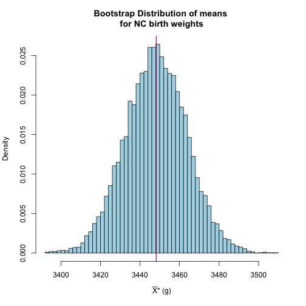
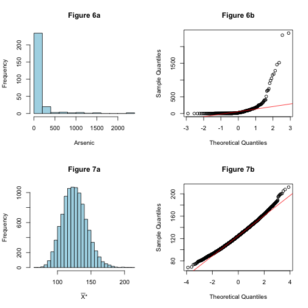
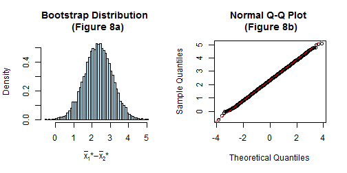
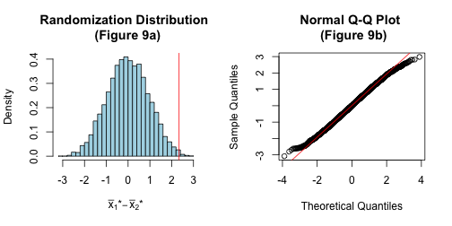
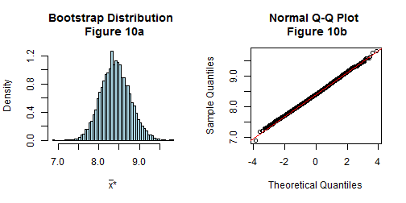
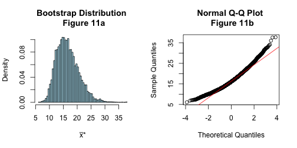
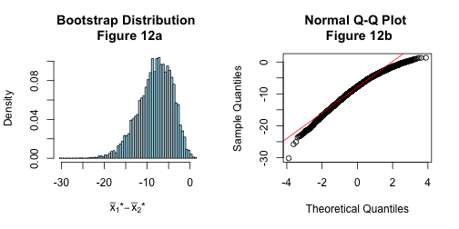
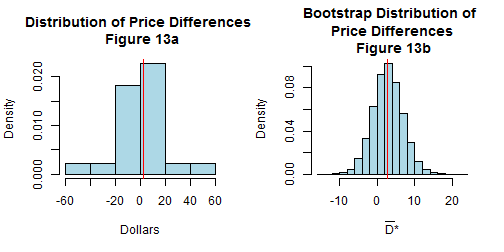
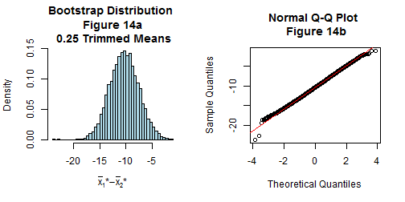
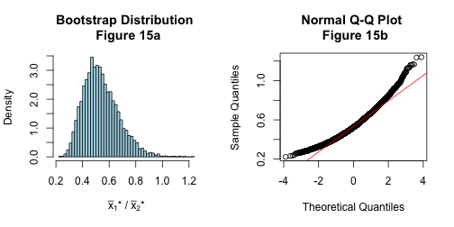

THE BOOTSTRAP (Chapter 5)
========================================================

We now move from the realm of probability to statistics, from situations where the population is known to where it is unknown. If all be have are data and a statistic estimated from the data, we need to estimate the sampling distribution of the statistic. One way to do this is with the **bootstrap**.


The birth weight of a baby is of interest to health officials since many studies have shown possible links between this weight and conditions in later life, such as obesity or diabetes. Researchers look for possible relationships between the birth weight of a baby and age of the mother or whether or not she smokes cigarettes or drink alcohol during her pregnancy. The centers for disease control and prevention CDC, using data provided by the U.S. Department of Health and Human Services, National Center for Health Statistics, the Division of Vital Statistics as well as the CDC, maintain a database on all babies born in a given year. We will investigate different samples taken from the CDC's database of births.

### INTRODUCTION TO THE BOOTSTRAP


```r
require(xtable)
```

```
## Loading required package: xtable
```

```r
site <- "http://www1.appstate.edu/~arnholta/Data/NCBirths2004.csv"
Babies <- read.csv(file=url(site))
```


For the North Carolina data, the mean weight of the 1009 babies in the sample is 3448.2597 g. We are interested in $\mu$, the true birth weight mean for all North Carolina babies born in 2004; this is probably not the same as the sample mean. We have already mentioned the different samples of the same size will yield different sample means, so how can we gauge the accuracy of the 3448.2597 as an estimate to $\mu$?

If we knew the sampling distribution of sample means for samples of size 1009 from the population of all 2004 North Carolina births, then this would give us an idea of how means vary from sample to sample, for the standard error of the sampling distribution tells us how far means deviate from the population mean $\mu$. But of course, since we do not have all the birth weights, we cannot guarantee the sampling distribution (and if we did have all the weights, we would know the true $\mu$!).

The bootstrap is a procedure that uses the given sample to create a new distribution, called the **bootstrap distribution**, that approximates the sampling distribution for the sample mean (or for other statistics). We will begin by considering only a small subset of the birth weights--- three observations, 3969, 3204, and 2892.

To find the bootstrap distribution of the mean, we draw samples (called _re-samples_ or _bootstrap samples_) of size $n$, with replacement, from the original sample and then compute the mean of each resample. In other words, we now treat the original sample as the population. For instance, Table 1, created with the folowing code shows all $3^3$ or 27 samples of size 3, taking order into account (the notation $x^*$ indicates a resampled observation and $\bar{x}^*$ or $\bar{\theta}^*$ the statistic for the bootstrap sample).


```r
rs <- c(3969, 3204, 2892)
xstar1 <- rep(rs, each = 9)
xstar2 <- rep(rep(rs, each = 3), 3)
xstar3 <- rep(rs, 9)
XD <- data.frame(xstar1, xstar2, xstar3)
xbarstar <- apply(XD, 1, mean)
BD <- cbind(XD, xbarstar)
WD <- BD
```


<!-- html table generated in R 3.0.2 by xtable 1.7-1 package -->
<!-- Thu Feb  6 14:11:34 2014 -->
<TABLE border=1>
<CAPTION ALIGN="bottom"> Table 1 --- All possible Samples of Size 3 from 3969, 3204, and 2892 </CAPTION>
<TR> <TH> $x^*_1$ </TH> <TH> $x^*_2$ </TH> <TH> $x^*_3$ </TH> <TH> $\bar{x}^*$ </TH>  </TR>
  <TR> <TD align="right"> 3969.00 </TD> <TD align="right"> 3969.00 </TD> <TD align="right"> 3969.00 </TD> <TD align="right"> 3969.00 </TD> </TR>
  <TR> <TD align="right"> 3969.00 </TD> <TD align="right"> 3969.00 </TD> <TD align="right"> 3204.00 </TD> <TD align="right"> 3714.00 </TD> </TR>
  <TR> <TD align="right"> 3969.00 </TD> <TD align="right"> 3969.00 </TD> <TD align="right"> 2892.00 </TD> <TD align="right"> 3610.00 </TD> </TR>
  <TR> <TD align="right"> 3969.00 </TD> <TD align="right"> 3204.00 </TD> <TD align="right"> 3969.00 </TD> <TD align="right"> 3714.00 </TD> </TR>
  <TR> <TD align="right"> 3969.00 </TD> <TD align="right"> 3204.00 </TD> <TD align="right"> 3204.00 </TD> <TD align="right"> 3459.00 </TD> </TR>
  <TR> <TD align="right"> 3969.00 </TD> <TD align="right"> 3204.00 </TD> <TD align="right"> 2892.00 </TD> <TD align="right"> 3355.00 </TD> </TR>
  <TR> <TD align="right"> 3969.00 </TD> <TD align="right"> 2892.00 </TD> <TD align="right"> 3969.00 </TD> <TD align="right"> 3610.00 </TD> </TR>
  <TR> <TD align="right"> 3969.00 </TD> <TD align="right"> 2892.00 </TD> <TD align="right"> 3204.00 </TD> <TD align="right"> 3355.00 </TD> </TR>
  <TR> <TD align="right"> 3969.00 </TD> <TD align="right"> 2892.00 </TD> <TD align="right"> 2892.00 </TD> <TD align="right"> 3251.00 </TD> </TR>
  <TR> <TD align="right"> 3204.00 </TD> <TD align="right"> 3969.00 </TD> <TD align="right"> 3969.00 </TD> <TD align="right"> 3714.00 </TD> </TR>
  <TR> <TD align="right"> 3204.00 </TD> <TD align="right"> 3969.00 </TD> <TD align="right"> 3204.00 </TD> <TD align="right"> 3459.00 </TD> </TR>
  <TR> <TD align="right"> 3204.00 </TD> <TD align="right"> 3969.00 </TD> <TD align="right"> 2892.00 </TD> <TD align="right"> 3355.00 </TD> </TR>
  <TR> <TD align="right"> 3204.00 </TD> <TD align="right"> 3204.00 </TD> <TD align="right"> 3969.00 </TD> <TD align="right"> 3459.00 </TD> </TR>
  <TR> <TD align="right"> 3204.00 </TD> <TD align="right"> 3204.00 </TD> <TD align="right"> 3204.00 </TD> <TD align="right"> 3204.00 </TD> </TR>
  <TR> <TD align="right"> 3204.00 </TD> <TD align="right"> 3204.00 </TD> <TD align="right"> 2892.00 </TD> <TD align="right"> 3100.00 </TD> </TR>
  <TR> <TD align="right"> 3204.00 </TD> <TD align="right"> 2892.00 </TD> <TD align="right"> 3969.00 </TD> <TD align="right"> 3355.00 </TD> </TR>
  <TR> <TD align="right"> 3204.00 </TD> <TD align="right"> 2892.00 </TD> <TD align="right"> 3204.00 </TD> <TD align="right"> 3100.00 </TD> </TR>
  <TR> <TD align="right"> 3204.00 </TD> <TD align="right"> 2892.00 </TD> <TD align="right"> 2892.00 </TD> <TD align="right"> 2996.00 </TD> </TR>
  <TR> <TD align="right"> 2892.00 </TD> <TD align="right"> 3969.00 </TD> <TD align="right"> 3969.00 </TD> <TD align="right"> 3610.00 </TD> </TR>
  <TR> <TD align="right"> 2892.00 </TD> <TD align="right"> 3969.00 </TD> <TD align="right"> 3204.00 </TD> <TD align="right"> 3355.00 </TD> </TR>
  <TR> <TD align="right"> 2892.00 </TD> <TD align="right"> 3969.00 </TD> <TD align="right"> 2892.00 </TD> <TD align="right"> 3251.00 </TD> </TR>
  <TR> <TD align="right"> 2892.00 </TD> <TD align="right"> 3204.00 </TD> <TD align="right"> 3969.00 </TD> <TD align="right"> 3355.00 </TD> </TR>
  <TR> <TD align="right"> 2892.00 </TD> <TD align="right"> 3204.00 </TD> <TD align="right"> 3204.00 </TD> <TD align="right"> 3100.00 </TD> </TR>
  <TR> <TD align="right"> 2892.00 </TD> <TD align="right"> 3204.00 </TD> <TD align="right"> 2892.00 </TD> <TD align="right"> 2996.00 </TD> </TR>
  <TR> <TD align="right"> 2892.00 </TD> <TD align="right"> 2892.00 </TD> <TD align="right"> 3969.00 </TD> <TD align="right"> 3251.00 </TD> </TR>
  <TR> <TD align="right"> 2892.00 </TD> <TD align="right"> 2892.00 </TD> <TD align="right"> 3204.00 </TD> <TD align="right"> 2996.00 </TD> </TR>
  <TR> <TD align="right"> 2892.00 </TD> <TD align="right"> 2892.00 </TD> <TD align="right"> 2892.00 </TD> <TD align="right"> 2892.00 </TD> </TR>
   </TABLE>


The idea behind the bootstrap is that if the original sample is representative of the population, then the bootstrap distribution of the mean will look approximately like the sampling distribution of the mean; that is, have roughly the same spread and shape. However, the mean of the bootstrap distribution will be the same as the mean of the original sample, not necessarily that of the original population.


```r
head(BD)
```

```
##   xstar1 xstar2 xstar3 xbarstar
## 1   3969   3969   3969     3969
## 2   3969   3969   3204     3714
## 3   3969   3969   2892     3610
## 4   3969   3204   3969     3714
## 5   3969   3204   3204     3459
## 6   3969   3204   2892     3355
```

```r
mean(rs)
```

```
## [1] 3355
```

```r
mean(BD[,"xbarstar"])
```

```
## [1] 3355
```


> The bootstrap idea: the original sample approximates the population from which it was drawn. So resamples from this sample approximates what we would get if we took many samples from the population. The bootstrap distribution of the statistic, based on many resamples, approximates the sampling distribution of the statistic, based on many samples.

Thus, the standard deviation of all the resample means listed in Table 1 is 266.2054 and we use this value as an estimate of actual standard error (standard deviation of the true sampling distribution).

Of course, it is hard for three observations to accurately approximate the population. Let us work with the full data set; we draw resmaples of size $n = 1009$ from the 1009 birth weights and calculate the mean for each.

There are now $1009^{1009}$ samples, too many for exhaustive calculation. Instead, we draw samples randomly, of size 1009 with replacement from the data, and calculate the mean for each. We repeat this many times, say 10,000, to create the bootstrap distribution. You can imagine that there is a table like Table 1 with $1009^{1009}$ rows, and we are randomly picking 10,000 rows from that table.

> #### BOOTSTRAP FOR A SINGLE POPULATION

> Given a sample of size $n$ from a population,

> 1.  Draw a resample of size $n$ with replacement from the sample.  Compute a statistic that describes the sample, such as the sample mean.
> 2.  Repeat this resampling process many times, say 10,000.
> 3.  Construct the bootstrap distribution of the statistic.  Inspect its spread, bias, and shape.


```r
set.seed(13)
head(Babies)
```

```
##   ID MothersAge Tobacco Alcohol Gender Weight Gestation
## 1  1      30-34      No      No   Male   3827        40
## 2  2      30-34      No      No   Male   3629        38
## 3  3      35-39      No      No Female   3062        37
## 4  4      20-24      No      No Female   3430        39
## 5  5      25-29      No      No   Male   3827        38
## 6  6      35-39      No      No Female   3119        39
```

```r
B <- 10000
my.boot.statB <- numeric(B)
for (i in 1:B){
  x <- sample(Babies$Weight, size = sum(!is.na(Babies$Weight)), replace = TRUE) 
  my.boot.statB[i] <- mean(x)
}
hist(my.boot.statB, breaks = "Scott", col = 'lightblue', xlab = substitute(paste(bar(X),"* (g)")), main ="Bootstrap Distribution of means \n for NC birth weights ", freq= FALSE)
abline(v = mean(Babies$Weight), col = "blue")
abline(v = mean(my.boot.statB), col = "red")
```

 

```r
boot.bias <- mean(my.boot.statB) - mean(Babies$Weight)
```


Note that the bootstrap distribution is approximately normal.  Second, with mean 3448.1229, it is centered at approximately the same location as the original mean, 3448.2597.  The difference between where the bootstrap distribution is centered and the mean of the of original sample is the bootstrap bias in this example -0.1367.  In general, the *bias* of an estimate $\hat{\theta}$ is $$Bias[\hat{\theta}] = E[\hat{\theta}] - \theta .$$  The bootstrap estimate of bias is $$Bias_{boot}[\hat{\theta}^*] = E[\hat{\theta}^*] - \hat{\theta},$$ the mean of the bootstrap distribution, minus the estimate from the original data. Third, we get a rough idea of the amount of variability.  We can quantify the variability by computing the standard deviation of the bootstrap distribution, in this case 15.5882.  This is the bootstrap standard error.
 
> #### BOOTSTRAP STANDARD ERROR
> The *bootstrap standard error* of a statistic is the standard deviation of the bootstrap distribution of the statistic.
 
> #### BIAS
>
> A statistic used to estimate a parameter is *biased* when the mean of its sampling distribution is not equal to the true value of the parameter.  The bias of a statistic $\hat{\theta}$ is $Bias[\hat{\theta}] = E[\hat{\theta}] - \theta$.  A statistic is **unbiased** if its bias is zero.
>
> The bootstrap method allows us to check for bias by seeing whether the bootstrap distribution of a statistic is centered at the statistic of the original random sample.  The bootstrap estimate of bias is the mean of the bootstrap distribution minus the statistic for the original data, $Bias_{boot}[\hat{\theta}^*] = E[\hat{\theta}^*] - \hat{\theta}$.

### Solution With The `boot` Package


```r
set.seed(13)
library(boot)
bs.mean <- function(data, i){
  d <- data[i]
  M <- mean(d)
  M}
boot.obj <- boot(data = Babies$Weight, statistic = bs.mean, R = 10000)
plot(boot.obj)
```

 

```r
BIAS <- mean(boot.obj$t) - boot.obj$t0
BIAS
```

```
## [1] -0.1367
```


### Key Features Of The Bootstrap

To highlight some key features of the bootstrap distribution, we begin with two examples in which the theoretical sampling distributions of the mean are known.


* Example 1:  Consider a random sample of size 49 drawn from a $N(25, 7)$.  Theory tells us that that the sampling distribution of the sample means is normal with mean 25 and standard error $\sigma/\sqrt{n} = 7/\sqrt{49} = 1$. 


```r
opar <- par(no.readonly = TRUE)
set.seed(11)
par(mfrow = c(3, 2))
curve(dnorm(x, 25, 7), from = 25 - 2.5*7, 25 + 2.5*7, col = "blue", main = "N(25, 7)", ylab = "", xlab = "")
abline(v = 25, col = "red")
curve(dnorm(x, 25, 1), from = 25 - 2.5*7, 25 + 2.5*7, col = "blue", main = "N(25, 1)", ylab = "", xlab = "")
abline(v = 25, col = "red")
rs1 <- rnorm(49, 25, 7)
rs2 <- rnorm(49, 25, 7)
hist(rs1, xlab = "", main = "n = 49")
abline(v = mean(rs1), col = "red")
B <- 10000
my.boot.stat1 <- numeric(B)
my.boot.stat2 <- numeric(B)
for (i in 1:B){
  x1 <- sample(rs1, size = 49, replace = TRUE) 
  x2 <- sample(rs2, size = 49, replace = TRUE) 
  my.boot.stat1[i] <- mean(x1)
  my.boot.stat2[i] <- mean(x2)
}
hist(my.boot.stat1, breaks = "Scott",  main ="Bootstrap Distribution", freq= FALSE, xlab = "", 
xlim = c(25 - 2.5*7, 25 + 2.5*7))
abline(v = mean(rs1), col = "red")
hist(rs2, xlab = "", main = "n = 49")
abline(v = mean(rs2), col = "red")
hist(my.boot.stat2, breaks = "Scott",  main ="Bootstrap Distribution", freq= FALSE, xlab = "", 
xlim = c(25 - 2.5*7, 25 + 2.5*7))
abline(v = mean(rs2), col = "red")
```

 

```r
par(opar)
```


The previous code shows the distributions of two such random samples with sample means $\bar{x}_1 =$ 22.9403, $\bar{x}_2 =$ 25.1794 and standard deviations $s_1 =$ 5.9322, $s_2 =$ 6.6413, respectively.  Based on the graphs above, we can see that the bootstrap distribution has roughly the same spread and shape as the theoretical sampling distribution, but the centers are different.  This example illustrates some important features of the bootstrap that hold for other statistics besides the mean:  the bootstrap distribution of a particular statistic $\hat{\theta}$ has approximately the same spread and shape as the sampling distirubiton of the statistic $\hat{\theta}$, but the center of the bootstrap distirbution is at the center of the original sample.  Hence we do not use the center of the bootstrap distribution in its own right, but we do compare the center of the bootstrap distribution with the observed statistic; if they differ, it indicates bias.

> #### BOOTSTRAP DISTRIBUTIONS AND SAMPLING DISTRIBUTIONS
>
> For most statistics, bootstrap distributions aproximate the spread, bias, and shape of the actual sampling distribution.


* Example 2: We now consider an example where neither the population nor the sampling distribution is normal.  A random variable $X$ that has a Gamma distribution is written $X \sim \Gamma(\alpha, \lambda)$.  If $X$ is a Gamma random variable, then $E[X] = \alpha/\lambda$, and $Var[X] = \alpha/\lambda^2$.  Let $X_1,\ldots , X_n \sim \Gamma(\alpha, \lambda)$. It is a fact that the sampling distribution of the mean $\bar{X}$ is $\Gamma(n\alpha, n\lambda)$.  We draw a random sample of size $n = 16$ from a $\Gamma(\alpha = 1, \lambda = 1/2)$ (population mean 2, standard deviation 2). 


```r
opar <- par(no.readonly = TRUE)
set.seed(18)
par(mfrow = c(3, 2))
curve(dgamma(x, 1, 1/2), from = 0, to = 8, col = "blue", main = "Gamma(1, 1/2)", ylab = "", xlab = "")
abline(v = 2, col = "red")
curve(dgamma(x, 16, 8), from = 0, 8, col = "blue", main = "Gamma(16, 8)", ylab = "", xlab = "")
abline(v = 2, col = "red")
rsg1 <- rgamma(16, 1, 1/2)
rsg2 <- rgamma(16, 1, 1/2)
hist(rsg1, xlab = "", main = "n = 16", xlim = c(0, 8))
abline(v = mean(rsg1), col = "red")
B <- 10000
my.boot.statg1 <- numeric(B)
my.boot.statg2 <- numeric(B)
for (i in 1:B){
  xg1 <- sample(rsg1, size = 16, replace = TRUE)
  xg2 <- sample(rsg2, size = 16, replace = TRUE)
  my.boot.statg1[i] <- mean(xg1)
  my.boot.statg2[i] <- mean(xg2)
}
hist(my.boot.statg1, breaks = "Scott",  main ="Bootstrap Distribution", freq= FALSE, xlab = "", 
xlim = c(0, 8))
abline(v = mean(rsg1), col = "red")
hist(rsg2, xlab = "", main = "n = 16", xlim = c(0, 8))
abline(v = mean(rsg2), col = "red")
hist(my.boot.statg2, breaks = "Scott",  main ="Bootstrap Distribution", freq= FALSE, xlab = "", 
xlim = c(0, 8))
abline(v = mean(rsg2), col = "red")
```

 

```r
par(opar)
```


The first graph in the second and third rows shows the distribution of a random sample with sample means and standard deviations $\bar{x}_1 =$ 1.5387, $\bar{x}_2 =$ 2.3165, $s_1 =$ 1.6062, and  $s_2 =$ 1.9916,  respectively.  Based on the graphs above, we can see that the bootstrap distribution has roughly the same spread and shape as the theoretical sampling distribution, but the centers are different. 

#### For most common estimators and under fairly general distribution assumptions, the following need to be noted:

* *Center* The center of the bootstrap distribution is *not* an accurate approximation for the center of the sampling distribution.  For example, the center of the bootstrap distribution for $\bar{X}$ is centered at approximately $\bar{x} = \mu_{\hat{F}}$, the mean of the sample, wheras the sampling distribution is centered at $\mu$.

* *Spread* The spread of the bootstrap distribution does reflect the spread of the sampling distribution.

* *Bias* The bootstrap bias estimate does reflect the bias of the sampling distribution.  Bias occurs if a sampling distribution is not centered at the parameter

* *Skewness* The skewness of the bootstrap ditribution does relfect the skewness of the sampling distribution.

The first point bears emphasis.  It means that *the bootstrap is not used to get better paramter estimates* because the bootstrap distributions are centered around statistics $\hat{\theta}$ calculated from the data rather than unknown population values.  Drawing thousands of bootstrap observations from the original data is not like drawing observations from the underlying population, it does not create new data. 

Instead, the bootstrap distribution is useful for *quantifying the behavior of a parameter estimate*, such as its standard error, skewness, bias, or for calculating confidence intervals.


```r
site <- "http://www1.appstate.edu/~arnholta/Data/Bangladesh.csv"
Bang <- read.csv(file=url(site)) # read data into Bang
```


* Example 3: Arsenic is a naturally occurring element in the groundwater of Bangladesh. However, much of this groundwater is used for drinking water by rural populations, so arsenic poisoning is a serious health issue. Figure 6a displays the distribution of arsenic concentrations from 271 wells in Bangladesh. The sample mean and standard deviation are $\bar{x}=$ 125.3199 and s = 297.9755, respectively (measured in micrograms per liter). We draw resamples of size 271 with replacement from the data and compute the mean for each resample. Figures 7a and 7b show a histogram and a normal quantile plot of the bootstrap distribution, respectively. The bootstrap distribution looks quite normal, with some skewness. This is the central limit theorem at work---when the sample size is large enough, the sampling distribution for the mean is approximately normal, even if the population is not normal.


```r
opar <- par(no.readonly = TRUE)
par(mfrow=c(2, 2))
Arsenic <- Bang$Arsenic
hist(Arsenic, breaks = "Scott", main = "Figure 6a", col = "lightblue")
qqnorm(Arsenic, main = "Figure 6b")
qqline(Arsenic, col = "red")
B <- 10000
n <- sum(!is.na(Arsenic))
arsenic.mean <- numeric(B)
set.seed(7)
for (i in 1:B){
  x <- sample(Arsenic, size = n, replace = TRUE)
  arsenic.mean[i] <- mean(x)
}
hist(arsenic.mean, main = "Figure 7a", col = "lightblue", breaks = "Scott", xlab = substitute(paste(bar(X),"*")))
qqnorm(arsenic.mean, main = "Figure 7b")
qqline(arsenic.mean, col = "red")
```

 

```r
par(opar)
```


The mean of the bootstrap means is 125.4621, quite close to the sample mean $\bar{X}$ (the difference is 0.1422, to four decimal places). The bootstrap standard error is the standard deviation of the bootstrap distribution; in this case, the bootstrap standard error is 17.9848.


```r
BELOW <- sum(arsenic.mean <= (mean(arsenic.mean) + qnorm(.025)*sd(arsenic.mean)))/B
ABOVE <- sum(arsenic.mean >= (mean(arsenic.mean) + qnorm(.975)*sd(arsenic.mean)))/B
c(BELOW, ABOVE)
```

```
## [1] 0.0147 0.0311
```


For the normal distribution, we know that the 2.5 and 97.5 percentiles are at the mean plus or minus 1.96 standard deviations. But for this particular bootstrap distribution, we find that 1.47% of the resample means are below the bootstrap mean -1.96 standard errors, and 3.11% of the resample means are above the bootstrap mean +1.96 standard errors. In this case, relying on the CLT would be inaccurate.


BOOTSTRAP PERCENTILE INTERVALS

The sample mean $\bar{x}$ gives an estimate of the true mean $\mu$, but it probably does not hit it exactly. It would be nice to have a range of values for the true $\mu$ that we are 95% sure includes the true $\mu$.

In the North Carolina birth weights case study, the bootstrap distribution shows roughly how sample means vary for samples of size 1009. If most of the sample means are concentrated within a certain interval of the bootstrap distribution, it seems reasonable to assume that the true meaning is most likely somewhere in that same interval. Thus, we can construct what is called a 95% confidence interval by using the 2.5 and 97.5 percentiles of the bootstrap distribution as endpoints. We would then say that we are 95% confident that the true mean lies within this interval. These are bootstrap percentile confidence intervals.

> BOOTSTRAP PERCENTILE CONFIDENCE INTERVALS  
>
> The interval between 2.5 and 97.5 percentiles of the bootstrap distribution of a statistic is a 95% *bootstrap percentile confidence interval* for the corresponding parameter.


```r
quantile(my.boot.statB, probs = c(0.025, 0.975))
```

```
 2.5% 97.5% 
 3417  3479 
```


For the North Carolina birth weights, the interval marked by the 2.5 and 97.5 percentiles is (3417.4202, 3478.9063). Thus, we would state that we are 95% confident that the true mean weight of North Carolina babies born in 2004 is between 3417.4202 and 3478.9063 g. In the arsenic example, the 2.5% and 97.5% points of the bootstrap distribution give us the interval (92.8419, 162.8321), so we are 95% confident that the true mean arsenic level is between 92.8419 and 162.8321 $\mu g/L$. Note that with $\bar{X}^* =$ 125.4621, this interval can be written (125.4621 -32.6203, 125.4621 + 37.37); in particular, this interval is not symmetric about the mean, reflecting the asymmetry of the bootstrap distribution.


The arsenic data illustrate an interesting point. A good confidence interval for the mean need not necessarily be symmetric: an endpoint will be further from the sample mean in the direction of any outliers. A confidence interval is an insurance policy: rather than relying on a single statistic, the sample mean, as an estimate of $\mu$, we give a range of possible values for $\mu$. We can see that there are some extremely large arsenic measurements: of the 271 observations, 8 are above 1000 $\mu g/L$ and 2 are above 2200 $\mu g/L$ (remember, the sample mean is only 125.3199!). What we do not know is just how huge arsenic levels in the population can be, or how many huge ones there are. It could be that huge observations are underrepresented in our data set. In order to protect against this – that is, to have only a 2.5% chance of missing a true big mean, the interval of plausible values for $\mu$ must stretch far to the right. Conversely, there is less risk of missing the true mean on the low side, so the left endpoint need not be as far away from the mean.

#### TWO SAMPLE BOOTSTRAP

We now turn to the problem of comparing two samples. In general, bootstrapping should mimic how the data were obtained. So the data correspond to independent samples from two populations, we should draw to samples that way. Then we proceed to compute the same statistic comparing the samples as per the original data, for example, difference in means or ratio of proportions.

> BOOTSTRAP FOR COMPARING TWO POPULATIONS
>
> Given independent samples of sizes m and n from two populations,
> 
> 1. Draw a resample of size $m$ with replacement from the first sample in a separate resample of size $n$ for the second sample. Compute a statistic that compares the two groups, such as the difference between the two sample means.
> 2. Repeat this resampling process many times say 10,000.
> 3. Construct the bootstrap distribution of the statistic. Inspect its spread, bias, and shape.

* Example 4: A high school student was curious about the total number of minutes devoted to commercials during any given half-hour time period on basic and extended cable TV channels.


```r
site <- "http://www1.appstate.edu/~arnholta/Data/TV.csv"
TV <- read.csv(file=url(site)) # read data into TV
head(TV)
```

```
##   ID Times Cable
## 1  1   7.0 Basic
## 2  2  10.0 Basic
## 3  3  10.6 Basic
## 4  4  10.2 Basic
## 5  5   8.6 Basic
## 6  6   7.6 Basic
```

```r
ct <- tapply(TV$Times, TV$Cable, mean)
ct
```

```
##    Basic Extended 
##     9.21     6.87
```


The means of the basic and extended channel commercial times or 9.21 and 6.87 min., respectively, so on average, commercials on basic channels are 2.34 min. longer than on extended channels. Is this difference of 2.34 min. statistically significant? The poor student could only stand to watch 10 hours of random TV, so his observations may not accurately represent the TV universe.

The original data are simple random samples of size 10 from two populations. We draw a bootstrap sample from the basic channel data and independently draw a bootstrap sample from the extended channel data, compute the means for each sample, and take the difference.


```r
times.Basic <- subset(TV, select = Times, subset = Cable == "Basic", drop = TRUE)
times.Ext <- subset(TV, select = Times, subset = Cable == "Extended", drop = TRUE)
B <- 10^4
times.diff.mean <- numeric(B)
set.seed(5)
for (i in 1:B){
  Basic.sample <- sample(times.Basic, size = length(times.Basic), replace = TRUE)
  Ext.sample <- sample(times.Ext, size = length(times.Ext), replace = TRUE)
  times.diff.mean[i] <- mean(Basic.sample) - mean(Ext.sample)
}
opar <- par(no.readonly = TRUE)
par(mfrow=c(1, 2))
hist(times.diff.mean, breaks = "Scott", freq=FALSE, main = "Bootstrap Distribution \n (Figure 8a)", xlab = substitute(paste(bar(x)[1],"*", - bar(x)[2],"*")), col = "lightblue")
qqnorm(times.diff.mean, main = "Normal Q-Q Plot \n (Figure 8b)")
qqline(times.diff.mean, col = "red")
```

 

```r
par(opar)
CI <- quantile(times.diff.mean, prob = c(0.025, 0.975))
CI
```

```
##  2.5% 97.5% 
##  0.85  3.81
```


Figure 8a shows the bootstrap distribution of the difference of sample means. As in the single sample case, we see that the bootstrap distribution is approximately normal and centered at the original statistics (the difference in sample means). We also get a quick idea of how much the difference in sample means varies due to random sampling. We may quantify this variation by computing the bootstrap standard error, which is 0.7553. Again, the bootstrap standard error is the standard error of the sampling distribution.

The right panel of Figure 8b shows a normal-quantile plot for the bootstrap distribution: the distribution is very close to normal.


The 95% bootstrap percentile confidence interval for the difference in means (basic – extended) is (0.85, 3.81). Thus, we are 95% confident that commercial times on basic channels are, on average, between 0.85 and 3.81 min. longer than on extended channels (perhalf-hour time periods).

We can also conduct a permutation test of the hypothesis that the mean commercial times for the two cable options are the same versus the hypothesis that mean times are not. Figure 9a shows the permutation distribution for the difference in mean advertisement time between basic and extended TV channels.


```r
obsDIFF <- mean(times.Basic) - mean(times.Ext)
P <- 10^4
times.diff.meanP <- numeric(P)
set.seed(4)
for (i in 1:P){
  index <- sample(length(TV$Times), size = length(TV$Times[TV$Cable == "Basic"]), replace = FALSE)
  times.diff.meanP[i] <- mean(TV$Times[index]) - mean(TV$Times[-index])
}
opar <- par(no.readonly = TRUE)
par(mfrow=c(1, 2))
hist(times.diff.meanP, breaks = "Scott", freq=FALSE, main = "Randomization Distribution \n (Figure 9a)", xlab = substitute(paste(bar(x)[1],"*", - bar(x)[2],"*")), col = "lightblue")
abline(v= obsDIFF, col = "red")
qqnorm(times.diff.meanP, main = "Normal Q-Q Plot \n (Figure 9b)")
qqline(times.diff.meanP, col = "red")
```

 

```r
par(opar)
pvalue <- (sum(times.diff.meanP >= obsDIFF) + 1)/(P + 1)
```


Recall that in permutation testing, we sample *without* replacement from the pooled data. The permutation distribution corresponds to sampling in a way that is consistent with the null hypothesis that the population means are the same. Thus, the permutation distribution is centered at zero. But in bootstrapping, we sample *with* replacement from the individual sample. However, the bootstrap has no restriction in regard to any null hypothesis, so it's distribution is centered at the original difference in means.

The permutation distribution is used for a single purpose: calculate a _p_-value to see how extreme an observed statistic is if the null hypothesis is true. The bootstrap is used for estimating standard errors and for answering some other questions we will raise below.

The permutation test for this example results in a _p_-value of 0.0042; thus, we conclude that the main commercial times are not the same between the two types of cable TV channels.

* Example 5: Verizon is the primary local telephone company (incumbent local exchange carrier, ILEC) for a large area of the eastern United States.  As such it is responsible for providing repair service for the customers of other telephone companies known as competing local exchange carriers (CLECs) in this region.  Verison is subject to fines if the repair times (the time it takes to fix a problem) for CLEC customers are substantially worse than those for Verizon customers.  The data set `Verizon` contains a random sample of repair times for 1664 ILEC and 23 CLEC customers. 


```r
site <- "http://www1.appstate.edu/~arnholta/Data/Verizon.csv"
Phone <- read.csv(file = url(site))
rt <- tapply(Phone$Time, Phone$Group, mean)
rt
```

```
##   CLEC   ILEC 
## 16.509  8.412
```

```r
times.ILEC <- subset(Phone, select = Time, subset = Group == "ILEC", drop = TRUE)
B <- 10^4
ILECmean <- numeric(B)
set.seed(3)
for (i in 1:B){
 ILECmean[i] <- mean(sample(times.ILEC, size = length(times.ILEC), replace = TRUE)) 
}
opar <- par(no.readonly = TRUE)
par(mfrow=c(1, 2))
hist(ILECmean, breaks = "Scott", col = "lightblue", main = "Bootstrap Distribution \n Figure 10a", freq= FALSE, xlab = substitute(paste(bar(x),"*")))
qqnorm(ILECmean, main = "Normal Q-Q Plot \n Figure 10b")
qqline(ILECmean, col = "red")
```

 

```r
par(opar)
CI <- quantile(ILECmean, prob = c(0.025, 0.975))
CI
```

```
##  2.5% 97.5% 
## 7.723 9.123
```


The bootstrap distribution for the larger ILEC data set ($n =$ 1664) is shown in Figure 10a. The distribution is centered around the sample mean of 8.4077, has a relatively narrow spread primarily due to the large sample size, with the bootstrap standard error of 0.3566 and a 95% bootstrap percentile interval of (7.7225, 9.1232). The distribution is roughly symmetric, with little skewness.


```r
times.CLEC <- subset(Phone, select = Time, subset = Group == "CLEC", drop = TRUE)
B <- 10^4
CLECmean <- numeric(B)
set.seed(2)
for (i in 1:B){
 CLECmean[i] <- mean(sample(times.CLEC, size = length(times.CLEC), replace = TRUE)) 
}
opar <- par(no.readonly = TRUE)
par(mfrow=c(1, 2))
hist(CLECmean, breaks = "Scott", col = "lightblue", main = "Bootstrap Distribution \n Figure 11a", freq= FALSE, xlab = substitute(paste(bar(x),"*")))
qqnorm(CLECmean, main = "Normal Q-Q Plot \n Figure 11b")
qqline(CLECmean, col = "red")
```

 

```r
par(opar)
CIC <- quantile(CLECmean, prob = c(0.025, 0.975))
CIC
```

```
##  2.5% 97.5% 
## 10.10 25.39
```


The bootstrap distribution for the smaller CLEC data set ($n =$ 23) is shown in Figure 11a. The distribution is centered around the sample mean of 16.532, has a much larger spread due to the small sample size, with the bootstrap standard error of 4.0093 and a 95% bootstrap percentile interval of (10.1039, 25.3941). The distribution is very skewed.


```r
B <- 10^4
diffmeans <- numeric(B)
set.seed(1)
for (i in 1:B){
  ILEC.sample <- sample(times.ILEC, size = length(times.ILEC), replace = TRUE)
  CLEC.sample <- sample(times.CLEC, size = length(times.CLEC), replace = TRUE)
  diffmeans[i] <- mean(ILEC.sample) - mean(CLEC.sample)
}
opar <- par(no.readonly = TRUE)
par(mfrow=c(1, 2))
hist(diffmeans, breaks = "Scott", col = "lightblue", main = "Bootstrap Distribution \n Figure 12a", freq= FALSE, xlab = substitute(paste(bar(x)[1],"*", - bar(x)[2],"*")))
qqnorm(diffmeans, main = "Normal Q-Q Plot \n Figure 12b")
qqline(diffmeans, col = "red")
```

 

```r
par(opar)
CIdiff <- quantile(diffmeans, prob = c(0.025, 0.975))
CIdiff
```

```
##    2.5%   97.5% 
## -16.644  -1.596
```


The bootstrap distribution for the difference in means is shown in Figure 12a. Note the strong skewness in the distribution. The mean of the bootstrap distribution is -8.111 with a standard error of 3.9468. A 95% bootstrap percentile confidence interval for the difference in means (ILEC-CLEC) is given by (-16.6445, -1.5959) and so we would say that with 95% confidence, the repair times for ILEC customers are, on average, 1.5959 $-$ 16.6445 hours shorter than the repair times for CLEC customers.

#### THE TWO INDEPENDENT POPULATIONS ASSUMPTION


```r
site <- "http://www1.appstate.edu/~arnholta/Data/Cameras.csv"
Cameras <- read.csv(file=url(site))
head(Cameras)
```

```
##   ID                  Item     JR     BH
## 1  1 Canon PowerShot A3000 129.99 149.99
## 2  2  Canon PowerShot A495  99.88  96.95
## 3  3        Casio EX-FC150 241.88 241.19
## 4  4  Kodak EasyShare C142  74.94  79.59
## 5  5    Nikon Coolpix L110 279.95 239.95
## 6  6     Nikon Coolpix L22 129.95 129.95
```


Savvy customers will often compare prices at different stores before making a purchase. Are some stores really better bargains consistently than others? We compiled the prices of a sample of point-and-shoot digital cameras from two electronic stores with an online presence, J & R and B & H the mean price of the cameras was $155.42 at J & R and $152.62 at B & H. Does this imply cameras are more expensive at J & R, or could the difference in mean price ($2.81) be chance variation? 

Now, it may be tempting to proceed as in the TV commercials or Verizon repair times examples, looking at the prices as coming from two populations, B & H and J & R. But note that the data are *not independent*! For each camera priced at B & H, we matched it with the price for the same camera at J & R. Thus, the data are called *matched pairs or paired data*.

In this case, for each camera, we compute the difference in price between the two stores (J & R price - B & H price). We then have one variable –-- the price differences –-- and we are back to the one–sample setting. The price differences are shown in Figure 13a.


```r
CameraDiffs <- Cameras$JR - Cameras$BH
B <- 10^5
boot.diffs <- numeric(B)
set.seed(2)
for (i in 1:B){
  boot.diffs[i] <- mean(sample(CameraDiffs, size = length(CameraDiffs), replace = TRUE))
}
CIdiff <- quantile(boot.diffs, prob = c(0.025, 0.975))
CIdiff
```

```
##   2.5%  97.5% 
## -4.896 10.585
```

```r
opar <- par(no.readonly = TRUE)
par(mfrow=c(1, 2))
hist(CameraDiffs, freq= FALSE, col = "lightblue", main = "Distribution of Price Differences \n Figure 13a", xlab = "Dollars")
abline(v = mean(CameraDiffs), col = "red")
hist(boot.diffs, freq= FALSE, col = "lightblue", main = "Bootstrap Distribution of \n Price Differences \n Figure 13b", xlab = substitute(paste(bar(D),"*")))
abline(v = mean(boot.diffs), col = "red")
```

 

```r
par(opar)
```


Performing a one sample bootstrap with $10^5$ resamples, we find a 95% bootstrap percentile interval for the mean price difference to be (-4.8964, 10.5846). Since zero is contained in the interval, we cannot conclude that the mean prices for digital point-and-shoot cameras differ between the two stores.

#### OTHER STATISTICS

As with permutation testing, when bootstrapping, we are not limited to simple statistics like the simple mean. Once we have drawn a bootstrap sample, we can calculate any statistic for that sample.

For example, instead of the sample mean, we can use more robust statistics that are less sensitive to extreme observations. Figure 14a shows the bootstrap distribution for the difference in trimmed means, in this case 25% trimmed means, also known as the mid-mean, the mean of the middle 50% of observations. Compared to the bootstrap difference in ordinary means (Figure 12a), this distribution has a much smaller spread. The bootstrap procedure may be used with a wide variety of statistics –-- means, medians, trimmed means, correlation coefficients, and so on –-- using the same procedure. This is a major advantage of the bootstrap. It allows statistical inferences such as confidence intervals to be calculated even for statistics for which there are no easy formulas. It offers hope of reforming statistical practice –-- away from simple but non-robust estimators like a sample mean or least-squares regression, in favor of robust alternatives.


```r
B <- 10^4
diffmeans.25 <- numeric(B)
set.seed(3)
for (i in 1:B){
  ILEC.sample <- sample(times.ILEC, size = length(times.ILEC), replace = TRUE)
  CLEC.sample <- sample(times.CLEC, size = length(times.CLEC), replace = TRUE)
  diffmeans.25[i] <- mean(ILEC.sample, trim = .25) - mean(CLEC.sample, trim = .25)
}
opar <- par(no.readonly = TRUE)
par(mfrow=c(1, 2))
hist(diffmeans.25, breaks = "Scott", col = "lightblue", main = "Bootstrap Distribution \n Figure 14a \n 0.25 Trimmed Means", freq= FALSE, xlab = substitute(paste(bar(x)[1],"*", - bar(x)[2],"*")))
qqnorm(diffmeans.25, main = "Normal Q-Q Plot \n Figure 14b")
qqline(diffmeans.25, col = "red")
```

 

```r
par(opar)
CIdiff.25 <- quantile(diffmeans.25, prob = c(0.025, 0.975))
CIdiff.25
```

```
##    2.5%   97.5% 
## -15.540  -4.895
```


Example 6: In the Verizon data, rather than looking at the difference in means, suppose we look at the ratio of means. The sample ratio is 0.5095, so for ILEC customers, repair times are about half of that for CLEC customers.


```r
site <- "http://www1.appstate.edu/~arnholta/Data/Verizon.csv"
Phone <- read.csv(file = url(site))
times.ILEC <- subset(Phone, select = Time, subset = Group == "ILEC", drop = TRUE)
times.CLEC <- subset(Phone, select = Time, subset = Group == "CLEC", drop = TRUE)
set.seed(4)
B <- 10^4
boot.ratio <- numeric(B)
for (i in 1:B){
  ILEC.sample <- sample(times.ILEC, size = length(times.ILEC), replace = TRUE)
  CLEC.sample <- sample(times.CLEC, size = length(times.CLEC), replace = TRUE)
  boot.ratio[i] <- mean(ILEC.sample)/mean(CLEC.sample)
}
opar <- par(no.readonly = TRUE)
par(mfrow=c(1, 2))
hist(boot.ratio, breaks = "Scott", col = "lightblue", main = "Bootstrap Distribution \n Figure 15a", freq= FALSE, xlab = substitute(paste(bar(x)[1],"* / ", bar(x)[2],"*")))
qqnorm(boot.ratio, main = "Normal Q-Q Plot \n Figure 15b")
qqline(boot.ratio, col = "red")
```

 

```r
par(opar)
CIratio <- quantile(boot.ratio, prob = c(0.025, 0.975))
CIratio
```

```
##   2.5%  97.5% 
## 0.3307 0.8412
```


As in the difference of means example, the bootstrap distribution of the ratio of means exhibits skewness (Figure 15a). The 95% bootstrap percentile confidence interval for the ratio of means (ILEC/CLEC) is (0.3307, 0.8412), so with 95% confidence, the true mean repair times for ILEC customers is between 0.3307 and 0.8412 times less than that for CLEC customers.

### Using `boot` Again


```r
library(boot)
set.seed(6)
phoneF <- function(data, i){
  d <- data[i, ]
  m <- tapply(d$Time, d$Group, mean)
  rat <- m[2]/m[1]
  rat}
boot.obj <- boot(data = Phone, statistic = phoneF, R = 10000)
plot(boot.obj)
```

 

```r
boot.ci(boot.obj, type = "perc")
```

```
## BOOTSTRAP CONFIDENCE INTERVAL CALCULATIONS
## Based on 10000 bootstrap replicates
## 
## CALL : 
## boot.ci(boot.out = boot.obj, type = "perc")
## 
## Intervals : 
## Level     Percentile     
## 95%   ( 0.3252,  0.8446 )  
## Calculations and Intervals on Original Scale
```

Another 95% bootstrap percentile confidence interval for the ratio of means (ILEC/CLEC) is 
(0.3252, 0.8446),
so with 95% confidence, the true mean repair times for ILEC customers is between 
0.3252 and 0.8446
times less than that for CLEC customers.
