Class Notes For STT 3850
========================================================
## Alan T. Arnholt


Last compiled Thursday, February 06, 2014 - 14:42:50.


Most of the material in the notes is taken from the class text _Mathematical Statistics with Resampling and `R`_ by Laura Chihara and Tim Hesterberg with slight modifications.  Some material in the notes is also taken from the first chapter of _Practicing Statistics: Guided Investigations for the Second Course_ by Shonda Kuiper and Jeffrey Sklar.  There are a number of places to get help with `R`.  The class text has some material online at: [https://sites.google.com/site/chiharahesterberg/rtutorials](https://sites.google.com/site/chiharahesterberg/rtutorials).  


Exploratory Data Analysis
========================================================

## Reading *.csv Data

```r
site <- "http://www1.appstate.edu/~arnholta/Data/FlightDelays.csv"
FlightDelays <- read.csv(file = url(site))
head(FlightDelays)  # shows first 6 rows of data frame
```

```
  ID Carrier FlightNo Destination DepartTime Day Month FlightLength Delay Delayed30
1  1      UA      403         DEN      4-8am Fri   May          281    -1        No
2  2      UA      405         DEN     8-Noon Fri   May          277   102       Yes
3  3      UA      409         DEN      4-8pm Fri   May          279     4        No
4  4      UA      511         ORD     8-Noon Fri   May          158    -2        No
5  5      UA      667         ORD      4-8am Fri   May          143    -3        No
6  6      UA      669         ORD      4-8am Fri   May          150     0        No
```

```r
str(FlightDelays)  # shows structure of data frame
```

```
'data.frame':	4029 obs. of  10 variables:
 $ ID          : int  1 2 3 4 5 6 7 8 9 10 ...
 $ Carrier     : Factor w/ 2 levels "AA","UA": 2 2 2 2 2 2 2 2 2 2 ...
 $ FlightNo    : int  403 405 409 511 667 669 673 677 679 681 ...
 $ Destination : Factor w/ 7 levels "BNA","DEN","DFW",..: 2 2 2 6 6 6 6 6 6 6 ...
 $ DepartTime  : Factor w/ 5 levels "4-8am","4-8pm",..: 1 4 2 4 1 1 4 4 5 5 ...
 $ Day         : Factor w/ 7 levels "Fri","Mon","Sat",..: 1 1 1 1 1 1 1 1 1 1 ...
 $ Month       : Factor w/ 2 levels "June","May": 2 2 2 2 2 2 2 2 2 2 ...
 $ FlightLength: int  281 277 279 158 143 150 158 160 160 163 ...
 $ Delay       : int  -1 102 4 -2 -3 0 -5 0 10 60 ...
 $ Delayed30   : Factor w/ 2 levels "No","Yes": 1 2 1 1 1 1 1 1 1 2 ...
```

```r
levels(FlightDelays$Month)
```

```
[1] "June" "May" 
```

```r
FlightDelays$Month <- factor(FlightDelays$Month, levels = c("May", "June"))
levels(FlightDelays$Month)
```

```
[1] "May"  "June"
```


## Creating Tables

```r
table(FlightDelays$Carrier)
```

```

  AA   UA 
2906 1123 
```

```r
xtabs(~Carrier, data = FlightDelays)
```

```
Carrier
  AA   UA 
2906 1123 
```


## Creating Barplots

```r
barplot(table(FlightDelays$Carrier))
```

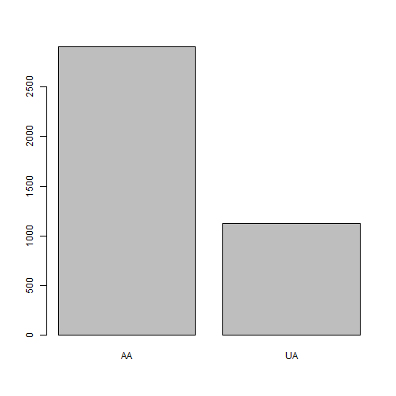

```r
require(ggplot2)
ggplot(data = FlightDelays, aes(x = Carrier)) + 
  geom_bar()
```

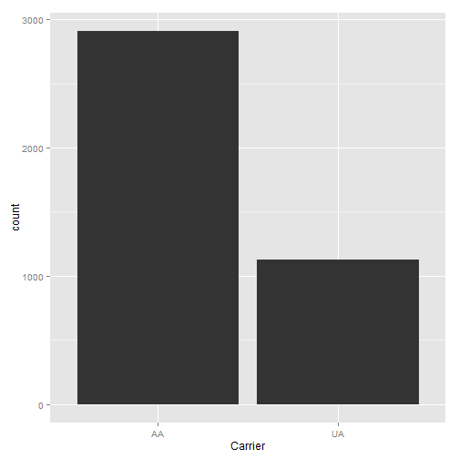

```r
ggplot(data = FlightDelays, aes(x = Carrier, fill= Month)) + 
  geom_bar()
```

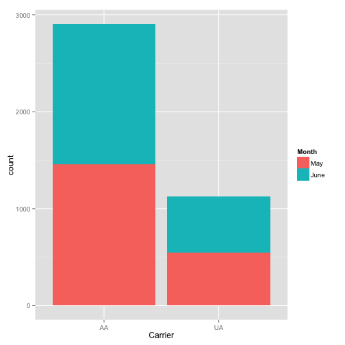

```r
ggplot(data = FlightDelays, aes(x = Carrier, fill= Month)) + 
  geom_bar() + 
  guides(fill = guide_legend(reverse = TRUE))
```


```r
ggplot(data = FlightDelays, aes(x = Carrier, fill= Month)) + 
  geom_bar(position="dodge") + 
  guides(fill = guide_legend(reverse = TRUE))
```

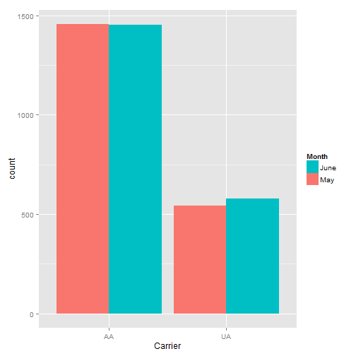

```r
xtabs(~ Carrier + (Delay > 30), data = FlightDelays)
```

```
       Delay > 30
Carrier FALSE TRUE
     AA  2513  393
     UA   919  204
```

```r
addmargins(xtabs(~ Carrier + (Delay > 30), data = FlightDelays))
```

```
       Delay > 30
Carrier FALSE TRUE  Sum
    AA   2513  393 2906
    UA    919  204 1123
    Sum  3432  597 4029
```

```r
ggplot(data = FlightDelays, aes(x = Carrier, fill= Delayed30)) + 
  geom_bar(position="dodge")
```

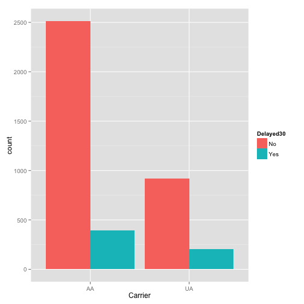

```r
ggplot(data = FlightDelays, aes(fill = Carrier, x= Delayed30)) + 
  geom_bar(position="dodge")
```


## Histograms of `Delay` values.


```r
hist(FlightDelays$Delay)  # Ugly with Defaults...you change
```

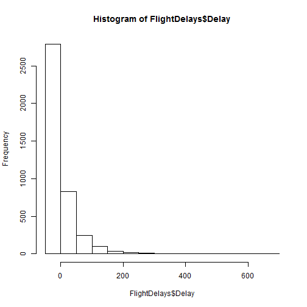

```r
library(lattice)
histogram(~Delay, data = FlightDelays)
```

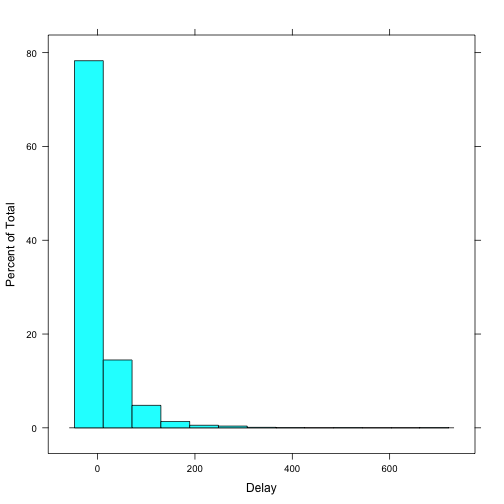

```r
histogram(~Delay, data = FlightDelays, type = "density")
```

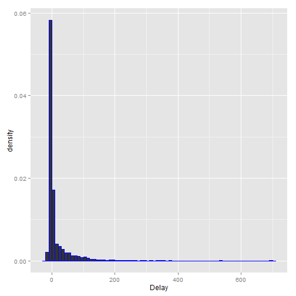

```r
histogram(~Delay, data = FlightDelays, type = "density",
          panel = function(...){
            panel.histogram(col = "peru",...)
            panel.densityplot(col = "red", lwd = 2, ...)
          }
          )
```

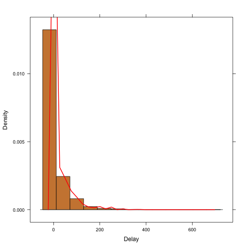

```r
ggplot(data = FlightDelays, aes(x = Delay)) + 
  geom_histogram()
```


```r
ggplot(data = FlightDelays, aes(x = Delay, y = ..density..)) + 
  geom_histogram(binwidth = 10, color = "blue") + 
  geom_density(color = "red")
```

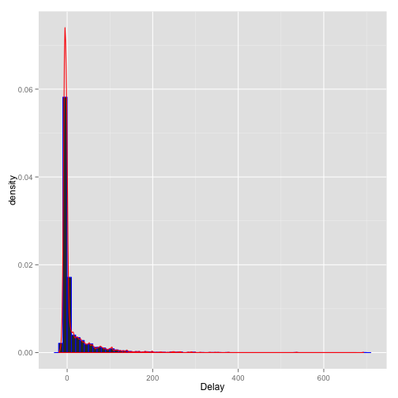

```r
ggplot(data = FlightDelays, aes(x = Delay)) + 
  geom_density(fill = "blue")
```

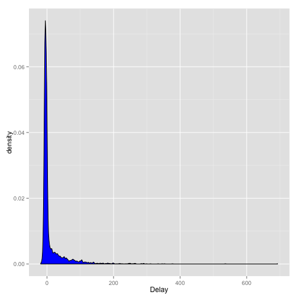

## Numeric Summaries


```r
summary(FlightDelays)
```

```
       ID       Carrier      FlightNo    Destination    DepartTime    Day       Month     
 Min.   :   1   AA:2906   Min.   :  71   BNA: 172    4-8am   : 699   Fri:637   May :1999  
 1st Qu.:1008   UA:1123   1st Qu.: 371   DEN: 264    4-8pm   : 972   Mon:630   June:2030  
 Median :2015             Median : 691   DFW: 918    8-Mid   : 257   Sat:453              
 Mean   :2015             Mean   : 827   IAD:  55    8-Noon  :1053   Sun:551              
 3rd Qu.:3022             3rd Qu.: 787   MIA: 610    Noon-4pm:1048   Thu:566              
 Max.   :4029             Max.   :2255   ORD:1785                    Tue:628              
                                         STL: 225                    Wed:564              
  FlightLength     Delay       Delayed30 
 Min.   : 68   Min.   :-19.0   No :3432  
 1st Qu.:155   1st Qu.: -6.0   Yes: 597  
 Median :163   Median : -3.0             
 Mean   :185   Mean   : 11.7             
 3rd Qu.:228   3rd Qu.:  5.0             
 Max.   :295   Max.   :693.0             
                                         
```

```r
sd(FlightDelays$Delay)
```

```
[1] 41.63
```

```r
sd(FlightDelays$Delay)^2
```

```
[1] 1733
```

```r
var(FlightDelays$Delay)
```

```
[1] 1733
```

```r
IQR(FlightDelays$Delay)
```

```
[1] 11
```

```r
quantile(FlightDelays$Delay)
```

```
  0%  25%  50%  75% 100% 
 -19   -6   -3    5  693 
```


## Boxplots


```r
boxplot(Delay ~ Carrier, data = FlightDelays)
```


```r
bwplot(Delay ~ Carrier, data = FlightDelays)
```

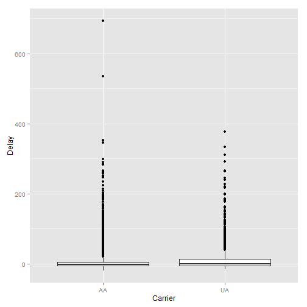

```r
bwplot(Delay ~ Carrier | Month, data = FlightDelays, as.table = TRUE, layout = c(2, 1))
```

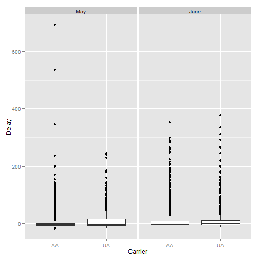

```r
ggplot(data = FlightDelays, aes(x = Carrier, y = Delay)) + geom_boxplot()
```

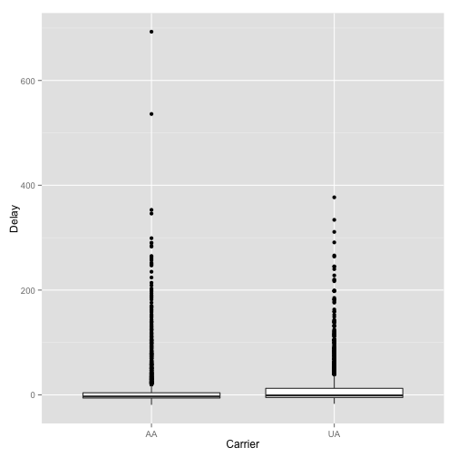

```r
ggplot(data = FlightDelays, aes(x = Carrier, y = Delay)) + geom_boxplot() + facet_grid(. ~ Month)
```

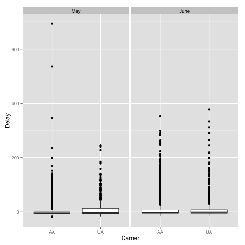


```r
site <- "http://www1.appstate.edu/~arnholta/Data/NCBirths2004.csv"
NCBirths <- read.csv(file=url(site))
head(NCBirths)
```

```
  ID MothersAge Tobacco Alcohol Gender Weight Gestation
1  1      30-34      No      No   Male   3827        40
2  2      30-34      No      No   Male   3629        38
3  3      35-39      No      No Female   3062        37
4  4      20-24      No      No Female   3430        39
5  5      25-29      No      No   Male   3827        38
6  6      35-39      No      No Female   3119        39
```

```r
boxplot(Weight ~ Gender, data = NCBirths, col = c("pink", "blue"))
```

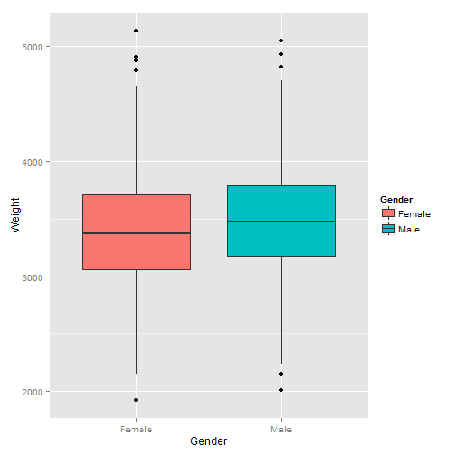

```r
bwplot(Weight ~ Gender, data = NCBirths)
```

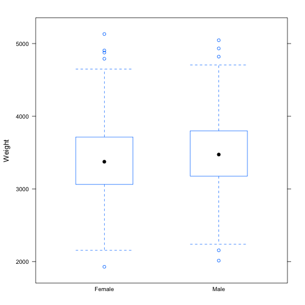

```r
p <- ggplot(data = NCBirths, aes(x = Gender, y = Weight, fill = Gender))
p + geom_boxplot()
```

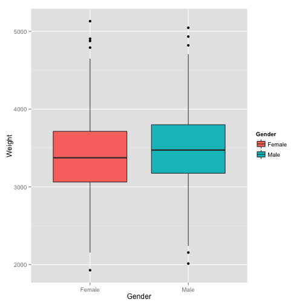

```r
p + geom_boxplot() + 
  guides(fill = FALSE) + 
  labs( x = "Newborn Gender", y = "Weight in ounces", title = "You Put Something Here")
```

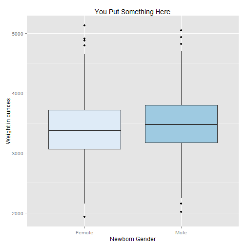

```r
p + geom_boxplot() + 
  guides(fill = FALSE) + 
  labs( x = "Newborn Gender", y = "Weight in ounces", title = "You Put Something Here") + 
  scale_fill_manual(values = c('pink', 'blue'))
```

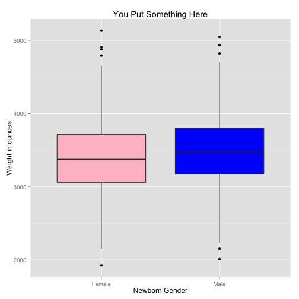

```r
p + geom_boxplot() + guides(fill = FALSE) + 
  labs( x = "Newborn Gender", y = "Weight in ounces", title = "You Put Something Here") + 
  scale_fill_brewer() + theme_bw()
```

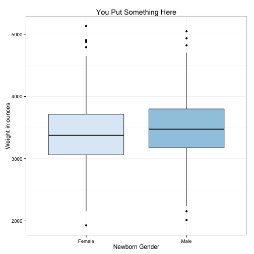


## Density Plots

```r
curve(dnorm(x), -4, 4, ylab = "", xlab = "")
x.region <- seq(from = 1, to = 4, length.out = 200)
y.region <- dnorm(x.region)
region.x <- c(x.region[1], x.region, x.region[200])
region.y <- c(0, y.region, 0)
polygon(region.x, region.y, col = "red")
abline(h = 0, lwd = 2)
```

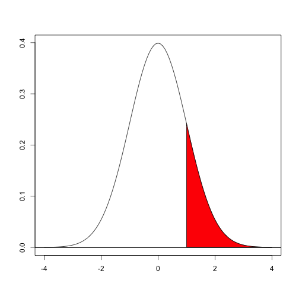

```r
# Same now with ggplot2
p <- ggplot(data = data.frame(x = c(-4, 4)), aes(x = x))
dnorm_func <- function(x){
  y <- dnorm(x)
  y[x<1] <- NA
  return(y)
}
p1 <- p + stat_function(fun = dnorm_func, geom = 'area', fill = 'blue', alpha = 0.2) + 
  geom_hline(yintercept = 0) + 
  stat_function(fun = dnorm) 
p1 + theme_bw()
```

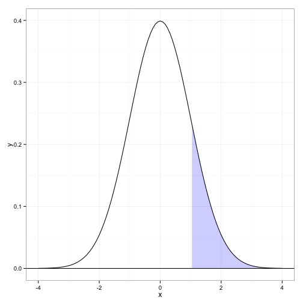

```r
p1 + theme_bw() + 
  labs(x = '', y = '', title = expression(integral(frac(1, sqrt(2*pi))*e^{-x^2/2}*dx, 1, infinity)==0.1586553) ) # Break it down!
```

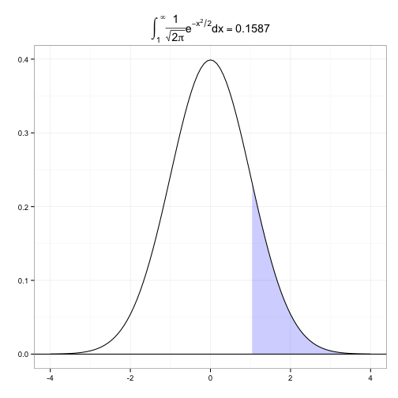


## Example 2.11 

Note this is not how `qqnorm` computes the quantiles!  The left graph of Figure 2.9 in the book is not quite correct...it does not use the data in the table...the first value 17.7 should be 21.7.


```r
x <- c(21.7, 22.6, 26.1, 28.3, 30, 31.2, 31.5, 33.5, 34.7, 36)
n <- length(x)
p <- (1:10)/(n + 1)
q <- qnorm(p)
rbind(x, p, q)
```

```
      [,1]    [,2]    [,3]    [,4]    [,5]    [,6]    [,7]    [,8]    [,9]   [,10]
x 21.70000 22.6000 26.1000 28.3000 30.0000 31.2000 31.5000 33.5000 34.7000 36.0000
p  0.09091  0.1818  0.2727  0.3636  0.4545  0.5455  0.6364  0.7273  0.8182  0.9091
q -1.33518 -0.9085 -0.6046 -0.3488 -0.1142  0.1142  0.3488  0.6046  0.9085  1.3352
```

```r
plot(q, x)
XS <- quantile(q, prob = c(0.25, 0.75))
YS <- quantile(x, prob = c(0.25, 0.75))
slopeA <- (YS[2] - YS[1])/(XS[2] - XS[1])
slopeB <- diff(YS)/diff(XS)
slopeA
```

```
  75% 
5.873 
```

```r
slopeB
```

```
  75% 
5.873 
```

```r
Intercept <- YS[1] - slopeA * XS[1]
Intercept
```

```
  25% 
29.83 
```

```r
abline(a = Intercept, b = slopeA)
```

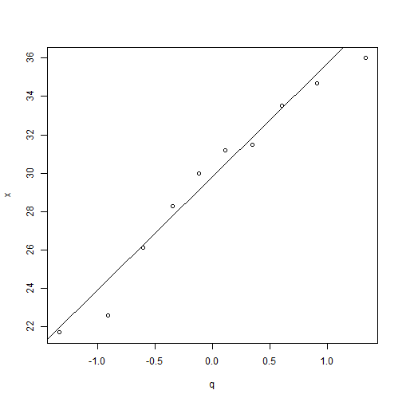

```r
# 
pc <- (1:10 - 3/8)/n
qc <- qnorm(pc)
rbind(x, pc, qc)
```

```
      [,1]    [,2]    [,3]    [,4]     [,5]    [,6]    [,7]    [,8]    [,9]   [,10]
x  21.7000 22.6000 26.1000 28.3000 30.00000 31.2000 31.5000 33.5000 34.7000 36.0000
pc  0.0625  0.1625  0.2625  0.3625  0.46250  0.5625  0.6625  0.7625  0.8625  0.9625
qc -1.5341 -0.9842 -0.6357 -0.3518 -0.09414  0.1573  0.4193  0.7144  1.0916  1.7805
```

```r
xs <- quantile(qc, prob = c(0.25, 0.75))
ys <- quantile(x, prob = c(0.25, 0.75))
slope <- diff(ys)/diff(xs)
intercept <- ys[1] - slope * xs[1]
c(intercept, slope)
```

```
   25%    75% 
29.625  5.268 
```

Consider using the `R` functions `qqnorm()` and `qqline()`.


```r
qqnorm(x)
qqline(x)
```

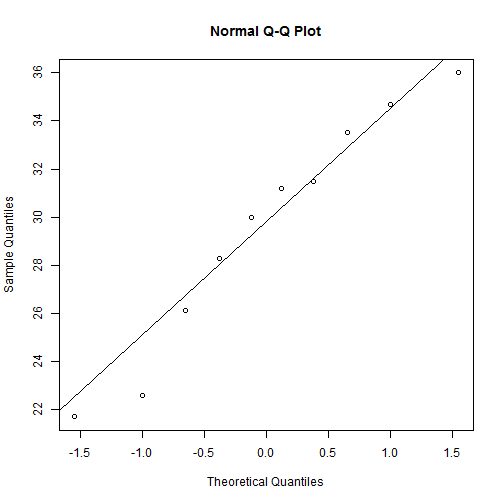

```r
# ggplot
ggplot(data = data.frame(x), aes(sample=x)) + 
  stat_qq() + 
  geom_abline(intercept = intercept, slope = slope)
```

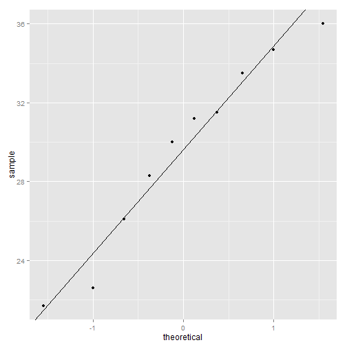


## Empirical Cumulative Distribution Function

The _empirical cumulative distribution function_ (ecdf) is an estimate of the underlying cumulative distribution function for a sample.  The empirical cdf, denoted by $\hat{F}$, is a step function $$\hat{F}(x) = \tfrac{1}{n} (\text{number of values} \leq x),$$
where $n$ is the sample size.


```r
y <- c(3, 6, 15, 15, 17, 19, 24)
plot.ecdf(y)
```


```r
set.seed(1)  # set seed for reproducibility
rxs <- rnorm(25)
plot.ecdf(rxs, xlim = c(-4, 4))
curve(pnorm(x), col = "blue", add = TRUE, lwd = 2)
```

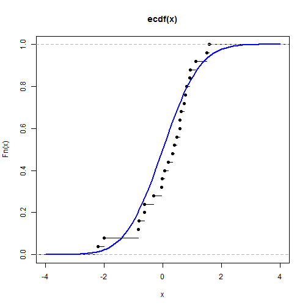


An alternative approach to the book's Figure 2.12 is provided using `ggplot2` after first creating Figure 2.12


```r
site <- "http://www1.appstate.edu/~arnholta/Data/Beerwings.csv"
Beerwings <- read.csv(file=url(site))
head(Beerwings) # shows first 6 rows of data frame
```

```
  ID Hotwings Beer Gender
1  1        4   24      F
2  2        5    0      F
3  3        5   12      F
4  4        6   12      F
5  5        7   12      F
6  6        7   12      F
```

```r
str(Beerwings)  # shows structure of data frame
```

```
'data.frame':	30 obs. of  4 variables:
 $ ID      : int  1 2 3 4 5 6 7 8 9 10 ...
 $ Hotwings: int  4 5 5 6 7 7 7 8 8 8 ...
 $ Beer    : int  24 0 12 12 12 12 24 24 0 12 ...
 $ Gender  : Factor w/ 2 levels "F","M": 1 1 1 1 1 1 2 1 2 2 ...
```

```r
beerM <- subset(Beerwings, select = Beer, subset = Gender == "M", drop = TRUE)
beerF <- subset(Beerwings, select = Beer, subset = Gender == "F", drop = TRUE)
plot.ecdf(beerM, xlab = "ounces", col = "blue", pch = 19)
plot.ecdf(beerF, col = "pink", pch = 19, add = TRUE)
abline(v = 25, lty = "dashed")
legend("topleft", legend = c("Males", "Females"), pch = 19, col = c("blue", "pink"))
```

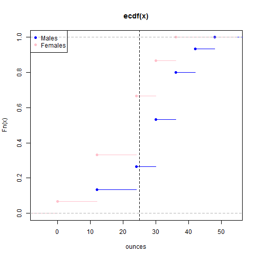

```r
# Using ggplot2 now
ggplot(data = Beerwings, aes(x = Beer, colour = Gender)) + 
  stat_ecdf() + 
  labs(x = "Beer in ounces", y ="", title = 'ECDF')
```

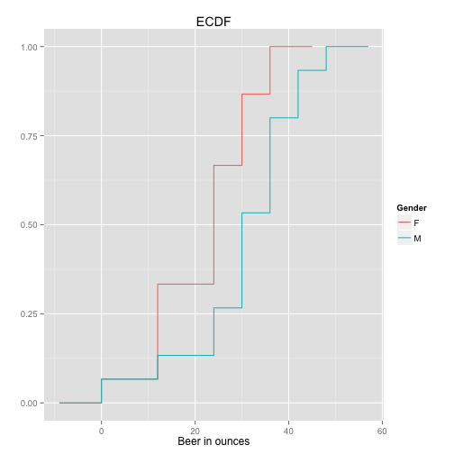


## Scatter Plots


```r
with(data = Beerwings, plot(Hotwings, Beer, xlab = "Hot wings eaten", ylab = "Beer consumed", 
                            pch = 19, col = "blue"))
```

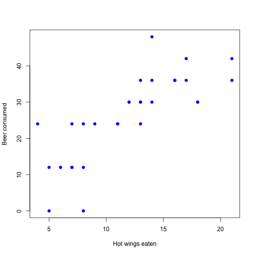

```r
p <- ggplot(data = Beerwings, aes(x = Hotwings, y = Beer)) + 
  geom_point() + 
  labs(x = "Hot wings eaten", y = "Beer consumed in ounces")
p
```

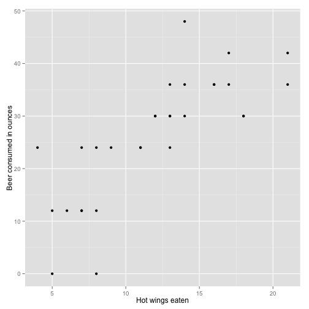

```r
p + geom_smooth()
```

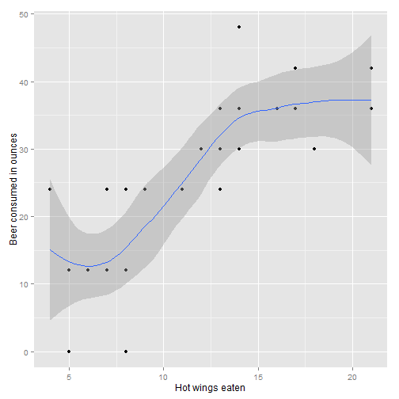

```r
p + geom_smooth(method = lm) + theme_bw()
```

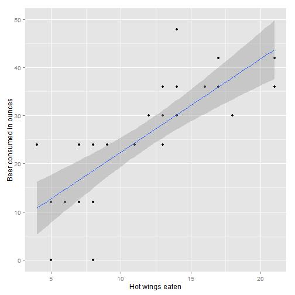


## Integrating with R


```r
f <- function(x) {
    (x - 1)^3 * exp(-x)
}
ans <- integrate(f, lower = 0, upper = Inf)$value
ans
```

```
[1] 2
```


Can A New Drug Reduce the Spread of Schistosomiasis?
========================================================

Schistosomiasis (skis-tuh-soh-may'-uh-sis) is a disease in humans caused by parasitic flatworms called schistosomes (skis'-tuh-sohms).  Schistosomiasis arrects about 200 million people worldwide and is a serious problem in sub-Saharan Africa, South America, China, and Southeast Asia.  The disease can cause death, but more commonly results in chronic and debilitating symptoms, arising primarily from the body's immune reaction to parasite eggs lodged in the liver, spleen,and intestines.

Currently there is one drug, praziquantel (pray'-zee-kwan-tel), in common use for treatment of schistosomiasis; it is inexpensive and effective. However, many organizations are concerned about relying on a single drug to treat a serious disease that affects so many people worldwide. Drug resistance may have prompted an outbreak in the 1990s in Senegal, where cure rates were low.  In 2007, several researchers published work on a  promising drug called K11777, which, in theory, might treat schistosomiasis.


```r
gender <- c(rep("Female", 10), rep("Male", 10))
group <- rep(rep(c("Treatment", "Control"), each = 5), 2)
worms <- c(1, 2, 2, 10, 7, 16, 10, 10, 7, 17, 3, 5, 9, 10, 6, 31, 26, 28, 13, 47)
schis <- data.frame(gender, group, worms)
head(schis, n = 3)
```

```
  gender     group worms
1 Female Treatment     1
2 Female Treatment     2
3 Female Treatment     2
```

```r
schis
```

```
   gender     group worms
1  Female Treatment     1
2  Female Treatment     2
3  Female Treatment     2
4  Female Treatment    10
5  Female Treatment     7
6  Female   Control    16
7  Female   Control    10
8  Female   Control    10
9  Female   Control     7
10 Female   Control    17
11   Male Treatment     3
12   Male Treatment     5
13   Male Treatment     9
14   Male Treatment    10
15   Male Treatment     6
16   Male   Control    31
17   Male   Control    26
18   Male   Control    28
19   Male   Control    13
20   Male   Control    47
```


```r
require(ggplot2)
p <- ggplot(data = schis, aes(group, worms)) + geom_point(position = "jitter", aes(color = group)) + 
    facet_grid(. ~ gender)
p
```


ACTIVITY
==================================================

1. Use the previous graph to compare visually the number of worms for the treatment and control groups for both the male and female mice.  Does each of the four groups appear to have a similar center and similar spread?  Are there any outliers (extreme observations that don't fit with the rest of the data)?

2. Calculate appropriate summary statistics (e.g., the median, mean, and standard deviation) for each of the four groups.  For the female mice, calculate the difference between the treatment and control means.  Do the same for the male mice.


```r
with(data = schis, schis[order(gender, group, worms), ])
```

```
   gender     group worms
9  Female   Control     7
7  Female   Control    10
8  Female   Control    10
6  Female   Control    16
10 Female   Control    17
1  Female Treatment     1
2  Female Treatment     2
3  Female Treatment     2
5  Female Treatment     7
4  Female Treatment    10
19   Male   Control    13
17   Male   Control    26
18   Male   Control    28
16   Male   Control    31
20   Male   Control    47
11   Male Treatment     3
12   Male Treatment     5
15   Male Treatment     6
13   Male Treatment     9
14   Male Treatment    10
```


```r
with(data = schis, tapply(worms, list(gender, group), median))
```

```
       Control Treatment
Female      10         2
Male        28         6
```

```r
with(data = schis, tapply(worms, list(gender, group), mean))
```

```
       Control Treatment
Female      12       4.4
Male        29       6.6
```

```r
with(data = schis, tapply(worms, list(gender, group), sd))
```

```
       Control Treatment
Female   4.301     3.912
Male    12.186     2.881
```


The descriptive analysis in Questions 1 and 2 points to a positive treatment effect: K11777 appears to have reduced the number of parasite worms in this sample.  But descriptive statistics are usually only the first step in ascertaining whether an effect is real; we often conduct a significance test or create a confidence interval to determine if chance alone could explain the effect.

We will introduce the basic concepts of randomization tests in a setting where units (mice in this example) are randomly allocated to a treatment or control group.  Using a significance test, we will decide if an observed treatment effect (the difference between the mean responses in the treatment and control) is "real" or if "random chance alone" could plausibly explain the observed effect.  The null hypothesis states that "random chance alone" is the reason for the observed effect.  In this initial discussion, the alternative hypothesis will be one-sided because we want to show that the true treatment mean($\mu_{treatment}$) is less than the true control mean ($\mu_{control}$).

Statistical Inference Through a Randomization Test
==================================================

Whether they take the form of significance tests or confidence intervals, inferential procedures rest on the **fundamental question for inference:** "What would happen if we did this many times?" Let's unpack this question in the context of the female mice schistosomiasis.  We observed a difference in means of 7.6 = 12 - 4.4 worms between the control and treatment groups.  While we expect that this large difference reflects the effectiveness of the drug, it is possible that chance alone could explain this difference.  This "chance alone" position is usually called the null hypothesis and includes the following assumptions:
* The number of parasitic worms found in the liver naturally varies from mouse to mouse.
* Whether or not the drug is effective, there clearly is variability in the responses of mice to the infestation of schistosomes.
* Each group exhibits this variability, and even if the drug is not effective, some mice do better than others.
* The only explanation for the observed difference of 7.6 worms in the means is that the random allocation randomly placed mice with  larger numbers of worms in the control group and mice with smaller numbers of worms in the treatment group.

In this study, the **null hypothesis** is that the treatment has no effect on the average worm count, and it is denoted as 

> $H_0:\mu_{control} = \mu_{treatment}$
Another way to write this hypothesis is 
> $H_0: \text{the treatment has no effect on average worm count}$

Alternative hypotheses can be "one-sided, greater-than" (as in this investigation), "one-sided, less-than" (the treatment causes an increase in worm count), or "two-sided" (the treatment is different, in one direction or the other, from the mean).  We chose to test a one-sided hypothesis because there is a clear research interest in one direction.  In other words, we will take action (start using the drug) only if we can show that K11777 reduces worm count.

> **The fundamental question for inference:** Every statistical inference procedure is based on the question "How does what we observed in our data compare to what would happen if the null hypothesis were actually true and we repeated the process many times?"

For a randomization test comparing responses for the two groups, this question becomes "How does the observed difference between groups compare to what would happen if the treatments actually had no effect on the individual responses and we repeated the random allocation of individuals to groups many times?"

Conducting a Randomization Test by Hand
===================================================

1. To get the feel for the concept of a _p_-value, write each of the female worm counts on an index card.  Shuffle the 10 index cards, and then draw five cards at random (without replacement).  Call these five cards the treatment group and the five remaining cards the control group.  Under the null hypothesis (i.e. the treatment has no effect on the worms), this allocation mimics precisely what actually happened in our experiment, since the only cause of group differences is the random allocation.  Calculate the mean of the five cards representing the treatment group and the mean of the five cards representing the control group.  Then find the difference between the control and treatment group means that you obtained in your allocation.  To be consistent, take the control group mean minus the treatment group mean.

2. If you were to do another random allocation, would you get the same difference in means? Explain.

3. Now, perform nine more random allocations, each time computing and writing down the difference in mean worm count between the control group and the treatment group.  Graphically represent the differences.  What proportion of these differences are 7.6 or larger?

4.  If you performed the simulation many times, would you expect a large percentage of the simulations to result in a mean difference greater than 7.6?  Explain.

The reasoning in the previous activity leads us to the randomization test and an interpretation of the fundamental question for inference.  The fundamental question for this context is as follows:  "If the null hypothesis were actually true and we randomly allocated our 10 mice to treatment and control groups many times, what proportion of the time would the observed difference in means be as big or bigger than 7.6?"  This long-run proportion is a probability that statisticians call the **_p-value_** of the randomization test.  The _p_-values for most randomization tests are found through simulations.  Despite the fact that simulations do not give exact _p_-values, they are usually preferred over the tedious and time consuming process of listing all possible outcomes.  Researchers usually pick a round number such as 10,000 repetitions on the simulation and approximate the _p_-value accordingly.  Since this _p_-value is an approximation, it is often referred to as the **empirical _p_-value.**

> **Key Concept:** Assuming that nothing except the random allocation process is creating group differences, the _p_-value of a randomization test is the probability of obtaining a group difference as large as or larger than the group difference actually observed in the experiment.

> **Key Concept:** The calculation of an empirical _p_-value requires these steps:
* Repeat the random allocation process a number of times (N times).
* Record, each time, whether or not the group difference exceeds or is the same as the one observed in the actual experiment (let X be the number of times the group difference exceeds or is the same as the one observed).
* Compute (X + 1)/(N + 1) to get the _p_-value, the proportion of times the difference exceeds or is the same as the observed difference.

**Note:** Including the observed value as one of the possible allocations is a more conservative approach and protects against getting a _p_-value of 0.  Our observation from the actual experiment provides evidence that the true _p_-value is greater than zero.

Performing a Randomization Test Using Computer Simulation
=========================================================

While physical simulations (such as the index cards activity) help us understand the process of computing an empirical _p_-value, using computer software is a much more efficient way of producing an empirical _p_-value based on a large number of iterations.  If you are simulating 10 random allocations, it is just as easy to use index cards as a computer.  However, the advantage of a computer simulation is that 10,000 random allocations can be conducted in almost the same time it takes to simulate 10 allocations.

Two-Sample Permutation Test
=============================
> Pool the _m + n_ values.
* **repeat**
  * Draw a resample of size _m_ without replacement.
  * Use the remaining _n_ observations for the other sample.
  * Calculate the difference in means or another test statistic that compares samples.
* **until** 
  * we have enough samples

Calculate the _p_-value as the fraction of times the random statistics are more or as extreme as the original statistic. Optionally, plot a histogram of the random statistic values.   
 
**Definition 3.2** A *test statistic* is a numerical function of the data whose value determines the result of the test.  The function itself is generally denoted *T=T(X)*, where **X** represents the data.  After being evaluated for the sample data **x**, the result is called an *observed test statistic* and is written in lowercase, *t=T(x)*.


Using Computer Simulations to Conduct a Hypothesis Test
=========================================================

1. Write code to allocate randomly each of the female worm counts to either the teatment or the control group.

2. Take the control group average minus the K11777 treatment group average.

3. Write code that perform steps 1. and 2. N = 99,999 times.  Compute and report the empirical _p_-value.

4. Create a histogram of the N simulated differences between group means and comment of the shape of the histogram.  

5. Based on your results in Questions 3 and 4 and assuming the null hypothesis is true, about how frequently do you think you would obtain a mean difference as large as or larger than 7.6 by random allocation alone?

6. Does your answer to Question 5 lead you to believe the "chance alone" position (i.e., the null hypothesis that the mean worm count is the same for both the treatment and the control), or does is lead you to believe that K11777 has a positive inhibitory effect on the schistosome worm in female mice?  Explain.

Using R
==========


```r
ND <- schis[gender == "Female", ]
ND
```

```
   gender     group worms
1  Female Treatment     1
2  Female Treatment     2
3  Female Treatment     2
4  Female Treatment    10
5  Female Treatment     7
6  Female   Control    16
7  Female   Control    10
8  Female   Control    10
9  Female   Control     7
10 Female   Control    17
```

```r
tapply(ND$worms, ND$group, mean)
```

```
  Control Treatment 
     12.0       4.4 
```

```r
# OR
ANS1 <- with(data = ND, tapply(worms, group, mean))
ANS1
```

```
  Control Treatment 
     12.0       4.4 
```

```r
observed <- ANS1[1] - ANS1[2]
observed
```

```
Control 
    7.6 
```

```r
names(observed) <- NULL
observed
```

```
[1] 7.6
```

Since we will be working with the **worms** variable for females only, we will create a vector holding these values.  Then, we will draw a random sample of size 5 from the numbers 1 through 10 (there are 10 observations).  The worms values corresponding to these positions will be values for the Control group and the remaining ones for the Treatment group.  The mean difference of this permutation will be stored in **result**.  This will be repeated many times.


```r
Worms <- ND$worms
Worms
```

```
 [1]  1  2  2 10  7 16 10 10  7 17
```

```r
# Another way:
Worms2 <- subset(ND, select = worms, drop = TRUE)
Worms2
```

```
 [1]  1  2  2 10  7 16 10 10  7 17
```

```r
N <- 10^4 - 1  # number of times to repeat the process
result <- numeric(N)  # space to save the random differences
for (i in 1:N) {
    # sample of size 5, from 1 to 10, without replacement
    index <- sample(10, size = 5, replace = FALSE)
    result[i] <- mean(Worms2[index]) - mean(Worms2[-index])
}
hist(result, col = "blue", freq = FALSE, main = "")
```


```r
d.res <- density(result)
plot(d.res, main = "", xlab = "", ylab = "")
polygon(d.res, col = "pink")
xs <- c(7.6, d.res$x[d.res$x >= 7.6])
ys <- c(0, d.res$y[d.res$x >= 7.6])
polygon(xs, ys, col = "red")
```


```r
pvalue <- (sum(result >= observed) + 1)/(N + 1)  # p-value
pvalue  # results will vary
```

```
[1] 0.0242
```

```r
# ggplot2 approach now
DF <- data.frame(x = result)
p <- ggplot(data = DF) + geom_density(aes(x = x, y = ..density..), fill = "pink", alpha = 0.4)
p
```


```r
x.dens <- density(result)
df.dens <- data.frame(x = x.dens$x, y = x.dens$y)
p + geom_area(data = subset(df.dens, x >= 7.6 & x <= max(DF$x)), aes(x = x, y = y), fill = "blue", alpha = 0.4) + 
    labs(x = "", y = "")
```


The code snippet **result >= observed** results in a vector of **TRUE's** and **FALSE's** depending on whether or not the mean difference computed for a resample is greater than the observed mean difference.  **sum(result >= observed)** counts the number of **TRUE's**.  Thus, the computed _p_-value is just the proportion of statistics (including the original) that are as large or larger than the original mean difference. The empirical _p_-value is 0.0242.

Because the sample sizes in the schistosomiasis study are small, it is possible to apply mathematical methods to obtain an **exact _p_-value** for this randomization test.  An exact _p_-value can be obtained by writing down the set of all possibilities (assuming each possible outcome is equally likely under the null hypothesis) and then calculating the proportion of the set for which the difference is at least as large as the observed difference.  In the schistosomiasis study, this requires listing every possible combination in which five of the 10 female mice can be allocated to the treatment (and the other five mice are assigned to the control).  There are $\binom{10}{5}=$ 252 possible combinations.  For each of these combinations, the difference between the treatment and control means is then calculated.  The exact _p_-value is the proportion of times in which the difference in the means is at least as large as the observed difference of 7.6 worms.  Of these 252 combinations, six have a mean difference of 7.6 and one has a mean difference greater than 7.6 (namely 8.8).  Since all 252 of these random allocations are equally likely, the exact _p_-value in this example is 7/252 = 0.0278.  However, most real studies are too large to list all possible samples.  Randomization tests are almost alwyas adequate, providing approximate _p_-values that are close enought to the true _p_-value.  

> Key Concept: The larger the number of randomizations within a simulation study, the more precise the _p_-value is. If the true _p_-value is p, the estimated _p_-value has variance approximately equal to $p(1 - p)/N$, where $N$ is the number of resamples.

Sometimes we have some threshold _p_-value at or below which we will reject the null hypothesis and conclude in favor of the alternative hypothesis.  This threshold value is called a **significance level** and is usually denoted by the Greek letter alpha ($\alpha$).  Common values are $\alpha = 0.05$ and $\alpha = 0.01$, but the value will depend heavily on context and the researcher's assessment of the acceptable risk of stating an incorrect conclusion.  When the study's _p_-value is less than or equal to this significance level, we state that the results are **statistically significant at level $\alpha$**.  If you see the phrase "statistically significant" without a specification of $\alpha$ the writer is most likely assuming $\alpha = 0.05$, for reasons of history and convention alone.  However, it is best to show the _p_-value instead of simply stating a result is significant at a particular $\alpha$-level.

Activity
==============

Explain what each line of the following code is doing.


```r
# PROGRAMMING IS THE BEST WAY TO DEBUG YOUR THINKING!  Theoretical Answer
require(PASWR)
DATA <- c(1, 2, 2, 10, 7, 16, 10, 10, 7, 17)
DATA
```

```
 [1]  1  2  2 10  7 16 10 10  7 17
```

```r
OBS <- mean(DATA[6:10]) - mean(DATA[1:5])
OBS
```

```
[1] 7.6
```

```r
# ANS <- t(Combinations(10, 5))
ANS <- t(combn(10, 5))
head(ANS)
```

```
     [,1] [,2] [,3] [,4] [,5]
[1,]    1    2    3    4    5
[2,]    1    2    3    4    6
[3,]    1    2    3    4    7
[4,]    1    2    3    4    8
[5,]    1    2    3    4    9
[6,]    1    2    3    4   10
```

```r
nn <- dim(ANS)[1]
nn
```

```
[1] 252
```

```r
means <- numeric(nn)
for (i in 1:nn) {
    means[i] <- mean(DATA[ANS[i, ]]) - mean(DATA[-ANS[i, ]])
}
sort(means)
```

```
  [1] -8.8 -7.6 -7.6 -7.6 -7.6 -7.6 -7.6 -6.4 -6.4 -6.4 -5.6 -5.6 -5.6 -5.6 -5.6 -5.6 -5.2 -5.2 -5.2
 [20] -5.2 -5.2 -4.8 -4.8 -4.4 -4.4 -4.4 -4.4 -4.4 -4.4 -4.4 -4.4 -4.4 -4.4 -4.4 -4.4 -4.0 -4.0 -4.0
 [39] -4.0 -4.0 -4.0 -4.0 -4.0 -4.0 -3.6 -3.6 -3.6 -3.2 -3.2 -3.2 -3.2 -2.8 -2.8 -2.8 -2.8 -2.4 -2.4
 [58] -2.4 -2.4 -2.0 -2.0 -2.0 -2.0 -2.0 -2.0 -2.0 -2.0 -2.0 -2.0 -2.0 -2.0 -2.0 -2.0 -2.0 -2.0 -2.0
 [77] -2.0 -1.6 -1.6 -1.6 -1.6 -1.6 -1.6 -1.6 -1.6 -1.6 -1.6 -1.6 -1.6 -1.6 -1.6 -1.6 -1.6 -1.6 -1.6
 [96] -1.2 -1.2 -1.2 -1.2 -1.2 -1.2 -1.2 -1.2 -1.2 -0.8 -0.8 -0.8 -0.8 -0.8 -0.8 -0.8 -0.8 -0.8 -0.8
[115] -0.4 -0.4 -0.4 -0.4 -0.4 -0.4 -0.4 -0.4 -0.4  0.0  0.0  0.0  0.0  0.0  0.0  0.4  0.4  0.4  0.4
[134]  0.4  0.4  0.4  0.4  0.4  0.8  0.8  0.8  0.8  0.8  0.8  0.8  0.8  0.8  0.8  1.2  1.2  1.2  1.2
[153]  1.2  1.2  1.2  1.2  1.2  1.6  1.6  1.6  1.6  1.6  1.6  1.6  1.6  1.6  1.6  1.6  1.6  1.6  1.6
[172]  1.6  1.6  1.6  1.6  2.0  2.0  2.0  2.0  2.0  2.0  2.0  2.0  2.0  2.0  2.0  2.0  2.0  2.0  2.0
[191]  2.0  2.0  2.0  2.4  2.4  2.4  2.4  2.8  2.8  2.8  2.8  3.2  3.2  3.2  3.2  3.6  3.6  3.6  4.0
[210]  4.0  4.0  4.0  4.0  4.0  4.0  4.0  4.0  4.4  4.4  4.4  4.4  4.4  4.4  4.4  4.4  4.4  4.4  4.4
[229]  4.4  4.8  4.8  5.2  5.2  5.2  5.2  5.2  5.6  5.6  5.6  5.6  5.6  5.6  6.4  6.4  6.4  7.6  7.6
[248]  7.6  7.6  7.6  7.6  8.8
```

```r
# 
sum(means >= OBS)
```

```
[1] 7
```

```r
pvalue <- sum(means >= OBS)/nn
pvalue
```

```
[1] 0.02778
```

```r
# 7/252
DF <- data.frame(x = means)
p <- ggplot(data = DF) + geom_density(aes(x = x, y = ..density..), fill = "pink", alpha = 0.4)
p
```


```r
x.dens <- density(means)
df.dens <- data.frame(x = x.dens$x, y = x.dens$y)
p + geom_area(data = subset(df.dens, x >= 7.6 & x <= max(DF$x)), aes(x = x, y = y), fill = "blue", alpha = 0.4) + 
    labs(x = "", y = "")
```


```r
# Another approach ....
P3 <- t(SRS(DATA, n = 5))
P2 <- t(SRS(DATA, n = 5))
# Note need to reorder the P2 values
P2R <- P2[, 252:1]
apply(P2R, 2, mean)
```

```
  [1] 12.0 10.2 10.8  9.2  9.2  9.0 11.4 12.0 10.4 10.4 10.2 10.2  8.6  8.6  8.4  9.2  9.2  9.0  7.6
 [20]  7.4  7.4 11.4 12.0 10.4 10.4 10.2 10.2  8.6  8.6  8.4  9.2  9.2  9.0  7.6  7.4  7.4 11.4  9.8
 [39]  9.8  9.6 10.4 10.4 10.2  8.8  8.6  8.6  8.6  8.6  8.4  7.0  6.8  6.8  7.6  7.4  7.4  5.8 12.0
 [58] 12.6 11.0 11.0 10.8 10.8  9.2  9.2  9.0  9.8  9.8  9.6  8.2  8.0  8.0 12.0 10.4 10.4 10.2 11.0
 [77] 11.0 10.8  9.4  9.2  9.2  9.2  9.2  9.0  7.6  7.4  7.4  8.2  8.0  8.0  6.4 12.0 10.4 10.4 10.2
 [96] 11.0 11.0 10.8  9.4  9.2  9.2  9.2  9.2  9.0  7.6  7.4  7.4  8.2  8.0  8.0  6.4 10.4 10.4 10.2
[115]  8.8  8.6  8.6  9.4  9.2  9.2  7.6  7.6  7.4  7.4  5.8  6.4 10.0 10.6  9.0  9.0  8.8  8.8  7.2
[134]  7.2  7.0  7.8  7.8  7.6  6.2  6.0  6.0 10.0  8.4  8.4  8.2  9.0  9.0  8.8  7.4  7.2  7.2  7.2
[153]  7.2  7.0  5.6  5.4  5.4  6.2  6.0  6.0  4.4 10.0  8.4  8.4  8.2  9.0  9.0  8.8  7.4  7.2  7.2
[172]  7.2  7.2  7.0  5.6  5.4  5.4  6.2  6.0  6.0  4.4  8.4  8.4  8.2  6.8  6.6  6.6  7.4  7.2  7.2
[191]  5.6  5.6  5.4  5.4  3.8  4.4 10.6  9.0  9.0  8.8  9.6  9.6  9.4  8.0  7.8  7.8  7.8  7.8  7.6
[210]  6.2  6.0  6.0  6.8  6.6  6.6  5.0  9.0  9.0  8.8  7.4  7.2  7.2  8.0  7.8  7.8  6.2  6.2  6.0
[229]  6.0  4.4  5.0  9.0  9.0  8.8  7.4  7.2  7.2  8.0  7.8  7.8  6.2  6.2  6.0  6.0  4.4  5.0  7.4
[248]  7.2  7.2  5.6  6.2  4.4
```

```r
apply(P3, 2, mean)
```

```
  [1]  4.4  6.2  5.6  7.2  7.2  7.4  5.0  4.4  6.0  6.0  6.2  6.2  7.8  7.8  8.0  7.2  7.2  7.4  8.8
 [20]  9.0  9.0  5.0  4.4  6.0  6.0  6.2  6.2  7.8  7.8  8.0  7.2  7.2  7.4  8.8  9.0  9.0  5.0  6.6
 [39]  6.6  6.8  6.0  6.0  6.2  7.6  7.8  7.8  7.8  7.8  8.0  9.4  9.6  9.6  8.8  9.0  9.0 10.6  4.4
 [58]  3.8  5.4  5.4  5.6  5.6  7.2  7.2  7.4  6.6  6.6  6.8  8.2  8.4  8.4  4.4  6.0  6.0  6.2  5.4
 [77]  5.4  5.6  7.0  7.2  7.2  7.2  7.2  7.4  8.8  9.0  9.0  8.2  8.4  8.4 10.0  4.4  6.0  6.0  6.2
 [96]  5.4  5.4  5.6  7.0  7.2  7.2  7.2  7.2  7.4  8.8  9.0  9.0  8.2  8.4  8.4 10.0  6.0  6.0  6.2
[115]  7.6  7.8  7.8  7.0  7.2  7.2  8.8  8.8  9.0  9.0 10.6 10.0  6.4  5.8  7.4  7.4  7.6  7.6  9.2
[134]  9.2  9.4  8.6  8.6  8.8 10.2 10.4 10.4  6.4  8.0  8.0  8.2  7.4  7.4  7.6  9.0  9.2  9.2  9.2
[153]  9.2  9.4 10.8 11.0 11.0 10.2 10.4 10.4 12.0  6.4  8.0  8.0  8.2  7.4  7.4  7.6  9.0  9.2  9.2
[172]  9.2  9.2  9.4 10.8 11.0 11.0 10.2 10.4 10.4 12.0  8.0  8.0  8.2  9.6  9.8  9.8  9.0  9.2  9.2
[191] 10.8 10.8 11.0 11.0 12.6 12.0  5.8  7.4  7.4  7.6  6.8  6.8  7.0  8.4  8.6  8.6  8.6  8.6  8.8
[210] 10.2 10.4 10.4  9.6  9.8  9.8 11.4  7.4  7.4  7.6  9.0  9.2  9.2  8.4  8.6  8.6 10.2 10.2 10.4
[229] 10.4 12.0 11.4  7.4  7.4  7.6  9.0  9.2  9.2  8.4  8.6  8.6 10.2 10.2 10.4 10.4 12.0 11.4  9.0
[248]  9.2  9.2 10.8 10.2 12.0
```

```r
DiffMeans <- apply(P3, 2, mean) - apply(P2R, 2, mean)
sort(DiffMeans)
```

```
  [1] -8.8 -7.6 -7.6 -7.6 -7.6 -7.6 -7.6 -6.4 -6.4 -6.4 -5.6 -5.6 -5.6 -5.6 -5.6 -5.6 -5.2 -5.2 -5.2
 [20] -5.2 -5.2 -4.8 -4.8 -4.4 -4.4 -4.4 -4.4 -4.4 -4.4 -4.4 -4.4 -4.4 -4.4 -4.4 -4.4 -4.0 -4.0 -4.0
 [39] -4.0 -4.0 -4.0 -4.0 -4.0 -4.0 -3.6 -3.6 -3.6 -3.2 -3.2 -3.2 -3.2 -2.8 -2.8 -2.8 -2.8 -2.4 -2.4
 [58] -2.4 -2.4 -2.0 -2.0 -2.0 -2.0 -2.0 -2.0 -2.0 -2.0 -2.0 -2.0 -2.0 -2.0 -2.0 -2.0 -2.0 -2.0 -2.0
 [77] -2.0 -1.6 -1.6 -1.6 -1.6 -1.6 -1.6 -1.6 -1.6 -1.6 -1.6 -1.6 -1.6 -1.6 -1.6 -1.6 -1.6 -1.6 -1.6
 [96] -1.2 -1.2 -1.2 -1.2 -1.2 -1.2 -1.2 -1.2 -1.2 -0.8 -0.8 -0.8 -0.8 -0.8 -0.8 -0.8 -0.8 -0.8 -0.8
[115] -0.4 -0.4 -0.4 -0.4 -0.4 -0.4 -0.4 -0.4 -0.4  0.0  0.0  0.0  0.0  0.0  0.0  0.4  0.4  0.4  0.4
[134]  0.4  0.4  0.4  0.4  0.4  0.8  0.8  0.8  0.8  0.8  0.8  0.8  0.8  0.8  0.8  1.2  1.2  1.2  1.2
[153]  1.2  1.2  1.2  1.2  1.2  1.6  1.6  1.6  1.6  1.6  1.6  1.6  1.6  1.6  1.6  1.6  1.6  1.6  1.6
[172]  1.6  1.6  1.6  1.6  2.0  2.0  2.0  2.0  2.0  2.0  2.0  2.0  2.0  2.0  2.0  2.0  2.0  2.0  2.0
[191]  2.0  2.0  2.0  2.4  2.4  2.4  2.4  2.8  2.8  2.8  2.8  3.2  3.2  3.2  3.2  3.6  3.6  3.6  4.0
[210]  4.0  4.0  4.0  4.0  4.0  4.0  4.0  4.0  4.4  4.4  4.4  4.4  4.4  4.4  4.4  4.4  4.4  4.4  4.4
[229]  4.4  4.8  4.8  5.2  5.2  5.2  5.2  5.2  5.6  5.6  5.6  5.6  5.6  5.6  6.4  6.4  6.4  7.6  7.6
[248]  7.6  7.6  7.6  7.6  8.8
```

```r
sum(DiffMeans >= 7.6)
```

```
[1] 7
```

```r
# Note the following:
obs <- mean(DATA[6:10])
sort(apply(P3, 2, mean))
```

```
  [1]  3.8  4.4  4.4  4.4  4.4  4.4  4.4  5.0  5.0  5.0  5.4  5.4  5.4  5.4  5.4  5.4  5.6  5.6  5.6
 [20]  5.6  5.6  5.8  5.8  6.0  6.0  6.0  6.0  6.0  6.0  6.0  6.0  6.0  6.0  6.0  6.0  6.2  6.2  6.2
 [39]  6.2  6.2  6.2  6.2  6.2  6.2  6.4  6.4  6.4  6.6  6.6  6.6  6.6  6.8  6.8  6.8  6.8  7.0  7.0
 [58]  7.0  7.0  7.2  7.2  7.2  7.2  7.2  7.2  7.2  7.2  7.2  7.2  7.2  7.2  7.2  7.2  7.2  7.2  7.2
 [77]  7.2  7.4  7.4  7.4  7.4  7.4  7.4  7.4  7.4  7.4  7.4  7.4  7.4  7.4  7.4  7.4  7.4  7.4  7.4
 [96]  7.6  7.6  7.6  7.6  7.6  7.6  7.6  7.6  7.6  7.8  7.8  7.8  7.8  7.8  7.8  7.8  7.8  7.8  7.8
[115]  8.0  8.0  8.0  8.0  8.0  8.0  8.0  8.0  8.0  8.2  8.2  8.2  8.2  8.2  8.2  8.4  8.4  8.4  8.4
[134]  8.4  8.4  8.4  8.4  8.4  8.6  8.6  8.6  8.6  8.6  8.6  8.6  8.6  8.6  8.6  8.8  8.8  8.8  8.8
[153]  8.8  8.8  8.8  8.8  8.8  9.0  9.0  9.0  9.0  9.0  9.0  9.0  9.0  9.0  9.0  9.0  9.0  9.0  9.0
[172]  9.0  9.0  9.0  9.0  9.2  9.2  9.2  9.2  9.2  9.2  9.2  9.2  9.2  9.2  9.2  9.2  9.2  9.2  9.2
[191]  9.2  9.2  9.2  9.4  9.4  9.4  9.4  9.6  9.6  9.6  9.6  9.8  9.8  9.8  9.8 10.0 10.0 10.0 10.2
[210] 10.2 10.2 10.2 10.2 10.2 10.2 10.2 10.2 10.4 10.4 10.4 10.4 10.4 10.4 10.4 10.4 10.4 10.4 10.4
[229] 10.4 10.6 10.6 10.8 10.8 10.8 10.8 10.8 11.0 11.0 11.0 11.0 11.0 11.0 11.4 11.4 11.4 12.0 12.0
[248] 12.0 12.0 12.0 12.0 12.6
```

```r
sum(apply(P3, 2, mean) >= obs)
```

```
[1] 7
```


Two-Sided Tests
====================

The direction of the alternative hypothesis is derived from the research hypothesis.  In this K11777 study, we enter the study expecting a reduction in worm counts and hoping the data will bear out this expectation.  It is our expectation, hope, or interest that drives the alternative hypothesis and the randomization calculation.  Occasionally, we enter a study without a firm direction in mind for the alternative, in which case we use a two-sided alternative.  Furthermore, even if we hope that the new treatment will be better than the old treatment or better than the control, we might be wrong---it may be that the new treatment is actually worse than the old treatment or even harmful (worse than the control).  Some statisticians argue that a conservative objective approach is to always consider the two-sided alternative.  For a **two-sided test**, the _p_-value must take into account extreme values of the test statistic in either direction (no matter which direction we actually observe in our sample data).

> Key Concept:  The direction of the alternative hypothesis does not depend on the sample data, but instead is determined by the research hypothesis before the data are collected.

We will now make our definition of the _p_-value more general for a wider variety of significance testing situations.  The _p_-value is the probability of observing a group difference as extreme as or more extreme than the group difference actually observed in the sample data, assuming that there is nothing creating groupd differences except the random allocation process.

This definition is consistent with the earlier definition for one-sided alternatives, as we can interpret _extreme_ to mean either greater than or less than, depending on the direction fo the alternative hypothesis.  But in the two-sided case, _extreme_ encompasses both directions.  In the K11777 example, we observed a difference of 7.6 between control and treament group means.  Thus, the two-sided _p_-value calculation is a count of all instances among the N replications where the randomly allocated mean difference is either as small as or smaller than -7.6 worms ($\leq -7.6$) or as great or greater than 7.6 worms ($\geq 7.6$).  This is often written as $|diff| \geq 7.6$.

Activity: A two-sided hypothesis test
======================================

  * Run the simulaltion study again to fine the empirical _p_-value for a two-sided hypothesis test to determine if there is a difference between the treatment and control group means for female mice.


```r
ND <- schis[gender == "Female", ]
ND
```

```
   gender     group worms
1  Female Treatment     1
2  Female Treatment     2
3  Female Treatment     2
4  Female Treatment    10
5  Female Treatment     7
6  Female   Control    16
7  Female   Control    10
8  Female   Control    10
9  Female   Control     7
10 Female   Control    17
```

```r
tapply(ND$worms, ND$group, mean)
```

```
  Control Treatment 
     12.0       4.4 
```

```r
# OR
ANS1 <- with(data = ND, tapply(worms, group, mean))
ANS1
```

```
  Control Treatment 
     12.0       4.4 
```

```r
observed <- ANS1[1] - ANS1[2]
observed
```

```
Control 
    7.6 
```

```r
names(observed) <- NULL
observed
```

```
[1] 7.6
```

```r
Worms2 <- subset(ND, select = worms, drop = TRUE)
Worms2
```

```
 [1]  1  2  2 10  7 16 10 10  7 17
```

```r
N <- 10^5 - 1  # number of times fo repeat the process
result <- numeric(N)  # space to save the random differences
for (i in 1:N) {
    # sample of size 5, from 1 to 10, without replacement
    index <- sample(10, size = 5, replace = FALSE)
    result[i] <- mean(Worms2[index]) - mean(Worms2[-index])
}
hist(result, col = "blue", main = "", freq = FALSE)
```


```r
d.res <- density(result)
plot(d.res, main = "", xlab = "", ylab = "")
polygon(d.res, col = "pink")
xsr <- c(7.6, d.res$x[d.res$x >= 7.6])
ysr <- c(0, d.res$y[d.res$x >= 7.6])
xsl <- c(-7.6, d.res$x[d.res$x <= -7.6])
ysl <- c(0, d.res$y[d.res$x <= -7.6])
polygon(xsr, ysr, col = "red")
polygon(xsl, ysl, col = "red")
```


```r
pvalue <- (sum(result >= observed) + sum(result <= -observed) + 1)/(N + 1)  # p-value
pvalue  # results will vary
```

```
[1] 0.05562
```

```r
# ggplot2 approach now
DF <- data.frame(x = result)
p <- ggplot(data = DF) + geom_density(aes(x = x, y = ..density..), fill = "pink", alpha = 0.4)
p
```


```r
x.dens <- density(result)
df.dens <- data.frame(x = x.dens$x, y = x.dens$y)
p + geom_area(data = subset(df.dens, x >= 7.6 & x <= max(DF$x)), aes(x = x, y = y), fill = "blue", alpha = 0.4) + 
    labs(x = "", y = "") + geom_area(data = subset(df.dens, x <= -7.6 & x >= min(DF$x)), aes(x = x, y = y), 
    fill = "blue", alpha = 0.4)
```


The empirical _p_-value for a two-sided test is 0.0556.

  * Is the number of simulations resulting in a difference greater than or equal to 7.6 identical to the number of simulations resulting in a difference less than or equal to -7.6?  Explain why these values are likely to be close but not identical.
  

```r
sum(result >= observed)
```

```
[1] 2728
```

```r
sum(result <= -observed)
```

```
[1] 2833
```


  * Explain why you expect the _p_-value for the two-sided alternative to be about double that for the one sided alternative.
  
What Can We Conclude from the Schistosomiasis Study?
======================================================

The key question in this study is whwther K11777 will reduce the spread of a common and potentially deadly disease.  The result that you calculated from the one-sided randomization hypothesis test should have been close to the exact _p_-value of 0.0278.  This small _p_-value allows you to reject the null hypothesis and conclude that the worm counts are lower in the female treatment group than in the female control group.  In every study, it is important to consider how random allocation and random sampling impact the conclusions.

> _Random allocation_: The schistosomiasis stude was an **experiment** because the units (female mice) were randomly allocated to treatment or contol groups.  To the best of our knowledge this experiment controlled for any outside influences and allows us to state that there is a cause and effect relationship between the treatment and response.  Therefore, we can conclude that K11777 did _cause_ a reduction in the average number of schistosome parasites in these female mice.

> _Random sampling_: Mice for this study are typically ordered from a facility that breeds and rasies lab mice.  It is possilbe that the mice in this study were biologically related or were exposed to something that caused their response to be different from that of other mice.  Similarly, there are risks in simply assuming that male mice have the same response as females.  Since our sample of 10 female mice was not selected at random from the population of all mice, we should question whether the results from this study hold for all mice.

More importantly, the results have not shown that this new drug will have the same impact on humans as it does on mice.  In addition, even though we found that K11777 does cause a reduction in worm counts, we did not specifically show that it will reduce the spread of the disease.  Is the disease less deadly if only two worms are in the body instead of 10?  Statistical consultants aren't typically expected to know the answers to these theoretical, biological, or medical types of questions, but they should ask questions to ensure that the study conclusions match the hypothesis that was tested.  In most cases, drug tests require multiple levels of studies to ensure that the drug is safe and to show that the results are consistent across the entire population of interest. While this study is very promising, much more work is needed before we can conclude that K11777 can reduce the spread of schistosomiasis in humans.

Permutation Test versus Randomization Tests
=====================================================

The random allocation of experimental units (e.g. mice) to groups provides the basis for statistical inference in a randomized comparative experiment.  In the schistosomiasis K11777 treatment study, we used a significance test to ascertain whether cause and effect was at work.  In the context of the random allocation study design, we called our significance test a randomization test.  In **observational studies**, subjects are not randomnly allocated to groups.  In this context, we apply the same inferential procedures as in the previous experiment, but we commonly call the significance test a **permutation test** rather than a a randomization test.  More importantly, in observational studies, the results of the test cannot typically be used to claim cause and effect; a reseracher should exhibit more caution in the interpretation of results.

> Key Concept: Wheras in experiments units are randomly allocated to treatment groups, observational studies do no impose a treatment on a unit.  Because the random allocation process protects against potential biases caused by extraneous variables, experiments are often used to show causation.

Age Discrimination Study
========================

Westvaco is a company that produces paper products.  IN 1991, Robert Martin was working in the engineering department of the company's envelope division when he was laid off in Round 2 of several rounds of layoffs by the company.  He sued the company, claiming to be a victim of age discrimination.  The ages of the 10 workers involved in Round 2 were: 25, 33, 35, 38, 48, 55, 55, 56, and 64.  The ages of the three people laid off were 55, 55, and 64.


```r
ages <- c(25, 33, 35, 38, 48, 55, 55, 55, 56, 64)
status <- c(rep("Job", 6), rep("LaidOff", 2), "Job", "LaidOff")
west <- data.frame(ages, status)
rm(ages, status)
west
```

```
   ages  status
1    25     Job
2    33     Job
3    35     Job
4    38     Job
5    48     Job
6    55     Job
7    55 LaidOff
8    55 LaidOff
9    56     Job
10   64 LaidOff
```

```r
require(ggplot2)
p <- ggplot(data = west, aes(status, ages)) + geom_point(position = "jitter", aes(color = status))
p
```


  * Conduct a permutation test to determine whether the observed difference between means is likely to occur just by chance.  Here we are interested in only a one-sided test to determine if the mean age of people who were laid off is higher than the mean age of people who were not laid off.
  

```r
OBS <- with(data = west, tapply(ages, status, mean))
OBS
```

```
    Job LaidOff 
  41.43   58.00 
```

```r
obsDiff <- OBS[2] - OBS[1]
names(obsDiff) <- NULL
obsDiff
```

```
[1] 16.57
```

```r
Ages <- subset(west, select = ages, drop = TRUE)
Ages
```

```
 [1] 25 33 35 38 48 55 55 55 56 64
```

```r
N <- 10^5 - 1  # number of times fo repeat the process
result <- numeric(N)  # space to save the random differences
for (i in 1:N) {
    # sample of size 3, from 1 to 10, without replacement
    index <- sample(10, size = 3, replace = FALSE)
    result[i] <- mean(Ages[index]) - mean(Ages[-index])
}
hist(result, col = "blue", main = "", xlim = c(-25, 25))
```


```r
d.res <- density(result)
plot(d.res, main = "", xlab = "", ylab = "", xlim = c(-25, 25))
polygon(d.res, col = "pink")
xs <- c(obsDiff, d.res$x[d.res$x >= obsDiff])
ys <- c(0, d.res$y[d.res$x >= obsDiff])
polygon(xs, ys, col = "red")
```


```r
# ggplot2 approach now
DF <- data.frame(x = result)
p <- ggplot(data = DF) + geom_density(aes(x = x, y = ..density..), fill = "pink", alpha = 0.4)
p
```


```r
x.dens <- density(result)
df.dens <- data.frame(x = x.dens$x, y = x.dens$y)
p + geom_area(data = subset(df.dens, x >= obsDiff & x <= max(DF$x)), aes(x = x, y = y), fill = "blue", 
    alpha = 0.4) + labs(x = "", y = "")
```


```r
pvalue <- (sum(result >= obsDiff) + 1)/(N + 1)  # p-value
pvalue  # results will vary
```

```
[1] 0.05075
```

The _p_-value is 0.0508.
  
  * Modify the code used in the previous problem to test if the median age of people who were laid off is higher than the median age of people who were not laid off.  Report the _p_-value and compare your results to those in the previous question.
  
  

```r
OBSM <- with(data = west, tapply(ages, status, median))
OBSM
```

```
    Job LaidOff 
     38      55 
```

```r
obsDiffMedian <- OBSM[2] - OBSM[1]
obsDiffMedian
```

```
LaidOff 
     17 
```

```r
Ages <- subset(west, select = ages, drop = TRUE)
Ages
```

```
 [1] 25 33 35 38 48 55 55 55 56 64
```

```r
N <- 10^5 - 1  # number of times fo repeat the process
MedianDiff <- numeric(N)  # space to save the random differences
for (i in 1:N) {
    # sample of size 3, from 1 to 10, without replacement
    index <- sample(10, size = 3, replace = FALSE)
    MedianDiff[i] <- median(Ages[index]) - median(Ages[-index])
}
hist(MedianDiff, col = "blue", main = "")
```


```r
# ggplot2 approach now
DF <- data.frame(x = MedianDiff)
p <- ggplot(data = DF) + geom_density(aes(x = x, y = ..density..), fill = "pink", alpha = 0.4)
p
```


```r
x.dens <- density(MedianDiff)
df.dens <- data.frame(x = x.dens$x, y = x.dens$y)
p + geom_area(data = subset(df.dens, x >= obsDiffMedian & x <= max(DF$x)), aes(x = x, y = y), fill = "blue", 
    alpha = 0.4) + labs(x = "", y = "")
```


```r
####### 
pvalueMED <- (sum(MedianDiff >= obsDiffMedian) + 1)/(N + 1)  # p-value
pvalueMED  # results will vary
```

```
[1] 0.1667
```

The _p_-value is 0.1667.

Since there was no random allocation (i.e., people were not randomly assigned to layoff group), statistical significance does not give us the right to assert that greater age is _causing_ a difference in being laid off.  We "imagine" an experiment in which workers are randomly allocated to a layoff group and then determine if the observed average difference between the ages of laid-off workers and those not laid off is significantly larger than would be expected to occur by chance is a randomized comparative experiment.

While age could be the cause for the difference ---hence proving the allegation of age discrimination---there are many other possibilities (i.e., extraneous variables), such as educational levels of the workers, their competence to do the job, and ratings on past performance evaluations.  Rejecting the null hypothesis in a nonrandomized context can be a _useful step_ toward establishing causality; however, it cannot establish causality unless the extraneous variables have been properly accounted for.  

In the actual court case, data from all three rounds of layoffs were statistically analyzed.  The analysis showed some evidence that older people were more likely to be laid off; however, Robert Martin ended up settling out of court.


Verizon Repair Times
======================


Verizon is the primary local telephone company (incumbent local exchange carrier ILEC) for a large area of the eastern United States.  AS such, it is responsible for providing repair service for the customers of other telephone companies known as competing local exchange carriers (CLECs) in this region.  Verizon is subject to fines if the repair times (the time it takes to fix a problem) for CLEC customers are substantially worse thatn those for Verizon customers.  The data set **Verizon.csv** stored in the class **Data** directory contains a random sample of repair times for 1664 ILEC and 23 CLEC customers.  The mean repair time for ILEC customers is 8.4 hours, while that for CLEC customers is 16.5 hours.  Could a difference this large be easily explained by chance?

The permutation distribution (difference of means) is skewed to the left, but that does not matter; both the observed statistic and the permutation resamples are affected by imbalance and skewness in the same way.  This test works fine even with unbalanced sample sizes of 1664 and 23, and even for very skewed data.

Note that the Verizon data has long tails.  The mean is not the best measure of center to use with long tailed distributions.  We may want to use a statistic that is less sensitive to skewed distributions.  There are a number of reasons to do this.  One is to get a better measure of what is important in practice, how inconvenienced customers are by the repairs.  After a while, each additional hour probably does not matter as much, yet a sample mean treats an extra 10 hours on a repair time of 100 hours the same as an extra 10 hours on a repair of 1 hour.  Second, a large recorded repair time might just be a blunder; for example, a repair time of $10^6$ hours must be a mistake.  Third, a more robust statistic could be more sensitive at detecting real differences in the distributions -- the mean is so sensitive to large observations that it pays less attention to moderate observations, wheras a statistic more sensitive to moderate observations could detect differences between populations that show up in the moderate observations.

Using Means
=============


```r
Ver <- read.csv("http://www1.appstate.edu/~arnholta/Data/Verizon.csv")
head(Ver)
```

```
   Time Group
1 17.50  ILEC
2  2.40  ILEC
3  0.00  ILEC
4  0.65  ILEC
5 22.23  ILEC
6  1.20  ILEC
```

```r
ANS <- tapply(Ver$Time, Ver$Group, mean)
observed <- ANS[1] - ANS[2]
observed
```

```
 CLEC 
8.098 
```

```r
N <- 10^4 - 1  # number of times fo repeat the process
result <- numeric(N)  # space to save the random differences
for (i in 1:N) {
    # sample of size 5, from 1 to 10, without replacement
    index <- sample(1687, size = 23, replace = FALSE)
    result[i] <- mean(Ver$Time[index]) - mean(Ver$Time[-index])
}
hist(result, col = "blue", main = "", breaks = "Scott")
abline(v = observed)
```


```r
pvalue <- (sum(result >= observed) + 1)/(N + 1)  # p-value
pvalue
```

```
[1] 0.0183
```

```r
DF <- data.frame(x = result)
p <- ggplot(data = DF) + geom_density(aes(x = x, y = ..density..), fill = "pink", alpha = 0.4)
p
```


```r
x.dens <- density(result)
df.dens <- data.frame(x = x.dens$x, y = x.dens$y)
p + geom_area(data = subset(df.dens, x >= observed & x <= max(DF$x)), aes(x = x, y = y), fill = "blue", 
    alpha = 0.4) + labs(x = "", y = "")
```


Using Medians
=================


```r
ANS <- tapply(Ver$Time, Ver$Group, median)
observed <- ANS[1] - ANS[2]
observed
```

```
 CLEC 
10.74 
```

```r
N <- 10^4 - 1  # number of times fo repeat the process
result <- numeric(N)  # space to save the random differences
for (i in 1:N) {
    # sample of size 5, from 1 to 10, without replacement
    index <- sample(1687, size = 23, replace = FALSE)
    result[i] <- median(Ver$Time[index]) - median(Ver$Time[-index])
}
hist(result, col = "blue", main = "Difference in Medians", breaks = "Scott")
abline(v = observed)
```


```r
pvalue <- (sum(result >= observed) + 1)/(N + 1)  # p-value
pvalue
```

```
[1] 0.0012
```

```r
DF <- data.frame(x = result)
p <- ggplot(data = DF) + geom_density(aes(x = x, y = ..density..), fill = "pink", alpha = 0.4)
p
```


```r
x.dens <- density(result)
df.dens <- data.frame(x = x.dens$x, y = x.dens$y)
p + geom_area(data = subset(df.dens, x >= observed & x <= max(DF$x)), aes(x = x, y = y), fill = "blue", 
    alpha = 0.4) + labs(x = "", y = "") + geom_vline(xintercept = observed)
```


Using 25% Trimmed Means
=================


```r
ANS <- tapply(Ver$Time, Ver$Group, mean, trim = 0.25)
observed <- ANS[1] - ANS[2]
observed
```

```
 CLEC 
10.34 
```

```r
N <- 10^4 - 1  # number of times fo repeat the process
result <- numeric(N)  # space to save the random differences
for (i in 1:N) {
    # sample of size 5, from 1 to 10, without replacement
    index <- sample(1687, size = 23, replace = FALSE)
    result[i] <- mean(Ver$Time[index], trim = 0.25) - mean(Ver$Time[-index], trim = 0.25)
}
hist(result, col = "blue", main = "Difference in Trimmed Means", breaks = "Scott")
abline(v = observed)
```


```r
pvalue1 <- (sum(result >= observed) + 1)/(N + 1)  # p-value
pvalue1
```

```
[1] 3e-04
```

```r
DF <- data.frame(x = result)
p <- ggplot(data = DF) + geom_density(aes(x = x, y = ..density..), fill = "pink", alpha = 0.4)
p
```


```r
x.dens <- density(result)
df.dens <- data.frame(x = x.dens$x, y = x.dens$y)
p + geom_area(data = subset(df.dens, x >= observed & x <= max(DF$x)), aes(x = x, y = y), fill = "blue", 
    alpha = 0.4) + labs(x = "", y = "") + geom_vline(xintercept = observed, color = "red")
```


It seems that the more robust statistics (median, 25% trimmed mean) are more sensitive to a possible difference between the populations; the tests are significant with estimated _p_-values of 0.0012 and 3 &times; 10<sup>-4</sup>, respectively.


Cocaine Addiction
========================================================


Two different methods to read in the data are illustrated next.


```r
Outcome <- c(rep("relapse", 10), rep("no relapse", 14), rep("relapse", 18), rep("no relapse", 6))
Drug <- c(rep("Desipramine", 24), rep("Lithium", 24))
Cocaine <- data.frame(Outcome, Drug)
head(Cocaine)
```

```
  Outcome        Drug
1 relapse Desipramine
2 relapse Desipramine
3 relapse Desipramine
4 relapse Desipramine
5 relapse Desipramine
6 relapse Desipramine
```

```r
ANS <- with(data = Cocaine, tapply(Outcome == "relapse", Drug, mean))
ANS
```

```
Desipramine     Lithium 
     0.4167      0.7500 
```

```r
obsDiffProp <- ANS[1] - ANS[2]
obsDiffProp
```

```
Desipramine 
    -0.3333 
```


```r
Outcome2 <- c(rep(1, 10), rep(0, 14), rep(1, 18), rep(0, 6))
Drug2 <- c(rep("Desipramine", 24), rep("Lithium", 24))
Cocaine2 <- data.frame(Outcome2, Drug2)
head(Cocaine2)
```

```
  Outcome2       Drug2
1        1 Desipramine
2        1 Desipramine
3        1 Desipramine
4        1 Desipramine
5        1 Desipramine
6        1 Desipramine
```

```r
ANS2 <- with(data = Cocaine2, tapply(Outcome2, Drug2, mean))
ANS2
```

```
Desipramine     Lithium 
     0.4167      0.7500 
```

```r
obsDiffProp2 <- ANS2[1] - ANS2[2]
obsDiffProp2
```

```
Desipramine 
    -0.3333 
```


Regardless of the method used to read in the data, the observed difference in proportion of addicts who relapse using Desipramine and Lithium is -0.3333. 


Repeating the Experiment
========================

The following code can be used when reading the data into a data frame using the second approach.


```r
N <- 10^4 - 1
DiffProp <- numeric(N)
for (i in 1:N) {
    # sample of size 24 # from the total 48 addicts
    index <- sample(48, size = 24, replace = FALSE)
    DiffProp[i] <- mean(Cocaine2$Outcome2[index]) - mean(Cocaine2$Outcome2[-index])
}
hist(DiffProp, col = "blue", breaks = "Scott", xlab = "", main = "")
abline(v = obsDiffProp2, col = "red")
```


```r
pvalue1 <- (sum(DiffProp <= obsDiffProp2) + 1)/(N + 1)
pvalue1
```

```
[1] 0.0205
```

```r
# ggplot2 approach
DF <- data.frame(x = DiffProp)
p <- ggplot(data = DF) + geom_density(aes(x = x, y = ..density..), fill = "pink", alpha = 0.4)
p
```


```r
x.dens <- density(DiffProp)
df.dens <- data.frame(x = x.dens$x, y = x.dens$y)
p + geom_area(data = subset(df.dens, x <= obsDiffProp & x >= min(DF$x)), aes(x = x, y = y), fill = "blue", 
    alpha = 0.4) + labs(x = "", y = "")
```


The following code can be used when reading the data into a data frame using the first approach.


```r
N <- 10^4 - 1
DiffProp <- numeric(N)
for (i in 1:N) {
    # sample of size 24 # from the total 48 addicts
    index <- sample(48, size = 24, replace = FALSE)
    DiffProp[i] <- mean(Cocaine$Outcome[index] == "relapse") - mean(Cocaine$Outcome[-index] == "relapse")
}
hist(DiffProp, col = "blue", breaks = "Scott", xlab = "", main = "")
abline(v = obsDiffProp, col = "red")
```


```r
pvalue <- (sum(DiffProp <= obsDiffProp) + 1)/(N + 1)
pvalue
```

```
[1] 0.0201
```

```r
# ggplot2 approach
DF <- data.frame(x = DiffProp)
p <- ggplot(data = DF) + geom_density(aes(x = x, y = ..density..), fill = "pink", alpha = 0.4)
p
```


```r
x.dens <- density(DiffProp)
df.dens <- data.frame(x = x.dens$x, y = x.dens$y)
p + geom_area(data = subset(df.dens, x <= obsDiffProp & x >= min(DF$x)), aes(x = x, y = y), fill = "blue", 
    alpha = 0.4) + labs(x = "", y = "")
```


Recall that if the true _p_-value is 0.02, then we can expect the standard deviation of our simulated _p_-value to be approximately $\sqrt{p\times(1-p)/N}$, or approximately 0.0014.

Mathematical Symbols
=======================

There are many online references for writing in $\LaTeX$.  Here is a [link to a pdf](http://mirrors.ibiblio.org/CTAN/info/examples/Math_into_LaTeX-4/SymbolTables.pdf) that you may find useful.

Try writing a few equations with $\LaTeX$.  Once you get the hang of $\LaTeX$, you will $\heartsuit$ it!  

$$\bar{y} = \sum_{i=1}^{n} \frac{y_i}{n}$$


Permutation and Randomization Tests for Matched Pairs Design
============================================================


The ideas developed with the Schistosomiasis example can be extended to other study designs, such as a basic two-variable design called a **matched pairs design**.  In a matched pairs design, each experimental unit provides both measurements in a study with two treatments (one of which could be a control).  Conversely, in the completely randomized situation of schistosomiasis K11777 treatment study, half of the units were assigned to control and half to treatment; no mouse received both treatments.

### Music and Relaxation

College students Anne Tillema and Anna Tekippe conducted an experiment to study the effect of music on a person's level of relaxation.  They hypothesized that fast songs would increase pulse rate more than slow songs.  The file called `Music.csv` contains the data from their experiment.  They decided to use a person's pulse rate as an operational definition of the person's level of relaxation and to compare pulse rates for two selections of music: a fast song and a slow song.  For the fast song they chose ["Beyond This Twilight"] (http://www.youtube.com/watch?v=_XT9RO1emjo) by Nine Inch Nails, and for the slow song they chose Rachmaninoff's ["Vocalise"](http://www.youtube.com/watch?v=h7UZhorAki4).  They recruited 28 student subjects for the experiment.

Anne and Anna came up with a **matched pairs design**.  Their fundamental question involved two treatments: (1) listening to the fast song and (2) listening to the slow song.  They could have randomly allocated 14 subjects to hear the fast song and 14 subjects to hear the slow song, but their more efficient approach was to have each subject provide both measurements.  That is, each subject listened to both songs, giving rise to two data values for each subject, called a matched pairs.  Randomization came into play when it was decided by a coin flip whether each subject would listen first to the fast song or the slow song.

In experiments, units are **randomly allocated to groups** which allosw researchers to make statements about causation.  In this example, Anne and Anna **randomize the order** to prescribe two conditions on a single subject. 

Specifically, as determined by coin flips, half the subjects experienced the following procedure:

[one minute rest; measure pulse (prepulse)] $\Rightarrow$ [listen to fast song for 2 minutes; measure pulse for second minute (fast song pulse)] $\Rightarrow$ [rest for one minute] $\Rightarrow$ [listen to slow song for 2 minutes; measure pulse for second minute (slow song pulse)].

The other half of the subjects experienced the procedure the same way except that they heard the slow song first and the fast song second as shown below.

[one minute rest; measure pulse (prepulse)] $\Rightarrow$ [listen to slow song for 2 minutes; measure pulse for second minute (slow song pulse)] $\Rightarrow$ [rest for one minute] $\Rightarrow$ [listen to fast song for 2 minutes; measure pulse for second minute (fast song pulse)].

Each subject gives us two measurements of interest for analysis: (1) fast song minus prepulse and (2) slow song pulse minus prepulse.  In the `Music.csv` file, these two measurements are called `Fastdiff` and `Slowdiff`, repsectively.

The graph below shows a dotplot of the 28 `Fastdiff`-minus`Slowdiff` values.  Notice that positive numbers predominate and the mean difference is 1.857 beats per minute, both suggesting that the fast song does indeed heighten response (pulse rate) more than the slow song.  We need to confirm this suspicion with a randomization test.


```r
Music <- read.csv("http://www1.appstate.edu/~arnholta/Data/Music.csv")
head(Music)
```

```
  Prepulse Slowsong Fastsong Favmusic Slowdiff Fastdiff Fastdiff.Slowdiff
1       72       78       80        1        6        8                 2
2       66       66       69        3        0        3                 3
3       70       86       78        3       16        8                -8
4       58       63       59        2        5        1                -4
5       65       80       74        3       15        9                -6
6       62       61       63        2       -1        1                 2
```

```r
require(ggplot2)
ggplot(data = Music, aes(x = Fastdiff.Slowdiff)) + geom_dotplot()
```


To perform a randomization test, we mimic the randomization procedure of the study design.  Here, the randomization determined the order in which the subject heard the songs, so randomization is applied to the two measurements of interest for each subject.  To compute a _p_-value, we determine how frequently we would obtain an observed difference as large or larger than 1.857. 

Testing the Effect of Music on Relaxation
------------------------------------------

1. Before they looked at the data, Anne and Anna decided to use a one- sided test to see whether fast music increased pulse rate more than slow music.  Why is it important to determine the direction of the test before looking at the data?

2. Create a simulation to test the `Music` data.  Randomly multiply each
each observed difference by a 1 or a -1.  This randomly assigns an order (`Fastdiff - Slowdiff`) or (`Slowdiff - Fastdiff`).  Then for each iteration, calculate the mean difference.  The _p_-value is the proportion of times your simulation found a mean difference greater than or equal to 1.8571.
  * Create a histogram of the mean differences.  Mark the area on the histogram that represets your _p_-value.
  * Use the _p_-value to state your conclusions in the context of the problem.  Address random allocation and random sampling (or lack of either) when stating your conclusions.

CAUTION: the type of randomization in Question 1. does not account for extraneous variables such as a great love for Nine Inch Nails on the part of some students or complete boredom with this band on the part of others (i.e., "musical taste" is a possible confounder that randomizing the order of listening cannot randomize away).  There will always be a caveat in theis type of study, since we are rather crudely letting one Nine Inch Nails song "represent" fast songs.


Contingency Tables
===============================================


To obtain information from the General Social Survey, go to [sda.berkley.edu](sda.berkley.edu). Click the ARCHIVE button.  In what follows, we will use information obtained from the [General Social Survey (GSS) Cumulative Datafile 1972-2010](http://sda.berkeley.edu/cgi-bin/hsda?harcsda+gss10). The following data file is obtained by clicking Download > Customized Subset.  Click in the radio button to the left of CSV file (Comma Separated Values with header record).  Enter `age(18-65)` in the Selection Filter(s) box.  Type `DEATHPEN SEX` in the Enter names of individual variables (original or created) to include box.  Scroll to the bottom of the page, and click the Continue button.  Review the page that appears to make sure you have selected the desired variables; then, click the `Create the Files` button.  You should have two hot links: the `Data file` and the `Codebook`.  By clicking on the `Data file` link, the information should open in your browser.  To read the data into `R`, copy the url and store it as follows.  Note the url `site` is temporary.  Consequently, we download the data to a folder on the hard drive.  The initial code is commented out as the url will no longer work after a day or so.  That is, you will need to get a new url if you want to duplicate the entire process.  


```r
# site <- 'http://sda.berkeley.edu/TMPDIR/AAELN0Q9.csv' download.file(url = site, destfile =
# '../data/DPS.csv')
DPS <- read.csv(file = "../data/DPS.csv")
xtabs(~SEX + DEATHPEN, data = DPS)
```

```
   DEATHPEN
SEX     0     1     2     3     4     5     8     9
  1 20263   257   103    28    37    35    11     0
  2 24601   283   160    58    67    37    32     2
```


Based on the `Codebook`, values 0, 8, and 9 are missing data values for the variable DEATHPEN.  We would like to store those values in our data frame as NA's (how `R` stores missing data).  Further, it would be nice to label the various categories according to their labels versus their numerical values.  To map character values to the numerical entries, we will use the `plyr` package (it can also be done using straight `R` commands).  


```r
library(plyr)
DPS$DEATHPEN <- mapvalues(DPS$DEATHPEN, from = c(0, 1, 2, 3, 4, 5, 8, 9), to = c(NA, "Strongly Agree", 
    "Agree", "Neither Agree nor Disagree", "Disagree", "Strongly Disagree", NA, NA))
DPS$SEX <- mapvalues(DPS$SEX, from = c(1, 2), to = c("Male", "Female"))
xtabs(~SEX + DEATHPEN, data = DPS)
```

```
        DEATHPEN
SEX      Agree Disagree Neither Agree nor Disagree Strongly Agree Strongly Disagree
  Female   160       67                         58            283                37
  Male     103       37                         28            257                35
```

The problem with the latest table is that the labels for the values appear in alphabetical order.  To solve this problem, we convert the character variables, `SEX` and `DEATHPEN` to factors and assign the order of the levels using the `levels=` command.


```r
DPS$DEATHPEN <- factor(DPS$DEATHPEN, levels = c("Strongly Agree", "Agree", "Neither Agree nor Disagree", 
    "Disagree", "Strongly Disagree"))
DPS$SEX <- factor(DPS$SEX, levels = c("Male", "Female"))
T1 <- xtabs(~SEX + DEATHPEN, data = DPS)
T1
```

```
        DEATHPEN
SEX      Strongly Agree Agree Neither Agree nor Disagree Disagree Strongly Disagree
  Male              257   103                         28       37                35
  Female            283   160                         58       67                37
```

```r
addmargins(T1)
```

```
        DEATHPEN
SEX      Strongly Agree Agree Neither Agree nor Disagree Disagree Strongly Disagree  Sum
  Male              257   103                         28       37                35  460
  Female            283   160                         58       67                37  605
  Sum               540   263                         86      104                72 1065
```

```r
prop.table(T1, 1)
```

```
        DEATHPEN
SEX      Strongly Agree   Agree Neither Agree nor Disagree Disagree Strongly Disagree
  Male          0.55870 0.22391                    0.06087  0.08043           0.07609
  Female        0.46777 0.26446                    0.09587  0.11074           0.06116
```


Test for Independence
========================

If SEX and DEATHPEN are independent, the expected count $E_{ij}$ for any cell is the row total times the column proportion, which is equivalent to the column total times the row proportion: $$E_{ij} = R_i(C_j/n) = C_j(R_i/n) = R_iC_j/n.$$

If SEX and DEATHPEN are independent, then the observed and the expected values for all cells should be similar.  The degree of similarity is measured with the statistic $$\sum_{cells}\dfrac{(OBS - EXP)^2}{EXP}$$

## Null and Alternative Hypotheses

The hypotheses to be tested are written as follows:

$H_0:$ Death penalty opinion is independent of gender (there is no association between death penalty opinion and gender).

$H_A:$ Death penalty opionion is dependent on gender (there is an association between death penalty opinion and gender).

## `R` interlude 

Consider how the `outer()` function works, which we will use to compute expected values.


```r
outer(1:3, 1:3)
```

```
     [,1] [,2] [,3]
[1,]    1    2    3
[2,]    2    4    6
[3,]    3    6    9
```

```r
outer(1:3, 3:1)
```

```
     [,1] [,2] [,3]
[1,]    3    2    1
[2,]    6    4    2
[3,]    9    6    3
```

```r
outer(1:3, 3:1, "+")
```

```
     [,1] [,2] [,3]
[1,]    4    3    2
[2,]    5    4    3
[3,]    6    5    4
```

```r
outer(1:3, 3:1, "^")
```

```
     [,1] [,2] [,3]
[1,]    1    1    1
[2,]    8    4    2
[3,]   27    9    3
```


The expected counts for `T1` are


```r
EC <- function(TAB) {
    outer(apply(TAB, 1, sum), apply(TAB, 2, sum))/sum(TAB)
}
EC(T1)
```

```
       Strongly Agree Agree Neither Agree nor Disagree Disagree Strongly Disagree
Male            233.2 113.6                      37.15    44.92              31.1
Female          306.8 149.4                      48.85    59.08              40.9
```


To remove all of the `NA` values from `DPS`, use `na.omit()` as follows.


```r
str(DPS)
```

```
'data.frame':	45974 obs. of  3 variables:
 $ CASEID  : int  1 3 4 5 6 7 8 9 10 11 ...
 $ DEATHPEN: Factor w/ 5 levels "Strongly Agree",..: NA NA NA NA NA NA NA NA NA NA ...
 $ SEX     : Factor w/ 2 levels "Male","Female": 2 2 2 2 1 1 1 2 2 2 ...
```

```r
DPSC <- na.omit(DPS)
str(DPSC)
```

```
'data.frame':	1065 obs. of  3 variables:
 $ CASEID  : int  26266 26267 26268 26270 26271 26272 26274 26275 26278 26279 ...
 $ DEATHPEN: Factor w/ 5 levels "Strongly Agree",..: 1 1 2 1 2 3 2 1 1 2 ...
 $ SEX     : Factor w/ 2 levels "Male","Female": 2 2 1 2 1 1 2 2 1 1 ...
 - attr(*, "na.action")=Class 'omit'  Named int [1:44909] 1 2 3 4 5 6 7 8 9 10 ...
  .. ..- attr(*, "names")= chr [1:44909] "1" "2" "3" "4" ...
```

Note that `DPSC` has 1065 observations where `DPS` has 45974 observations, but 44909 of the observations in `DPS` are `NA`.  To perform a permutation test, we will need to use the cleaned up version of the data frame `DPSC`.  

## Permutation Test for Independence

To perform a permutation test for independence between two categorical variables, the data will need to be stored in two columns.  For example, if a contingency tables has 1065 entries, that data will need to be stored in an object with 1065 rows and a column for each categorical variable.  If the null hypothesis that `SEX` and `DEATHPEN` are independent is correct, then we could permute either the `SEX` or `DEATHPEN` values, and any other permutation would be equally likely.  For each permutation resample, we will obtain a contingency table and compute the statistic     
$$\sum_{cells}\dfrac{(OBS - EXP)^2}{EXP}$$ for that permutation.  Note that for every resample, the row and column totals in the contingency table are the same; only the counts in the table change.


```r
set.seed(123)
addmargins(table(DPSC$SEX, sample(DPSC$DEATHPEN)))
```

```
        
         Strongly Agree Agree Neither Agree nor Disagree Disagree Strongly Disagree  Sum
  Male              256   107                         27       48                22  460
  Female            284   156                         59       56                50  605
  Sum               540   263                         86      104                72 1065
```

```r
addmargins(table(DPSC$SEX, sample(DPSC$DEATHPEN)))
```

```
        
         Strongly Agree Agree Neither Agree nor Disagree Disagree Strongly Disagree  Sum
  Male              230   115                         38       43                34  460
  Female            310   148                         48       61                38  605
  Sum               540   263                         86      104                72 1065
```

```r
addmargins(xtabs(~sample(SEX) + DEATHPEN, data = DPSC))
```

```
           DEATHPEN
sample(SEX) Strongly Agree Agree Neither Agree nor Disagree Disagree Strongly Disagree  Sum
     Male              232   117                         35       47                29  460
     Female            308   146                         51       57                43  605
     Sum               540   263                         86      104                72 1065
```

```r
addmargins(xtabs(~sample(SEX) + DEATHPEN, data = DPSC))
```

```
           DEATHPEN
sample(SEX) Strongly Agree Agree Neither Agree nor Disagree Disagree Strongly Disagree  Sum
     Male              218   126                         38       46                32  460
     Female            322   137                         48       58                40  605
     Sum               540   263                         86      104                72 1065
```


To perform the permutation test, randomly permute one of the catgorical variables.  Each time the categorical variable is permuted, compute the statistic $\sum_{cells}\dfrac{(OBS - EXP)^2}{EXP}$ on the resulting contingency table and store the result.  Repeat this process a large number of times.  The $p$-value will be the fraction of times the simulated statistics equal or exceed the value of the observed statistic.  


```r
N <- 10^4 - 1  # Change this for slower computers
result <- numeric(N)
for (i in 1:N) {
    # T2 <- table(sample(DPSC$SEX), DPSC$DEATHPEN)
    T2 <- xtabs(~sample(SEX) + DEATHPEN, data = DPSC)
    result[i] <- chisq.test(T2)$statistic
}
obs <- chisq.test(xtabs(~SEX + DEATHPEN, data = DPSC))$statistic
pvalue <- (sum(result >= obs) + 1)/(N + 1)
pvalue
```

```
[1] 0.008
```

```r
pvalueCH <- chisq.test(xtabs(~SEX + DEATHPEN, data = DPSC))$p.value
pvalueCH
```

```
[1] 0.009966
```

```r
# Or chisq.test(DPSC$SEX, DPSC$DEATHPEN)$p.value
hist(result, breaks = "Scott", col = "pink", freq = FALSE, main = "")
curve(dchisq(x, 4), 0, 20, add = TRUE, col = "red")
```


The simulated permutation $p$-value is 0.008.  The $p$-value that is returned from the `chisq.test()` is 0.01.  In this case, the two $p$-values are fairly similar.  This will not always be the case.  

## Formatting the Data

Some times, you will have only access to data that has been summarized (contingency tables).  To get your data into the needed format, you may want to use the following function written by [Marc Schwartz](https://stat.ethz.ch/pipermail/r-help/2006-October/115290.html) which will take a contingency table and convert it to a flat file.  The function `expand.dft()` is also in the package `vcdExtra`.  


```r
expand.dft <- function(x, na.strings = "NA", as.is = FALSE, dec = ".") {
    # Take each row in the source data frame table and replicate it using the Freq value
    DF <- sapply(1:nrow(x), function(i) x[rep(i, each = x$Freq[i]), ], simplify = FALSE)
    
    # Take the above list and rbind it to create a single DF Also subset the result to eliminate the Freq
    # column
    DF <- subset(do.call("rbind", DF), select = -Freq)
    
    # Now apply type.convert to the character coerced factor columns to facilitate data type selection
    # for each column
    for (i in 1:ncol(DF)) {
        DF[[i]] <- type.convert(as.character(DF[[i]]), na.strings = na.strings, as.is = as.is, dec = dec)
    }
    
    DF
}
```


### Example Conversion

The `x=` argument to `expand.dft()` is a table that has been converted to a data frame.  In the following example, a matrix of values is created that resembles a contingency table.  To convert the matrix to a table, we use the function `as.table()`.To convert the table to a data frame, we use the function `as.data.frame()`.  Finally, we apply the `expand.dft()` function to the contingency table that was converted to a data frame and stored in the object `HADF`.


```r
HA <- c(110, 277, 50, 163, 302, 63)
HAM <- matrix(data = HA, nrow = 2, byrow = TRUE)
dimnames(HAM) <- list(Gender = c("Male", "Female"), Giddy = c("Very Happy", "Pretty Happy", "Not to Happy"))
HAM
```

```
        Giddy
Gender   Very Happy Pretty Happy Not to Happy
  Male          110          277           50
  Female        163          302           63
```

```r
HAT <- as.table(HAM)
HAT
```

```
        Giddy
Gender   Very Happy Pretty Happy Not to Happy
  Male          110          277           50
  Female        163          302           63
```

```r
addmargins(HAT)
```

```
        Giddy
Gender   Very Happy Pretty Happy Not to Happy Sum
  Male          110          277           50 437
  Female        163          302           63 528
  Sum           273          579          113 965
```

```r
HADF <- as.data.frame(HAT)
HATflatfile <- vcdExtra::expand.dft(HADF)
head(HATflatfile)
```

```
  Gender      Giddy
1   Male Very Happy
2   Male Very Happy
3   Male Very Happy
4   Male Very Happy
5   Male Very Happy
6   Male Very Happy
```

```r
str(HATflatfile)
```

```
'data.frame':	965 obs. of  2 variables:
 $ Gender: Factor w/ 2 levels "Female","Male": 2 2 2 2 2 2 2 2 2 2 ...
 $ Giddy : Factor w/ 3 levels "Not to Happy",..: 3 3 3 3 3 3 3 3 3 3 ...
```


## Questions

From the [http://sda.berkeley.edu/cgi-bin/hsda?harcsda+gss10](http://sda.berkeley.edu/cgi-bin/hsda?harcsda+gss10) page, click Download > Customized Subset.  Click in the radio button to the left of CSV file (Comma Separated Values with header record).  Type `DEATHPEN DEGREE` in the Enter names of individual variables (original or created) to include box.  Click in the radio button All for CASE IDENTIFICATION AND YEAR.  Scroll to the bottom of the page, and click the Continue button.  Review the page that appears to make sure you have selected the desired variables; then, click the `Create the Files` button.  You should have two hot links: the `Data file` and the `Codebook`.  By clicking on the `Data file` link, the information should open in your browser.  To read the data into `R`, copy the url and store it as follows.


```r
# site <- 'http://sda.berkeley.edu/TMPDIR/AAO0mzEh.csv' download.file(url = site, destfile =
# '../data/dpy.csv')
dpy <- read.csv(file = "../data/dpy.csv")
str(dpy)
```

```
'data.frame':	55087 obs. of  5 variables:
 $ CASEID  : int  1 2 3 4 5 6 7 8 9 10 ...
 $ DEATHPEN: int  0 0 0 0 0 0 0 0 0 0 ...
 $ DEGREE  : int  3 0 1 3 1 1 1 3 1 1 ...
 $ YEAR    : int  1972 1972 1972 1972 1972 1972 1972 1972 1972 1972 ...
 $ ID      : int  1 2 3 4 5 6 7 8 9 10 ...
```

```r
xtabs(~DEATHPEN + DEGREE, data = dpy)
```

```
        DEGREE
DEATHPEN     0     1     2     3     4     8     9
       0 12106 27564  2854  7450  3595    30   129
       1   120   381    30    79    29     0     3
       2    78   168    16    52    12     0     1
       3    20    63     4    14     3     0     0
       4    23    74     9    22     9     0     1
       5    12    36     4    20    12     0     0
       8    17    23     2    11     5     0     1
       9     3     2     0     0     0     0     0
```

What is the only YEAR these two questions were asked?

There are several ways to answer this question, here is the first one that comes to mind.   


```r
YQ <- subset(x = dpy, subset = DEATHPEN != 0 & DEGREE != 0)
head(YQ)
```

```
      CASEID DEATHPEN DEGREE YEAR ID
26266  26266        1      1 1991  1
26267  26267        1      4 1991  2
26268  26268        2      4 1991  3
26269  26269        8      3 1991  4
26270  26270        1      1 1991  5
26273  26273        1      3 1991  8
```

```r
xtabs(~YEAR, data = YQ)
```

```
YEAR
1991 
1086 
```

To satisfy the curious, the answer is 1991. 

## Some code to answer Problem 10


```r
women <- c(35, 146)
men <- c(8, 97)
stuff <- rbind(women, men)
dimnames(stuff) <- list(Gender = c("Women", "Men"), Diet = c("Yes", "No"))
stuff
```

```
       Diet
Gender  Yes  No
  Women  35 146
  Men     8  97
```

```r
stuffT <- as.table(stuff)
stuffDF <- as.data.frame(stuffT)
head(stuffDF)
```

```
  Gender Diet Freq
1  Women  Yes   35
2    Men  Yes    8
3  Women   No  146
4    Men   No   97
```

```r
DFL <- vcdExtra::expand.dft(stuffDF)
head(DFL)
```

```
  Gender Diet
1  Women  Yes
2  Women  Yes
3  Women  Yes
4  Women  Yes
5  Women  Yes
6  Women  Yes
```

```r
N <- 10^4 - 1  # Change this for slower computers
result <- numeric(N)
for (i in 1:N) {
    T2 <- xtabs(~sample(Gender) + Diet, data = DFL)
    result[i] <- chisq.test(T2)$statistic
}
obs <- chisq.test(xtabs(~Gender + Diet, data = DFL))$statistic
pvalue <- (sum(result >= obs) + 1)/(N + 1)
pvalue
```

```
[1] 0.0104
```


## Test of Homogeneity

The major difference between testing for homogeneity and testing for independence is that you will have samples from two or more populations when testing for homogeneity. Recall that we only had one sample when we tested for independence.  Consider testing whether the proportion of boys is the same as the proportions of girls that favor three different flavors of candy.  That is, $H_0: \pi_{B1} = \pi_{G1}, \pi_{B2} = \pi_{G2}, \pi_{B3} =\pi_{G3}$ versus
$H_A:$ at least one of the inequalities does not hold.


```r
candy <- c(42, 20, 38, 33, 27, 50)
candyM <- matrix(data = candy, nrow = 2, byrow = TRUE)
dimnames(candyM) <- list(Gender = c("Boys", "Girls"), Flavor = c("Flavor 1", "Flavor 2", "Flavor 3"))
candyM
```

```
       Flavor
Gender  Flavor 1 Flavor 2 Flavor 3
  Boys        42       20       38
  Girls       33       27       50
```

```r
candyT <- as.table(candyM)
candyT
```

```
       Flavor
Gender  Flavor 1 Flavor 2 Flavor 3
  Boys        42       20       38
  Girls       33       27       50
```

```r
addmargins(candyT)
```

```
       Flavor
Gender  Flavor 1 Flavor 2 Flavor 3 Sum
  Boys        42       20       38 100
  Girls       33       27       50 110
  Sum         75       47       88 210
```

```r
candyDF <- as.data.frame(candyT)
candyflatfile <- vcdExtra::expand.dft(candyDF)
head(candyflatfile)
```

```
  Gender   Flavor
1   Boys Flavor 1
2   Boys Flavor 1
3   Boys Flavor 1
4   Boys Flavor 1
5   Boys Flavor 1
6   Boys Flavor 1
```

```r
str(candyflatfile)
```

```
'data.frame':	210 obs. of  2 variables:
 $ Gender: Factor w/ 2 levels "Boys","Girls": 1 1 1 1 1 1 1 1 1 1 ...
 $ Flavor: Factor w/ 3 levels "Flavor 1","Flavor 2",..: 1 1 1 1 1 1 1 1 1 1 ...
```

```r
E <- chisq.test(candyT)$expected
E
```

```
       Flavor
Gender  Flavor 1 Flavor 2 Flavor 3
  Boys     35.71    22.38     41.9
  Girls    39.29    24.62     46.1
```

```r
obsstat <- chisq.test(candyT)$statistic
obsstat
```

```
X-squared 
     3.29 
```

```r
# Now we will run a permutation test.
N <- 10^4 - 1  # Change this for slower computers
result <- numeric(N)
for (i in 1:N) {
    T2 <- xtabs(~sample(Gender) + Flavor, data = candyflatfile)
    result[i] <- chisq.test(T2)$statistic
}
pvalue <- (sum(result >= obsstat) + 1)/(N + 1)
pvalue
```

```
[1] 0.1951
```


In this case, there is no evidence to suggest the proportions of boys favoring flavors one, two, and three is any different than the proportions of girls favoring flavors one, two and three.

## Goodness of Fit

A quality engineer has taken 50 samples of size 13 each from a production process.  The numbers of defectives for these samples are given in the code.  Test the null hypothesis at an $\alpha =0.05$ level that the number of defective follows (a) the Poisson distribution, (b) the binomial distribution.


```r
numberDefectives <- c(0, 1, 2, 3, 4, 5, "6 or more")
numberSamples <- c(10, 24, 10, 4, 1, 1, 0)
names(numberSamples) <- numberDefectives
numberSamples
```

```
        0         1         2         3         4         5 6 or more 
       10        24        10         4         1         1         0 
```


Since no parameters are specified, they must be estimated from the data in order to carry out the test in both (a) and (b).

See [dist.pdf](http://asulearn.appstate.edu/file.php/66695/STT3850/dist.pdf) for a summary of various probability distributions.  The Poisson pdf is $P(X =x|\lambda) = \frac{\lambda e^{-\lambda}}{x!}$ with $E[X] =\lambda$. And estimate of the mean number of defectives in the 50 samples is 1.3.


```r
muest <- sum(numberSamples[-7] * c(0, 1, 2, 3, 4, 5))/50
muest
```

```
[1] 1.3
```

Using $\hat{\lambda} = 1.3$, we compute the probabilities for each category and subsequent expected values.


```r
ps <- dpois(0:4, muest)
p5m <- 1 - ppois(4, muest)
psf <- c(ps, p5m)
psf
```

```
[1] 0.27253 0.35429 0.23029 0.09979 0.03243 0.01066
```

```r
exh <- psf * 50
exh
```

```
[1] 13.6266 17.7146 11.5145  4.9896  1.6216  0.5332
```

```r
((numberSamples[-7] - exh)^2/exh)
```

```
     0      1      2      3      4      5 
0.9652 2.2302 0.1992 0.1963 0.2383 0.4088 
```

```r
stat <- sum((numberSamples[-7] - exh)^2/exh)
stat
```

```
[1] 4.238
```

```r
epvalue <- pchisq(stat, 6 - 1 - 1, lower = FALSE)
epvalue
```

```
[1] 0.3748
```

Since the $p$-value is 0.3748, we can not reject the null hypothesis that the distribution follows a Poisson distribution.  That is, there is no evidence to suggest the distribution is something other than the Poisson distribution.

One really needs the expected cell counts to be at least five.  Consider collapsing the number of defectives greater than or equal to 3 to a single category.


```r
ps <- dpois(0:2, muest)
p3m <- 1 - ppois(2, muest)
psf <- c(ps, p3m)
psf
```

```
[1] 0.2725 0.3543 0.2303 0.1429
```

```r
exh <- psf * 50
exh
```

```
[1] 13.627 17.715 11.514  7.144
```

```r
((numberSamples[-c(7, 6, 5)] + c(0, 0, 0, 2) - exh)^2/exh)
```

```
     0      1      2      3 
0.9652 2.2302 0.1992 0.1833 
```

```r
stat <- sum((numberSamples[-c(7, 6, 5)] + c(0, 0, 0, 2) - exh)^2/exh)
stat
```

```
[1] 3.578
```

```r
epvalue2 <- pchisq(stat, 4 - 1 - 1, lower = FALSE)
epvalue2
```

```
[1] 0.1671
```

```r
# Could use the following but the degrees of freedom will be incorrect for this test!
chisq.test(c(10, 24, 10, 6), p = psf)
```

```

	Chi-squared test for given probabilities

data:  c(10, 24, 10, 6)
X-squared = 3.578, df = 3, p-value = 0.3108
```

Note the substantial drop in $p$-value (0.1671) although the final conclusion is still the same.

For part (b), the null hypothesis is that the number of defectives in each sample of 13 follows the binomial distribution with $n = 13$ and $\pi$ equal the probability of a defective in any sample.  An estimate of $\pi$, $\hat{\pi}$ is the total number of defectives (65) divided by the total number of observations (650).  That is $\hat{\pi} = 0.1$.


```r
pihat <- 65/650
ps <- dbinom(0:2, 13, pihat)
p3m <- 1 - pbinom(2, 13, pihat)
psf <- c(ps, p3m)
psf
```

```
[1] 0.2542 0.3672 0.2448 0.1339
```

```r
exh <- psf * 50
exh
```

```
[1] 12.709 18.358 12.239  6.694
```

```r
((numberSamples[-c(7, 6, 5)] + c(0, 0, 0, 2) - exh)^2/exh)
```

```
      0       1       2       3 
0.57757 1.73402 0.40947 0.07198 
```

```r
stat <- sum((numberSamples[-c(7, 6, 5)] + c(0, 0, 0, 2) - exh)^2/exh)
stat
```

```
[1] 2.793
```

```r
epvalue3 <- pchisq(stat, 4 - 1 - 1, lower = FALSE)
epvalue3
```

```
[1] 0.2475
```


This example illustrates a common result with chi-square goodness-of-fit tests, i.e., that each to two (or more) different null hypotheses may be accepted for the same data set.  Obviously, the true distribution cannot be both binomial and Poisson at the same time which is why the conclusion is that there is not sufficient evidence to suggest the alternative.  This does not make the null hypothesis true!


Sampling Distributions (Chapter 4)
========================================================

Toss a fair coin $n = 10$ times and note the proportion of heads $\hat{p}$.  If you repeat the experiment, you probably would not get the same proportion of heads.  If you toss 50 sets of 10 coin flips, you might see outcomes (i.e., proportions of heads, $\hat{p}$) such as those below.


```r
set.seed(12)
cointoss <- rbinom(50, 10, 1/2)
phat <- cointoss/10
xtabs(~phat)
```

```
phat
0.1 0.2 0.3 0.4 0.5 0.6 0.7 0.8 
  1   3   6  10  12  11   6   1 
```

```r
plot(xtabs(~phat), ylab = "count", xlab = expression(hat(p)))
```

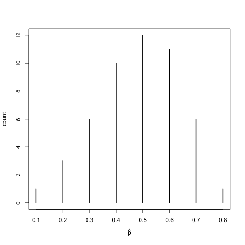

Although proportions between 0.3 and 0.7 occur most often, we see there is a proportion as low as 0.1 heads and as high as 0.8 heads.  Instead of 50 sets of 10 coin flips, the next simulation performs 50,000 sets of 10 tosses.


```r
set.seed(12)
cointoss <- rbinom(50000, 10, 1/2)
phat <- cointoss/10
xtabs(~phat)
```

```
phat
    0   0.1   0.2   0.3   0.4   0.5   0.6   0.7   0.8   0.9     1 
   47   480  2187  5837 10252 12238 10321  5853  2264   469    52 
```

```r
mean(phat)
```

```
[1] 0.5006
```

```r
sd(phat)
```

```
[1] 0.1581
```

```r
plot(xtabs(~phat), ylab = "count", xlab = expression(hat(p)))
```

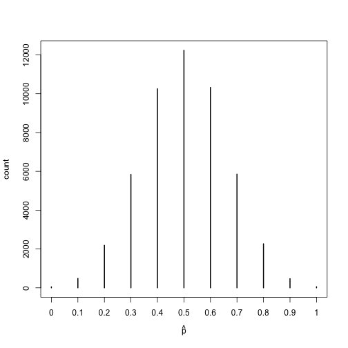


The previous plot is an approximation to the *sampling distribution of $\hat{p}$*.  The mean of the sampling distribution of $\hat{p}$ is $\mu_{\hat{p}} = p$, and the standard deviation of the sampling distribution of $\hat{p}$, $\sigma_{\hat{p}} = \sqrt{p\times(1-p)/n}$.  The standard deviation of the simulated $\hat{p}$ values, the standard deviation of a statistic, is called a *standard error*.  In this simulation, the estimated mean of the statistic is written as $\hat{\mu}_{\hat{p}}=$ 0.5006. The standard error of $\hat{p}$, sometimes written as $SE(\hat{p})$ or $\hat{\sigma}_{\hat{p}}$ is 0.1581.

## The Central Limit Theorem

Let $X_1, X_2,...,X_n$ be independent identically distributed random variables with mean $\mu$ and variance $\sigma^2$, both finite.  Then for any constant z,

$$\lim_{n \to \infty} P\left(\frac{\bar{X} - \mu}{\sigma/\sqrt{n}} \leq z \right) = \Phi(z) $$

Where $\Phi$ is the cdf of the standard normal distribution.  The central limit theorem means that for ``sufficiently large'' $n$, the sampling distribution of $\bar{X}$ is approximately normal with mean $\mu_{\bar{X}}= \mu$, and standard deviation $\sigma_{\bar{X}} = \sigma/\sqrt{n}$.  Recall that the standard deviation of a statistic is called a standard error.  Consequently, our text refers to $\sigma_{\bar{X}}$ as $SE(\bar{X})$.

#### Note:  If you one is sampling from a normal distribution, then the resulting sampling distribution of the sample mean is exactly normal.  It is always the case that $\mu_{\bar{X}} = \mu$ and $\sigma_{\bar{X}} = \sigma/\sqrt{n}$ regardless of the population one is sampling from.

## Just how large is ''sufficiently large''?

Consider the following simulations


```r
set.seed(123)
par(mfrow = c(4, 3))
# X~N(50,15)
x <- seq(0, 100, 0.01)
y <- dnorm(x, 50, 15)
plot(x, y, type = "l", col = "blue", lwd = 2, main = "X~N(50,15)", xlab = "", ylab = "")

# X~U(0,1)
x <- seq(0, 1, 0.001)
y <- dunif(x, 0, 1)
plot(x, y, type = "l", col = "blue", lwd = 2, main = "X~U(0,1)", xlab = "", ylab = "")

# X~Exp(1)
x <- seq(0, 5, 0.01)
y <- dexp(x, 1)
plot(x, y, type = "l", col = "blue", lwd = 2, main = "X~Exp(1)", xlab = "", ylab = "")

m <- 20000  # Number of Samples
EX <- 1.2  # Character expansion

xbar.5 <- apply(matrix(rnorm(m * 5, 50, 15), nrow = m), 1, mean)
hist(xbar.5, breaks = "Scott", col = "blue", xlim = c(0, 100), prob = T, xlab = "", ylab = "", main = "")
mtext(expression(bar(x)[5]), side = 3, line = 1, cex = EX)

xbar.5 <- apply(matrix(runif(m * 5, 0, 1), nrow = m), 1, mean)
hist(xbar.5, breaks = "Scott", col = "blue", xlim = c(0, 1), prob = T, xlab = "", ylab = "", main = "")
mtext(expression(bar(x)[5]), side = 3, line = 1, cex = EX)

xbar.5 <- apply(matrix(rexp(m * 5, 1), nrow = m), 1, mean)
hist(xbar.5, breaks = "Scott", col = "blue", xlim = c(0, 5), prob = T, xlab = "", ylab = "", main = "")
mtext(expression(bar(x)[5]), side = 3, line = 1, cex = EX)

xbar.10 <- apply(matrix(rnorm(m * 10, 50, 15), nrow = m), 1, mean)
hist(xbar.10, breaks = "Scott", col = "blue", xlim = c(0, 100), prob = T, xlab = "", ylab = "", main = "")
mtext(expression(bar(x)[10]), side = 3, line = 1, cex = EX)

xbar.10 <- apply(matrix(runif(m * 10, 0, 1), nrow = m), 1, mean)
hist(xbar.10, breaks = "Scott", col = "blue", xlim = c(0, 1), prob = T, xlab = "", ylab = "", main = "")
mtext(expression(bar(x)[10]), side = 3, line = 1, cex = EX)

xbar.10 <- apply(matrix(rexp(m * 10, 1), nrow = m), 1, mean)
hist(xbar.10, breaks = "Scott", col = "blue", xlim = c(0, 5), prob = T, xlab = "", ylab = "", main = "")
mtext(expression(bar(x)[10]), side = 3, line = 1, cex = EX)

xbar.30 <- apply(matrix(rnorm(m * 30, 50, 15), nrow = m), 1, mean)
hist(xbar.30, breaks = "Scott", col = "blue", xlim = c(0, 100), prob = T, xlab = "", ylab = "", main = "")
mtext(expression(bar(x)[30]), side = 3, line = 1, cex = EX)

xbar.30 <- apply(matrix(runif(m * 30, 0, 1), nrow = m), 1, mean)
hist(xbar.30, breaks = "Scott", col = "blue", xlim = c(0, 1), prob = T, xlab = "", ylab = "", main = "")
mtext(expression(bar(x)[30]), side = 3, line = 1, cex = EX)

xbar.30 <- apply(matrix(rexp(m * 30, 1), nrow = m), 1, mean)
hist(xbar.30, breaks = "Scott", col = "blue", xlim = c(0, 5), prob = T, xlab = "", ylab = "", main = "")
mtext(expression(bar(x)[30]), side = 3, line = 1, cex = EX)
```

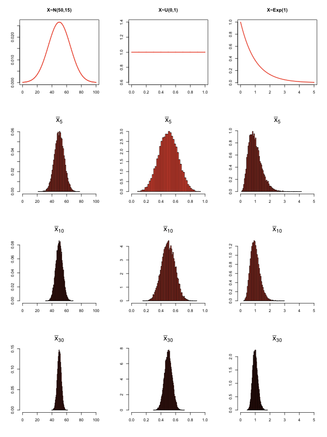

```r

par(mfrow = c(1, 1))
```


#### Note:  The usual rule of thumb, found in most textbooks, is that the CLT is reasonably accurate if $n \geq 30$.  Such rules are wishful thinking, dating to a pre-computer age when one had few realistic alternatives to using the CLT because most other methods were computationally infeasible.


## CLT for Binomial Data

**Example 4.9** Toss a fair coin 300 times.  Find the approximate probability of getting at most 160 heads.

**Solution:** Let $X=$ the number of heads in 300 flips of a fair coin.  Since $X \sim Bin(n = 300, p = 1/2)$ it follows that $\mu_X = np$ and $\sigma_{X} =\sqrt{np\times(1 - p)}$, and $Y \dot{\sim} N(np, \sqrt{np\times(1 - p)})$.  It follows that $P(X <= 160) = P\left(\frac{X - np}{\sqrt{np \times (1 - p)}} = Z \leq \frac{160 - 150}{\sqrt{300/4}}\right).$  Furthermore, $P(Z \leq 1.154701)=$ 0.8759.  Solve the problem in class using $\hat{p}$ as the random variable.

**Exact Solution:** $P(X \leq 160)= \sum_{x = 0}^{x = 160}\binom{300}{x} 0.5^x 0.5^{300-x}=$ 0.8874.


<!---


