Class Notes For STT 3850
========================================================
## Alan T. Arnholt


Last compiled Thursday, February 06, 2014 - 7:59:56 PM.


Most of the material in the notes is taken from the class text _Mathematical Statistics with Resampling and `R`_ by Laura Chihara and Tim Hesterberg with slight modifications.  Some material in the notes is also taken from the first chapter of _Practicing Statistics: Guided Investigations for the Second Course_ by Shonda Kuiper and Jeffrey Sklar.  There are a number of places to get help with `R`.  The class text has some material online at: [https://sites.google.com/site/chiharahesterberg/rtutorials](https://sites.google.com/site/chiharahesterberg/rtutorials).  


Exploratory Data Analysis
========================================================

## Reading *.csv Data

```r
site <- "http://www1.appstate.edu/~arnholta/Data/FlightDelays.csv"
FlightDelays <- read.csv(file = url(site))
head(FlightDelays)  # shows first 6 rows of data frame
```

```
  ID Carrier FlightNo Destination DepartTime Day Month FlightLength Delay Delayed30
1  1      UA      403         DEN      4-8am Fri   May          281    -1        No
2  2      UA      405         DEN     8-Noon Fri   May          277   102       Yes
3  3      UA      409         DEN      4-8pm Fri   May          279     4        No
4  4      UA      511         ORD     8-Noon Fri   May          158    -2        No
5  5      UA      667         ORD      4-8am Fri   May          143    -3        No
6  6      UA      669         ORD      4-8am Fri   May          150     0        No
```

```r
str(FlightDelays)  # shows structure of data frame
```

```
'data.frame':	4029 obs. of  10 variables:
 $ ID          : int  1 2 3 4 5 6 7 8 9 10 ...
 $ Carrier     : Factor w/ 2 levels "AA","UA": 2 2 2 2 2 2 2 2 2 2 ...
 $ FlightNo    : int  403 405 409 511 667 669 673 677 679 681 ...
 $ Destination : Factor w/ 7 levels "BNA","DEN","DFW",..: 2 2 2 6 6 6 6 6 6 6 ...
 $ DepartTime  : Factor w/ 5 levels "4-8am","4-8pm",..: 1 4 2 4 1 1 4 4 5 5 ...
 $ Day         : Factor w/ 7 levels "Fri","Mon","Sat",..: 1 1 1 1 1 1 1 1 1 1 ...
 $ Month       : Factor w/ 2 levels "June","May": 2 2 2 2 2 2 2 2 2 2 ...
 $ FlightLength: int  281 277 279 158 143 150 158 160 160 163 ...
 $ Delay       : int  -1 102 4 -2 -3 0 -5 0 10 60 ...
 $ Delayed30   : Factor w/ 2 levels "No","Yes": 1 2 1 1 1 1 1 1 1 2 ...
```

```r
levels(FlightDelays$Month)
```

```
[1] "June" "May" 
```

```r
FlightDelays$Month <- factor(FlightDelays$Month, levels = c("May", "June"))
levels(FlightDelays$Month)
```

```
[1] "May"  "June"
```


## Creating Tables

```r
table(FlightDelays$Carrier)
```

```

  AA   UA 
2906 1123 
```

```r
xtabs(~Carrier, data = FlightDelays)
```

```
Carrier
  AA   UA 
2906 1123 
```


## Creating Barplots

```r
barplot(table(FlightDelays$Carrier))
```


```r
require(ggplot2)
ggplot(data = FlightDelays, aes(x = Carrier)) + 
  geom_bar()
```

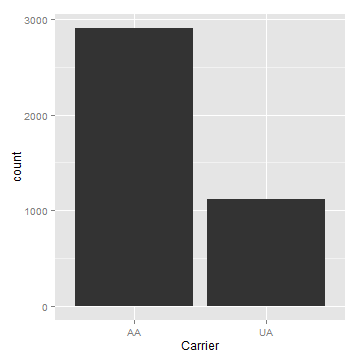

```r
ggplot(data = FlightDelays, aes(x = Carrier, fill= Month)) + 
  geom_bar()
```

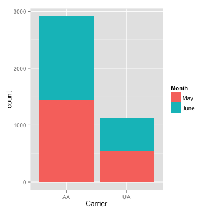

```r
ggplot(data = FlightDelays, aes(x = Carrier, fill= Month)) + 
  geom_bar() + 
  guides(fill = guide_legend(reverse = TRUE))
```


```r
ggplot(data = FlightDelays, aes(x = Carrier, fill= Month)) + 
  geom_bar(position="dodge") + 
  guides(fill = guide_legend(reverse = TRUE))
```

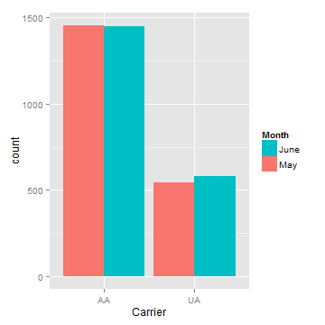

```r
xtabs(~ Carrier + (Delay > 30), data = FlightDelays)
```

```
       Delay > 30
Carrier FALSE TRUE
     AA  2513  393
     UA   919  204
```

```r
addmargins(xtabs(~ Carrier + (Delay > 30), data = FlightDelays))
```

```
       Delay > 30
Carrier FALSE TRUE  Sum
    AA   2513  393 2906
    UA    919  204 1123
    Sum  3432  597 4029
```

```r
ggplot(data = FlightDelays, aes(x = Carrier, fill= Delayed30)) + 
  geom_bar(position="dodge")
```

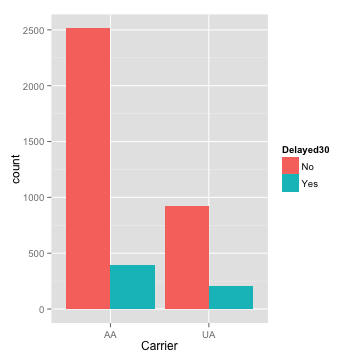

```r
ggplot(data = FlightDelays, aes(fill = Carrier, x= Delayed30)) + 
  geom_bar(position="dodge")
```

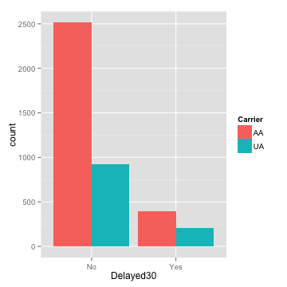


## Histograms of `Delay` values.


```r
hist(FlightDelays$Delay)  # Ugly with Defaults...you change
```


```r
library(lattice)
histogram(~Delay, data = FlightDelays)
```

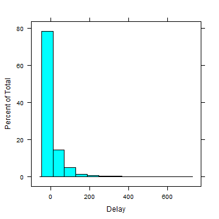

```r
histogram(~Delay, data = FlightDelays, type = "density")
```

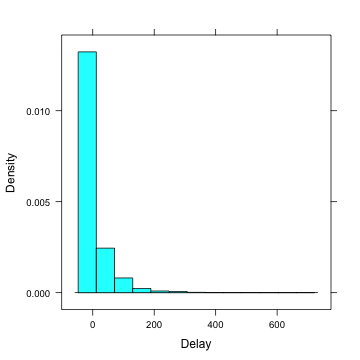

```r
histogram(~Delay, data = FlightDelays, type = "density",
          panel = function(...){
            panel.histogram(col = "peru",...)
            panel.densityplot(col = "red", lwd = 2, ...)
          }
          )
```

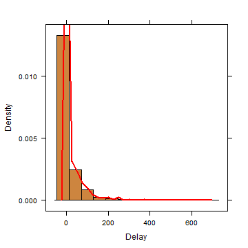

```r
ggplot(data = FlightDelays, aes(x = Delay)) + 
  geom_histogram()
```


```r
ggplot(data = FlightDelays, aes(x = Delay, y = ..density..)) + 
  geom_histogram(binwidth = 10, color = "blue") + 
  geom_density(color = "red")
```

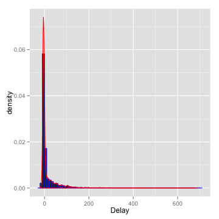

```r
ggplot(data = FlightDelays, aes(x = Delay)) + 
  geom_density(fill = "blue")
```

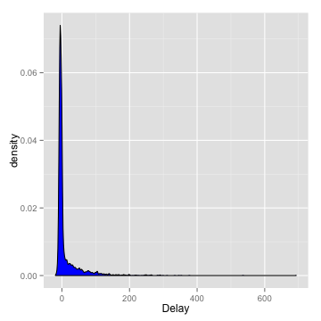

## Numeric Summaries


```r
summary(FlightDelays)
```

```
       ID       Carrier      FlightNo    Destination    DepartTime    Day       Month     
 Min.   :   1   AA:2906   Min.   :  71   BNA: 172    4-8am   : 699   Fri:637   May :1999  
 1st Qu.:1008   UA:1123   1st Qu.: 371   DEN: 264    4-8pm   : 972   Mon:630   June:2030  
 Median :2015             Median : 691   DFW: 918    8-Mid   : 257   Sat:453              
 Mean   :2015             Mean   : 827   IAD:  55    8-Noon  :1053   Sun:551              
 3rd Qu.:3022             3rd Qu.: 787   MIA: 610    Noon-4pm:1048   Thu:566              
 Max.   :4029             Max.   :2255   ORD:1785                    Tue:628              
                                         STL: 225                    Wed:564              
  FlightLength     Delay       Delayed30 
 Min.   : 68   Min.   :-19.0   No :3432  
 1st Qu.:155   1st Qu.: -6.0   Yes: 597  
 Median :163   Median : -3.0             
 Mean   :185   Mean   : 11.7             
 3rd Qu.:228   3rd Qu.:  5.0             
 Max.   :295   Max.   :693.0             
                                         
```

```r
sd(FlightDelays$Delay)
```

```
[1] 41.63
```

```r
sd(FlightDelays$Delay)^2
```

```
[1] 1733
```

```r
var(FlightDelays$Delay)
```

```
[1] 1733
```

```r
IQR(FlightDelays$Delay)
```

```
[1] 11
```

```r
quantile(FlightDelays$Delay)
```

```
  0%  25%  50%  75% 100% 
 -19   -6   -3    5  693 
```


## Boxplots


```r
boxplot(Delay ~ Carrier, data = FlightDelays)
```

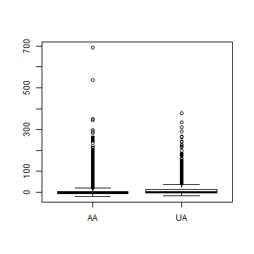

```r
bwplot(Delay ~ Carrier, data = FlightDelays)
```

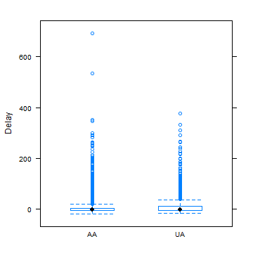

```r
bwplot(Delay ~ Carrier | Month, data = FlightDelays, as.table = TRUE, layout = c(2, 1))
```

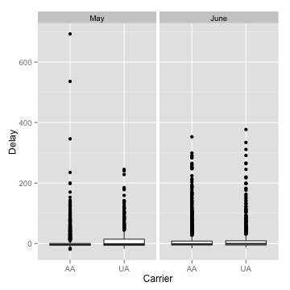

```r
ggplot(data = FlightDelays, aes(x = Carrier, y = Delay)) + geom_boxplot()
```


```r
ggplot(data = FlightDelays, aes(x = Carrier, y = Delay)) + geom_boxplot() + facet_grid(. ~ Month)
```


```r
site <- "http://www1.appstate.edu/~arnholta/Data/NCBirths2004.csv"
NCBirths <- read.csv(file=url(site))
head(NCBirths)
```

```
  ID MothersAge Tobacco Alcohol Gender Weight Gestation
1  1      30-34      No      No   Male   3827        40
2  2      30-34      No      No   Male   3629        38
3  3      35-39      No      No Female   3062        37
4  4      20-24      No      No Female   3430        39
5  5      25-29      No      No   Male   3827        38
6  6      35-39      No      No Female   3119        39
```

```r
boxplot(Weight ~ Gender, data = NCBirths, col = c("pink", "blue"))
```

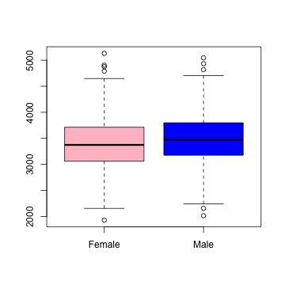

```r
bwplot(Weight ~ Gender, data = NCBirths)
```

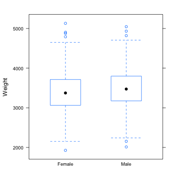

```r
p <- ggplot(data = NCBirths, aes(x = Gender, y = Weight, fill = Gender))
p + geom_boxplot()
```

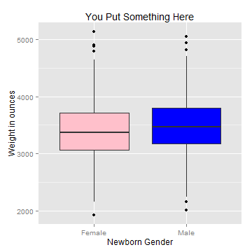

```r
p + geom_boxplot() + 
  guides(fill = FALSE) + 
  labs( x = "Newborn Gender", y = "Weight in ounces", title = "You Put Something Here")
```


```r
p + geom_boxplot() + 
  guides(fill = FALSE) + 
  labs( x = "Newborn Gender", y = "Weight in ounces", title = "You Put Something Here") + 
  scale_fill_manual(values = c('pink', 'blue'))
```

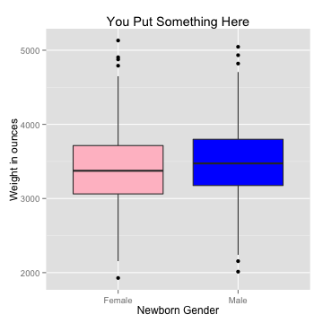

```r
p + geom_boxplot() + guides(fill = FALSE) + 
  labs( x = "Newborn Gender", y = "Weight in ounces", title = "You Put Something Here") + 
  scale_fill_brewer() + theme_bw()
```

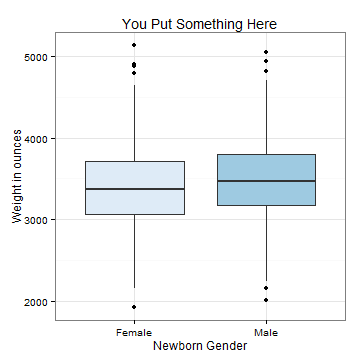


## Density Plots

```r
curve(dnorm(x), -4, 4, ylab = "", xlab = "")
x.region <- seq(from = 1, to = 4, length.out = 200)
y.region <- dnorm(x.region)
region.x <- c(x.region[1], x.region, x.region[200])
region.y <- c(0, y.region, 0)
polygon(region.x, region.y, col = "red")
abline(h = 0, lwd = 2)
```

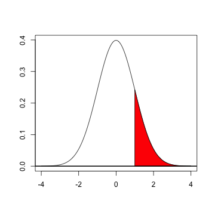

```r
# Same now with ggplot2
p <- ggplot(data = data.frame(x = c(-4, 4)), aes(x = x))
dnorm_func <- function(x){
  y <- dnorm(x)
  y[x<1] <- NA
  return(y)
}
p1 <- p + stat_function(fun = dnorm_func, geom = 'area', fill = 'blue', alpha = 0.2) + 
  geom_hline(yintercept = 0) + 
  stat_function(fun = dnorm) 
p1 + theme_bw()
```

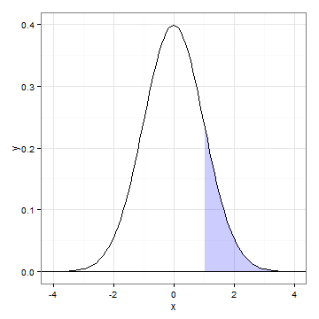

```r
p1 + theme_bw() + 
  labs(x = '', y = '', title = expression(integral(frac(1, sqrt(2*pi))*e^{-x^2/2}*dx, 1, infinity)==0.1586553) ) # Break it down!
```

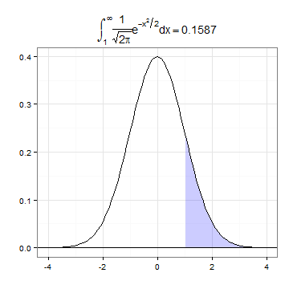


## Example 2.11 

Note this is not how `qqnorm` computes the quantiles!  The left graph of Figure 2.9 in the book is not quite correct...it does not use the data in the table...the first value 17.7 should be 21.7.


```r
x <- c(21.7, 22.6, 26.1, 28.3, 30, 31.2, 31.5, 33.5, 34.7, 36)
n <- length(x)
p <- (1:10)/(n + 1)
q <- qnorm(p)
rbind(x, p, q)
```

```
      [,1]    [,2]    [,3]    [,4]    [,5]    [,6]    [,7]    [,8]    [,9]   [,10]
x 21.70000 22.6000 26.1000 28.3000 30.0000 31.2000 31.5000 33.5000 34.7000 36.0000
p  0.09091  0.1818  0.2727  0.3636  0.4545  0.5455  0.6364  0.7273  0.8182  0.9091
q -1.33518 -0.9085 -0.6046 -0.3488 -0.1142  0.1142  0.3488  0.6046  0.9085  1.3352
```

```r
plot(q, x)
XS <- quantile(q, prob = c(0.25, 0.75))
YS <- quantile(x, prob = c(0.25, 0.75))
slopeA <- (YS[2] - YS[1])/(XS[2] - XS[1])
slopeB <- diff(YS)/diff(XS)
slopeA
```

```
  75% 
5.873 
```

```r
slopeB
```

```
  75% 
5.873 
```

```r
Intercept <- YS[1] - slopeA * XS[1]
Intercept
```

```
  25% 
29.83 
```

```r
abline(a = Intercept, b = slopeA)
```


```r
# 
pc <- (1:10 - 3/8)/n
qc <- qnorm(pc)
rbind(x, pc, qc)
```

```
      [,1]    [,2]    [,3]    [,4]     [,5]    [,6]    [,7]    [,8]    [,9]   [,10]
x  21.7000 22.6000 26.1000 28.3000 30.00000 31.2000 31.5000 33.5000 34.7000 36.0000
pc  0.0625  0.1625  0.2625  0.3625  0.46250  0.5625  0.6625  0.7625  0.8625  0.9625
qc -1.5341 -0.9842 -0.6357 -0.3518 -0.09414  0.1573  0.4193  0.7144  1.0916  1.7805
```

```r
xs <- quantile(qc, prob = c(0.25, 0.75))
ys <- quantile(x, prob = c(0.25, 0.75))
slope <- diff(ys)/diff(xs)
intercept <- ys[1] - slope * xs[1]
c(intercept, slope)
```

```
   25%    75% 
29.625  5.268 
```

Consider using the `R` functions `qqnorm()` and `qqline()`.


```r
qqnorm(x)
qqline(x)
```


```r
# ggplot
ggplot(data = data.frame(x), aes(sample=x)) + 
  stat_qq() + 
  geom_abline(intercept = intercept, slope = slope)
```

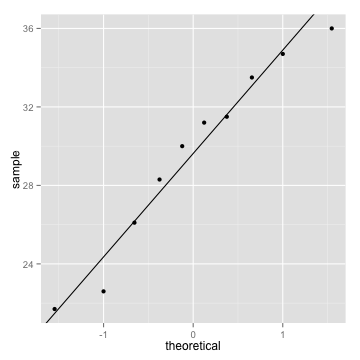


## Empirical Cumulative Distribution Function

The _empirical cumulative distribution function_ (ecdf) is an estimate of the underlying cumulative distribution function for a sample.  The empirical cdf, denoted by $\hat{F}$, is a step function $$\hat{F}(x) = \tfrac{1}{n} (\text{number of values} \leq x),$$
where $n$ is the sample size.


```r
y <- c(3, 6, 15, 15, 17, 19, 24)
plot.ecdf(y)
```

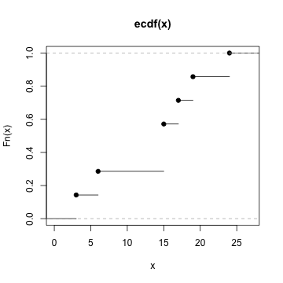

```r
set.seed(1)  # set seed for reproducibility
rxs <- rnorm(25)
plot.ecdf(rxs, xlim = c(-4, 4))
curve(pnorm(x), col = "blue", add = TRUE, lwd = 2)
```


An alternative approach to the book's Figure 2.12 is provided using `ggplot2` after first creating Figure 2.12


```r
site <- "http://www1.appstate.edu/~arnholta/Data/Beerwings.csv"
Beerwings <- read.csv(file=url(site))
head(Beerwings) # shows first 6 rows of data frame
```

```
  ID Hotwings Beer Gender
1  1        4   24      F
2  2        5    0      F
3  3        5   12      F
4  4        6   12      F
5  5        7   12      F
6  6        7   12      F
```

```r
str(Beerwings)  # shows structure of data frame
```

```
'data.frame':	30 obs. of  4 variables:
 $ ID      : int  1 2 3 4 5 6 7 8 9 10 ...
 $ Hotwings: int  4 5 5 6 7 7 7 8 8 8 ...
 $ Beer    : int  24 0 12 12 12 12 24 24 0 12 ...
 $ Gender  : Factor w/ 2 levels "F","M": 1 1 1 1 1 1 2 1 2 2 ...
```

```r
beerM <- subset(Beerwings, select = Beer, subset = Gender == "M", drop = TRUE)
beerF <- subset(Beerwings, select = Beer, subset = Gender == "F", drop = TRUE)
plot.ecdf(beerM, xlab = "ounces", col = "blue", pch = 19)
plot.ecdf(beerF, col = "pink", pch = 19, add = TRUE)
abline(v = 25, lty = "dashed")
legend("topleft", legend = c("Males", "Females"), pch = 19, col = c("blue", "pink"))
```

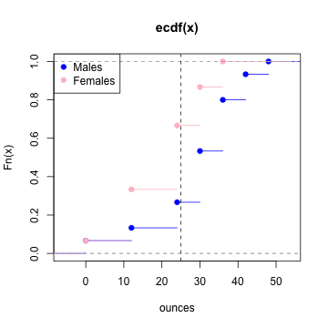

```r
# Using ggplot2 now
ggplot(data = Beerwings, aes(x = Beer, colour = Gender)) + 
  stat_ecdf() + 
  labs(x = "Beer in ounces", y ="", title = 'ECDF')
```

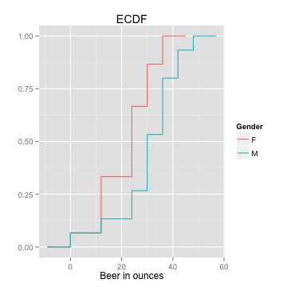


## Scatter Plots


```r
with(data = Beerwings, plot(Hotwings, Beer, xlab = "Hot wings eaten", ylab = "Beer consumed", 
                            pch = 19, col = "blue"))
```

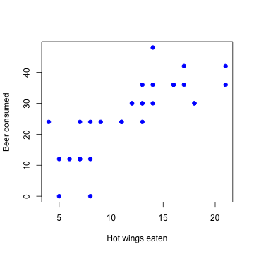

```r
p <- ggplot(data = Beerwings, aes(x = Hotwings, y = Beer)) + 
  geom_point() + 
  labs(x = "Hot wings eaten", y = "Beer consumed in ounces")
p
```

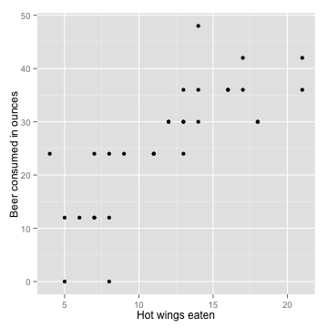

```r
p + geom_smooth()
```

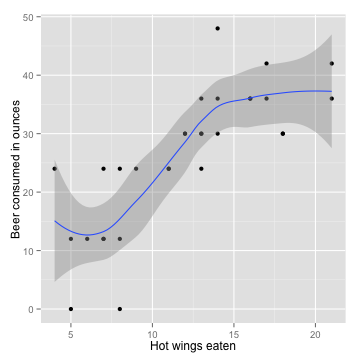

```r
p + geom_smooth(method = lm) + theme_bw()
```

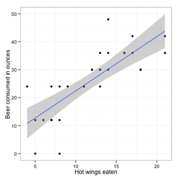


## Integrating with R


```r
f <- function(x) {
    (x - 1)^3 * exp(-x)
}
ans <- integrate(f, lower = 0, upper = Inf)$value
ans
```

```
[1] 2
```


Can A New Drug Reduce the Spread of Schistosomiasis?
========================================================

Schistosomiasis (skis-tuh-soh-may'-uh-sis) is a disease in humans caused by parasitic flatworms called schistosomes (skis'-tuh-sohms).  Schistosomiasis arrects about 200 million people worldwide and is a serious problem in sub-Saharan Africa, South America, China, and Southeast Asia.  The disease can cause death, but more commonly results in chronic and debilitating symptoms, arising primarily from the body's immune reaction to parasite eggs lodged in the liver, spleen,and intestines.

Currently there is one drug, praziquantel (pray'-zee-kwan-tel), in common use for treatment of schistosomiasis; it is inexpensive and effective. However, many organizations are concerned about relying on a single drug to treat a serious disease that affects so many people worldwide. Drug resistance may have prompted an outbreak in the 1990s in Senegal, where cure rates were low.  In 2007, several researchers published work on a  promising drug called K11777, which, in theory, might treat schistosomiasis.


```r
gender <- c(rep("Female", 10), rep("Male", 10))
group <- rep(rep(c("Treatment", "Control"), each = 5), 2)
worms <- c(1, 2, 2, 10, 7, 16, 10, 10, 7, 17, 3, 5, 9, 10, 6, 31, 26, 28, 13, 47)
schis <- data.frame(gender, group, worms)
head(schis, n = 3)
```

```
  gender     group worms
1 Female Treatment     1
2 Female Treatment     2
3 Female Treatment     2
```

```r
schis
```

```
   gender     group worms
1  Female Treatment     1
2  Female Treatment     2
3  Female Treatment     2
4  Female Treatment    10
5  Female Treatment     7
6  Female   Control    16
7  Female   Control    10
8  Female   Control    10
9  Female   Control     7
10 Female   Control    17
11   Male Treatment     3
12   Male Treatment     5
13   Male Treatment     9
14   Male Treatment    10
15   Male Treatment     6
16   Male   Control    31
17   Male   Control    26
18   Male   Control    28
19   Male   Control    13
20   Male   Control    47
```


```r
require(ggplot2)
p <- ggplot(data = schis, aes(group, worms)) + geom_point(position = "jitter", aes(color = group)) + 
    facet_grid(. ~ gender)
p
```

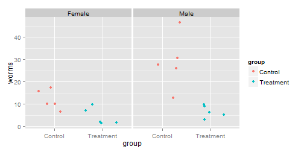


ACTIVITY
==================================================

1. Use the previous graph to compare visually the number of worms for the treatment and control groups for both the male and female mice.  Does each of the four groups appear to have a similar center and similar spread?  Are there any outliers (extreme observations that don't fit with the rest of the data)?

2. Calculate appropriate summary statistics (e.g., the median, mean, and standard deviation) for each of the four groups.  For the female mice, calculate the difference between the treatment and control means.  Do the same for the male mice.


```r
with(data = schis, schis[order(gender, group, worms), ])
```

```
   gender     group worms
9  Female   Control     7
7  Female   Control    10
8  Female   Control    10
6  Female   Control    16
10 Female   Control    17
1  Female Treatment     1
2  Female Treatment     2
3  Female Treatment     2
5  Female Treatment     7
4  Female Treatment    10
19   Male   Control    13
17   Male   Control    26
18   Male   Control    28
16   Male   Control    31
20   Male   Control    47
11   Male Treatment     3
12   Male Treatment     5
15   Male Treatment     6
13   Male Treatment     9
14   Male Treatment    10
```


```r
with(data = schis, tapply(worms, list(gender, group), median))
```

```
       Control Treatment
Female      10         2
Male        28         6
```

```r
with(data = schis, tapply(worms, list(gender, group), mean))
```

```
       Control Treatment
Female      12       4.4
Male        29       6.6
```

```r
with(data = schis, tapply(worms, list(gender, group), sd))
```

```
       Control Treatment
Female   4.301     3.912
Male    12.186     2.881
```


The descriptive analysis in Questions 1 and 2 points to a positive treatment effect: K11777 appears to have reduced the number of parasite worms in this sample.  But descriptive statistics are usually only the first step in ascertaining whether an effect is real; we often conduct a significance test or create a confidence interval to determine if chance alone could explain the effect.

We will introduce the basic concepts of randomization tests in a setting where units (mice in this example) are randomly allocated to a treatment or control group.  Using a significance test, we will decide if an observed treatment effect (the difference between the mean responses in the treatment and control) is "real" or if "random chance alone" could plausibly explain the observed effect.  The null hypothesis states that "random chance alone" is the reason for the observed effect.  In this initial discussion, the alternative hypothesis will be one-sided because we want to show that the true treatment mean($\mu_{treatment}$) is less than the true control mean ($\mu_{control}$).

Statistical Inference Through a Randomization Test
==================================================

Whether they take the form of significance tests or confidence intervals, inferential procedures rest on the **fundamental question for inference:** "What would happen if we did this many times?" Let's unpack this question in the context of the female mice schistosomiasis.  We observed a difference in means of 7.6 = 12 - 4.4 worms between the control and treatment groups.  While we expect that this large difference reflects the effectiveness of the drug, it is possible that chance alone could explain this difference.  This "chance alone" position is usually called the null hypothesis and includes the following assumptions:
* The number of parasitic worms found in the liver naturally varies from mouse to mouse.
* Whether or not the drug is effective, there clearly is variability in the responses of mice to the infestation of schistosomes.
* Each group exhibits this variability, and even if the drug is not effective, some mice do better than others.
* The only explanation for the observed difference of 7.6 worms in the means is that the random allocation randomly placed mice with  larger numbers of worms in the control group and mice with smaller numbers of worms in the treatment group.

In this study, the **null hypothesis** is that the treatment has no effect on the average worm count, and it is denoted as 

> $H_0:\mu_{control} = \mu_{treatment}$
Another way to write this hypothesis is 
> $H_0: \text{the treatment has no effect on average worm count}$

Alternative hypotheses can be "one-sided, greater-than" (as in this investigation), "one-sided, less-than" (the treatment causes an increase in worm count), or "two-sided" (the treatment is different, in one direction or the other, from the mean).  We chose to test a one-sided hypothesis because there is a clear research interest in one direction.  In other words, we will take action (start using the drug) only if we can show that K11777 reduces worm count.

> **The fundamental question for inference:** Every statistical inference procedure is based on the question "How does what we observed in our data compare to what would happen if the null hypothesis were actually true and we repeated the process many times?"

For a randomization test comparing responses for the two groups, this question becomes "How does the observed difference between groups compare to what would happen if the treatments actually had no effect on the individual responses and we repeated the random allocation of individuals to groups many times?"

Conducting a Randomization Test by Hand
===================================================

1. To get the feel for the concept of a _p_-value, write each of the female worm counts on an index card.  Shuffle the 10 index cards, and then draw five cards at random (without replacement).  Call these five cards the treatment group and the five remaining cards the control group.  Under the null hypothesis (i.e. the treatment has no effect on the worms), this allocation mimics precisely what actually happened in our experiment, since the only cause of group differences is the random allocation.  Calculate the mean of the five cards representing the treatment group and the mean of the five cards representing the control group.  Then find the difference between the control and treatment group means that you obtained in your allocation.  To be consistent, take the control group mean minus the treatment group mean.

2. If you were to do another random allocation, would you get the same difference in means? Explain.

3. Now, perform nine more random allocations, each time computing and writing down the difference in mean worm count between the control group and the treatment group.  Graphically represent the differences.  What proportion of these differences are 7.6 or larger?

4.  If you performed the simulation many times, would you expect a large percentage of the simulations to result in a mean difference greater than 7.6?  Explain.

The reasoning in the previous activity leads us to the randomization test and an interpretation of the fundamental question for inference.  The fundamental question for this context is as follows:  "If the null hypothesis were actually true and we randomly allocated our 10 mice to treatment and control groups many times, what proportion of the time would the observed difference in means be as big or bigger than 7.6?"  This long-run proportion is a probability that statisticians call the **_p-value_** of the randomization test.  The _p_-values for most randomization tests are found through simulations.  Despite the fact that simulations do not give exact _p_-values, they are usually preferred over the tedious and time consuming process of listing all possible outcomes.  Researchers usually pick a round number such as 10,000 repetitions on the simulation and approximate the _p_-value accordingly.  Since this _p_-value is an approximation, it is often referred to as the **empirical _p_-value.**

> **Key Concept:** Assuming that nothing except the random allocation process is creating group differences, the _p_-value of a randomization test is the probability of obtaining a group difference as large as or larger than the group difference actually observed in the experiment.

> **Key Concept:** The calculation of an empirical _p_-value requires these steps:
* Repeat the random allocation process a number of times (N times).
* Record, each time, whether or not the group difference exceeds or is the same as the one observed in the actual experiment (let X be the number of times the group difference exceeds or is the same as the one observed).
* Compute (X + 1)/(N + 1) to get the _p_-value, the proportion of times the difference exceeds or is the same as the observed difference.

**Note:** Including the observed value as one of the possible allocations is a more conservative approach and protects against getting a _p_-value of 0.  Our observation from the actual experiment provides evidence that the true _p_-value is greater than zero.

Performing a Randomization Test Using Computer Simulation
=========================================================

While physical simulations (such as the index cards activity) help us understand the process of computing an empirical _p_-value, using computer software is a much more efficient way of producing an empirical _p_-value based on a large number of iterations.  If you are simulating 10 random allocations, it is just as easy to use index cards as a computer.  However, the advantage of a computer simulation is that 10,000 random allocations can be conducted in almost the same time it takes to simulate 10 allocations.

Two-Sample Permutation Test
=============================
> Pool the _m + n_ values.
* **repeat**
  * Draw a resample of size _m_ without replacement.
  * Use the remaining _n_ observations for the other sample.
  * Calculate the difference in means or another test statistic that compares samples.
* **until** 
  * we have enough samples

Calculate the _p_-value as the fraction of times the random statistics are more or as extreme as the original statistic. Optionally, plot a histogram of the random statistic values.   
 
**Definition 3.2** A *test statistic* is a numerical function of the data whose value determines the result of the test.  The function itself is generally denoted *T=T(X)*, where **X** represents the data.  After being evaluated for the sample data **x**, the result is called an *observed test statistic* and is written in lowercase, *t=T(x)*.


Using Computer Simulations to Conduct a Hypothesis Test
=========================================================

1. Write code to allocate randomly each of the female worm counts to either the teatment or the control group.

2. Take the control group average minus the K11777 treatment group average.

3. Write code that perform steps 1. and 2. N = 99,999 times.  Compute and report the empirical _p_-value.

4. Create a histogram of the N simulated differences between group means and comment of the shape of the histogram.  

5. Based on your results in Questions 3 and 4 and assuming the null hypothesis is true, about how frequently do you think you would obtain a mean difference as large as or larger than 7.6 by random allocation alone?

6. Does your answer to Question 5 lead you to believe the "chance alone" position (i.e., the null hypothesis that the mean worm count is the same for both the treatment and the control), or does is lead you to believe that K11777 has a positive inhibitory effect on the schistosome worm in female mice?  Explain.

Using R
==========


```r
ND <- schis[gender == "Female", ]
ND
```

```
   gender     group worms
1  Female Treatment     1
2  Female Treatment     2
3  Female Treatment     2
4  Female Treatment    10
5  Female Treatment     7
6  Female   Control    16
7  Female   Control    10
8  Female   Control    10
9  Female   Control     7
10 Female   Control    17
```

```r
tapply(ND$worms, ND$group, mean)
```

```
  Control Treatment 
     12.0       4.4 
```

```r
# OR
ANS1 <- with(data = ND, tapply(worms, group, mean))
ANS1
```

```
  Control Treatment 
     12.0       4.4 
```

```r
observed <- ANS1[1] - ANS1[2]
observed
```

```
Control 
    7.6 
```

```r
names(observed) <- NULL
observed
```

```
[1] 7.6
```

Since we will be working with the **worms** variable for females only, we will create a vector holding these values.  Then, we will draw a random sample of size 5 from the numbers 1 through 10 (there are 10 observations).  The worms values corresponding to these positions will be values for the Control group and the remaining ones for the Treatment group.  The mean difference of this permutation will be stored in **result**.  This will be repeated many times.


```r
Worms <- ND$worms
Worms
```

```
 [1]  1  2  2 10  7 16 10 10  7 17
```

```r
# Another way:
Worms2 <- subset(ND, select = worms, drop = TRUE)
Worms2
```

```
 [1]  1  2  2 10  7 16 10 10  7 17
```

```r
N <- 10^4 - 1  # number of times to repeat the process
result <- numeric(N)  # space to save the random differences
for (i in 1:N) {
    # sample of size 5, from 1 to 10, without replacement
    index <- sample(10, size = 5, replace = FALSE)
    result[i] <- mean(Worms2[index]) - mean(Worms2[-index])
}
hist(result, col = "blue", freq = FALSE, main = "")
```

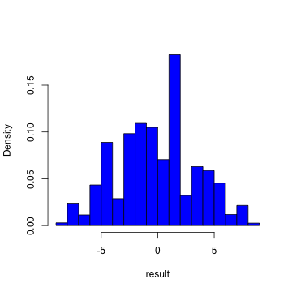

```r
d.res <- density(result)
plot(d.res, main = "", xlab = "", ylab = "")
polygon(d.res, col = "pink")
xs <- c(7.6, d.res$x[d.res$x >= 7.6])
ys <- c(0, d.res$y[d.res$x >= 7.6])
polygon(xs, ys, col = "red")
```

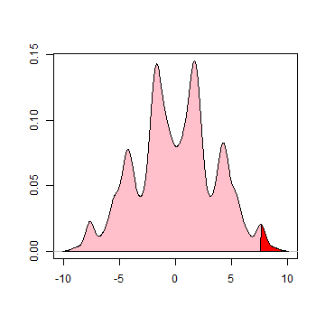

```r
pvalue <- (sum(result >= observed) + 1)/(N + 1)  # p-value
pvalue  # results will vary
```

```
[1] 0.0242
```

```r
# ggplot2 approach now
DF <- data.frame(x = result)
p <- ggplot(data = DF) + geom_density(aes(x = x, y = ..density..), fill = "pink", alpha = 0.4)
p
```

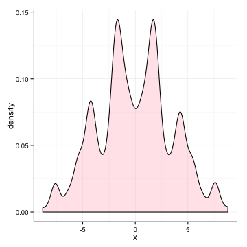

```r
x.dens <- density(result)
df.dens <- data.frame(x = x.dens$x, y = x.dens$y)
p + geom_area(data = subset(df.dens, x >= 7.6 & x <= max(DF$x)), aes(x = x, y = y), fill = "blue", alpha = 0.4) + 
    labs(x = "", y = "")
```

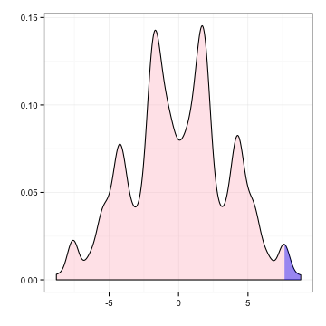

The code snippet **result >= observed** results in a vector of **TRUE's** and **FALSE's** depending on whether or not the mean difference computed for a resample is greater than the observed mean difference.  **sum(result >= observed)** counts the number of **TRUE's**.  Thus, the computed _p_-value is just the proportion of statistics (including the original) that are as large or larger than the original mean difference. The empirical _p_-value is 0.0242.

Because the sample sizes in the schistosomiasis study are small, it is possible to apply mathematical methods to obtain an **exact _p_-value** for this randomization test.  An exact _p_-value can be obtained by writing down the set of all possibilities (assuming each possible outcome is equally likely under the null hypothesis) and then calculating the proportion of the set for which the difference is at least as large as the observed difference.  In the schistosomiasis study, this requires listing every possible combination in which five of the 10 female mice can be allocated to the treatment (and the other five mice are assigned to the control).  There are $\binom{10}{5}=$ 252 possible combinations.  For each of these combinations, the difference between the treatment and control means is then calculated.  The exact _p_-value is the proportion of times in which the difference in the means is at least as large as the observed difference of 7.6 worms.  Of these 252 combinations, six have a mean difference of 7.6 and one has a mean difference greater than 7.6 (namely 8.8).  Since all 252 of these random allocations are equally likely, the exact _p_-value in this example is 7/252 = 0.0278.  However, most real studies are too large to list all possible samples.  Randomization tests are almost alwyas adequate, providing approximate _p_-values that are close enought to the true _p_-value.  

> Key Concept: The larger the number of randomizations within a simulation study, the more precise the _p_-value is. If the true _p_-value is p, the estimated _p_-value has variance approximately equal to $p(1 - p)/N$, where $N$ is the number of resamples.

Sometimes we have some threshold _p_-value at or below which we will reject the null hypothesis and conclude in favor of the alternative hypothesis.  This threshold value is called a **significance level** and is usually denoted by the Greek letter alpha ($\alpha$).  Common values are $\alpha = 0.05$ and $\alpha = 0.01$, but the value will depend heavily on context and the researcher's assessment of the acceptable risk of stating an incorrect conclusion.  When the study's _p_-value is less than or equal to this significance level, we state that the results are **statistically significant at level $\alpha$**.  If you see the phrase "statistically significant" without a specification of $\alpha$ the writer is most likely assuming $\alpha = 0.05$, for reasons of history and convention alone.  However, it is best to show the _p_-value instead of simply stating a result is significant at a particular $\alpha$-level.

Activity
==============

Explain what each line of the following code is doing.


```r
# PROGRAMMING IS THE BEST WAY TO DEBUG YOUR THINKING!  Theoretical Answer
require(PASWR)
DATA <- c(1, 2, 2, 10, 7, 16, 10, 10, 7, 17)
DATA
```

```
 [1]  1  2  2 10  7 16 10 10  7 17
```

```r
OBS <- mean(DATA[6:10]) - mean(DATA[1:5])
OBS
```

```
[1] 7.6
```

```r
# ANS <- t(Combinations(10, 5))
ANS <- t(combn(10, 5))
head(ANS)
```

```
     [,1] [,2] [,3] [,4] [,5]
[1,]    1    2    3    4    5
[2,]    1    2    3    4    6
[3,]    1    2    3    4    7
[4,]    1    2    3    4    8
[5,]    1    2    3    4    9
[6,]    1    2    3    4   10
```

```r
nn <- dim(ANS)[1]
nn
```

```
[1] 252
```

```r
means <- numeric(nn)
for (i in 1:nn) {
    means[i] <- mean(DATA[ANS[i, ]]) - mean(DATA[-ANS[i, ]])
}
sort(means)
```

```
  [1] -8.8 -7.6 -7.6 -7.6 -7.6 -7.6 -7.6 -6.4 -6.4 -6.4 -5.6 -5.6 -5.6 -5.6 -5.6 -5.6 -5.2 -5.2 -5.2
 [20] -5.2 -5.2 -4.8 -4.8 -4.4 -4.4 -4.4 -4.4 -4.4 -4.4 -4.4 -4.4 -4.4 -4.4 -4.4 -4.4 -4.0 -4.0 -4.0
 [39] -4.0 -4.0 -4.0 -4.0 -4.0 -4.0 -3.6 -3.6 -3.6 -3.2 -3.2 -3.2 -3.2 -2.8 -2.8 -2.8 -2.8 -2.4 -2.4
 [58] -2.4 -2.4 -2.0 -2.0 -2.0 -2.0 -2.0 -2.0 -2.0 -2.0 -2.0 -2.0 -2.0 -2.0 -2.0 -2.0 -2.0 -2.0 -2.0
 [77] -2.0 -1.6 -1.6 -1.6 -1.6 -1.6 -1.6 -1.6 -1.6 -1.6 -1.6 -1.6 -1.6 -1.6 -1.6 -1.6 -1.6 -1.6 -1.6
 [96] -1.2 -1.2 -1.2 -1.2 -1.2 -1.2 -1.2 -1.2 -1.2 -0.8 -0.8 -0.8 -0.8 -0.8 -0.8 -0.8 -0.8 -0.8 -0.8
[115] -0.4 -0.4 -0.4 -0.4 -0.4 -0.4 -0.4 -0.4 -0.4  0.0  0.0  0.0  0.0  0.0  0.0  0.4  0.4  0.4  0.4
[134]  0.4  0.4  0.4  0.4  0.4  0.8  0.8  0.8  0.8  0.8  0.8  0.8  0.8  0.8  0.8  1.2  1.2  1.2  1.2
[153]  1.2  1.2  1.2  1.2  1.2  1.6  1.6  1.6  1.6  1.6  1.6  1.6  1.6  1.6  1.6  1.6  1.6  1.6  1.6
[172]  1.6  1.6  1.6  1.6  2.0  2.0  2.0  2.0  2.0  2.0  2.0  2.0  2.0  2.0  2.0  2.0  2.0  2.0  2.0
[191]  2.0  2.0  2.0  2.4  2.4  2.4  2.4  2.8  2.8  2.8  2.8  3.2  3.2  3.2  3.2  3.6  3.6  3.6  4.0
[210]  4.0  4.0  4.0  4.0  4.0  4.0  4.0  4.0  4.4  4.4  4.4  4.4  4.4  4.4  4.4  4.4  4.4  4.4  4.4
[229]  4.4  4.8  4.8  5.2  5.2  5.2  5.2  5.2  5.6  5.6  5.6  5.6  5.6  5.6  6.4  6.4  6.4  7.6  7.6
[248]  7.6  7.6  7.6  7.6  8.8
```

```r
# 
sum(means >= OBS)
```

```
[1] 7
```

```r
pvalue <- sum(means >= OBS)/nn
pvalue
```

```
[1] 0.02778
```

```r
# 7/252
DF <- data.frame(x = means)
p <- ggplot(data = DF) + geom_density(aes(x = x, y = ..density..), fill = "pink", alpha = 0.4)
p
```

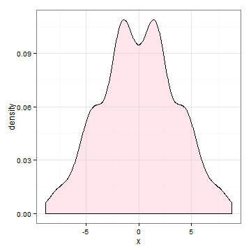

```r
x.dens <- density(means)
df.dens <- data.frame(x = x.dens$x, y = x.dens$y)
p + geom_area(data = subset(df.dens, x >= 7.6 & x <= max(DF$x)), aes(x = x, y = y), fill = "blue", alpha = 0.4) + 
    labs(x = "", y = "")
```

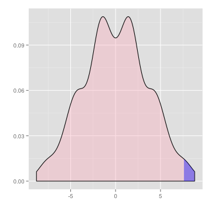

```r
# Another approach ....
P3 <- t(SRS(DATA, n = 5))
P2 <- t(SRS(DATA, n = 5))
# Note need to reorder the P2 values
P2R <- P2[, 252:1]
apply(P2R, 2, mean)
```

```
  [1] 12.0 10.2 10.8  9.2  9.2  9.0 11.4 12.0 10.4 10.4 10.2 10.2  8.6  8.6  8.4  9.2  9.2  9.0  7.6
 [20]  7.4  7.4 11.4 12.0 10.4 10.4 10.2 10.2  8.6  8.6  8.4  9.2  9.2  9.0  7.6  7.4  7.4 11.4  9.8
 [39]  9.8  9.6 10.4 10.4 10.2  8.8  8.6  8.6  8.6  8.6  8.4  7.0  6.8  6.8  7.6  7.4  7.4  5.8 12.0
 [58] 12.6 11.0 11.0 10.8 10.8  9.2  9.2  9.0  9.8  9.8  9.6  8.2  8.0  8.0 12.0 10.4 10.4 10.2 11.0
 [77] 11.0 10.8  9.4  9.2  9.2  9.2  9.2  9.0  7.6  7.4  7.4  8.2  8.0  8.0  6.4 12.0 10.4 10.4 10.2
 [96] 11.0 11.0 10.8  9.4  9.2  9.2  9.2  9.2  9.0  7.6  7.4  7.4  8.2  8.0  8.0  6.4 10.4 10.4 10.2
[115]  8.8  8.6  8.6  9.4  9.2  9.2  7.6  7.6  7.4  7.4  5.8  6.4 10.0 10.6  9.0  9.0  8.8  8.8  7.2
[134]  7.2  7.0  7.8  7.8  7.6  6.2  6.0  6.0 10.0  8.4  8.4  8.2  9.0  9.0  8.8  7.4  7.2  7.2  7.2
[153]  7.2  7.0  5.6  5.4  5.4  6.2  6.0  6.0  4.4 10.0  8.4  8.4  8.2  9.0  9.0  8.8  7.4  7.2  7.2
[172]  7.2  7.2  7.0  5.6  5.4  5.4  6.2  6.0  6.0  4.4  8.4  8.4  8.2  6.8  6.6  6.6  7.4  7.2  7.2
[191]  5.6  5.6  5.4  5.4  3.8  4.4 10.6  9.0  9.0  8.8  9.6  9.6  9.4  8.0  7.8  7.8  7.8  7.8  7.6
[210]  6.2  6.0  6.0  6.8  6.6  6.6  5.0  9.0  9.0  8.8  7.4  7.2  7.2  8.0  7.8  7.8  6.2  6.2  6.0
[229]  6.0  4.4  5.0  9.0  9.0  8.8  7.4  7.2  7.2  8.0  7.8  7.8  6.2  6.2  6.0  6.0  4.4  5.0  7.4
[248]  7.2  7.2  5.6  6.2  4.4
```

```r
apply(P3, 2, mean)
```

```
  [1]  4.4  6.2  5.6  7.2  7.2  7.4  5.0  4.4  6.0  6.0  6.2  6.2  7.8  7.8  8.0  7.2  7.2  7.4  8.8
 [20]  9.0  9.0  5.0  4.4  6.0  6.0  6.2  6.2  7.8  7.8  8.0  7.2  7.2  7.4  8.8  9.0  9.0  5.0  6.6
 [39]  6.6  6.8  6.0  6.0  6.2  7.6  7.8  7.8  7.8  7.8  8.0  9.4  9.6  9.6  8.8  9.0  9.0 10.6  4.4
 [58]  3.8  5.4  5.4  5.6  5.6  7.2  7.2  7.4  6.6  6.6  6.8  8.2  8.4  8.4  4.4  6.0  6.0  6.2  5.4
 [77]  5.4  5.6  7.0  7.2  7.2  7.2  7.2  7.4  8.8  9.0  9.0  8.2  8.4  8.4 10.0  4.4  6.0  6.0  6.2
 [96]  5.4  5.4  5.6  7.0  7.2  7.2  7.2  7.2  7.4  8.8  9.0  9.0  8.2  8.4  8.4 10.0  6.0  6.0  6.2
[115]  7.6  7.8  7.8  7.0  7.2  7.2  8.8  8.8  9.0  9.0 10.6 10.0  6.4  5.8  7.4  7.4  7.6  7.6  9.2
[134]  9.2  9.4  8.6  8.6  8.8 10.2 10.4 10.4  6.4  8.0  8.0  8.2  7.4  7.4  7.6  9.0  9.2  9.2  9.2
[153]  9.2  9.4 10.8 11.0 11.0 10.2 10.4 10.4 12.0  6.4  8.0  8.0  8.2  7.4  7.4  7.6  9.0  9.2  9.2
[172]  9.2  9.2  9.4 10.8 11.0 11.0 10.2 10.4 10.4 12.0  8.0  8.0  8.2  9.6  9.8  9.8  9.0  9.2  9.2
[191] 10.8 10.8 11.0 11.0 12.6 12.0  5.8  7.4  7.4  7.6  6.8  6.8  7.0  8.4  8.6  8.6  8.6  8.6  8.8
[210] 10.2 10.4 10.4  9.6  9.8  9.8 11.4  7.4  7.4  7.6  9.0  9.2  9.2  8.4  8.6  8.6 10.2 10.2 10.4
[229] 10.4 12.0 11.4  7.4  7.4  7.6  9.0  9.2  9.2  8.4  8.6  8.6 10.2 10.2 10.4 10.4 12.0 11.4  9.0
[248]  9.2  9.2 10.8 10.2 12.0
```

```r
DiffMeans <- apply(P3, 2, mean) - apply(P2R, 2, mean)
sort(DiffMeans)
```

```
  [1] -8.8 -7.6 -7.6 -7.6 -7.6 -7.6 -7.6 -6.4 -6.4 -6.4 -5.6 -5.6 -5.6 -5.6 -5.6 -5.6 -5.2 -5.2 -5.2
 [20] -5.2 -5.2 -4.8 -4.8 -4.4 -4.4 -4.4 -4.4 -4.4 -4.4 -4.4 -4.4 -4.4 -4.4 -4.4 -4.4 -4.0 -4.0 -4.0
 [39] -4.0 -4.0 -4.0 -4.0 -4.0 -4.0 -3.6 -3.6 -3.6 -3.2 -3.2 -3.2 -3.2 -2.8 -2.8 -2.8 -2.8 -2.4 -2.4
 [58] -2.4 -2.4 -2.0 -2.0 -2.0 -2.0 -2.0 -2.0 -2.0 -2.0 -2.0 -2.0 -2.0 -2.0 -2.0 -2.0 -2.0 -2.0 -2.0
 [77] -2.0 -1.6 -1.6 -1.6 -1.6 -1.6 -1.6 -1.6 -1.6 -1.6 -1.6 -1.6 -1.6 -1.6 -1.6 -1.6 -1.6 -1.6 -1.6
 [96] -1.2 -1.2 -1.2 -1.2 -1.2 -1.2 -1.2 -1.2 -1.2 -0.8 -0.8 -0.8 -0.8 -0.8 -0.8 -0.8 -0.8 -0.8 -0.8
[115] -0.4 -0.4 -0.4 -0.4 -0.4 -0.4 -0.4 -0.4 -0.4  0.0  0.0  0.0  0.0  0.0  0.0  0.4  0.4  0.4  0.4
[134]  0.4  0.4  0.4  0.4  0.4  0.8  0.8  0.8  0.8  0.8  0.8  0.8  0.8  0.8  0.8  1.2  1.2  1.2  1.2
[153]  1.2  1.2  1.2  1.2  1.2  1.6  1.6  1.6  1.6  1.6  1.6  1.6  1.6  1.6  1.6  1.6  1.6  1.6  1.6
[172]  1.6  1.6  1.6  1.6  2.0  2.0  2.0  2.0  2.0  2.0  2.0  2.0  2.0  2.0  2.0  2.0  2.0  2.0  2.0
[191]  2.0  2.0  2.0  2.4  2.4  2.4  2.4  2.8  2.8  2.8  2.8  3.2  3.2  3.2  3.2  3.6  3.6  3.6  4.0
[210]  4.0  4.0  4.0  4.0  4.0  4.0  4.0  4.0  4.4  4.4  4.4  4.4  4.4  4.4  4.4  4.4  4.4  4.4  4.4
[229]  4.4  4.8  4.8  5.2  5.2  5.2  5.2  5.2  5.6  5.6  5.6  5.6  5.6  5.6  6.4  6.4  6.4  7.6  7.6
[248]  7.6  7.6  7.6  7.6  8.8
```

```r
sum(DiffMeans >= 7.6)
```

```
[1] 7
```

```r
# Note the following:
obs <- mean(DATA[6:10])
sort(apply(P3, 2, mean))
```

```
  [1]  3.8  4.4  4.4  4.4  4.4  4.4  4.4  5.0  5.0  5.0  5.4  5.4  5.4  5.4  5.4  5.4  5.6  5.6  5.6
 [20]  5.6  5.6  5.8  5.8  6.0  6.0  6.0  6.0  6.0  6.0  6.0  6.0  6.0  6.0  6.0  6.0  6.2  6.2  6.2
 [39]  6.2  6.2  6.2  6.2  6.2  6.2  6.4  6.4  6.4  6.6  6.6  6.6  6.6  6.8  6.8  6.8  6.8  7.0  7.0
 [58]  7.0  7.0  7.2  7.2  7.2  7.2  7.2  7.2  7.2  7.2  7.2  7.2  7.2  7.2  7.2  7.2  7.2  7.2  7.2
 [77]  7.2  7.4  7.4  7.4  7.4  7.4  7.4  7.4  7.4  7.4  7.4  7.4  7.4  7.4  7.4  7.4  7.4  7.4  7.4
 [96]  7.6  7.6  7.6  7.6  7.6  7.6  7.6  7.6  7.6  7.8  7.8  7.8  7.8  7.8  7.8  7.8  7.8  7.8  7.8
[115]  8.0  8.0  8.0  8.0  8.0  8.0  8.0  8.0  8.0  8.2  8.2  8.2  8.2  8.2  8.2  8.4  8.4  8.4  8.4
[134]  8.4  8.4  8.4  8.4  8.4  8.6  8.6  8.6  8.6  8.6  8.6  8.6  8.6  8.6  8.6  8.8  8.8  8.8  8.8
[153]  8.8  8.8  8.8  8.8  8.8  9.0  9.0  9.0  9.0  9.0  9.0  9.0  9.0  9.0  9.0  9.0  9.0  9.0  9.0
[172]  9.0  9.0  9.0  9.0  9.2  9.2  9.2  9.2  9.2  9.2  9.2  9.2  9.2  9.2  9.2  9.2  9.2  9.2  9.2
[191]  9.2  9.2  9.2  9.4  9.4  9.4  9.4  9.6  9.6  9.6  9.6  9.8  9.8  9.8  9.8 10.0 10.0 10.0 10.2
[210] 10.2 10.2 10.2 10.2 10.2 10.2 10.2 10.2 10.4 10.4 10.4 10.4 10.4 10.4 10.4 10.4 10.4 10.4 10.4
[229] 10.4 10.6 10.6 10.8 10.8 10.8 10.8 10.8 11.0 11.0 11.0 11.0 11.0 11.0 11.4 11.4 11.4 12.0 12.0
[248] 12.0 12.0 12.0 12.0 12.6
```

```r
sum(apply(P3, 2, mean) >= obs)
```

```
[1] 7
```


Two-Sided Tests
====================

The direction of the alternative hypothesis is derived from the research hypothesis.  In this K11777 study, we enter the study expecting a reduction in worm counts and hoping the data will bear out this expectation.  It is our expectation, hope, or interest that drives the alternative hypothesis and the randomization calculation.  Occasionally, we enter a study without a firm direction in mind for the alternative, in which case we use a two-sided alternative.  Furthermore, even if we hope that the new treatment will be better than the old treatment or better than the control, we might be wrong---it may be that the new treatment is actually worse than the old treatment or even harmful (worse than the control).  Some statisticians argue that a conservative objective approach is to always consider the two-sided alternative.  For a **two-sided test**, the _p_-value must take into account extreme values of the test statistic in either direction (no matter which direction we actually observe in our sample data).

> Key Concept:  The direction of the alternative hypothesis does not depend on the sample data, but instead is determined by the research hypothesis before the data are collected.

We will now make our definition of the _p_-value more general for a wider variety of significance testing situations.  The _p_-value is the probability of observing a group difference as extreme as or more extreme than the group difference actually observed in the sample data, assuming that there is nothing creating groupd differences except the random allocation process.

This definition is consistent with the earlier definition for one-sided alternatives, as we can interpret _extreme_ to mean either greater than or less than, depending on the direction fo the alternative hypothesis.  But in the two-sided case, _extreme_ encompasses both directions.  In the K11777 example, we observed a difference of 7.6 between control and treament group means.  Thus, the two-sided _p_-value calculation is a count of all instances among the N replications where the randomly allocated mean difference is either as small as or smaller than -7.6 worms ($\leq -7.6$) or as great or greater than 7.6 worms ($\geq 7.6$).  This is often written as $|diff| \geq 7.6$.

Activity: A two-sided hypothesis test
======================================

  * Run the simulaltion study again to fine the empirical _p_-value for a two-sided hypothesis test to determine if there is a difference between the treatment and control group means for female mice.


```r
ND <- schis[gender == "Female", ]
ND
```

```
   gender     group worms
1  Female Treatment     1
2  Female Treatment     2
3  Female Treatment     2
4  Female Treatment    10
5  Female Treatment     7
6  Female   Control    16
7  Female   Control    10
8  Female   Control    10
9  Female   Control     7
10 Female   Control    17
```

```r
tapply(ND$worms, ND$group, mean)
```

```
  Control Treatment 
     12.0       4.4 
```

```r
# OR
ANS1 <- with(data = ND, tapply(worms, group, mean))
ANS1
```

```
  Control Treatment 
     12.0       4.4 
```

```r
observed <- ANS1[1] - ANS1[2]
observed
```

```
Control 
    7.6 
```

```r
names(observed) <- NULL
observed
```

```
[1] 7.6
```

```r
Worms2 <- subset(ND, select = worms, drop = TRUE)
Worms2
```

```
 [1]  1  2  2 10  7 16 10 10  7 17
```

```r
N <- 10^5 - 1  # number of times fo repeat the process
result <- numeric(N)  # space to save the random differences
for (i in 1:N) {
    # sample of size 5, from 1 to 10, without replacement
    index <- sample(10, size = 5, replace = FALSE)
    result[i] <- mean(Worms2[index]) - mean(Worms2[-index])
}
hist(result, col = "blue", main = "", freq = FALSE)
```

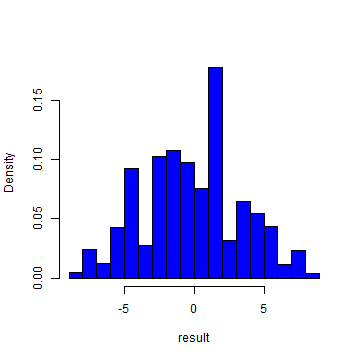

```r
d.res <- density(result)
plot(d.res, main = "", xlab = "", ylab = "")
polygon(d.res, col = "pink")
xsr <- c(7.6, d.res$x[d.res$x >= 7.6])
ysr <- c(0, d.res$y[d.res$x >= 7.6])
xsl <- c(-7.6, d.res$x[d.res$x <= -7.6])
ysl <- c(0, d.res$y[d.res$x <= -7.6])
polygon(xsr, ysr, col = "red")
polygon(xsl, ysl, col = "red")
```

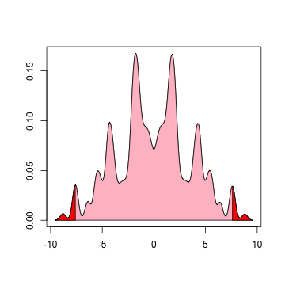

```r
pvalue <- (sum(result >= observed) + sum(result <= -observed) + 1)/(N + 1)  # p-value
pvalue  # results will vary
```

```
[1] 0.05562
```

```r
# ggplot2 approach now
DF <- data.frame(x = result)
p <- ggplot(data = DF) + geom_density(aes(x = x, y = ..density..), fill = "pink", alpha = 0.4)
p
```

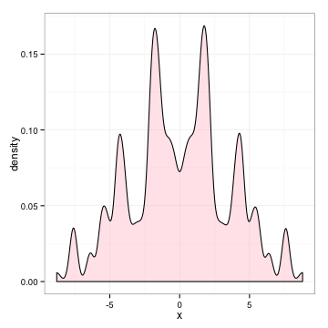

```r
x.dens <- density(result)
df.dens <- data.frame(x = x.dens$x, y = x.dens$y)
p + geom_area(data = subset(df.dens, x >= 7.6 & x <= max(DF$x)), aes(x = x, y = y), fill = "blue", alpha = 0.4) + 
    labs(x = "", y = "") + geom_area(data = subset(df.dens, x <= -7.6 & x >= min(DF$x)), aes(x = x, y = y), 
    fill = "blue", alpha = 0.4)
```

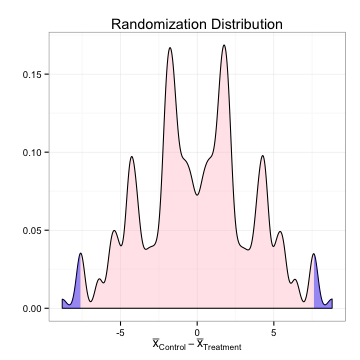

The empirical _p_-value for a two-sided test is 0.0556.

  * Is the number of simulations resulting in a difference greater than or equal to 7.6 identical to the number of simulations resulting in a difference less than or equal to -7.6?  Explain why these values are likely to be close but not identical.
  

```r
sum(result >= observed)
```

```
[1] 2728
```

```r
sum(result <= -observed)
```

```
[1] 2833
```


  * Explain why you expect the _p_-value for the two-sided alternative to be about double that for the one sided alternative.
  
What Can We Conclude from the Schistosomiasis Study?
======================================================

The key question in this study is whwther K11777 will reduce the spread of a common and potentially deadly disease.  The result that you calculated from the one-sided randomization hypothesis test should have been close to the exact _p_-value of 0.0278.  This small _p_-value allows you to reject the null hypothesis and conclude that the worm counts are lower in the female treatment group than in the female control group.  In every study, it is important to consider how random allocation and random sampling impact the conclusions.

> _Random allocation_: The schistosomiasis stude was an **experiment** because the units (female mice) were randomly allocated to treatment or contol groups.  To the best of our knowledge this experiment controlled for any outside influences and allows us to state that there is a cause and effect relationship between the treatment and response.  Therefore, we can conclude that K11777 did _cause_ a reduction in the average number of schistosome parasites in these female mice.

> _Random sampling_: Mice for this study are typically ordered from a facility that breeds and rasies lab mice.  It is possilbe that the mice in this study were biologically related or were exposed to something that caused their response to be different from that of other mice.  Similarly, there are risks in simply assuming that male mice have the same response as females.  Since our sample of 10 female mice was not selected at random from the population of all mice, we should question whether the results from this study hold for all mice.

More importantly, the results have not shown that this new drug will have the same impact on humans as it does on mice.  In addition, even though we found that K11777 does cause a reduction in worm counts, we did not specifically show that it will reduce the spread of the disease.  Is the disease less deadly if only two worms are in the body instead of 10?  Statistical consultants aren't typically expected to know the answers to these theoretical, biological, or medical types of questions, but they should ask questions to ensure that the study conclusions match the hypothesis that was tested.  In most cases, drug tests require multiple levels of studies to ensure that the drug is safe and to show that the results are consistent across the entire population of interest. While this study is very promising, much more work is needed before we can conclude that K11777 can reduce the spread of schistosomiasis in humans.

Permutation Test versus Randomization Tests
=====================================================

The random allocation of experimental units (e.g. mice) to groups provides the basis for statistical inference in a randomized comparative experiment.  In the schistosomiasis K11777 treatment study, we used a significance test to ascertain whether cause and effect was at work.  In the context of the random allocation study design, we called our significance test a randomization test.  In **observational studies**, subjects are not randomnly allocated to groups.  In this context, we apply the same inferential procedures as in the previous experiment, but we commonly call the significance test a **permutation test** rather than a a randomization test.  More importantly, in observational studies, the results of the test cannot typically be used to claim cause and effect; a reseracher should exhibit more caution in the interpretation of results.

> Key Concept: Wheras in experiments units are randomly allocated to treatment groups, observational studies do no impose a treatment on a unit.  Because the random allocation process protects against potential biases caused by extraneous variables, experiments are often used to show causation.

Age Discrimination Study
========================

Westvaco is a company that produces paper products.  IN 1991, Robert Martin was working in the engineering department of the company's envelope division when he was laid off in Round 2 of several rounds of layoffs by the company.  He sued the company, claiming to be a victim of age discrimination.  The ages of the 10 workers involved in Round 2 were: 25, 33, 35, 38, 48, 55, 55, 56, and 64.  The ages of the three people laid off were 55, 55, and 64.


```r
ages <- c(25, 33, 35, 38, 48, 55, 55, 55, 56, 64)
status <- c(rep("Job", 6), rep("LaidOff", 2), "Job", "LaidOff")
west <- data.frame(ages, status)
rm(ages, status)
west
```

```
   ages  status
1    25     Job
2    33     Job
3    35     Job
4    38     Job
5    48     Job
6    55     Job
7    55 LaidOff
8    55 LaidOff
9    56     Job
10   64 LaidOff
```

```r
require(ggplot2)
p <- ggplot(data = west, aes(status, ages)) + geom_point(position = "jitter", aes(color = status))
p
```

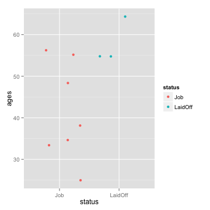

  * Conduct a permutation test to determine whether the observed difference between means is likely to occur just by chance.  Here we are interested in only a one-sided test to determine if the mean age of people who were laid off is higher than the mean age of people who were not laid off.
  

```r
OBS <- with(data = west, tapply(ages, status, mean))
OBS
```

```
    Job LaidOff 
  41.43   58.00 
```

```r
obsDiff <- OBS[2] - OBS[1]
names(obsDiff) <- NULL
obsDiff
```

```
[1] 16.57
```

```r
Ages <- subset(west, select = ages, drop = TRUE)
Ages
```

```
 [1] 25 33 35 38 48 55 55 55 56 64
```

```r
N <- 10^5 - 1  # number of times fo repeat the process
result <- numeric(N)  # space to save the random differences
for (i in 1:N) {
    # sample of size 3, from 1 to 10, without replacement
    index <- sample(10, size = 3, replace = FALSE)
    result[i] <- mean(Ages[index]) - mean(Ages[-index])
}
hist(result, col = "blue", main = "", xlim = c(-25, 25))
```

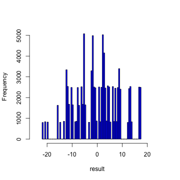

```r
d.res <- density(result)
plot(d.res, main = "", xlab = "", ylab = "", xlim = c(-25, 25))
polygon(d.res, col = "pink")
xs <- c(obsDiff, d.res$x[d.res$x >= obsDiff])
ys <- c(0, d.res$y[d.res$x >= obsDiff])
polygon(xs, ys, col = "red")
```

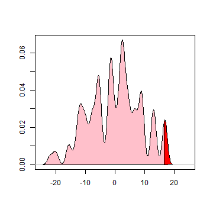

```r
# ggplot2 approach now
DF <- data.frame(x = result)
p <- ggplot(data = DF) + geom_density(aes(x = x, y = ..density..), fill = "pink", alpha = 0.4)
p
```

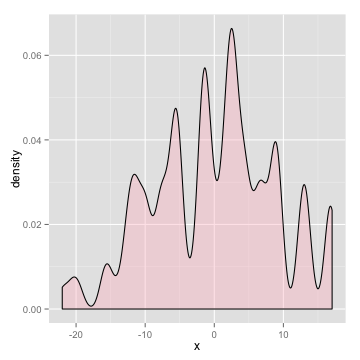

```r
x.dens <- density(result)
df.dens <- data.frame(x = x.dens$x, y = x.dens$y)
p + geom_area(data = subset(df.dens, x >= obsDiff & x <= max(DF$x)), aes(x = x, y = y), fill = "blue", 
    alpha = 0.4) + labs(x = "", y = "")
```

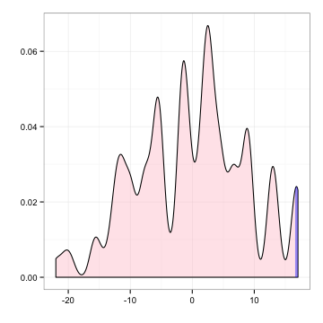

```r
pvalue <- (sum(result >= obsDiff) + 1)/(N + 1)  # p-value
pvalue  # results will vary
```

```
[1] 0.05075
```

The _p_-value is 0.0508.
  
  * Modify the code used in the previous problem to test if the median age of people who were laid off is higher than the median age of people who were not laid off.  Report the _p_-value and compare your results to those in the previous question.
  
  

```r
OBSM <- with(data = west, tapply(ages, status, median))
OBSM
```

```
    Job LaidOff 
     38      55 
```

```r
obsDiffMedian <- OBSM[2] - OBSM[1]
obsDiffMedian
```

```
LaidOff 
     17 
```

```r
Ages <- subset(west, select = ages, drop = TRUE)
Ages
```

```
 [1] 25 33 35 38 48 55 55 55 56 64
```

```r
N <- 10^5 - 1  # number of times fo repeat the process
MedianDiff <- numeric(N)  # space to save the random differences
for (i in 1:N) {
    # sample of size 3, from 1 to 10, without replacement
    index <- sample(10, size = 3, replace = FALSE)
    MedianDiff[i] <- median(Ages[index]) - median(Ages[-index])
}
hist(MedianDiff, col = "blue", main = "")
```


```r
# ggplot2 approach now
DF <- data.frame(x = MedianDiff)
p <- ggplot(data = DF) + geom_density(aes(x = x, y = ..density..), fill = "pink", alpha = 0.4)
p
```

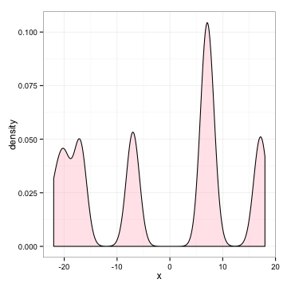

```r
x.dens <- density(MedianDiff)
df.dens <- data.frame(x = x.dens$x, y = x.dens$y)
p + geom_area(data = subset(df.dens, x >= obsDiffMedian & x <= max(DF$x)), aes(x = x, y = y), fill = "blue", 
    alpha = 0.4) + labs(x = "", y = "")
```

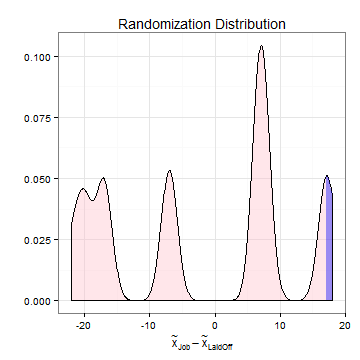

```r
####### 
pvalueMED <- (sum(MedianDiff >= obsDiffMedian) + 1)/(N + 1)  # p-value
pvalueMED  # results will vary
```

```
[1] 0.1667
```

The _p_-value is 0.1667.

Since there was no random allocation (i.e., people were not randomly assigned to layoff group), statistical significance does not give us the right to assert that greater age is _causing_ a difference in being laid off.  We "imagine" an experiment in which workers are randomly allocated to a layoff group and then determine if the observed average difference between the ages of laid-off workers and those not laid off is significantly larger than would be expected to occur by chance is a randomized comparative experiment.

While age could be the cause for the difference ---hence proving the allegation of age discrimination---there are many other possibilities (i.e., extraneous variables), such as educational levels of the workers, their competence to do the job, and ratings on past performance evaluations.  Rejecting the null hypothesis in a nonrandomized context can be a _useful step_ toward establishing causality; however, it cannot establish causality unless the extraneous variables have been properly accounted for.  

In the actual court case, data from all three rounds of layoffs were statistically analyzed.  The analysis showed some evidence that older people were more likely to be laid off; however, Robert Martin ended up settling out of court.


Verizon Repair Times
======================


Verizon is the primary local telephone company (incumbent local exchange carrier ILEC) for a large area of the eastern United States.  AS such, it is responsible for providing repair service for the customers of other telephone companies known as competing local exchange carriers (CLECs) in this region.  Verizon is subject to fines if the repair times (the time it takes to fix a problem) for CLEC customers are substantially worse thatn those for Verizon customers.  The data set **Verizon.csv** stored in the class **Data** directory contains a random sample of repair times for 1664 ILEC and 23 CLEC customers.  The mean repair time for ILEC customers is 8.4 hours, while that for CLEC customers is 16.5 hours.  Could a difference this large be easily explained by chance?

The permutation distribution (difference of means) is skewed to the left, but that does not matter; both the observed statistic and the permutation resamples are affected by imbalance and skewness in the same way.  This test works fine even with unbalanced sample sizes of 1664 and 23, and even for very skewed data.

Note that the Verizon data has long tails.  The mean is not the best measure of center to use with long tailed distributions.  We may want to use a statistic that is less sensitive to skewed distributions.  There are a number of reasons to do this.  One is to get a better measure of what is important in practice, how inconvenienced customers are by the repairs.  After a while, each additional hour probably does not matter as much, yet a sample mean treats an extra 10 hours on a repair time of 100 hours the same as an extra 10 hours on a repair of 1 hour.  Second, a large recorded repair time might just be a blunder; for example, a repair time of $10^6$ hours must be a mistake.  Third, a more robust statistic could be more sensitive at detecting real differences in the distributions -- the mean is so sensitive to large observations that it pays less attention to moderate observations, wheras a statistic more sensitive to moderate observations could detect differences between populations that show up in the moderate observations.

Using Means
=============


```r
Ver <- read.csv("http://www1.appstate.edu/~arnholta/Data/Verizon.csv")
head(Ver)
```

```
   Time Group
1 17.50  ILEC
2  2.40  ILEC
3  0.00  ILEC
4  0.65  ILEC
5 22.23  ILEC
6  1.20  ILEC
```

```r
ANS <- tapply(Ver$Time, Ver$Group, mean)
observed <- ANS[1] - ANS[2]
observed
```

```
 CLEC 
8.098 
```

```r
N <- 10^4 - 1  # number of times fo repeat the process
result <- numeric(N)  # space to save the random differences
for (i in 1:N) {
    # sample of size 5, from 1 to 10, without replacement
    index <- sample(1687, size = 23, replace = FALSE)
    result[i] <- mean(Ver$Time[index]) - mean(Ver$Time[-index])
}
hist(result, col = "blue", main = "", breaks = "Scott")
abline(v = observed)
```

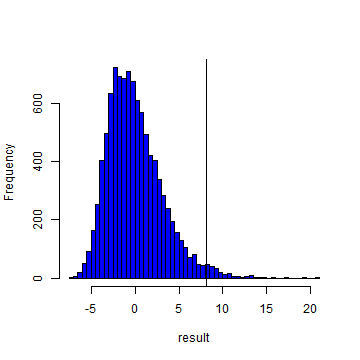

```r
pvalue <- (sum(result >= observed) + 1)/(N + 1)  # p-value
pvalue
```

```
[1] 0.0183
```

```r
DF <- data.frame(x = result)
p <- ggplot(data = DF) + geom_density(aes(x = x, y = ..density..), fill = "pink", alpha = 0.4)
p
```

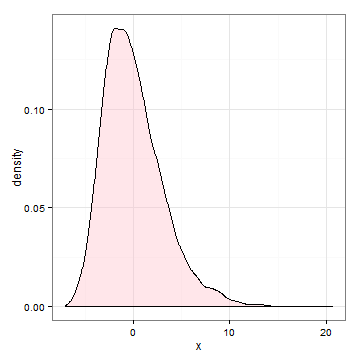

```r
x.dens <- density(result)
df.dens <- data.frame(x = x.dens$x, y = x.dens$y)
p + geom_area(data = subset(df.dens, x >= observed & x <= max(DF$x)), aes(x = x, y = y), fill = "blue", 
    alpha = 0.4) + labs(x = "", y = "")
```

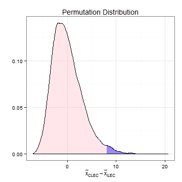


Using Medians
=================


```r
ANS <- tapply(Ver$Time, Ver$Group, median)
observed <- ANS[1] - ANS[2]
observed
```

```
 CLEC 
10.74 
```

```r
N <- 10^4 - 1  # number of times fo repeat the process
result <- numeric(N)  # space to save the random differences
for (i in 1:N) {
    # sample of size 5, from 1 to 10, without replacement
    index <- sample(1687, size = 23, replace = FALSE)
    result[i] <- median(Ver$Time[index]) - median(Ver$Time[-index])
}
hist(result, col = "blue", main = "Difference in Medians", breaks = "Scott")
abline(v = observed)
```


```r
pvalue <- (sum(result >= observed) + 1)/(N + 1)  # p-value
pvalue
```

```
[1] 0.0012
```

```r
DF <- data.frame(x = result)
p <- ggplot(data = DF) + geom_density(aes(x = x, y = ..density..), fill = "pink", alpha = 0.4)
p
```


```r
x.dens <- density(result)
df.dens <- data.frame(x = x.dens$x, y = x.dens$y)
p + geom_area(data = subset(df.dens, x >= observed & x <= max(DF$x)), aes(x = x, y = y), fill = "blue", 
    alpha = 0.4) + labs(x = "", y = "") + geom_vline(xintercept = observed)
```


Using 25% Trimmed Means
=================


```r
ANS <- tapply(Ver$Time, Ver$Group, mean, trim = 0.25)
observed <- ANS[1] - ANS[2]
observed
```

```
 CLEC 
10.34 
```

```r
N <- 10^4 - 1  # number of times fo repeat the process
result <- numeric(N)  # space to save the random differences
for (i in 1:N) {
    # sample of size 5, from 1 to 10, without replacement
    index <- sample(1687, size = 23, replace = FALSE)
    result[i] <- mean(Ver$Time[index], trim = 0.25) - mean(Ver$Time[-index], trim = 0.25)
}
hist(result, col = "blue", main = "Difference in Trimmed Means", breaks = "Scott")
abline(v = observed)
```


```r
pvalue1 <- (sum(result >= observed) + 1)/(N + 1)  # p-value
pvalue1
```

```
[1] 3e-04
```

```r
DF <- data.frame(x = result)
p <- ggplot(data = DF) + geom_density(aes(x = x, y = ..density..), fill = "pink", alpha = 0.4)
p
```


```r
x.dens <- density(result)
df.dens <- data.frame(x = x.dens$x, y = x.dens$y)
p + geom_area(data = subset(df.dens, x >= observed & x <= max(DF$x)), aes(x = x, y = y), fill = "blue", 
    alpha = 0.4) + labs(x = "", y = "") + geom_vline(xintercept = observed, color = "red")
```


It seems that the more robust statistics (median, 25% trimmed mean) are more sensitive to a possible difference between the populations; the tests are significant with estimated _p_-values of 0.0012 and 3 &times; 10<sup>-4</sup>, respectively.


Cocaine Addiction
========================================================


Two different methods to read in the data are illustrated next.


```r
Outcome <- c(rep("relapse", 10), rep("no relapse", 14), rep("relapse", 18), rep("no relapse", 6))
Drug <- c(rep("Desipramine", 24), rep("Lithium", 24))
Cocaine <- data.frame(Outcome, Drug)
head(Cocaine)
```

```
  Outcome        Drug
1 relapse Desipramine
2 relapse Desipramine
3 relapse Desipramine
4 relapse Desipramine
5 relapse Desipramine
6 relapse Desipramine
```

```r
ANS <- with(data = Cocaine, tapply(Outcome == "relapse", Drug, mean))
ANS
```

```
Desipramine     Lithium 
     0.4167      0.7500 
```

```r
obsDiffProp <- ANS[1] - ANS[2]
obsDiffProp
```

```
Desipramine 
    -0.3333 
```


```r
Outcome2 <- c(rep(1, 10), rep(0, 14), rep(1, 18), rep(0, 6))
Drug2 <- c(rep("Desipramine", 24), rep("Lithium", 24))
Cocaine2 <- data.frame(Outcome2, Drug2)
head(Cocaine2)
```

```
  Outcome2       Drug2
1        1 Desipramine
2        1 Desipramine
3        1 Desipramine
4        1 Desipramine
5        1 Desipramine
6        1 Desipramine
```

```r
ANS2 <- with(data = Cocaine2, tapply(Outcome2, Drug2, mean))
ANS2
```

```
Desipramine     Lithium 
     0.4167      0.7500 
```

```r
obsDiffProp2 <- ANS2[1] - ANS2[2]
obsDiffProp2
```

```
Desipramine 
    -0.3333 
```


Regardless of the method used to read in the data, the observed difference in proportion of addicts who relapse using Desipramine and Lithium is -0.3333. 


Repeating the Experiment
========================

The following code can be used when reading the data into a data frame using the second approach.


```r
N <- 10^4 - 1
DiffProp <- numeric(N)
for (i in 1:N) {
    # sample of size 24 # from the total 48 addicts
    index <- sample(48, size = 24, replace = FALSE)
    DiffProp[i] <- mean(Cocaine2$Outcome2[index]) - mean(Cocaine2$Outcome2[-index])
}
hist(DiffProp, col = "blue", breaks = "Scott", xlab = "", main = "")
abline(v = obsDiffProp2, col = "red")
```


```r
pvalue1 <- (sum(DiffProp <= obsDiffProp2) + 1)/(N + 1)
pvalue1
```

```
[1] 0.0205
```

```r
# ggplot2 approach
DF <- data.frame(x = DiffProp)
p <- ggplot(data = DF) + geom_density(aes(x = x, y = ..density..), fill = "pink", alpha = 0.4)
p
```


```r
x.dens <- density(DiffProp)
df.dens <- data.frame(x = x.dens$x, y = x.dens$y)
p + geom_area(data = subset(df.dens, x <= obsDiffProp & x >= min(DF$x)), aes(x = x, y = y), fill = "blue", 
    alpha = 0.4) + labs(x = "", y = "")
```


The following code can be used when reading the data into a data frame using the first approach.


```r
N <- 10^4 - 1
DiffProp <- numeric(N)
for (i in 1:N) {
    # sample of size 24 # from the total 48 addicts
    index <- sample(48, size = 24, replace = FALSE)
    DiffProp[i] <- mean(Cocaine$Outcome[index] == "relapse") - mean(Cocaine$Outcome[-index] == "relapse")
}
hist(DiffProp, col = "blue", breaks = "Scott", xlab = "", main = "")
abline(v = obsDiffProp, col = "red")
```


```r
pvalue <- (sum(DiffProp <= obsDiffProp) + 1)/(N + 1)
pvalue
```

```
[1] 0.0201
```

```r
# ggplot2 approach
DF <- data.frame(x = DiffProp)
p <- ggplot(data = DF) + geom_density(aes(x = x, y = ..density..), fill = "pink", alpha = 0.4)
p
```


```r
x.dens <- density(DiffProp)
df.dens <- data.frame(x = x.dens$x, y = x.dens$y)
p + geom_area(data = subset(df.dens, x <= obsDiffProp & x >= min(DF$x)), aes(x = x, y = y), fill = "blue", 
    alpha = 0.4) + labs(x = "", y = "")
```


Recall that if the true _p_-value is 0.02, then we can expect the standard deviation of our simulated _p_-value to be approximately $\sqrt{p\times(1-p)/N}$, or approximately 0.0014.

Mathematical Symbols
=======================

There are many online references for writing in $\LaTeX$.  Here is a [link to a pdf](http://mirrors.ibiblio.org/CTAN/info/examples/Math_into_LaTeX-4/SymbolTables.pdf) that you may find useful.

Try writing a few equations with $\LaTeX$.  Once you get the hang of $\LaTeX$, you will $\heartsuit$ it!  

$$\bar{y} = \sum_{i=1}^{n} \frac{y_i}{n}$$


Permutation and Randomization Tests for Matched Pairs Design
============================================================


The ideas developed with the Schistosomiasis example can be extended to other study designs, such as a basic two-variable design called a **matched pairs design**.  In a matched pairs design, each experimental unit provides both measurements in a study with two treatments (one of which could be a control).  Conversely, in the completely randomized situation of schistosomiasis K11777 treatment study, half of the units were assigned to control and half to treatment; no mouse received both treatments.

### Music and Relaxation

College students Anne Tillema and Anna Tekippe conducted an experiment to study the effect of music on a person's level of relaxation.  They hypothesized that fast songs would increase pulse rate more than slow songs.  The file called `Music.csv` contains the data from their experiment.  They decided to use a person's pulse rate as an operational definition of the person's level of relaxation and to compare pulse rates for two selections of music: a fast song and a slow song.  For the fast song they chose ["Beyond This Twilight"] (http://www.youtube.com/watch?v=_XT9RO1emjo) by Nine Inch Nails, and for the slow song they chose Rachmaninoff's ["Vocalise"](http://www.youtube.com/watch?v=h7UZhorAki4).  They recruited 28 student subjects for the experiment.

Anne and Anna came up with a **matched pairs design**.  Their fundamental question involved two treatments: (1) listening to the fast song and (2) listening to the slow song.  They could have randomly allocated 14 subjects to hear the fast song and 14 subjects to hear the slow song, but their more efficient approach was to have each subject provide both measurements.  That is, each subject listened to both songs, giving rise to two data values for each subject, called a matched pairs.  Randomization came into play when it was decided by a coin flip whether each subject would listen first to the fast song or the slow song.

In experiments, units are **randomly allocated to groups** which allosw researchers to make statements about causation.  In this example, Anne and Anna **randomize the order** to prescribe two conditions on a single subject. 

Specifically, as determined by coin flips, half the subjects experienced the following procedure:

[one minute rest; measure pulse (prepulse)] $\Rightarrow$ [listen to fast song for 2 minutes; measure pulse for second minute (fast song pulse)] $\Rightarrow$ [rest for one minute] $\Rightarrow$ [listen to slow song for 2 minutes; measure pulse for second minute (slow song pulse)].

The other half of the subjects experienced the procedure the same way except that they heard the slow song first and the fast song second as shown below.

[one minute rest; measure pulse (prepulse)] $\Rightarrow$ [listen to slow song for 2 minutes; measure pulse for second minute (slow song pulse)] $\Rightarrow$ [rest for one minute] $\Rightarrow$ [listen to fast song for 2 minutes; measure pulse for second minute (fast song pulse)].

Each subject gives us two measurements of interest for analysis: (1) fast song minus prepulse and (2) slow song pulse minus prepulse.  In the `Music.csv` file, these two measurements are called `Fastdiff` and `Slowdiff`, repsectively.

The graph below shows a dotplot of the 28 `Fastdiff`-minus`Slowdiff` values.  Notice that positive numbers predominate and the mean difference is 1.857 beats per minute, both suggesting that the fast song does indeed heighten response (pulse rate) more than the slow song.  We need to confirm this suspicion with a randomization test.


```r
Music <- read.csv("http://www1.appstate.edu/~arnholta/Data/Music.csv")
head(Music)
```

```
  Prepulse Slowsong Fastsong Favmusic Slowdiff Fastdiff Fastdiff.Slowdiff
1       72       78       80        1        6        8                 2
2       66       66       69        3        0        3                 3
3       70       86       78        3       16        8                -8
4       58       63       59        2        5        1                -4
5       65       80       74        3       15        9                -6
6       62       61       63        2       -1        1                 2
```

```r
require(ggplot2)
ggplot(data = Music, aes(x = Fastdiff.Slowdiff)) + geom_dotplot()
```


To perform a randomization test, we mimic the randomization procedure of the study design.  Here, the randomization determined the order in which the subject heard the songs, so randomization is applied to the two measurements of interest for each subject.  To compute a _p_-value, we determine how frequently we would obtain an observed difference as large or larger than 1.857. 

Testing the Effect of Music on Relaxation
------------------------------------------

1. Before they looked at the data, Anne and Anna decided to use a one- sided test to see whether fast music increased pulse rate more than slow music.  Why is it important to determine the direction of the test before looking at the data?

2. Create a simulation to test the `Music` data.  Randomly multiply each
each observed difference by a 1 or a -1.  This randomly assigns an order (`Fastdiff - Slowdiff`) or (`Slowdiff - Fastdiff`).  Then for each iteration, calculate the mean difference.  The _p_-value is the proportion of times your simulation found a mean difference greater than or equal to 1.8571.
  * Create a histogram of the mean differences.  Mark the area on the histogram that represets your _p_-value.
  * Use the _p_-value to state your conclusions in the context of the problem.  Address random allocation and random sampling (or lack of either) when stating your conclusions.

CAUTION: the type of randomization in Question 1. does not account for extraneous variables such as a great love for Nine Inch Nails on the part of some students or complete boredom with this band on the part of others (i.e., "musical taste" is a possible confounder that randomizing the order of listening cannot randomize away).  There will always be a caveat in theis type of study, since we are rather crudely letting one Nine Inch Nails song "represent" fast songs.


Contingency Tables
===============================================


To obtain information from the General Social Survey, go to [sda.berkley.edu](sda.berkley.edu). Click the ARCHIVE button.  In what follows, we will use information obtained from the [General Social Survey (GSS) Cumulative Datafile 1972-2010](http://sda.berkeley.edu/cgi-bin/hsda?harcsda+gss10). The following data file is obtained by clicking Download > Customized Subset.  Click in the radio button to the left of CSV file (Comma Separated Values with header record).  Enter `age(18-65)` in the Selection Filter(s) box.  Type `DEATHPEN SEX` in the Enter names of individual variables (original or created) to include box.  Scroll to the bottom of the page, and click the Continue button.  Review the page that appears to make sure you have selected the desired variables; then, click the `Create the Files` button.  You should have two hot links: the `Data file` and the `Codebook`.  By clicking on the `Data file` link, the information should open in your browser.  To read the data into `R`, copy the url and store it as follows.  Note the url `site` is temporary.  Consequently, we download the data to a folder on the hard drive.  The initial code is commented out as the url will no longer work after a day or so.  That is, you will need to get a new url if you want to duplicate the entire process.  


```r
# site <- 'http://sda.berkeley.edu/TMPDIR/AAELN0Q9.csv' download.file(url = site, destfile =
# '../data/DPS.csv')
DPS <- read.csv(file = "../data/DPS.csv")
xtabs(~SEX + DEATHPEN, data = DPS)
```

```
   DEATHPEN
SEX     0     1     2     3     4     5     8     9
  1 20263   257   103    28    37    35    11     0
  2 24601   283   160    58    67    37    32     2
```


Based on the `Codebook`, values 0, 8, and 9 are missing data values for the variable DEATHPEN.  We would like to store those values in our data frame as NA's (how `R` stores missing data).  Further, it would be nice to label the various categories according to their labels versus their numerical values.  To map character values to the numerical entries, we will use the `plyr` package (it can also be done using straight `R` commands).  


```r
library(plyr)
DPS$DEATHPEN <- mapvalues(DPS$DEATHPEN, from = c(0, 1, 2, 3, 4, 5, 8, 9), to = c(NA, "Strongly Agree", 
    "Agree", "Neither Agree nor Disagree", "Disagree", "Strongly Disagree", NA, NA))
DPS$SEX <- mapvalues(DPS$SEX, from = c(1, 2), to = c("Male", "Female"))
xtabs(~SEX + DEATHPEN, data = DPS)
```

```
        DEATHPEN
SEX      Agree Disagree Neither Agree nor Disagree Strongly Agree Strongly Disagree
  Female   160       67                         58            283                37
  Male     103       37                         28            257                35
```

The problem with the latest table is that the labels for the values appear in alphabetical order.  To solve this problem, we convert the character variables, `SEX` and `DEATHPEN` to factors and assign the order of the levels using the `levels=` command.


```r
DPS$DEATHPEN <- factor(DPS$DEATHPEN, levels = c("Strongly Agree", "Agree", "Neither Agree nor Disagree", 
    "Disagree", "Strongly Disagree"))
DPS$SEX <- factor(DPS$SEX, levels = c("Male", "Female"))
T1 <- xtabs(~SEX + DEATHPEN, data = DPS)
T1
```

```
        DEATHPEN
SEX      Strongly Agree Agree Neither Agree nor Disagree Disagree Strongly Disagree
  Male              257   103                         28       37                35
  Female            283   160                         58       67                37
```

```r
addmargins(T1)
```

```
        DEATHPEN
SEX      Strongly Agree Agree Neither Agree nor Disagree Disagree Strongly Disagree  Sum
  Male              257   103                         28       37                35  460
  Female            283   160                         58       67                37  605
  Sum               540   263                         86      104                72 1065
```

```r
prop.table(T1, 1)
```

```
        DEATHPEN
SEX      Strongly Agree   Agree Neither Agree nor Disagree Disagree Strongly Disagree
  Male          0.55870 0.22391                    0.06087  0.08043           0.07609
  Female        0.46777 0.26446                    0.09587  0.11074           0.06116
```


Test for Independence
========================

If SEX and DEATHPEN are independent, the expected count $E_{ij}$ for any cell is the row total times the column proportion, which is equivalent to the column total times the row proportion: $$E_{ij} = R_i(C_j/n) = C_j(R_i/n) = R_iC_j/n.$$

If SEX and DEATHPEN are independent, then the observed and the expected values for all cells should be similar.  The degree of similarity is measured with the statistic $$\sum_{cells}\dfrac{(OBS - EXP)^2}{EXP}$$

## Null and Alternative Hypotheses

The hypotheses to be tested are written as follows:

$H_0:$ Death penalty opinion is independent of gender (there is no association between death penalty opinion and gender).

$H_A:$ Death penalty opionion is dependent on gender (there is an association between death penalty opinion and gender).

## `R` interlude 

Consider how the `outer()` function works, which we will use to compute expected values.


```r
outer(1:3, 1:3)
```

```
     [,1] [,2] [,3]
[1,]    1    2    3
[2,]    2    4    6
[3,]    3    6    9
```

```r
outer(1:3, 3:1)
```

```
     [,1] [,2] [,3]
[1,]    3    2    1
[2,]    6    4    2
[3,]    9    6    3
```

```r
outer(1:3, 3:1, "+")
```

```
     [,1] [,2] [,3]
[1,]    4    3    2
[2,]    5    4    3
[3,]    6    5    4
```

```r
outer(1:3, 3:1, "^")
```

```
     [,1] [,2] [,3]
[1,]    1    1    1
[2,]    8    4    2
[3,]   27    9    3
```


The expected counts for `T1` are


```r
EC <- function(TAB) {
    outer(apply(TAB, 1, sum), apply(TAB, 2, sum))/sum(TAB)
}
EC(T1)
```

```
       Strongly Agree Agree Neither Agree nor Disagree Disagree Strongly Disagree
Male            233.2 113.6                      37.15    44.92              31.1
Female          306.8 149.4                      48.85    59.08              40.9
```


To remove all of the `NA` values from `DPS`, use `na.omit()` as follows.


```r
str(DPS)
```

```
'data.frame':	45974 obs. of  3 variables:
 $ CASEID  : int  1 3 4 5 6 7 8 9 10 11 ...
 $ DEATHPEN: Factor w/ 5 levels "Strongly Agree",..: NA NA NA NA NA NA NA NA NA NA ...
 $ SEX     : Factor w/ 2 levels "Male","Female": 2 2 2 2 1 1 1 2 2 2 ...
```

```r
DPSC <- na.omit(DPS)
str(DPSC)
```

```
'data.frame':	1065 obs. of  3 variables:
 $ CASEID  : int  26266 26267 26268 26270 26271 26272 26274 26275 26278 26279 ...
 $ DEATHPEN: Factor w/ 5 levels "Strongly Agree",..: 1 1 2 1 2 3 2 1 1 2 ...
 $ SEX     : Factor w/ 2 levels "Male","Female": 2 2 1 2 1 1 2 2 1 1 ...
 - attr(*, "na.action")=Class 'omit'  Named int [1:44909] 1 2 3 4 5 6 7 8 9 10 ...
  .. ..- attr(*, "names")= chr [1:44909] "1" "2" "3" "4" ...
```

Note that `DPSC` has 1065 observations where `DPS` has 45974 observations, but 44909 of the observations in `DPS` are `NA`.  To perform a permutation test, we will need to use the cleaned up version of the data frame `DPSC`.  

## Permutation Test for Independence

To perform a permutation test for independence between two categorical variables, the data will need to be stored in two columns.  For example, if a contingency tables has 1065 entries, that data will need to be stored in an object with 1065 rows and a column for each categorical variable.  If the null hypothesis that `SEX` and `DEATHPEN` are independent is correct, then we could permute either the `SEX` or `DEATHPEN` values, and any other permutation would be equally likely.  For each permutation resample, we will obtain a contingency table and compute the statistic     
$$\sum_{cells}\dfrac{(OBS - EXP)^2}{EXP}$$ for that permutation.  Note that for every resample, the row and column totals in the contingency table are the same; only the counts in the table change.


```r
set.seed(123)
addmargins(table(DPSC$SEX, sample(DPSC$DEATHPEN)))
```

```
        
         Strongly Agree Agree Neither Agree nor Disagree Disagree Strongly Disagree  Sum
  Male              256   107                         27       48                22  460
  Female            284   156                         59       56                50  605
  Sum               540   263                         86      104                72 1065
```

```r
addmargins(table(DPSC$SEX, sample(DPSC$DEATHPEN)))
```

```
        
         Strongly Agree Agree Neither Agree nor Disagree Disagree Strongly Disagree  Sum
  Male              230   115                         38       43                34  460
  Female            310   148                         48       61                38  605
  Sum               540   263                         86      104                72 1065
```

```r
addmargins(xtabs(~sample(SEX) + DEATHPEN, data = DPSC))
```

```
           DEATHPEN
sample(SEX) Strongly Agree Agree Neither Agree nor Disagree Disagree Strongly Disagree  Sum
     Male              232   117                         35       47                29  460
     Female            308   146                         51       57                43  605
     Sum               540   263                         86      104                72 1065
```

```r
addmargins(xtabs(~sample(SEX) + DEATHPEN, data = DPSC))
```

```
           DEATHPEN
sample(SEX) Strongly Agree Agree Neither Agree nor Disagree Disagree Strongly Disagree  Sum
     Male              218   126                         38       46                32  460
     Female            322   137                         48       58                40  605
     Sum               540   263                         86      104                72 1065
```


To perform the permutation test, randomly permute one of the catgorical variables.  Each time the categorical variable is permuted, compute the statistic $\sum_{cells}\dfrac{(OBS - EXP)^2}{EXP}$ on the resulting contingency table and store the result.  Repeat this process a large number of times.  The $p$-value will be the fraction of times the simulated statistics equal or exceed the value of the observed statistic.  


```r
N <- 10^4 - 1  # Change this for slower computers
result <- numeric(N)
for (i in 1:N) {
    # T2 <- table(sample(DPSC$SEX), DPSC$DEATHPEN)
    T2 <- xtabs(~sample(SEX) + DEATHPEN, data = DPSC)
    result[i] <- chisq.test(T2)$statistic
}
obs <- chisq.test(xtabs(~SEX + DEATHPEN, data = DPSC))$statistic
pvalue <- (sum(result >= obs) + 1)/(N + 1)
pvalue
```

```
[1] 0.008
```

```r
pvalueCH <- chisq.test(xtabs(~SEX + DEATHPEN, data = DPSC))$p.value
pvalueCH
```

```
[1] 0.009966
```

```r
# Or chisq.test(DPSC$SEX, DPSC$DEATHPEN)$p.value
hist(result, breaks = "Scott", col = "pink", freq = FALSE, main = "")
curve(dchisq(x, 4), 0, 20, add = TRUE, col = "red")
```


The simulated permutation $p$-value is 0.008.  The $p$-value that is returned from the `chisq.test()` is 0.01.  In this case, the two $p$-values are fairly similar.  This will not always be the case.  

## Formatting the Data

Some times, you will have only access to data that has been summarized (contingency tables).  To get your data into the needed format, you may want to use the following function written by [Marc Schwartz](https://stat.ethz.ch/pipermail/r-help/2006-October/115290.html) which will take a contingency table and convert it to a flat file.  The function `expand.dft()` is also in the package `vcdExtra`.  


```r
expand.dft <- function(x, na.strings = "NA", as.is = FALSE, dec = ".") {
    # Take each row in the source data frame table and replicate it using the Freq value
    DF <- sapply(1:nrow(x), function(i) x[rep(i, each = x$Freq[i]), ], simplify = FALSE)
    
    # Take the above list and rbind it to create a single DF Also subset the result to eliminate the Freq
    # column
    DF <- subset(do.call("rbind", DF), select = -Freq)
    
    # Now apply type.convert to the character coerced factor columns to facilitate data type selection
    # for each column
    for (i in 1:ncol(DF)) {
        DF[[i]] <- type.convert(as.character(DF[[i]]), na.strings = na.strings, as.is = as.is, dec = dec)
    }
    
    DF
}
```


### Example Conversion

The `x=` argument to `expand.dft()` is a table that has been converted to a data frame.  In the following example, a matrix of values is created that resembles a contingency table.  To convert the matrix to a table, we use the function `as.table()`.To convert the table to a data frame, we use the function `as.data.frame()`.  Finally, we apply the `expand.dft()` function to the contingency table that was converted to a data frame and stored in the object `HADF`.


```r
HA <- c(110, 277, 50, 163, 302, 63)
HAM <- matrix(data = HA, nrow = 2, byrow = TRUE)
dimnames(HAM) <- list(Gender = c("Male", "Female"), Giddy = c("Very Happy", "Pretty Happy", "Not to Happy"))
HAM
```

```
        Giddy
Gender   Very Happy Pretty Happy Not to Happy
  Male          110          277           50
  Female        163          302           63
```

```r
HAT <- as.table(HAM)
HAT
```

```
        Giddy
Gender   Very Happy Pretty Happy Not to Happy
  Male          110          277           50
  Female        163          302           63
```

```r
addmargins(HAT)
```

```
        Giddy
Gender   Very Happy Pretty Happy Not to Happy Sum
  Male          110          277           50 437
  Female        163          302           63 528
  Sum           273          579          113 965
```

```r
HADF <- as.data.frame(HAT)
HATflatfile <- vcdExtra::expand.dft(HADF)
head(HATflatfile)
```

```
  Gender      Giddy
1   Male Very Happy
2   Male Very Happy
3   Male Very Happy
4   Male Very Happy
5   Male Very Happy
6   Male Very Happy
```

```r
str(HATflatfile)
```

```
'data.frame':	965 obs. of  2 variables:
 $ Gender: Factor w/ 2 levels "Female","Male": 2 2 2 2 2 2 2 2 2 2 ...
 $ Giddy : Factor w/ 3 levels "Not to Happy",..: 3 3 3 3 3 3 3 3 3 3 ...
```


## Questions

From the [http://sda.berkeley.edu/cgi-bin/hsda?harcsda+gss10](http://sda.berkeley.edu/cgi-bin/hsda?harcsda+gss10) page, click Download > Customized Subset.  Click in the radio button to the left of CSV file (Comma Separated Values with header record).  Type `DEATHPEN DEGREE` in the Enter names of individual variables (original or created) to include box.  Click in the radio button All for CASE IDENTIFICATION AND YEAR.  Scroll to the bottom of the page, and click the Continue button.  Review the page that appears to make sure you have selected the desired variables; then, click the `Create the Files` button.  You should have two hot links: the `Data file` and the `Codebook`.  By clicking on the `Data file` link, the information should open in your browser.  To read the data into `R`, copy the url and store it as follows.


```r
# site <- 'http://sda.berkeley.edu/TMPDIR/AAO0mzEh.csv' download.file(url = site, destfile =
# '../data/dpy.csv')
dpy <- read.csv(file = "../data/dpy.csv")
str(dpy)
```

```
'data.frame':	55087 obs. of  5 variables:
 $ CASEID  : int  1 2 3 4 5 6 7 8 9 10 ...
 $ DEATHPEN: int  0 0 0 0 0 0 0 0 0 0 ...
 $ DEGREE  : int  3 0 1 3 1 1 1 3 1 1 ...
 $ YEAR    : int  1972 1972 1972 1972 1972 1972 1972 1972 1972 1972 ...
 $ ID      : int  1 2 3 4 5 6 7 8 9 10 ...
```

```r
xtabs(~DEATHPEN + DEGREE, data = dpy)
```

```
        DEGREE
DEATHPEN     0     1     2     3     4     8     9
       0 12106 27564  2854  7450  3595    30   129
       1   120   381    30    79    29     0     3
       2    78   168    16    52    12     0     1
       3    20    63     4    14     3     0     0
       4    23    74     9    22     9     0     1
       5    12    36     4    20    12     0     0
       8    17    23     2    11     5     0     1
       9     3     2     0     0     0     0     0
```

What is the only YEAR these two questions were asked?

There are several ways to answer this question, here is the first one that comes to mind.   


```r
YQ <- subset(x = dpy, subset = DEATHPEN != 0 & DEGREE != 0)
head(YQ)
```

```
      CASEID DEATHPEN DEGREE YEAR ID
26266  26266        1      1 1991  1
26267  26267        1      4 1991  2
26268  26268        2      4 1991  3
26269  26269        8      3 1991  4
26270  26270        1      1 1991  5
26273  26273        1      3 1991  8
```

```r
xtabs(~YEAR, data = YQ)
```

```
YEAR
1991 
1086 
```

To satisfy the curious, the answer is 1991. 

## Some code to answer Problem 10


```r
women <- c(35, 146)
men <- c(8, 97)
stuff <- rbind(women, men)
dimnames(stuff) <- list(Gender = c("Women", "Men"), Diet = c("Yes", "No"))
stuff
```

```
       Diet
Gender  Yes  No
  Women  35 146
  Men     8  97
```

```r
stuffT <- as.table(stuff)
stuffDF <- as.data.frame(stuffT)
head(stuffDF)
```

```
  Gender Diet Freq
1  Women  Yes   35
2    Men  Yes    8
3  Women   No  146
4    Men   No   97
```

```r
DFL <- vcdExtra::expand.dft(stuffDF)
head(DFL)
```

```
  Gender Diet
1  Women  Yes
2  Women  Yes
3  Women  Yes
4  Women  Yes
5  Women  Yes
6  Women  Yes
```

```r
N <- 10^4 - 1  # Change this for slower computers
result <- numeric(N)
for (i in 1:N) {
    T2 <- xtabs(~sample(Gender) + Diet, data = DFL)
    result[i] <- chisq.test(T2)$statistic
}
obs <- chisq.test(xtabs(~Gender + Diet, data = DFL))$statistic
pvalue <- (sum(result >= obs) + 1)/(N + 1)
pvalue
```

```
[1] 0.0104
```


## Test of Homogeneity

The major difference between testing for homogeneity and testing for independence is that you will have samples from two or more populations when testing for homogeneity. Recall that we only had one sample when we tested for independence.  Consider testing whether the proportion of boys is the same as the proportions of girls that favor three different flavors of candy.  That is, $H_0: \pi_{B1} = \pi_{G1}, \pi_{B2} = \pi_{G2}, \pi_{B3} =\pi_{G3}$ versus
$H_A:$ at least one of the inequalities does not hold.


```r
candy <- c(42, 20, 38, 33, 27, 50)
candyM <- matrix(data = candy, nrow = 2, byrow = TRUE)
dimnames(candyM) <- list(Gender = c("Boys", "Girls"), Flavor = c("Flavor 1", "Flavor 2", "Flavor 3"))
candyM
```

```
       Flavor
Gender  Flavor 1 Flavor 2 Flavor 3
  Boys        42       20       38
  Girls       33       27       50
```

```r
candyT <- as.table(candyM)
candyT
```

```
       Flavor
Gender  Flavor 1 Flavor 2 Flavor 3
  Boys        42       20       38
  Girls       33       27       50
```

```r
addmargins(candyT)
```

```
       Flavor
Gender  Flavor 1 Flavor 2 Flavor 3 Sum
  Boys        42       20       38 100
  Girls       33       27       50 110
  Sum         75       47       88 210
```

```r
candyDF <- as.data.frame(candyT)
candyflatfile <- vcdExtra::expand.dft(candyDF)
head(candyflatfile)
```

```
  Gender   Flavor
1   Boys Flavor 1
2   Boys Flavor 1
3   Boys Flavor 1
4   Boys Flavor 1
5   Boys Flavor 1
6   Boys Flavor 1
```

```r
str(candyflatfile)
```

```
'data.frame':	210 obs. of  2 variables:
 $ Gender: Factor w/ 2 levels "Boys","Girls": 1 1 1 1 1 1 1 1 1 1 ...
 $ Flavor: Factor w/ 3 levels "Flavor 1","Flavor 2",..: 1 1 1 1 1 1 1 1 1 1 ...
```

```r
E <- chisq.test(candyT)$expected
E
```

```
       Flavor
Gender  Flavor 1 Flavor 2 Flavor 3
  Boys     35.71    22.38     41.9
  Girls    39.29    24.62     46.1
```

```r
obsstat <- chisq.test(candyT)$statistic
obsstat
```

```
X-squared 
     3.29 
```

```r
# Now we will run a permutation test.
N <- 10^4 - 1  # Change this for slower computers
result <- numeric(N)
for (i in 1:N) {
    T2 <- xtabs(~sample(Gender) + Flavor, data = candyflatfile)
    result[i] <- chisq.test(T2)$statistic
}
pvalue <- (sum(result >= obsstat) + 1)/(N + 1)
pvalue
```

```
[1] 0.1951
```


In this case, there is no evidence to suggest the proportions of boys favoring flavors one, two, and three is any different than the proportions of girls favoring flavors one, two and three.

## Goodness of Fit

A quality engineer has taken 50 samples of size 13 each from a production process.  The numbers of defectives for these samples are given in the code.  Test the null hypothesis at an $\alpha =0.05$ level that the number of defective follows (a) the Poisson distribution, (b) the binomial distribution.


```r
numberDefectives <- c(0, 1, 2, 3, 4, 5, "6 or more")
numberSamples <- c(10, 24, 10, 4, 1, 1, 0)
names(numberSamples) <- numberDefectives
numberSamples
```

```
        0         1         2         3         4         5 6 or more 
       10        24        10         4         1         1         0 
```


Since no parameters are specified, they must be estimated from the data in order to carry out the test in both (a) and (b).

See [dist.pdf](http://asulearn.appstate.edu/file.php/66695/STT3850/dist.pdf) for a summary of various probability distributions.  The Poisson pdf is $P(X =x|\lambda) = \frac{\lambda e^{-\lambda}}{x!}$ with $E[X] =\lambda$. And estimate of the mean number of defectives in the 50 samples is 1.3.


```r
muest <- sum(numberSamples[-7] * c(0, 1, 2, 3, 4, 5))/50
muest
```

```
[1] 1.3
```

Using $\hat{\lambda} = 1.3$, we compute the probabilities for each category and subsequent expected values.


```r
ps <- dpois(0:4, muest)
p5m <- 1 - ppois(4, muest)
psf <- c(ps, p5m)
psf
```

```
[1] 0.27253 0.35429 0.23029 0.09979 0.03243 0.01066
```

```r
exh <- psf * 50
exh
```

```
[1] 13.6266 17.7146 11.5145  4.9896  1.6216  0.5332
```

```r
((numberSamples[-7] - exh)^2/exh)
```

```
     0      1      2      3      4      5 
0.9652 2.2302 0.1992 0.1963 0.2383 0.4088 
```

```r
stat <- sum((numberSamples[-7] - exh)^2/exh)
stat
```

```
[1] 4.238
```

```r
epvalue <- pchisq(stat, 6 - 1 - 1, lower = FALSE)
epvalue
```

```
[1] 0.3748
```

Since the $p$-value is 0.3748, we can not reject the null hypothesis that the distribution follows a Poisson distribution.  That is, there is no evidence to suggest the distribution is something other than the Poisson distribution.

One really needs the expected cell counts to be at least five.  Consider collapsing the number of defectives greater than or equal to 3 to a single category.


```r
ps <- dpois(0:2, muest)
p3m <- 1 - ppois(2, muest)
psf <- c(ps, p3m)
psf
```

```
[1] 0.2725 0.3543 0.2303 0.1429
```

```r
exh <- psf * 50
exh
```

```
[1] 13.627 17.715 11.514  7.144
```

```r
((numberSamples[-c(7, 6, 5)] + c(0, 0, 0, 2) - exh)^2/exh)
```

```
     0      1      2      3 
0.9652 2.2302 0.1992 0.1833 
```

```r
stat <- sum((numberSamples[-c(7, 6, 5)] + c(0, 0, 0, 2) - exh)^2/exh)
stat
```

```
[1] 3.578
```

```r
epvalue2 <- pchisq(stat, 4 - 1 - 1, lower = FALSE)
epvalue2
```

```
[1] 0.1671
```

```r
# Could use the following but the degrees of freedom will be incorrect for this test!
chisq.test(c(10, 24, 10, 6), p = psf)
```

```

	Chi-squared test for given probabilities

data:  c(10, 24, 10, 6)
X-squared = 3.578, df = 3, p-value = 0.3108
```

Note the substantial drop in $p$-value (0.1671) although the final conclusion is still the same.

For part (b), the null hypothesis is that the number of defectives in each sample of 13 follows the binomial distribution with $n = 13$ and $\pi$ equal the probability of a defective in any sample.  An estimate of $\pi$, $\hat{\pi}$ is the total number of defectives (65) divided by the total number of observations (650).  That is $\hat{\pi} = 0.1$.


```r
pihat <- 65/650
ps <- dbinom(0:2, 13, pihat)
p3m <- 1 - pbinom(2, 13, pihat)
psf <- c(ps, p3m)
psf
```

```
[1] 0.2542 0.3672 0.2448 0.1339
```

```r
exh <- psf * 50
exh
```

```
[1] 12.709 18.358 12.239  6.694
```

```r
((numberSamples[-c(7, 6, 5)] + c(0, 0, 0, 2) - exh)^2/exh)
```

```
      0       1       2       3 
0.57757 1.73402 0.40947 0.07198 
```

```r
stat <- sum((numberSamples[-c(7, 6, 5)] + c(0, 0, 0, 2) - exh)^2/exh)
stat
```

```
[1] 2.793
```

```r
epvalue3 <- pchisq(stat, 4 - 1 - 1, lower = FALSE)
epvalue3
```

```
[1] 0.2475
```


This example illustrates a common result with chi-square goodness-of-fit tests, i.e., that each to two (or more) different null hypotheses may be accepted for the same data set.  Obviously, the true distribution cannot be both binomial and Poisson at the same time which is why the conclusion is that there is not sufficient evidence to suggest the alternative.  This does not make the null hypothesis true!


Sampling Distributions (Chapter 4)
========================================================

Toss a fair coin $n = 10$ times and note the proportion of heads $\hat{p}$.  If you repeat the experiment, you probably would not get the same proportion of heads.  If you toss 50 sets of 10 coin flips, you might see outcomes (i.e., proportions of heads, $\hat{p}$) such as those below.


```r
set.seed(12)
cointoss <- rbinom(50, 10, 1/2)
phat <- cointoss/10
xtabs(~phat)
```

```
phat
0.1 0.2 0.3 0.4 0.5 0.6 0.7 0.8 
  1   3   6  10  12  11   6   1 
```

```r
plot(xtabs(~phat), ylab = "count", xlab = expression(hat(p)))
```


Although proportions between 0.3 and 0.7 occur most often, we see there is a proportion as low as 0.1 heads and as high as 0.8 heads.  Instead of 50 sets of 10 coin flips, the next simulation performs 50,000 sets of 10 tosses.


```r
set.seed(12)
cointoss <- rbinom(50000, 10, 1/2)
phat <- cointoss/10
xtabs(~phat)
```

```
phat
    0   0.1   0.2   0.3   0.4   0.5   0.6   0.7   0.8   0.9     1 
   47   480  2187  5837 10252 12238 10321  5853  2264   469    52 
```

```r
mean(phat)
```

```
[1] 0.5006
```

```r
sd(phat)
```

```
[1] 0.1581
```

```r
plot(xtabs(~phat), ylab = "count", xlab = expression(hat(p)))
```


The previous plot is an approximation to the *sampling distribution of $\hat{p}$*.  The mean of the sampling distribution of $\hat{p}$ is $\mu_{\hat{p}} = p$, and the standard deviation of the sampling distribution of $\hat{p}$, $\sigma_{\hat{p}} = \sqrt{p\times(1-p)/n}$.  The standard deviation of the simulated $\hat{p}$ values, the standard deviation of a statistic, is called a *standard error*.  In this simulation, the estimated mean of the statistic is written as $\hat{\mu}_{\hat{p}}=$ 0.5006. The standard error of $\hat{p}$, sometimes written as $SE(\hat{p})$ or $\hat{\sigma}_{\hat{p}}$ is 0.1581.

## The Central Limit Theorem

Let $X_1, X_2,...,X_n$ be independent identically distributed random variables with mean $\mu$ and variance $\sigma^2$, both finite.  Then for any constant z,

$$\lim_{n \to \infty} P\left(\frac{\bar{X} - \mu}{\sigma/\sqrt{n}} \leq z \right) = \Phi(z) $$

Where $\Phi$ is the cdf of the standard normal distribution.  The central limit theorem means that for ``sufficiently large'' $n$, the sampling distribution of $\bar{X}$ is approximately normal with mean $\mu_{\bar{X}}= \mu$, and standard deviation $\sigma_{\bar{X}} = \sigma/\sqrt{n}$.  Recall that the standard deviation of a statistic is called a standard error.  Consequently, our text refers to $\sigma_{\bar{X}}$ as $SE(\bar{X})$.

#### Note:  If you one is sampling from a normal distribution, then the resulting sampling distribution of the sample mean is exactly normal.  It is always the case that $\mu_{\bar{X}} = \mu$ and $\sigma_{\bar{X}} = \sigma/\sqrt{n}$ regardless of the population one is sampling from.

## Just how large is ''sufficiently large''?

Consider the following simulations


```r
set.seed(123)
par(mfrow = c(4, 3))
# X~N(50,15)
x <- seq(0, 100, 0.01)
y <- dnorm(x, 50, 15)
plot(x, y, type = "l", col = "blue", lwd = 2, main = "X~N(50,15)", xlab = "", ylab = "")

# X~U(0,1)
x <- seq(0, 1, 0.001)
y <- dunif(x, 0, 1)
plot(x, y, type = "l", col = "blue", lwd = 2, main = "X~U(0,1)", xlab = "", ylab = "")

# X~Exp(1)
x <- seq(0, 5, 0.01)
y <- dexp(x, 1)
plot(x, y, type = "l", col = "blue", lwd = 2, main = "X~Exp(1)", xlab = "", ylab = "")

m <- 20000  # Number of Samples
EX <- 1.2  # Character expansion

xbar.5 <- apply(matrix(rnorm(m * 5, 50, 15), nrow = m), 1, mean)
hist(xbar.5, breaks = "Scott", col = "blue", xlim = c(0, 100), prob = T, xlab = "", ylab = "", main = "")
mtext(expression(bar(x)[5]), side = 3, line = 1, cex = EX)

xbar.5 <- apply(matrix(runif(m * 5, 0, 1), nrow = m), 1, mean)
hist(xbar.5, breaks = "Scott", col = "blue", xlim = c(0, 1), prob = T, xlab = "", ylab = "", main = "")
mtext(expression(bar(x)[5]), side = 3, line = 1, cex = EX)

xbar.5 <- apply(matrix(rexp(m * 5, 1), nrow = m), 1, mean)
hist(xbar.5, breaks = "Scott", col = "blue", xlim = c(0, 5), prob = T, xlab = "", ylab = "", main = "")
mtext(expression(bar(x)[5]), side = 3, line = 1, cex = EX)

xbar.10 <- apply(matrix(rnorm(m * 10, 50, 15), nrow = m), 1, mean)
hist(xbar.10, breaks = "Scott", col = "blue", xlim = c(0, 100), prob = T, xlab = "", ylab = "", main = "")
mtext(expression(bar(x)[10]), side = 3, line = 1, cex = EX)

xbar.10 <- apply(matrix(runif(m * 10, 0, 1), nrow = m), 1, mean)
hist(xbar.10, breaks = "Scott", col = "blue", xlim = c(0, 1), prob = T, xlab = "", ylab = "", main = "")
mtext(expression(bar(x)[10]), side = 3, line = 1, cex = EX)

xbar.10 <- apply(matrix(rexp(m * 10, 1), nrow = m), 1, mean)
hist(xbar.10, breaks = "Scott", col = "blue", xlim = c(0, 5), prob = T, xlab = "", ylab = "", main = "")
mtext(expression(bar(x)[10]), side = 3, line = 1, cex = EX)

xbar.30 <- apply(matrix(rnorm(m * 30, 50, 15), nrow = m), 1, mean)
hist(xbar.30, breaks = "Scott", col = "blue", xlim = c(0, 100), prob = T, xlab = "", ylab = "", main = "")
mtext(expression(bar(x)[30]), side = 3, line = 1, cex = EX)

xbar.30 <- apply(matrix(runif(m * 30, 0, 1), nrow = m), 1, mean)
hist(xbar.30, breaks = "Scott", col = "blue", xlim = c(0, 1), prob = T, xlab = "", ylab = "", main = "")
mtext(expression(bar(x)[30]), side = 3, line = 1, cex = EX)

xbar.30 <- apply(matrix(rexp(m * 30, 1), nrow = m), 1, mean)
hist(xbar.30, breaks = "Scott", col = "blue", xlim = c(0, 5), prob = T, xlab = "", ylab = "", main = "")
mtext(expression(bar(x)[30]), side = 3, line = 1, cex = EX)
```


```r

par(mfrow = c(1, 1))
```


#### Note:  The usual rule of thumb, found in most textbooks, is that the CLT is reasonably accurate if $n \geq 30$.  Such rules are wishful thinking, dating to a pre-computer age when one had few realistic alternatives to using the CLT because most other methods were computationally infeasible.


## CLT for Binomial Data

**Example 4.9** Toss a fair coin 300 times.  Find the approximate probability of getting at most 160 heads.

**Solution:** Let $X=$ the number of heads in 300 flips of a fair coin.  Since $X \sim Bin(n = 300, p = 1/2)$ it follows that $\mu_X = np$ and $\sigma_{X} =\sqrt{np\times(1 - p)}$, and $Y \dot{\sim} N(np, \sqrt{np\times(1 - p)})$.  It follows that $P(X <= 160) = P\left(\frac{X - np}{\sqrt{np \times (1 - p)}} = Z \leq \frac{160 - 150}{\sqrt{300/4}}\right).$  Furthermore, $P(Z \leq 1.154701)=$ 0.8759.  Solve the problem in class using $\hat{p}$ as the random variable.

**Exact Solution:** $P(X \leq 160)= \sum_{x = 0}^{x = 160}\binom{300}{x} 0.5^x 0.5^{300-x}=$ 0.8874.


THE BOOTSTRAP (Chapter 5)
========================================================

We now move from the realm of probability to statistics, from situations where the population is known to where it is unknown. If all be have are data and a statistic estimated from the data, we need to estimate the sampling distribution of the statistic. One way to do this is with the **bootstrap**.


The birth weight of a baby is of interest to health officials since many studies have shown possible links between this weight and conditions in later life, such as obesity or diabetes. Researchers look for possible relationships between the birth weight of a baby and age of the mother or whether or not she smokes cigarettes or drink alcohol during her pregnancy. The centers for disease control and prevention CDC, using data provided by the U.S. Department of Health and Human Services, National Center for Health Statistics, the Division of Vital Statistics as well as the CDC, maintain a database on all babies born in a given year. We will investigate different samples taken from the CDC's database of births.

### INTRODUCTION TO THE BOOTSTRAP


```r
require(xtable)
site <- "http://www1.appstate.edu/~arnholta/Data/NCBirths2004.csv"
Babies <- read.csv(file = url(site))
```


For the North Carolina data, the mean weight of the 1009 babies in the sample is 3448.2597 g. We are interested in $\mu$, the true birth weight mean for all North Carolina babies born in 2004; this is probably not the same as the sample mean. We have already mentioned the different samples of the same size will yield different sample means, so how can we gauge the accuracy of the 3448.2597 as an estimate to $\mu$?

If we knew the sampling distribution of sample means for samples of size 1009 from the population of all 2004 North Carolina births, then this would give us an idea of how means vary from sample to sample, for the standard error of the sampling distribution tells us how far means deviate from the population mean $\mu$. But of course, since we do not have all the birth weights, we cannot guarantee the sampling distribution (and if we did have all the weights, we would know the true $\mu$!).

The bootstrap is a procedure that uses the given sample to create a new distribution, called the **bootstrap distribution**, that approximates the sampling distribution for the sample mean (or for other statistics). We will begin by considering only a small subset of the birth weights--- three observations, 3969, 3204, and 2892.

To find the bootstrap distribution of the mean, we draw samples (called _re-samples_ or _bootstrap samples_) of size $n$, with replacement, from the original sample and then compute the mean of each resample. In other words, we now treat the original sample as the population. For instance, Table 1, created with the folowing code shows all $3^3$ or 27 samples of size 3, taking order into account (the notation $x^*$ indicates a resampled observation and $\bar{x}^*$ or $\bar{\theta}^*$ the statistic for the bootstrap sample).


```r
rs <- c(3969, 3204, 2892)
xstar1 <- rep(rs, each = 9)
xstar2 <- rep(rep(rs, each = 3), 3)
xstar3 <- rep(rs, 9)
XD <- data.frame(xstar1, xstar2, xstar3)
xbarstar <- apply(XD, 1, mean)
BD <- cbind(XD, xbarstar)
WD <- BD
```


<!-- html table generated in R 3.0.2 by xtable 1.7-1 package -->
<!-- Thu Feb 06 19:12:49 2014 -->
<TABLE border=1>
<CAPTION ALIGN="bottom"> Table 1 --- All possible Samples of Size 3 from 3969, 3204, and 2892 </CAPTION>
<TR> <TH> $x^*_1$ </TH> <TH> $x^*_2$ </TH> <TH> $x^*_3$ </TH> <TH> $\bar{x}^*$ </TH>  </TR>
  <TR> <TD align="right"> 3969.00 </TD> <TD align="right"> 3969.00 </TD> <TD align="right"> 3969.00 </TD> <TD align="right"> 3969.00 </TD> </TR>
  <TR> <TD align="right"> 3969.00 </TD> <TD align="right"> 3969.00 </TD> <TD align="right"> 3204.00 </TD> <TD align="right"> 3714.00 </TD> </TR>
  <TR> <TD align="right"> 3969.00 </TD> <TD align="right"> 3969.00 </TD> <TD align="right"> 2892.00 </TD> <TD align="right"> 3610.00 </TD> </TR>
  <TR> <TD align="right"> 3969.00 </TD> <TD align="right"> 3204.00 </TD> <TD align="right"> 3969.00 </TD> <TD align="right"> 3714.00 </TD> </TR>
  <TR> <TD align="right"> 3969.00 </TD> <TD align="right"> 3204.00 </TD> <TD align="right"> 3204.00 </TD> <TD align="right"> 3459.00 </TD> </TR>
  <TR> <TD align="right"> 3969.00 </TD> <TD align="right"> 3204.00 </TD> <TD align="right"> 2892.00 </TD> <TD align="right"> 3355.00 </TD> </TR>
  <TR> <TD align="right"> 3969.00 </TD> <TD align="right"> 2892.00 </TD> <TD align="right"> 3969.00 </TD> <TD align="right"> 3610.00 </TD> </TR>
  <TR> <TD align="right"> 3969.00 </TD> <TD align="right"> 2892.00 </TD> <TD align="right"> 3204.00 </TD> <TD align="right"> 3355.00 </TD> </TR>
  <TR> <TD align="right"> 3969.00 </TD> <TD align="right"> 2892.00 </TD> <TD align="right"> 2892.00 </TD> <TD align="right"> 3251.00 </TD> </TR>
  <TR> <TD align="right"> 3204.00 </TD> <TD align="right"> 3969.00 </TD> <TD align="right"> 3969.00 </TD> <TD align="right"> 3714.00 </TD> </TR>
  <TR> <TD align="right"> 3204.00 </TD> <TD align="right"> 3969.00 </TD> <TD align="right"> 3204.00 </TD> <TD align="right"> 3459.00 </TD> </TR>
  <TR> <TD align="right"> 3204.00 </TD> <TD align="right"> 3969.00 </TD> <TD align="right"> 2892.00 </TD> <TD align="right"> 3355.00 </TD> </TR>
  <TR> <TD align="right"> 3204.00 </TD> <TD align="right"> 3204.00 </TD> <TD align="right"> 3969.00 </TD> <TD align="right"> 3459.00 </TD> </TR>
  <TR> <TD align="right"> 3204.00 </TD> <TD align="right"> 3204.00 </TD> <TD align="right"> 3204.00 </TD> <TD align="right"> 3204.00 </TD> </TR>
  <TR> <TD align="right"> 3204.00 </TD> <TD align="right"> 3204.00 </TD> <TD align="right"> 2892.00 </TD> <TD align="right"> 3100.00 </TD> </TR>
  <TR> <TD align="right"> 3204.00 </TD> <TD align="right"> 2892.00 </TD> <TD align="right"> 3969.00 </TD> <TD align="right"> 3355.00 </TD> </TR>
  <TR> <TD align="right"> 3204.00 </TD> <TD align="right"> 2892.00 </TD> <TD align="right"> 3204.00 </TD> <TD align="right"> 3100.00 </TD> </TR>
  <TR> <TD align="right"> 3204.00 </TD> <TD align="right"> 2892.00 </TD> <TD align="right"> 2892.00 </TD> <TD align="right"> 2996.00 </TD> </TR>
  <TR> <TD align="right"> 2892.00 </TD> <TD align="right"> 3969.00 </TD> <TD align="right"> 3969.00 </TD> <TD align="right"> 3610.00 </TD> </TR>
  <TR> <TD align="right"> 2892.00 </TD> <TD align="right"> 3969.00 </TD> <TD align="right"> 3204.00 </TD> <TD align="right"> 3355.00 </TD> </TR>
  <TR> <TD align="right"> 2892.00 </TD> <TD align="right"> 3969.00 </TD> <TD align="right"> 2892.00 </TD> <TD align="right"> 3251.00 </TD> </TR>
  <TR> <TD align="right"> 2892.00 </TD> <TD align="right"> 3204.00 </TD> <TD align="right"> 3969.00 </TD> <TD align="right"> 3355.00 </TD> </TR>
  <TR> <TD align="right"> 2892.00 </TD> <TD align="right"> 3204.00 </TD> <TD align="right"> 3204.00 </TD> <TD align="right"> 3100.00 </TD> </TR>
  <TR> <TD align="right"> 2892.00 </TD> <TD align="right"> 3204.00 </TD> <TD align="right"> 2892.00 </TD> <TD align="right"> 2996.00 </TD> </TR>
  <TR> <TD align="right"> 2892.00 </TD> <TD align="right"> 2892.00 </TD> <TD align="right"> 3969.00 </TD> <TD align="right"> 3251.00 </TD> </TR>
  <TR> <TD align="right"> 2892.00 </TD> <TD align="right"> 2892.00 </TD> <TD align="right"> 3204.00 </TD> <TD align="right"> 2996.00 </TD> </TR>
  <TR> <TD align="right"> 2892.00 </TD> <TD align="right"> 2892.00 </TD> <TD align="right"> 2892.00 </TD> <TD align="right"> 2892.00 </TD> </TR>
   </TABLE>


The idea behind the bootstrap is that if the original sample is representative of the population, then the bootstrap distribution of the mean will look approximately like the sampling distribution of the mean; that is, have roughly the same spread and shape. However, the mean of the bootstrap distribution will be the same as the mean of the original sample, not necessarily that of the original population.


```r
head(BD)
```

```
  xstar1 xstar2 xstar3 xbarstar
1   3969   3969   3969     3969
2   3969   3969   3204     3714
3   3969   3969   2892     3610
4   3969   3204   3969     3714
5   3969   3204   3204     3459
6   3969   3204   2892     3355
```

```r
mean(rs)
```

```
[1] 3355
```

```r
mean(BD[, "xbarstar"])
```

```
[1] 3355
```


> The bootstrap idea: the original sample approximates the population from which it was drawn. So resamples from this sample approximates what we would get if we took many samples from the population. The bootstrap distribution of the statistic, based on many resamples, approximates the sampling distribution of the statistic, based on many samples.

Thus, the standard deviation of all the resample means listed in Table 1 is 266.2054 and we use this value as an estimate of actual standard error (standard deviation of the true sampling distribution).

Of course, it is hard for three observations to accurately approximate the population. Let us work with the full data set; we draw resmaples of size $n = 1009$ from the 1009 birth weights and calculate the mean for each.

There are now $1009^{1009}$ samples, too many for exhaustive calculation. Instead, we draw samples randomly, of size 1009 with replacement from the data, and calculate the mean for each. We repeat this many times, say 10,000, to create the bootstrap distribution. You can imagine that there is a table like Table 1 with $1009^{1009}$ rows, and we are randomly picking 10,000 rows from that table.

> #### BOOTSTRAP FOR A SINGLE POPULATION

> Given a sample of size $n$ from a population,

> 1.  Draw a resample of size $n$ with replacement from the sample.  Compute a statistic that describes the sample, such as the sample mean.
> 2.  Repeat this resampling process many times, say 10,000.
> 3.  Construct the bootstrap distribution of the statistic.  Inspect its spread, bias, and shape.


```r
set.seed(13)
head(Babies)
```

```
  ID MothersAge Tobacco Alcohol Gender Weight Gestation
1  1      30-34      No      No   Male   3827        40
2  2      30-34      No      No   Male   3629        38
3  3      35-39      No      No Female   3062        37
4  4      20-24      No      No Female   3430        39
5  5      25-29      No      No   Male   3827        38
6  6      35-39      No      No Female   3119        39
```

```r
B <- 10000
my.boot.statB <- numeric(B)
for (i in 1:B) {
    x <- sample(Babies$Weight, size = sum(!is.na(Babies$Weight)), replace = TRUE)
    my.boot.statB[i] <- mean(x)
}
hist(my.boot.statB, breaks = "Scott", col = "lightblue", xlab = substitute(paste(bar(X), "* (g)")), main = "Bootstrap Distribution of means \n for NC birth weights ", 
    freq = FALSE)
abline(v = mean(Babies$Weight), col = "blue")
abline(v = mean(my.boot.statB), col = "red")
```


```r
boot.bias <- mean(my.boot.statB) - mean(Babies$Weight)
boot.bias
```

```
[1] -0.1367
```

```r
ggplot(data = data.frame(x = my.boot.statB), aes(x = x)) + geom_density(fill = "lightblue") + labs(x = substitute(paste(bar(X), 
    "* (g)")), title = "Bootstrap Distribution of means \n for NC birth weights") + theme_bw()
```


Note that the bootstrap distribution is approximately normal.  Second, with mean 3448.1229, it is centered at approximately the same location as the original mean, 3448.2597.  The difference between where the bootstrap distribution is centered and the mean of the of original sample is the bootstrap bias in this example -0.1367.  In general, the *bias* of an estimate $\hat{\theta}$ is $$Bias[\hat{\theta}] = E[\hat{\theta}] - \theta .$$  The bootstrap estimate of bias is $$Bias_{boot}[\hat{\theta}^*] = E[\hat{\theta}^*] - \hat{\theta},$$ the mean of the bootstrap distribution, minus the estimate from the original data. Third, we get a rough idea of the amount of variability.  We can quantify the variability by computing the standard deviation of the bootstrap distribution, in this case 15.5882.  This is the bootstrap standard error.
 
> #### BOOTSTRAP STANDARD ERROR
> The *bootstrap standard error* of a statistic is the standard deviation of the bootstrap distribution of the statistic.
 
> #### BIAS
>
> A statistic used to estimate a parameter is *biased* when the mean of its sampling distribution is not equal to the true value of the parameter.  The bias of a statistic $\hat{\theta}$ is $Bias[\hat{\theta}] = E[\hat{\theta}] - \theta$.  A statistic is **unbiased** if its bias is zero.
>
> The bootstrap method allows us to check for bias by seeing whether the bootstrap distribution of a statistic is centered at the statistic of the original random sample.  The bootstrap estimate of bias is the mean of the bootstrap distribution minus the statistic for the original data, $Bias_{boot}[\hat{\theta}^*] = E[\hat{\theta}^*] - \hat{\theta}$.

### Solution With The `boot` Package


```r
set.seed(13)
library(boot)
bs.mean <- function(data, i) {
    d <- data[i]
    M <- mean(d)
    M
}
boot.obj <- boot(data = Babies$Weight, statistic = bs.mean, R = 10000)
plot(boot.obj)
```


```r
BIAS <- mean(boot.obj$t) - boot.obj$t0
BIAS
```

```
[1] -0.1367
```


### Key Features Of The Bootstrap

To highlight some key features of the bootstrap distribution, we begin with two examples in which the theoretical sampling distributions of the mean are known.


* Example 1:  Consider a random sample of size 49 drawn from a $N(25, 7)$.  Theory tells us that that the sampling distribution of the sample means is normal with mean 25 and standard error $\sigma/\sqrt{n} = 7/\sqrt{49} = 1$. 


```r
opar <- par(no.readonly = TRUE)
set.seed(11)
par(mfrow = c(3, 2))
curve(dnorm(x, 25, 7), from = 25 - 2.5 * 7, 25 + 2.5 * 7, col = "blue", main = "N(25, 7)", ylab = "", 
    xlab = "")
abline(v = 25, col = "red")
curve(dnorm(x, 25, 1), from = 25 - 2.5 * 7, 25 + 2.5 * 7, col = "blue", main = "N(25, 1)", ylab = "", 
    xlab = "")
abline(v = 25, col = "red")
rs1 <- rnorm(49, 25, 7)
rs2 <- rnorm(49, 25, 7)
hist(rs1, xlab = "", main = "n = 49")
abline(v = mean(rs1), col = "red")
B <- 10000
my.boot.stat1 <- numeric(B)
my.boot.stat2 <- numeric(B)
for (i in 1:B) {
    x1 <- sample(rs1, size = 49, replace = TRUE)
    x2 <- sample(rs2, size = 49, replace = TRUE)
    my.boot.stat1[i] <- mean(x1)
    my.boot.stat2[i] <- mean(x2)
}
hist(my.boot.stat1, breaks = "Scott", main = "Bootstrap Distribution", freq = FALSE, xlab = "", xlim = c(25 - 
    2.5 * 7, 25 + 2.5 * 7))
abline(v = mean(rs1), col = "red")
hist(rs2, xlab = "", main = "n = 49")
abline(v = mean(rs2), col = "red")
hist(my.boot.stat2, breaks = "Scott", main = "Bootstrap Distribution", freq = FALSE, xlab = "", xlim = c(25 - 
    2.5 * 7, 25 + 2.5 * 7))
abline(v = mean(rs2), col = "red")
```


```r
par(opar)
```


The previous code shows the distributions of two such random samples with sample means $\bar{x}_1 =$ 22.9403, $\bar{x}_2 =$ 25.1794 and standard deviations $s_1 =$ 5.9322, $s_2 =$ 6.6413, respectively.  Based on the graphs above, we can see that the bootstrap distribution has roughly the same spread and shape as the theoretical sampling distribution, but the centers are different.  This example illustrates some important features of the bootstrap that hold for other statistics besides the mean:  the bootstrap distribution of a particular statistic $\hat{\theta}$ has approximately the same spread and shape as the sampling distirubiton of the statistic $\hat{\theta}$, but the center of the bootstrap distirbution is at the center of the original sample.  Hence we do not use the center of the bootstrap distribution in its own right, but we do compare the center of the bootstrap distribution with the observed statistic; if they differ, it indicates bias.

> #### BOOTSTRAP DISTRIBUTIONS AND SAMPLING DISTRIBUTIONS
>
> For most statistics, bootstrap distributions aproximate the spread, bias, and shape of the actual sampling distribution.


* Example 2: We now consider an example where neither the population nor the sampling distribution is normal.  A random variable $X$ that has a Gamma distribution is written $X \sim \Gamma(\alpha, \lambda)$.  If $X$ is a Gamma random variable, then $E[X] = \alpha/\lambda$, and $Var[X] = \alpha/\lambda^2$.  Let $X_1,\ldots , X_n \sim \Gamma(\alpha, \lambda)$. It is a fact that the sampling distribution of the mean $\bar{X}$ is $\Gamma(n\alpha, n\lambda)$.  We draw a random sample of size $n = 16$ from a $\Gamma(\alpha = 1, \lambda = 1/2)$ (population mean 2, standard deviation 2). 


```r
opar <- par(no.readonly = TRUE)
set.seed(18)
par(mfrow = c(3, 2))
curve(dgamma(x, 1, 1/2), from = 0, to = 8, col = "blue", main = "Gamma(1, 1/2)", ylab = "", xlab = "")
abline(v = 2, col = "red")
curve(dgamma(x, 16, 8), from = 0, 8, col = "blue", main = "Gamma(16, 8)", ylab = "", xlab = "")
abline(v = 2, col = "red")
rsg1 <- rgamma(16, 1, 1/2)
rsg2 <- rgamma(16, 1, 1/2)
hist(rsg1, xlab = "", main = "n = 16", xlim = c(0, 8))
abline(v = mean(rsg1), col = "red")
B <- 10000
my.boot.statg1 <- numeric(B)
my.boot.statg2 <- numeric(B)
for (i in 1:B) {
    xg1 <- sample(rsg1, size = 16, replace = TRUE)
    xg2 <- sample(rsg2, size = 16, replace = TRUE)
    my.boot.statg1[i] <- mean(xg1)
    my.boot.statg2[i] <- mean(xg2)
}
hist(my.boot.statg1, breaks = "Scott", main = "Bootstrap Distribution", freq = FALSE, xlab = "", xlim = c(0, 
    8))
abline(v = mean(rsg1), col = "red")
hist(rsg2, xlab = "", main = "n = 16", xlim = c(0, 8))
abline(v = mean(rsg2), col = "red")
hist(my.boot.statg2, breaks = "Scott", main = "Bootstrap Distribution", freq = FALSE, xlab = "", xlim = c(0, 
    8))
abline(v = mean(rsg2), col = "red")
```


```r
par(opar)
```


The first graph in the second and third rows shows the distribution of a random sample with sample means and standard deviations $\bar{x}_1 =$ 1.5387, $\bar{x}_2 =$ 2.3165, $s_1 =$ 1.6062, and  $s_2 =$ 1.9916,  respectively.  Based on the graphs above, we can see that the bootstrap distribution has roughly the same spread and shape as the theoretical sampling distribution, but the centers are different. 

#### For most common estimators and under fairly general distribution assumptions, the following need to be noted:

* *Center* The center of the bootstrap distribution is *not* an accurate approximation for the center of the sampling distribution.  For example, the center of the bootstrap distribution for $\bar{X}$ is centered at approximately $\bar{x} = \mu_{\hat{F}}$, the mean of the sample, wheras the sampling distribution is centered at $\mu$.

* *Spread* The spread of the bootstrap distribution does reflect the spread of the sampling distribution.

* *Bias* The bootstrap bias estimate does reflect the bias of the sampling distribution.  Bias occurs if a sampling distribution is not centered at the parameter

* *Skewness* The skewness of the bootstrap ditribution does relfect the skewness of the sampling distribution.

The first point bears emphasis.  It means that *the bootstrap is not used to get better paramter estimates* because the bootstrap distributions are centered around statistics $\hat{\theta}$ calculated from the data rather than unknown population values.  Drawing thousands of bootstrap observations from the original data is not like drawing observations from the underlying population, it does not create new data. 

Instead, the bootstrap distribution is useful for *quantifying the behavior of a parameter estimate*, such as its standard error, skewness, bias, or for calculating confidence intervals.


```r
site <- "http://www1.appstate.edu/~arnholta/Data/Bangladesh.csv"
Bang <- read.csv(file = url(site))  # read data into Bang
```


* Example 3: Arsenic is a naturally occurring element in the groundwater of Bangladesh. However, much of this groundwater is used for drinking water by rural populations, so arsenic poisoning is a serious health issue. Figure 6a displays the distribution of arsenic concentrations from 271 wells in Bangladesh. The sample mean and standard deviation are $\bar{x}=$ 125.3199 and s = 297.9755, respectively (measured in micrograms per liter). We draw resamples of size 271 with replacement from the data and compute the mean for each resample. Figures 7a and 7b show a histogram and a normal quantile plot of the bootstrap distribution, respectively. The bootstrap distribution looks quite normal, with some skewness. This is the central limit theorem at work---when the sample size is large enough, the sampling distribution for the mean is approximately normal, even if the population is not normal.


```r
opar <- par(no.readonly = TRUE)
par(mfrow = c(2, 2))
Arsenic <- Bang$Arsenic
hist(Arsenic, breaks = "Scott", main = "Figure 6a", col = "lightblue")
qqnorm(Arsenic, main = "Figure 6b")
qqline(Arsenic, col = "red")
B <- 10000
n <- sum(!is.na(Arsenic))
arsenic.mean <- numeric(B)
set.seed(7)
for (i in 1:B) {
    x <- sample(Arsenic, size = n, replace = TRUE)
    arsenic.mean[i] <- mean(x)
}
hist(arsenic.mean, main = "Figure 7a", col = "lightblue", breaks = "Scott", xlab = substitute(paste(bar(X), 
    "*")))
qqnorm(arsenic.mean, main = "Figure 7b")
qqline(arsenic.mean, col = "red")
```


```r
par(opar)
```


The mean of the bootstrap means is 125.4621, quite close to the sample mean $\bar{X}$ (the difference is 0.1422, to four decimal places). The bootstrap standard error is the standard deviation of the bootstrap distribution; in this case, the bootstrap standard error is 17.9848.


```r
BELOW <- sum(arsenic.mean <= (mean(arsenic.mean) + qnorm(0.025) * sd(arsenic.mean)))/B
ABOVE <- sum(arsenic.mean >= (mean(arsenic.mean) + qnorm(0.975) * sd(arsenic.mean)))/B
c(BELOW, ABOVE)
```

```
[1] 0.0147 0.0311
```


For the normal distribution, we know that the 2.5 and 97.5 percentiles are at the mean plus or minus 1.96 standard deviations. But for this particular bootstrap distribution, we find that 1.47% of the resample means are below the bootstrap mean -1.96 standard errors, and 3.11% of the resample means are above the bootstrap mean +1.96 standard errors. In this case, relying on the CLT would be inaccurate.


BOOTSTRAP PERCENTILE INTERVALS

The sample mean $\bar{x}$ gives an estimate of the true mean $\mu$, but it probably does not hit it exactly. It would be nice to have a range of values for the true $\mu$ that we are 95% sure includes the true $\mu$.

In the North Carolina birth weights case study, the bootstrap distribution shows roughly how sample means vary for samples of size 1009. If most of the sample means are concentrated within a certain interval of the bootstrap distribution, it seems reasonable to assume that the true meaning is most likely somewhere in that same interval. Thus, we can construct what is called a 95% confidence interval by using the 2.5 and 97.5 percentiles of the bootstrap distribution as endpoints. We would then say that we are 95% confident that the true mean lies within this interval. These are bootstrap percentile confidence intervals.

> BOOTSTRAP PERCENTILE CONFIDENCE INTERVALS  
>
> The interval between 2.5 and 97.5 percentiles of the bootstrap distribution of a statistic is a 95% *bootstrap percentile confidence interval* for the corresponding parameter.


```r
quantile(my.boot.statB, probs = c(0.025, 0.975))
```

```
 2.5% 97.5% 
 3417  3479 
```


For the North Carolina birth weights, the interval marked by the 2.5 and 97.5 percentiles is (3417.4202, 3478.9063). Thus, we would state that we are 95% confident that the true mean weight of North Carolina babies born in 2004 is between 3417.4202 and 3478.9063 g. In the arsenic example, the 2.5% and 97.5% points of the bootstrap distribution give us the interval (92.8419, 162.8321), so we are 95% confident that the true mean arsenic level is between 92.8419 and 162.8321 $\mu g/L$. Note that with $\bar{X}^* =$ 125.4621, this interval can be written (125.4621 -32.6203, 125.4621 + 37.37); in particular, this interval is not symmetric about the mean, reflecting the asymmetry of the bootstrap distribution.


The arsenic data illustrate an interesting point. A good confidence interval for the mean need not necessarily be symmetric: an endpoint will be further from the sample mean in the direction of any outliers. A confidence interval is an insurance policy: rather than relying on a single statistic, the sample mean, as an estimate of $\mu$, we give a range of possible values for $\mu$. We can see that there are some extremely large arsenic measurements: of the 271 observations, 8 are above 1000 $\mu g/L$ and 2 are above 2200 $\mu g/L$ (remember, the sample mean is only 125.3199!). What we do not know is just how huge arsenic levels in the population can be, or how many huge ones there are. It could be that huge observations are underrepresented in our data set. In order to protect against this – that is, to have only a 2.5% chance of missing a true big mean, the interval of plausible values for $\mu$ must stretch far to the right. Conversely, there is less risk of missing the true mean on the low side, so the left endpoint need not be as far away from the mean.

#### TWO SAMPLE BOOTSTRAP

We now turn to the problem of comparing two samples. In general, bootstrapping should mimic how the data were obtained. So the data correspond to independent samples from two populations, we should draw to samples that way. Then we proceed to compute the same statistic comparing the samples as per the original data, for example, difference in means or ratio of proportions.

> BOOTSTRAP FOR COMPARING TWO POPULATIONS
>
> Given independent samples of sizes m and n from two populations,
> 
> 1. Draw a resample of size $m$ with replacement from the first sample in a separate resample of size $n$ for the second sample. Compute a statistic that compares the two groups, such as the difference between the two sample means.
> 2. Repeat this resampling process many times say 10,000.
> 3. Construct the bootstrap distribution of the statistic. Inspect its spread, bias, and shape.

* Example 4: A high school student was curious about the total number of minutes devoted to commercials during any given half-hour time period on basic and extended cable TV channels.


```r
site <- "http://www1.appstate.edu/~arnholta/Data/TV.csv"
TV <- read.csv(file = url(site))  # read data into TV
head(TV)
```

```
  ID Times Cable
1  1   7.0 Basic
2  2  10.0 Basic
3  3  10.6 Basic
4  4  10.2 Basic
5  5   8.6 Basic
6  6   7.6 Basic
```

```r
ct <- tapply(TV$Times, TV$Cable, mean)
ct
```

```
   Basic Extended 
    9.21     6.87 
```


The means of the basic and extended channel commercial times or 9.21 and 6.87 min., respectively, so on average, commercials on basic channels are 2.34 min. longer than on extended channels. Is this difference of 2.34 min. statistically significant? The poor student could only stand to watch 10 hours of random TV, so his observations may not accurately represent the TV universe.

The original data are simple random samples of size 10 from two populations. We draw a bootstrap sample from the basic channel data and independently draw a bootstrap sample from the extended channel data, compute the means for each sample, and take the difference.


```r
times.Basic <- subset(TV, select = Times, subset = Cable == "Basic", drop = TRUE)
times.Ext <- subset(TV, select = Times, subset = Cable == "Extended", drop = TRUE)
B <- 10^4
times.diff.mean <- numeric(B)
set.seed(5)
for (i in 1:B) {
    Basic.sample <- sample(times.Basic, size = length(times.Basic), replace = TRUE)
    Ext.sample <- sample(times.Ext, size = length(times.Ext), replace = TRUE)
    times.diff.mean[i] <- mean(Basic.sample) - mean(Ext.sample)
}
opar <- par(no.readonly = TRUE)
par(mfrow = c(1, 2))
hist(times.diff.mean, breaks = "Scott", freq = FALSE, main = "Bootstrap Distribution \n (Figure 8a)", 
    xlab = substitute(paste(bar(x)[1], "*", -bar(x)[2], "*")), col = "lightblue")
qqnorm(times.diff.mean, main = "Normal Q-Q Plot \n (Figure 8b)")
qqline(times.diff.mean, col = "red")
```


```r
par(opar)
CI <- quantile(times.diff.mean, prob = c(0.025, 0.975))
CI
```

```
 2.5% 97.5% 
 0.85  3.81 
```


Figure 8a shows the bootstrap distribution of the difference of sample means. As in the single sample case, we see that the bootstrap distribution is approximately normal and centered at the original statistics (the difference in sample means). We also get a quick idea of how much the difference in sample means varies due to random sampling. We may quantify this variation by computing the bootstrap standard error, which is 0.7553. Again, the bootstrap standard error is the standard error of the sampling distribution.

The right panel of Figure 8b shows a normal-quantile plot for the bootstrap distribution: the distribution is very close to normal.


The 95% bootstrap percentile confidence interval for the difference in means (basic – extended) is (0.85, 3.81). Thus, we are 95% confident that commercial times on basic channels are, on average, between 0.85 and 3.81 min. longer than on extended channels (perhalf-hour time periods).

We can also conduct a permutation test of the hypothesis that the mean commercial times for the two cable options are the same versus the hypothesis that mean times are not. Figure 9a shows the permutation distribution for the difference in mean advertisement time between basic and extended TV channels.


```r
obsDIFF <- mean(times.Basic) - mean(times.Ext)
P <- 10^4
times.diff.meanP <- numeric(P)
set.seed(4)
for (i in 1:P) {
    index <- sample(length(TV$Times), size = length(TV$Times[TV$Cable == "Basic"]), replace = FALSE)
    times.diff.meanP[i] <- mean(TV$Times[index]) - mean(TV$Times[-index])
}
opar <- par(no.readonly = TRUE)
par(mfrow = c(1, 2))
hist(times.diff.meanP, breaks = "Scott", freq = FALSE, main = "Randomization Distribution \n (Figure 9a)", 
    xlab = substitute(paste(bar(x)[1], "*", -bar(x)[2], "*")), col = "lightblue")
abline(v = obsDIFF, col = "red")
qqnorm(times.diff.meanP, main = "Normal Q-Q Plot \n (Figure 9b)")
qqline(times.diff.meanP, col = "red")
```


```r
par(opar)
pvalue <- (sum(times.diff.meanP >= obsDIFF) + 1)/(P + 1)
```


Recall that in permutation testing, we sample *without* replacement from the pooled data. The permutation distribution corresponds to sampling in a way that is consistent with the null hypothesis that the population means are the same. Thus, the permutation distribution is centered at zero. But in bootstrapping, we sample *with* replacement from the individual sample. However, the bootstrap has no restriction in regard to any null hypothesis, so it's distribution is centered at the original difference in means.

The permutation distribution is used for a single purpose: calculate a _p_-value to see how extreme an observed statistic is if the null hypothesis is true. The bootstrap is used for estimating standard errors and for answering some other questions we will raise below.

The permutation test for this example results in a _p_-value of 0.0042; thus, we conclude that the main commercial times are not the same between the two types of cable TV channels.

* Example 5: Verizon is the primary local telephone company (incumbent local exchange carrier, ILEC) for a large area of the eastern United States.  As such it is responsible for providing repair service for the customers of other telephone companies known as competing local exchange carriers (CLECs) in this region.  Verison is subject to fines if the repair times (the time it takes to fix a problem) for CLEC customers are substantially worse than those for Verizon customers.  The data set `Verizon` contains a random sample of repair times for 1664 ILEC and 23 CLEC customers. 


```r
site <- "http://www1.appstate.edu/~arnholta/Data/Verizon.csv"
Phone <- read.csv(file = url(site))
rt <- tapply(Phone$Time, Phone$Group, mean)
rt
```

```
  CLEC   ILEC 
16.509  8.412 
```

```r
times.ILEC <- subset(Phone, select = Time, subset = Group == "ILEC", drop = TRUE)
B <- 10^4
ILECmean <- numeric(B)
set.seed(3)
for (i in 1:B) {
    ILECmean[i] <- mean(sample(times.ILEC, size = length(times.ILEC), replace = TRUE))
}
opar <- par(no.readonly = TRUE)
par(mfrow = c(1, 2))
hist(ILECmean, breaks = "Scott", col = "lightblue", main = "Bootstrap Distribution \n Figure 10a", freq = FALSE, 
    xlab = substitute(paste(bar(x), "*")))
qqnorm(ILECmean, main = "Normal Q-Q Plot \n Figure 10b")
qqline(ILECmean, col = "red")
```


```r
par(opar)
CI <- quantile(ILECmean, prob = c(0.025, 0.975))
CI
```

```
 2.5% 97.5% 
7.723 9.123 
```


The bootstrap distribution for the larger ILEC data set ($n =$ 1664) is shown in Figure 10a. The distribution is centered around the sample mean of 8.4077, has a relatively narrow spread primarily due to the large sample size, with the bootstrap standard error of 0.3566 and a 95% bootstrap percentile interval of (7.7225, 9.1232). The distribution is roughly symmetric, with little skewness.


```r
times.CLEC <- subset(Phone, select = Time, subset = Group == "CLEC", drop = TRUE)
B <- 10^4
CLECmean <- numeric(B)
set.seed(2)
for (i in 1:B) {
    CLECmean[i] <- mean(sample(times.CLEC, size = length(times.CLEC), replace = TRUE))
}
opar <- par(no.readonly = TRUE)
par(mfrow = c(1, 2))
hist(CLECmean, breaks = "Scott", col = "lightblue", main = "Bootstrap Distribution \n Figure 11a", freq = FALSE, 
    xlab = substitute(paste(bar(x), "*")))
qqnorm(CLECmean, main = "Normal Q-Q Plot \n Figure 11b")
qqline(CLECmean, col = "red")
```


```r
par(opar)
CIC <- quantile(CLECmean, prob = c(0.025, 0.975))
CIC
```

```
 2.5% 97.5% 
10.10 25.39 
```


The bootstrap distribution for the smaller CLEC data set ($n =$ 23) is shown in Figure 11a. The distribution is centered around the sample mean of 16.532, has a much larger spread due to the small sample size, with the bootstrap standard error of 4.0093 and a 95% bootstrap percentile interval of (10.1039, 25.3941). The distribution is very skewed.


```r
B <- 10^4
diffmeans <- numeric(B)
set.seed(1)
for (i in 1:B) {
    ILEC.sample <- sample(times.ILEC, size = length(times.ILEC), replace = TRUE)
    CLEC.sample <- sample(times.CLEC, size = length(times.CLEC), replace = TRUE)
    diffmeans[i] <- mean(ILEC.sample) - mean(CLEC.sample)
}
opar <- par(no.readonly = TRUE)
par(mfrow = c(1, 2))
hist(diffmeans, breaks = "Scott", col = "lightblue", main = "Bootstrap Distribution \n Figure 12a", freq = FALSE, 
    xlab = substitute(paste(bar(x)[1], "*", -bar(x)[2], "*")))
qqnorm(diffmeans, main = "Normal Q-Q Plot \n Figure 12b")
qqline(diffmeans, col = "red")
```


```r
par(opar)
CIdiff <- quantile(diffmeans, prob = c(0.025, 0.975))
CIdiff
```

```
   2.5%   97.5% 
-16.644  -1.596 
```


The bootstrap distribution for the difference in means is shown in Figure 12a. Note the strong skewness in the distribution. The mean of the bootstrap distribution is -8.111 with a standard error of 3.9468. A 95% bootstrap percentile confidence interval for the difference in means (ILEC-CLEC) is given by (-16.6445, -1.5959) and so we would say that with 95% confidence, the repair times for ILEC customers are, on average, 1.5959 $-$ 16.6445 hours shorter than the repair times for CLEC customers.

#### THE TWO INDEPENDENT POPULATIONS ASSUMPTION


```r
site <- "http://www1.appstate.edu/~arnholta/Data/Cameras.csv"
Cameras <- read.csv(file = url(site))
head(Cameras)
```

```
  ID                  Item     JR     BH
1  1 Canon PowerShot A3000 129.99 149.99
2  2  Canon PowerShot A495  99.88  96.95
3  3        Casio EX-FC150 241.88 241.19
4  4  Kodak EasyShare C142  74.94  79.59
5  5    Nikon Coolpix L110 279.95 239.95
6  6     Nikon Coolpix L22 129.95 129.95
```


Savvy customers will often compare prices at different stores before making a purchase. Are some stores really better bargains consistently than others? We compiled the prices of a sample of point-and-shoot digital cameras from two electronic stores with an online presence, J & R and B & H the mean price of the cameras was $155.42 at J & R and $152.62 at B & H. Does this imply cameras are more expensive at J & R, or could the difference in mean price ($2.81) be chance variation? 

Now, it may be tempting to proceed as in the TV commercials or Verizon repair times examples, looking at the prices as coming from two populations, B & H and J & R. But note that the data are *not independent*! For each camera priced at B & H, we matched it with the price for the same camera at J & R. Thus, the data are called *matched pairs or paired data*.

In this case, for each camera, we compute the difference in price between the two stores (J & R price - B & H price). We then have one variable –-- the price differences –-- and we are back to the one–sample setting. The price differences are shown in Figure 13a.


```r
CameraDiffs <- Cameras$JR - Cameras$BH
B <- 10^5
boot.diffs <- numeric(B)
set.seed(2)
for (i in 1:B) {
    boot.diffs[i] <- mean(sample(CameraDiffs, size = length(CameraDiffs), replace = TRUE))
}
CIdiff <- quantile(boot.diffs, prob = c(0.025, 0.975))
CIdiff
```

```
  2.5%  97.5% 
-4.896 10.585 
```

```r
opar <- par(no.readonly = TRUE)
par(mfrow = c(1, 2))
hist(CameraDiffs, freq = FALSE, col = "lightblue", main = "Distribution of Price Differences \n Figure 13a", 
    xlab = "Dollars")
abline(v = mean(CameraDiffs), col = "red")
hist(boot.diffs, freq = FALSE, col = "lightblue", main = "Bootstrap Distribution of \n Price Differences \n Figure 13b", 
    xlab = substitute(paste(bar(D), "*")))
abline(v = mean(boot.diffs), col = "red")
```


```r
par(opar)
```


Performing a one sample bootstrap with $10^5$ resamples, we find a 95% bootstrap percentile interval for the mean price difference to be (-4.8964, 10.5846). Since zero is contained in the interval, we cannot conclude that the mean prices for digital point-and-shoot cameras differ between the two stores.

#### OTHER STATISTICS

As with permutation testing, when bootstrapping, we are not limited to simple statistics like the simple mean. Once we have drawn a bootstrap sample, we can calculate any statistic for that sample.

For example, instead of the sample mean, we can use more robust statistics that are less sensitive to extreme observations. Figure 14a shows the bootstrap distribution for the difference in trimmed means, in this case 25% trimmed means, also known as the mid-mean, the mean of the middle 50% of observations. Compared to the bootstrap difference in ordinary means (Figure 12a), this distribution has a much smaller spread. The bootstrap procedure may be used with a wide variety of statistics –-- means, medians, trimmed means, correlation coefficients, and so on –-- using the same procedure. This is a major advantage of the bootstrap. It allows statistical inferences such as confidence intervals to be calculated even for statistics for which there are no easy formulas. It offers hope of reforming statistical practice –-- away from simple but non-robust estimators like a sample mean or least-squares regression, in favor of robust alternatives.


```r
B <- 10^4
diffmeans.25 <- numeric(B)
set.seed(3)
for (i in 1:B) {
    ILEC.sample <- sample(times.ILEC, size = length(times.ILEC), replace = TRUE)
    CLEC.sample <- sample(times.CLEC, size = length(times.CLEC), replace = TRUE)
    diffmeans.25[i] <- mean(ILEC.sample, trim = 0.25) - mean(CLEC.sample, trim = 0.25)
}
opar <- par(no.readonly = TRUE)
par(mfrow = c(1, 2))
hist(diffmeans.25, breaks = "Scott", col = "lightblue", main = "Bootstrap Distribution \n Figure 14a \n 0.25 Trimmed Means", 
    freq = FALSE, xlab = substitute(paste(bar(x)[1], "*", -bar(x)[2], "*")))
qqnorm(diffmeans.25, main = "Normal Q-Q Plot \n Figure 14b")
qqline(diffmeans.25, col = "red")
```


```r
par(opar)
CIdiff.25 <- quantile(diffmeans.25, prob = c(0.025, 0.975))
CIdiff.25
```

```
   2.5%   97.5% 
-15.540  -4.895 
```


Example 6: In the Verizon data, rather than looking at the difference in means, suppose we look at the ratio of means. The sample ratio is 0.5095, so for ILEC customers, repair times are about half of that for CLEC customers.


```r
site <- "http://www1.appstate.edu/~arnholta/Data/Verizon.csv"
Phone <- read.csv(file = url(site))
times.ILEC <- subset(Phone, select = Time, subset = Group == "ILEC", drop = TRUE)
times.CLEC <- subset(Phone, select = Time, subset = Group == "CLEC", drop = TRUE)
set.seed(4)
B <- 10^4
boot.ratio <- numeric(B)
for (i in 1:B) {
    ILEC.sample <- sample(times.ILEC, size = length(times.ILEC), replace = TRUE)
    CLEC.sample <- sample(times.CLEC, size = length(times.CLEC), replace = TRUE)
    boot.ratio[i] <- mean(ILEC.sample)/mean(CLEC.sample)
}
opar <- par(no.readonly = TRUE)
par(mfrow = c(1, 2))
hist(boot.ratio, breaks = "Scott", col = "lightblue", main = "Bootstrap Distribution \n Figure 15a", 
    freq = FALSE, xlab = substitute(paste(bar(x)[1], "* / ", bar(x)[2], "*")))
qqnorm(boot.ratio, main = "Normal Q-Q Plot \n Figure 15b")
qqline(boot.ratio, col = "red")
```


```r
par(opar)
CIratio <- quantile(boot.ratio, prob = c(0.025, 0.975))
CIratio
```

```
  2.5%  97.5% 
0.3307 0.8412 
```


As in the difference of means example, the bootstrap distribution of the ratio of means exhibits skewness (Figure 15a). The 95% bootstrap percentile confidence interval for the ratio of means (ILEC/CLEC) is (0.3307, 0.8412), so with 95% confidence, the true mean repair times for ILEC customers is between 0.3307 and 0.8412 times less than that for CLEC customers.

### Using `boot` Again


```r
library(boot)
set.seed(6)
phoneF <- function(data, i) {
    d <- data[i, ]
    m <- tapply(d$Time, d$Group, mean)
    rat <- m[2]/m[1]
    rat
}
boot.obj <- boot(data = Phone, statistic = phoneF, R = 10000)
plot(boot.obj)
```


```r
ans <- boot.ci(boot.obj, type = "perc")
ans
```

```
BOOTSTRAP CONFIDENCE INTERVAL CALCULATIONS
Based on 10000 bootstrap replicates

CALL : 
boot.ci(boot.out = boot.obj, type = "perc")

Intervals : 
Level     Percentile     
95%   ( 0.3252,  0.8446 )  
Calculations and Intervals on Original Scale
```

Another 95% bootstrap percentile confidence interval for the ratio of means (ILEC/CLEC) is 
(0.3252, 0.8446),
so with 95% confidence, the true mean repair times for ILEC customers is between 
0.3252 and 0.8446
times less than that for CLEC customers.


In Class Exercise
========================================================

The birth weight of a baby is of interest to health officials since many studies have shown possible links between weight and conditions later in life, such as obesity or diabetes.  The data set `Girls2004` consists of a random sample of 40 baby girls born in Alaska and 40 baby girls born in Wyoming.  These babies also had a gestation period of at least 37 weeks and were single births. 


Import the data `Girls2004.csv` available from [http:\\www1.appstate.edu/arnholta/Data/](http:\\www1.appstate.edu/arnholta/Data/).


  * Perform some exploratory data analysis and obtain summary statistics on the weights of baby girls born in Wyoming and Alaska (do separate analyses for each state).
  
  * Bootstrap the difference in means, plot the distribution, and give summary statistics.  Obtain a 95% bootstrap percentile confidence interval and interpret this interval.
  
  * What is the bootstrap estimate of the bias?  What fraction of the bootstrap standard error does it represent?
  
  * Conduct a permutation test to calculate the difference in mean weights and state your conclusion.
  
  * For what population(s) if any, does this conclusion hold?  Explain.


In Class Exercise (Partial Solution)
========================================================

The birth weight of a baby is of interest to health officials since many studies have shown possible links between weight and conditions later in life, such as obesity or diabetes.  The data set `Girls2004` consists of a random sample of 40 baby girls born in Alaska and 40 baby girls born in Wyoming.  These babies also had a gestation period of at least 37 weeks and were single births. 


Import the data `Girls2004` available from [http:\\www1.appstate.edu/arnholta/Data/](http:\\www1.appstate.edu/arnholta/Data/).


```r
site <- "http://www1.appstate.edu/~arnholta/Data/Girls2004.csv"
Girls <- read.csv(file = url(site))
head(Girls)
```

```
  ID State MothersAge Smoker Weight Gestation
1  1    WY      15-19     No   3085        40
2  2    WY      35-39     No   3515        39
3  3    WY      25-29     No   3775        40
4  4    WY      20-24     No   3265        39
5  5    WY      25-29     No   2970        40
6  6    WY      20-24     No   2850        38
```


  * Perform some exploratory data analysis and obtain summary statistics on the weights of baby girls born in Wyoming and Alaska (do separate analyses for each state).
  

```r
opar <- par(no.readonly = TRUE)
par(mfrow = c(2, 2))
hist(Girls$Weight[Girls$State == "AK"], col = "pink1", breaks = "Scott", xlab = "Weight in g.", main = "Alaska", 
    freq = FALSE)
lines(density(Girls$Weight[Girls$State == "AK"]), col = "red")
qqnorm(Girls$Weight[Girls$State == "AK"], col = "pink1")
qqline(Girls$Weight[Girls$State == "AK"], col = "pink1")
hist(Girls$Weight[Girls$State == "WY"], col = "pink", breaks = "Scott", xlab = "Weight in g.", main = "Wyoming", 
    freq = FALSE)
lines(density(Girls$Weight[Girls$State == "WY"]), col = "red")
qqnorm(Girls$Weight[Girls$State == "WY"], col = "pink")
qqline(Girls$Weight[Girls$State == "WY"], col = "pink")
```


```r
par(opar)
```


Another approach is to use `lattice`.


```r
require(lattice)
histogram(~Weight | State, data = Girls, layout = c(1, 2), as.table = TRUE, type = "density")
```


```r
qqmath(~Weight | State, data = Girls, layout = c(1, 2), as.table = TRUE)
```


```r
qqmath(~Weight, group = State, data = Girls)
```


A third approach is to use `ggplot2`. (This is my preference.)


```r
require(ggplot2)
p <- ggplot(data = Girls, aes(x = Weight)) + geom_histogram(binwidth = 300, fill = "peru", color = "black") + 
    facet_grid(State ~ .)
p + theme_bw()
```


```r
p1 <- ggplot(data = Girls, aes(x = Weight)) + geom_histogram(aes(y = ..density..), binwidth = 300, fill = "blue", 
    color = "black") + facet_grid(State ~ .) + geom_density(color = "red", size = 1)
p1 + theme_bw()
```


```r
p2 <- ggplot(data = Girls, aes(sample = Weight, color = State)) + stat_qq()
p2 + theme_bw()
```


```r
ggplot(data = Girls, aes(sample = Weight, shape = State, color = State)) + stat_qq() + facet_grid(State ~ 
    .) + theme_bw()
```


## Graphs are fun!


```r
with(data = Girls, tapply(Weight, State, mean))
```

```
  AK   WY 
3516 3208 
```

```r
tapply(Girls$Weight, Girls$State, sd)
```

```
   AK    WY 
578.8 418.3 
```

```r
AK.weight <- subset(Girls, select = Weight, subset = State == "AK", drop = TRUE)
WY.weight <- subset(Girls, select = Weight, subset = State == "WY", drop = TRUE)
c(mean(AK.weight), sd(AK.weight), mean(WY.weight), sd(WY.weight))
```

```
[1] 3516.3  578.8 3207.9  418.3
```

> ANSWER: The mean and standard deviation of weight for baby girls born in Alaska is 3516.35 and 578.8336, respectively.  The mean and standard deviation of weight for baby girls born in Wyoming is 3207.9 and 418.3184, respectively. 
  
  * Bootstrap the difference in means, plot the distribution, and give summary statistics.  Obtain a 95% bootstrap percentile confidence interval and interpret this interval.
  

```r
B <- 15000
mean.diff <- numeric(B)
for (i in 1:B) {
    AK <- sample(AK.weight, size = sum(!is.na(AK.weight)), replace = TRUE)
    WY <- sample(WY.weight, size = sum(!is.na(WY.weight)), replace = TRUE)
    mean.diff[i] <- mean(AK) - mean(WY)
}
opar <- par(no.readonly = TRUE)
par(mfrow = c(1, 2))
hist(mean.diff, breaks = "Scott", col = "lightblue", main = "Bootstrap Distribution", xlab = substitute(paste(bar(x)[1], 
    "*", -bar(x)[2], "*")), freq = FALSE)
abline(v = mean(AK.weight) - mean(WY.weight), col = "red")
curve(dnorm(x, mean(mean.diff), sd(mean.diff)), col = "blue", add = TRUE, lwd = 2)
qqnorm(mean.diff, col = "blue")
qqline(mean.diff, col = "red")
```


```r
par(opar)
BIAS <- mean(mean.diff) - (mean(AK.weight) - mean(WY.weight))
BIAS
```

```
[1] 0.4039
```

```r
CI <- quantile(mean.diff, prob = c(0.025, 0.975))
CI
```

```
  2.5%  97.5% 
 89.92 524.93 
```


```r
ggplot(data = data.frame(x = mean.diff), aes(x = x)) + geom_density(fill = "skyblue") + labs(x = substitute(paste(bar(x)[1], 
    "*", -bar(x)[2], "*"))) + theme_bw()
```


> ANSWER: The mean of the bootstrap distribution of the difference of means ($\hat{\mu}_{\bar{x}^*_1 - \bar{x}^*_2}$) is 308.8539 while the standard error of the bootstrap distribution of means ($\hat{\sigma}_{\bar{x}^*_1 - \bar{x}^*_2}$) is 110.7742.  We are 95% confident that the mean weight of baby girls born in Alaska are 89.9219 to 524.9344 grams greater than baby girls born in Wyoming.
  
  * What is the bootstrap estimate of the bias?  What fraction of the bootstrap standard error does it represent?
  
> ANSWER: The bootstrap estimate of the bias $(Bias_{boot}[\bar{x}^*_1 - \bar{x}^*_2] = E[\bar{x}^*_1 - \bar{x}^*_2] - [\bar{x}_1 - \bar{x}_2])$ is 0.4039.  The $Bias_{boot}[\bar{x}^*_1 - \bar{x}^*_2]$ represents 0.3646% of the standard error of the bootstrap.
  
  *  Conduct a permutation test to calculate the difference in mean weights and state your conclusion.
  

```r
ANS <- tapply(Girls$Weight, Girls$State, mean)
ANS
```

```
  AK   WY 
3516 3208 
```

```r
obs.mean.diff <- ANS[1] - ANS[2]
names(obs.mean.diff) <- NULL
obs.mean.diff
```

```
[1] 308.4
```

```r
R <- 50000
Weight <- subset(Girls, select = Weight, drop = TRUE)
result <- numeric(R)  # space to save the random differences
for (i in 1:R) {
    # sample of size 40, from 1 to 80, without replacement
    index <- sample(80, size = 40, replace = FALSE)
    result[i] <- mean(Weight[index]) - mean(Weight[-index])
}
hist(result, col = "blue", main = "", xlab = expression(bar(x)[1] - bar(x)[2]))
abline(v = obs.mean.diff, col = "red")
```


```r
pvalue <- (sum(abs(result) >= abs(obs.mean.diff) + 1))/(R + 1)  # p-value
pvalue  # results will vary
```

```
[1] 0.00738
```

The _p_-value for testing $H_0: \mu_{AK} = \mu_{WY}$ versus $H_A: \mu_{AK} \neq \mu_{WY}$ is 0.0074.  The small _p_-value suggests that the mean weight of babies born in Alaska is not the same as the mean weight of babies born in Wyoming.
  
  *  For what population(s) if any, does this conclusion hold?  Explain.
  
> ANSWER:  The results should hold for single birth babies born in both Alaska and Wyoming with a gestation period of at least 37 weeks.  


CLASSICAL INFERENCE: CONFIDENCE INTERVALS
==========================================

### 7.1.1 Confidence Intervals for a Mean, $\sigma$ Known


**Example 7.1** The Centers for Disease Control maintains growth charts for infants and children [(http://cdc.gov/growthcharts/zscore.html)](http://cdc.gov/growthcharts/zscore.html). For 13-year-old girls, the mean weight is 101 pounds with a standard deviation of 24.6 pounds. We assume the weights are normally distributed. The public health officials in Sodor are interested in the weights of the teens in their town: they suspect that the mean weight of their girls might be different from the mean weight in the growth chart but are willing to assume that the variation is the same. If they survey a random sample of 150 thirteen-year-old girls and find their mean weight – an estimate of the population mean weight – is 95 pounds, how accurate this estimate be? 

We assume the 150 sample values are from a normal distribution, $N(\mu, 24.6)$. Then the sampling distribution of mean weights is $N(\mu, 24.6/\sqrt{150})$. Let $\bar{X}$ denote the mean of the 150 weights, so standardizing gives $Z = (\bar{X} – \mu)/(24.6/\sqrt{150}) \sim N(0, 1)$.  For a standard normal random variable $Z$, we have $$P(z_{\alpha/2} < Z < z_{1-\alpha/2})$$ 

The random interval $(\bar{X} - 3.937, \bar{X} + 3.937)$ has a probability of 0.95 of containing the mean $\mu$. Now, once you drive your sample, the random variable $\bar{X}$ is replaced by the (observed) sample mean weight of $\bar{x} = 95$, and the interval (91.1, 98.9) is no longer a random interval. We interpret this interval by stating that we are 95% confident that the population mean weight of 13-year-old girls Sodor is between 91.9 in 98.9 pounds.

### Remark

* The trick of doing algebra on equations that are inside of probability is often handy.
* Be careful when reading an equation such as $0.95 = P(\bar{X}  -3.937 < \mu < \bar{X} + 3.937)$. this does not mean that $\mu$ is random, with a 95% probability of falling between two values. The parameter $\mu$ is an unknown constant. Instead, it is the interval that is random, with a 95% probability of including $\mu$.
In the previous example, we computed a confidence interval of (91.1, 98.9). We should not attribute a probability to this interval: either the true meaning is in this interval or it is not!  The statement "we are 95% confident" means that if we repeated the same process of drawing samples and computing intervals many times, then in the long run, 95% of the intervals would include $\mu$.

More generally, for a sample of size $n$ drawn from a normal distribution with unknown $\mu$ and known $\sigma$, a $(1 - \alpha)\times 100\%$ confidence interval for the mean  $\mu$ is $$ CI_{1 - \alpha}(\mu) = \left( \bar{X} + z_{\alpha/2} \sigma/\sqrt{n} ,  \bar{X} + z_{1-\alpha/2} \sigma/\sqrt{n}\right) $$

If we draw thousands of random samples from a normal distribution with parameters $\mu, \sigma$ and compute the 95% confidence interval for each sample, then about 95% of the intervals would contain $\mu$.

We illustrate this with the simulation by drawing random samples of size 30 from a $N(25, 4)$.  For each sample,  we construct a 95% confidence interval and check to see whether it contains $\mu = 25$.  We do this 10,000 times and keep track of the number of times that the interval contains $\mu$. For good measure, we will graph some of the random intervals. 


```r
set.seed(13)
counter <- 0  # set counter to 0
mu <- 25
sigma <- 4
n <- 30
sims <- 10^4
plot(x = c(mu - 4 * sigma/sqrt(n), mu + 4 * sigma/sqrt(n)), y = c(1, 100), type = "n", xlab = "", ylab = "")
for (i in 1:sims) {
    x <- rnorm(n, mu, sigma)
    L <- mean(x) + qnorm(0.025) * sigma/sqrt(n)
    U <- mean(x) + qnorm(0.975) * sigma/sqrt(n)
    if (L < mu && mu < U) {
        counter <- counter + 1
    }
    if (i <= 100) {
        segments(L, i, U, i, col = "blue")
    }
}
abline(v = mu, col = "red")
```


```r
ACL <- counter/sims * 100
ACL
```

```
[1] 95.08
```


The function `CIsim()` from the `PASWR` package is used to run a similar simulation below.


```r
require(PASWR)
set.seed(11)
CIsim(samples = 100, n = 30, parameter = 25, sigma = 4, type = "Mean")
```


```
6 % of the random confidence intervals do not contain Mu = 25 . 
```


**Example 7.2** An engineer test the gas mileage of a random sample of $n = 30$ of his company cars ready to be sold.  The 95% confidence interval for the mean mileage of all the cars is (29.5, 33.4) miles per gallon.  Evaluate the following statements:

1. We are 95% confident that the gas mileage for cars in this company is between 25.5 and 33.4 mpg.

2. 95% of all samples will give an average mileage between 29.5 and 33.4 mpg.

3. There is a 95% chance that the true mean is between 29.5 and 33.4 mpg.

**Solution**

1. This is not correct:  a confidence interval is for a population parameter, and in this case the mean, not for individuals.

2. This is not correct:  each sample will give rise to a different confidence interval  and 95% of these intervals will contain the true mean.

3. This is not correct: $\mu$ is not random. The probability that it is between 29.5 and 33.4 is 0 or 1.

In our first example, we constructed a 95% confidence interval, but we can use other levels of confidence more generally let $q$ denote the $(1 - \alpha/2)$ quantile that satisfies $P(Z < q) = 1 - \alpha/2$. Then, by symmetry, $P(-q < Z < q) = 1 - \alpha$.  We will represent the quantile $q$ in a standard normal distribution with the notation $z_{1 - \alpha/2}$.  For example, $z_{.975}=$ 1.96.  Let $\bar{X}$ denote the mean of a random sample of size $n$ from a normal distribution $N(\mu, \sigma)$.  Then, since $\bar{X} \sim N(\mu, \sigma/\sqrt{n})$, by mimicking the previous algebra, we have

\[\begin{align}
1 - \alpha &= P(z_{\alpha/2} < Z < z_{1 -\alpha/2}) \\
&= P\left( \bar{X} - z_{1 - \alpha/2}\sigma/\sqrt{n}, \bar{X} + z_{1 - \alpha/2}\sigma/\sqrt{n}  \right)
\end{align}\]

**Example 7.3**  Suppose the sample 3.4, 2.9, 2.8, 5.1, 6.3, 3.9 is drawn from the normal distribution with unknown $\mu$ and known $\sigma = 2.5$.  Find a 90% confidence interval for $\mu$.

**Solution**  The mean of the six numbers is 4.0667.  Here, $1 - \alpha = 0.90$, so $\alpha/2 = 0.05$.  Thus, $z_{1 - \alpha/2} = z_{0.95} =$
1.6449.  The 90% confidence interval is 
 
\[\left(4.0667 - 1.6449 \times \frac{2.5}{\sqrt{6}}, 4.0667 + 1.6449 \times \frac{2.5}{\sqrt{6}} \right)\].

We are 90% confident that the population mean lies in the interval (2.3879, 5.7454).


```r
xs <- c(3.4, 2.9, 2.8, 5.1, 6.3, 3.9)
n <- length(xs)
SIGMA <- 2.5
alpha <- 0.1
LL <- mean(xs) - qnorm(1 - alpha/2) * SIGMA/sqrt(n)
UL <- mean(xs) + qnorm(1 - alpha/2) * SIGMA/sqrt(n)
CI <- c(LL, UL)
CI
```

```
[1] 2.388 5.745
```

```r
require(PASWR)  # or use z.test() from PASWR
z.test(x = xs, sigma.x = SIGMA, conf.level = 0.9)$conf
```

```
[1] 2.388 5.745
attr(,"conf.level")
[1] 0.9
```


The term $z_{1 - \alpha/2}\times \sigma/\sqrt{n}$ is called the *margin of error* (we abbreviate this as ME).

MARGIN OF ERROR: The margin of error for a symmetric confidence interval is the distance from the estimate to either end.  The confidence interval is of the following form: estimate $\pm$ ME.

**Example 7.4**  Suppose researchers want to estimate the mean weight of girls in Sodor.  They assume that the distribution of weights is normal with unknown mean $\mu$, but with known $\sigma =24.6$.  How many girls should they sample if they want,  with 95% confidence, their margin of error to be at most 5 pounds?

**Solution** Since $z_{1 - \alpha/2} = z_{0.975}=$ 1.96, we set $1.96(24.6/\sqrt{n}) \leq 5$.  This leads to $n \geq$ 92.9879, so there should be at least 93 girls in the sample.


```r
n <- ceiling((qnorm(0.975) * 24.6/5)^2)
n
```

```
[1] 93
```


**Remark** Note that with the with of the interval, given by $z_{1 - \alpha/2}\times(\sigma/\sqrt{n})$, depends on the level of confidence (which determines $z_{1-\alpha/2}$), the standard deviation,  and the sample size.  Analysts cannot control $\sigma$,  but can adjust $z_{1 - \alpha/2}$ or $n$. To make the confidence interval narrower, they can either increase the sample size $n$ or decrease  the size of the quantile $z_{1-\alpha/2}$, which amounts to decreasing  the confidence level.

**7.1.2 Confidence Intervals for a Mean, $\sigma$ Unknown**

In most real-life settings,  a data analyst  will not know the mean or the standard deviation of the population of interest.  How then would we get an interval estimate of the mean $\mu$?  we have used  the sample mean $\bar{X}$ as an estimate  of $\mu$, so it seems natural to consider the sample standard deviation $S$ as an estimate of $\sigma$. 

However, in deriving the confidence interval for $\mu$, we used the fact that $(\bar{X} - \mu)/(\sigma/\sqrt{n})$ follows a standard normal distribution. Does changing $\sigma$ to $S$, the sample standard deviation, change  the distribution? Who uses simulation to investigate the distribution of $(\bar{X} - \mu)/(\sigma/\sqrt{n})$ for random samples drawn from a $N(\mu, \sigma)$.


```r
set.seed(1)
N <- 10^4
TS <- numeric(N)
n <- 16
for (i in 1:N) {
    x <- rnorm(n, 25, 7)
    xbar <- mean(x)
    s <- sd(x)
    TS[i] <- (xbar - 25)/(s/sqrt(n))
}
par(mfrow = c(1, 2))
hist(TS, breaks = "Scott", freq = FALSE, col = "pink", main = "", xlab = expression(t))
qqnorm(TS, col = rgb(1, 0, 0, 0.1))
abline(a = 0, b = 1)
```


```r
par(mfrow = c(1, 1))
```


This distribution does have slightly longer tails than the normal distribution; you could never tell this from a histogram, but it is apparent in the normal quantile plot.  Sometimes $S$ is smaller than $\sigma$, and when the denominator is small, the ratio is large.  In effect, having to estimate $\sigma$ using $S$ adds variability.

It turns out that $T = (\bar{X} - \mu)/(S/\sqrt{n})$ has a Students $t$ distribution with $n-1$ degrees of freedom.  

The density of a $t$ distribution with $k$ degrees of freedom is bell shaped and symmetric about 0, with heavier (longer) tails than that of the standard normal.  As $k$ tends toward infinity, the density of the $t$ distribution tends toward the density of the standard normal.  


```r
curve(dnorm(x, 0, 1), -4, 4, col = "black", ylab = "", xlab = "")
curve(dt(x, 1), add = TRUE, lty = 2, col = "green")
curve(dt(x, 4), add = TRUE, lty = 3, col = "pink")
curve(dt(x, 9), add = TRUE, lty = 4, col = "red")
curve(dt(x, 36), add = TRUE, lty = 5, col = "blue")
abline(h = 0, lwd = 2)
legend("topright", legend = c("N(0, 1)", "t_1", "t_4", "t_9", "t_36"), lty = c(1, 2, 3, 4, 5), col = c("black", 
    "green", "pink", "red", "blue"), lwd = 1.5)
```


We derive the confidence interval for $\mu$ when $\sigma$ is unknown in the same way as when $\sigma$ is known.  Let $t_{1 - \alpha/2; n-1}$ denote the $(1 - \alpha/2)$ quantile of the $t$ distribution with $n - 1$ degrees of freedom, $P(T_{n-1} < t_{1-\alpha/2; n-1}) =1 - \alpha/2, 0 < \alpha <1$. Then using symmetry of the $t$ distribution, we have

\[
\begin{align}
1 - \alpha &= P\left(-t_{1 - \alpha/2; n-1} < \frac{\bar{X} - \mu}{S/\sqrt{n}} < t_{1 - \alpha/2; n-1}  \right) \\
&=  P\left(\bar{X}-t_{1 - \alpha/2; n-1}\times \frac{S}{\sqrt{n}} < \mu < \bar{X} + t_{1 - \alpha/2; n-1} \times \frac{S}{\sqrt{n}}  \right)
\end{align}
\]

**$T$ CONFIDENCE INTERVAL FOR NORMAL MEAN WITH UNKNOWN STANDARD DEVIATION**
If $X_i \sim N(\mu, \sigma), i = 1, \ldots, n,$ with $\sigma$ unknown, then a $(1 - \alpha)\times 100\%$ confidence interval for $\mu$ is given by

\[
CI_{1 - \alpha}(\mu) = \left(\bar{X}-t_{1 - \alpha/2; n-1}\times \frac{S}{\sqrt{n}},  \bar{X} +t_{1 - \alpha/2; n-1}\times \frac{S}{\sqrt{n}}  \right)
\]

**Example 7.5** The distribution of weights of boys in Sodor is normal with unknown mean $\mu$.  From a random sample of 28 boys, we find a sample mean of 110 pounds and a sample standard deviation of 7.5 pounds.  To compute a 90% confidence interval, find the 0.95 quantile of the $t$ distribution with 27 degrees of freedom, which is 1.7033 using the command `qt(0.95, 27)`. The interval is $(110 - 1.7033*7.5/\sqrt{28}, 110 + 1.7033*7.5/\sqrt{28})$; thus we are 90% confident that the true mean weight is between 107.6 and 112.4 pounds.

**R Note:**

The command `pt` or `qt` give probabilities or quantiles, respectively, for the $t$ distribution.  For instance, to find $P(T_{27} < 2.8)$ for the random variable $T_{27}$ from a $t$ distribution with 27 degrees of freedom,


```r
pt(2.8, 27)
```

```
[1] 0.9953
```

To find the quantile $t_{.95; 27}$ satisfying $P(T_{27} < t_{.95; 27}) = 0.95$, 


```r
qt(0.95, 27)
```

```
[1] 1.703
```

```r
# 
require(PASWR)
tsum.test(mean.x = 110, s.x = 7.5, n.x = 28, conf.level = 0.9)$conf
```

```
[1] 107.6 112.4
attr(,"conf.level")
[1] 0.9
```


Compare the 0.95 quantile for a $t$ distribution with 27 degrees of freedom with that of the standard normal: 1.7033 versus 1.6449.  Thus, the $t$ interval is slightly wider than the $z$ interval, reflecting, as we noted previously, the extra uncertainty in not knowing the true $\sigma$.

**Example 7.6** Find a 99% confidence interval for the mean weight of baby girls born in North Carolina in 2004.


**Solution** The mean and standard deviation of the weights of $n =$ 521 girls is 3398.3167 and 485.6911g, respectively. A normal quantile plot shows that the weights are approximately normally distributed, so a $t$ interval is reasonable.


```r
site <- "http://www1.appstate.edu/~arnholta/Data/NCBirths2004.csv"
NCBirths2004 <- read.csv(file = url(site))
MEANS <- tapply(NCBirths2004$Weight, NCBirths2004$Gender, mean)
SD <- tapply(NCBirths2004$Weight, NCBirths2004$Gender, sd)
MEANS
```

```
Female   Male 
  3398   3502 
```

```r
SD
```

```
Female   Male 
 485.7  484.8 
```

```r
qqnorm(NCBirths2004$Weight[NCBirths2004$Gender == "Female"], main = "", col = rgb(1, 0, 0, 0.2))
qqline(NCBirths2004$Weight[NCBirths2004$Gender == "Female"], col = "blue")
```


```r
require(lattice)
qqmath(~Weight | Gender, data = NCBirths2004, col = rgb(1, 0, 0, 0.1))
```


```r
require(ggplot2)
ggplot(data = NCBirths2004, aes(sample = Weight)) + stat_qq(color = rgb(1, 0, 0, 0.1)) + facet_grid(. ~ 
    Gender)
```


Since $1 - \alpha = 0.99$, it follows that $\alpha/2 = 0.005$.  The 0.995 quantile for the $t$ distribution with 520 degrees of freedom is $t_{0.995; 520}=$ 2.5853.  Thus, the 99% confidence interval is 3398.3167$\pm$ 2.5853$\times$ 485.6911 $/\sqrt{521} =$ (3343.305, 3453.3284) g.

**R Note:**

Use the command `t.test()` to find confidence intervals.


```r
girls <- subset(NCBirths2004, select = Weight, subset = Gender == "Female", drop = TRUE)
t.test(girls, conf.level = 0.99)$conf
```

```
[1] 3343 3453
attr(,"conf.level")
[1] 0.99
```

```r
# Or
t.test(NCBirths2004$Weight[NCBirths2004$Gender == "Female"], conf = 0.99)$conf
```

```
[1] 3343 3453
attr(,"conf.level")
[1] 0.99
```


**Assumptions** With any statistical procedure, one of the first questions to ask is, How robust is it?  That is, what happens if the assumptions underlying the procedure are violated? The $t$ confidence interval assumes that the underlying populations is normal, so what happens if that is not the case?

When the population has a normal distribution, the $t$ interval is exact: a $(1 - \alpha)\times 100\%)$ interval covers $\mu$ with probability $1 - \alpha$ or, equivalently, misses $\mu$ on either side with probability $\alpha/2$; that is, the interval is completely above $\mu$ with probability $\alpha/2$ or is completely below with probability $\alpha/2$.

Let us check this for a nonnormal population by running a simulation.

**Example 7.7** We draw random samples from the right-skewed gamma distribution with $\alpha = 5$ and $\lambda = 2$ and count the number of times the 95% confidence interval misses the mean $\mu = 5/2$ on each side.


```r
set.seed(13)
tooLow <- 0  # set counter to 0
tooHigh <- 0  # set counter to 0
n <- 20  # sample size
q <- qt(0.975, n - 1)
N <- 10^5
for (i in 1:N) {
    x <- rgamma(n, shape = 5, rate = 2)
    xbar <- mean(x)
    s <- sd(x)
    L <- xbar - q * s/sqrt(n)
    U <- xbar + q * s/sqrt(n)
    if (U < 5/2) {
        tooLow <- tooLow + 1
    }
    if (L > 5/2) {
        tooHigh <- tooHigh + 1
    }
}
TL <- tooLow/N * 100
TH <- tooHigh/N * 100
c(TL, TH)
```

```
[1] 4.340 1.328
```

What proportion of the times did the confidence intervals miss the true mean 5/2?  In one run of this simulation, about 4.34% of the time, the interval was too low and was below 5/2, and about 1.328% of the time, the interval was too high and was above 5/2.

When the population is nonnormal but symmetric and the sample size is moderate or large, the $t$ interval is very accurate.  The main weakness of the $t$ confidence interval occurs when the population is skewed.  The simulation illustrated this problem.  To see this from another point of view, we will look at the distributions of the $t$ statistics, $T = (\bar{X} - \mu)/(S/\sqrt{n})$, since accuracy of $t$ intervals depends on how close the $t$ statistic is to having a $t$ distribution.  


```r
set.seed(13)
n <- 10  # sample size
q <- qt(0.975, n - 1)
N <- 10^5
TSU <- numeric(N)
for (i in 1:N) {
    x <- runif(n, 0, 1)
    xbar <- mean(x)
    s <- sd(x)
    TSU[i] <- (xbar - 0.5)/(s/sqrt(n))
}
TSE10 <- numeric(N)
for (i in 1:N) {
    x <- rexp(n, 1)
    xbar <- mean(x)
    s <- sd(x)
    TSE10[i] <- (xbar - 1)/(s/sqrt(n))
}
n <- 100
TSE100 <- numeric(N)
for (i in 1:N) {
    x <- rexp(n, 1)
    xbar <- mean(x)
    s <- sd(x)
    TSE100[i] <- (xbar - 1)/(s/sqrt(n))
}
# 
n <- 10
qqmath(~TSU, col = "red", xlim = c(-3, 3), ylim = c(-3, 3), distribution = function(p) {
    qt(p, df = n - 1)
}, xlab = "Theoretical t quantiles", ylab = "Sample quantiles", main = "Uniform, n = 10", panel = function(x, 
    ...) {
    panel.qqmath(x, pch = ".", ...)
    panel.abline(a = 0, b = 1, ...)
})
```


```r
# 
qqmath(~TSE10, col = "red", xlim = c(-3, 3), ylim = c(-3, 3), distribution = function(p) {
    qt(p, df = n - 1)
}, xlab = "Theoretical t quantiles", ylab = "Sample quantiles", main = "Exponential, n = 10", panel = function(x, 
    ...) {
    panel.qqmath(x, pch = ".", ...)
    panel.abline(a = 0, b = 1, ...)
})
```


```r
# 
n <- 100
qqmath(~TSE100, col = "red", xlim = c(-3, 3), ylim = c(-3, 3), distribution = function(p) {
    qt(p, df = n - 1)
}, xlab = "Theoretical t quantiles", ylab = "Sample quantiles", main = "Exponential, n = 100", panel = function(x, 
    ...) {
    panel.qqmath(x, pch = ".", ...)
    panel.abline(a = 0, b = 1, ...)
})
```


```r
# 
```


```r
DF <- data.frame(TSU, TSE10, TSE100)
p <- ggplot(data = DF, aes(sample = TSU)) + stat_qq(distribution = qt, dparams = list(df = 9), pch = ".", 
    color = rgb(1, 0, 0, 0.01)) + xlim(-3, 3) + ylim(-3, 3) + xlab("Theoretical t quantiles") + ylab("Sample quantiles") + 
    ggtitle("Uniform, n = 10")
p + geom_abline(intercept = 0, slope = 1, color = "gray")
```


```r
# 
p <- ggplot(data = DF, aes(sample = TSE10)) + stat_qq(distribution = qt, dparams = list(df = 9), pch = ".", 
    color = rgb(1, 0, 0, 0.01)) + xlim(-3, 3) + ylim(-3, 3) + xlab("Theoretical t quantiles") + ylab("Sample quantiles") + 
    ggtitle("Exponential, n = 10")
p + geom_abline(intercept = 0, slope = 1, color = "gray")
```


```r
# 
p <- ggplot(data = DF, aes(sample = TSE100)) + stat_qq(distribution = qt, dparams = list(df = 99), pch = ".", 
    color = rgb(1, 0, 0, 0.01)) + xlim(-3, 3) + ylim(-3, 3) + xlab("Theoretical t quantiles") + ylab("Sample quantiles") + 
    ggtitle("Exponential, n = 100")
p + geom_abline(intercept = 0, slope = 1, color = "gray")
```


The previous graphs compare the distribution of $t$ statistics for samples of size $n = 10$  from a uniform distribution,  size $n = 10$  from an exponential distribution,  and size $n = 100$  from an exponential distribution to the $t$ distribution. The range on all plots is truncated so that we can focus on the range of values important for confidence intervals. Notice that for  the uniform population,  the distribution of the $t$ statistic is close to the  $t$ distribution, except in the tails.  For exponential populations, the discrepancy  is much larger, and the discrepancy decreases only slowly as the sample size increases.  To reduce the discrepancy (the difference between actual and nominal  probabilities) by a factor of 10  requires a sample size 100 times larger. For an exponential population, we must have $n > 5000$  before the actual probabilities of a 95% $t$ interval  missing the true mean in either tail are within 10% of the desired probability of 2.5%;  that is,  the actual tail probabilities are between 2.25% and  2.75%.


Before using  a $t$ confidence interval,  you should create a normal quantile plot  to see whether the data are skewed. The larger the sample size, the more skew can be tolerated. There are skewness adjusted versions of $t$ intervals including bootstrap $t$ intervals that we cover later. However, be particularly careful with outliers:  since $\bar{x}$ is sensitive to extreme values, outliers can have a big impact on confidence intervals  – a bigger impact than skewness. If you have outliers in your data, you should investigate: are these recording errors or observations that are not representative of the population? If the former, correct them; and if the latter,  remove them. If the outliers cannot be removed, then advanced,  more robust techniques may be required.

### 7.1.3 Confidence Intervals for a Difference in Means

Let $X$ and $Y$ be random variables with $X \sim N(\mu_1, \sigma_1)$ and $Y \sim N(\mu_2, \sigma_2)$. Then $X - Y \sim N \left(\mu_1 - \mu_2, \sqrt{\sigma_1^2 + \sigma_2^2} \right)$  For samples sizes $n_1$ and $n_2$,

$$\bar{X} - \bar{Y} \sim N \left(\mu_1 - \mu_2, \sqrt{\sigma_1^2/n_1 + \sigma_2^2/n_2}\right)$$

Of course, in practice we usually do not know the population variances, so we will plug in the sample variances.  As in the single-sample case, we call this a $t$ statistics:

$$T = \frac{(\bar{X} - \bar{Y}) - (\mu_X - \mu_Y)}{\sqrt{S_X^2/n_X + S_Y^2/n_Y}}$$

The exact distribution of this statistic is a n unsolved problem.  It does, however, have approximately a $t$ distribution if the populations are normal.  The difficult part is the degrees of freedom.  The degrees of freedom are given with Welch's approximation:

$$\nu = \frac{(s_X^2/n_x + s_Y^2/n_Y)^2}{(s_X^2/n_X)^2/(n_X - 1) + (S_Y^2/n_Y)^2/(n_Y -1)}.$$

**$T$ CONFIDENCE INTERVAL FOR DIFFERENCE  IN MEANS**
If $X_i \sim N(\mu_X, \sigma_X), i = 1, \ldots, n_X,$ and $Y_j \sim N(\mu_Y, \sigma_Y), j = 1, \ldots, n_Y,$  then an approximate $(1 - \alpha)\times 100\%$ confidence interval for $\mu_X - \mu_Y$ is given by

\[
CI_{1 - \alpha}(\mu_X - \mu_Y) = \left(\bar{X} - \bar{Y} - t_{1 - \alpha/2; \nu}\times \sqrt{\frac{S_X^2 + S_Y^2}{n_X + n_Y}},  \bar{X} - \bar{Y} + t_{1 - \alpha/2; \nu}\times \sqrt{\frac{S_X^2 + S_Y^2}{n_X + n_Y}}  \right)
\]

**Example 7.8**


```r
require(PASWR)
require(ggplot2)
```


Construct a 90% confidence interval for $\mu_X - \mu_Y$ using the information in `Calculus` which provides the assessment scores for students enrolled in a biostatistics course according to whether they had completed a calculus course prior to enrolling in the biostatistics course. Before constructing a confidence interval, one should verify the assumptions needed to have a valid confidence interval.  In this case we need to check for normality of both samples.


```r
ggplot(data = Calculus, aes(sample = Calculus$No.Calculus)) + stat_qq() + ggtitle("No Calculus")
```


```r
ggplot(data = Calculus, aes(sample = Calculus$Yes.Calculus)) + stat_qq() + ggtitle("Yes Calculus")
```


For the $n_X = 18$ students who had no calculus, the mean and standard deviation of their course scores are $\bar{x}=$ 62.6111, and $s_X =$ 13.2227. For the $n_Y = 18$ students who had calculus, the mean and standard deviation of their course scores are $\bar{y}=$ 86.9444, and $s_Y =$ 4.3178. The mean difference is $\bar{x} -\bar{y}=$ -24.3333 with the standard error of the difference of 3.2786 and degrees of freedom are 20.5848.  The 0.95 quantile of the $t$ distribution with 20.5848 degrees of freedom is 1.7223.  Thus, the 90% confidence interval is $-24.333 \pm 1.7233 \times 3.2786 = (-29.9802, -18.6865)$.

**R Note:**

```r
t.test(Calculus$No.Calculus, Calculus$Yes.Calculus, conf.level = 0.9)
```

```

	Welch Two Sample t-test

data:  Calculus$No.Calculus and Calculus$Yes.Calculus
t = -7.422, df = 20.59, p-value = 3.04e-07
alternative hypothesis: true difference in means is not equal to 0
90 percent confidence interval:
 -29.98 -18.69
sample estimates:
mean of x mean of y 
    62.61     86.94 
```

```r
t.test(Calculus$No.Calculus, Calculus$Yes.Calculus, conf.level = 0.9)$conf.int
```

```
[1] -29.98 -18.69
attr(,"conf.level")
[1] 0.9
```


**Remark**

* If the confidence interval for the difference in means contains 0, then we cannot rule out the possibility that the means might be the same, $\mu_X - \mu_Y = 0$ or, equivalently, $\mu_X = \mu_Y$.
* Skewness is less of an issue for the two-sample $t$ confidence intervals than for one-sample intervals, because the skewness from the two samples tends to cancel out.  In particular, if the populations have the same skewness and variance and the sample sizes are equal, then the skewness cancels out exactly, and the distribution of $t$ statistics can be very close to a $t$ distribution even for quite small samples.

**Example 7.9**  Consider the weights of boy and girl babies born in Texas in 2004.  Construct a 95% $t$ confidence interval for the mean difference in weights (boys - girls).


```r
site <- "http://www1.appstate.edu/~arnholta/Data/TXBirths2004.csv"
Texas <- read.csv(file = url(site))
ggplot(data = Texas, aes(x = Weight)) + geom_histogram() + facet_grid(Gender ~ .)
```


```r
ggplot(data = Texas, aes(sample = Weight)) + stat_qq() + facet_grid(Gender ~ .)
```


```r
t.test(Texas$Weight ~ Texas$Gender)
```

```

	Welch Two Sample t-test

data:  Texas$Weight by Texas$Gender
t = -4.193, df = 1553, p-value = 2.908e-05
alternative hypothesis: true difference in means is not equal to 0
95 percent confidence interval:
 -170.12  -61.68
sample estimates:
mean in group Female   mean in group Male 
                3221                 3337 
```

```r
str(Texas)
```

```
'data.frame':	1587 obs. of  8 variables:
 $ ID        : int  1 2 3 4 5 6 7 8 9 10 ...
 $ MothersAge: Factor w/ 7 levels "15-19","20-24",..: 2 2 3 3 1 4 4 3 6 3 ...
 $ Smoker    : Factor w/ 2 levels "No","Yes": 1 1 1 1 1 1 1 1 1 1 ...
 $ Gender    : Factor w/ 2 levels "Female","Male": 2 2 1 1 1 1 2 1 2 1 ...
 $ Weight    : int  3033 3232 3317 2560 2126 2948 3884 2665 3714 2977 ...
 $ Gestation : int  39 40 37 36 37 38 39 38 40 37 ...
 $ Number    : int  1 1 1 1 1 1 1 1 1 1 ...
 $ Multiple  : Factor w/ 2 levels "No","Yes": 1 1 1 1 1 1 1 1 1 1 ...
```

```r
Texas <- within(data = Texas, expr = {
    Gender <- factor(Gender, levels = c("Male", "Female"))
})
str(Texas)
```

```
'data.frame':	1587 obs. of  8 variables:
 $ ID        : int  1 2 3 4 5 6 7 8 9 10 ...
 $ MothersAge: Factor w/ 7 levels "15-19","20-24",..: 2 2 3 3 1 4 4 3 6 3 ...
 $ Smoker    : Factor w/ 2 levels "No","Yes": 1 1 1 1 1 1 1 1 1 1 ...
 $ Gender    : Factor w/ 2 levels "Male","Female": 1 1 2 2 2 2 1 2 1 2 ...
 $ Weight    : int  3033 3232 3317 2560 2126 2948 3884 2665 3714 2977 ...
 $ Gestation : int  39 40 37 36 37 38 39 38 40 37 ...
 $ Number    : int  1 1 1 1 1 1 1 1 1 1 ...
 $ Multiple  : Factor w/ 2 levels "No","Yes": 1 1 1 1 1 1 1 1 1 1 ...
```

```r
t.test(Texas$Weight ~ Texas$Gender)
```

```

	Welch Two Sample t-test

data:  Texas$Weight by Texas$Gender
t = 4.193, df = 1553, p-value = 2.908e-05
alternative hypothesis: true difference in means is not equal to 0
95 percent confidence interval:
  61.68 170.12
sample estimates:
  mean in group Male mean in group Female 
                3337                 3221 
```


**7.4 CONFIDENCE ITERVALS FOR PROPORTIONS**

In 2010, according to an AP-Gfk Poll conducted on October 13-18, 59% of 846 likely voters responded that they felt things in this country were heading in the wrong direction [(http:www.ap-gfkpoll.com/poll.archive.html)](http:www.ap-gfkpoll.com/poll.archive.html).  Let $X$ denote the number of likely voters in a sample of size $n$ who think the country is headed in the wrong direction.  We assume $X$ is binomial, $X \sim Bin(n, p)$.  We know that the proportion of likely voters, $\hat{p} =X/n$ is an unbiased estimator of $p$ and for large $n$, $Z = (\hat{p} - p)/\sqrt{p(1-p)}$ is approximately standard normal.  Thus,

$$ P\left(-z_{1- \alpha/2}< \frac{\hat{p} - p}{\sqrt{p(1-p)/n}} < z_{1 - \alpha/2}  \right) \approx 1 - \alpha$$

Isolating the $p$ in this expression requires a bit more of algebra than the earlier problems.  We set

$$-z_{1 - \alpha/2} =\frac{\hat{p} - p}{\sqrt{p(1-p)/n}} $$

and solve for $p$ (we get the same answer if we had set the right-hand side of the above to $z_{1 - \alpha/2}$).  This leads to the quadratic equation

$$\left(z_{1-\alpha/2}^2 + n \right)p^2 -\left( 2n\hat{p} + z_{1-\alpha/2} \right)p +  n\hat{p}^2 $$

Using the quadratic formula to solve for $p$ gives a $(1 - \alpha)$ 100% confidence interval ($L$, $U$), where

$$L = \frac{\hat{p} + z_{1-\alpha/2}^2/(2n) - z_{1-\alpha/2}\sqrt{\hat{p}(1 - \hat{p})/n + z_{1- \alpha/2}^2/(4n^2)}}{1 - z_{1 - \alpha/2}^2/n},$$

$$U = \frac{\hat{p} + z_{1-\alpha/2}^2/(2n) + z_{1-\alpha/2}\sqrt{\hat{p}(1 - \hat{p})/n + z_{1- \alpha/2}^2/(4n^2)}}{1 - z_{1 - \alpha/2}^2/n}.$$

Thus for a 90% confidence interval using $\hat{p}=0.59$ and $n=846$ we have

$$\frac{0.59 + (1.645^2/(2 \times 846)) \pm 1.645 \sqrt{0.59 \times 0.41/846 + 1.645^2/(4 \times 846^2)}}{1 - 1.645^2/846} = 0.589 \pm 0.0278 = (0.5618, 0.6173) $$

**R Note:**


```r
prop.test(x = 499, n = 846, conf.level = 0.9, correct = FALSE)
```

```

	1-sample proportions test without continuity correction

data:  499 out of 846, null probability 0.5
X-squared = 27.31, df = 1, p-value = 1.733e-07
alternative hypothesis: true p is not equal to 0.5
90 percent confidence interval:
 0.5618 0.6173
sample estimates:
     p 
0.5898 
```

```r
prop.test(x = 499, n = 846, conf.level = 0.9, correct = FALSE)$conf
```

```
[1] 0.5618 0.6173
attr(,"conf.level")
[1] 0.9
```


**Remark**

* This interval is called a Wilson or Wilson score interval (Wilson (1927)).
* The center of the score interval is $(\hat{p} + z_{1 - \alpha/2}^2)/(2n + z_{1 - \alpha/2}^2/n)$. If we set $\kappa = z_{1 - \alpha/2}^2$, then the center can be written as $\hat{p}(n/(n + \kappa)) + (1/2)(\kappa/(n + \kappa))$, a weighted average of the observed proportions and 1/2.  As $n$ increases, more weight is given to $\hat{p}$.

**7.4.1 The Agresti-Coull Interval for a Proportion**

Now, the limits of the interval given for the score interval are pretty messy, so in general, we would want software to do the calculations.  However, in the event that we must resort to hand calculations, it would be nice to find a simpler expression for the confidence interval.  Agresti and Coull (1998) considered the 95% confidence interval for which the 0.975 quantile is $z_{0.975} \approx 1.96$, and hence $z_{0.975}^2 \approx 4$.

**The AGRESTI-COULL 95% CONFIDENCE INTERVAL FOR A PROPORTION**

If $X$ denotes the number of successes in a sample of size $n$, let $\tilde{X} = X = 2, \tilde{n} = n + 4,$ and $\tilde{p} = \tilde{X}/\tilde{n}$.  Then an approximate 95% confidence interval for $p$ is

$$\left(\tilde{p} - 1.96\sqrt{\frac{\tilde{p}(1 - \tilde{p})}{\tilde{n}}},  \tilde{p} + 1.96\sqrt{\frac{\tilde{p}(1 - \tilde{p})}{\tilde{n}}}   \right)$$

**Example 7.18**  Suppose the sample size is $n = 210$ with $x = 130$.  Then $\tilde{x}=130 + 2=132$, $\tilde{n} = 210 + 4 = 214$, and $\tilde{p} = 132/214 =$ 0.6168.  Thus an approximate 95% confidence interval is given by


```r
xtilde <- 132
ntilde <- 214
ptilde <- xtilde/ntilde
ptilde + c(-1, 1) * qnorm(0.975) * sqrt(ptilde * (1 - ptilde)/ntilde)
```

```
[1] 0.5517 0.6820
```

```r
# Compare to
prop.test(x = 130, n = 210, correct = FALSE)
```

```

	1-sample proportions test without continuity correction

data:  130 out of 210, null probability 0.5
X-squared = 11.9, df = 1, p-value = 0.0005599
alternative hypothesis: true p is not equal to 0.5
95 percent confidence interval:
 0.5518 0.6820
sample estimates:
    p 
0.619 
```

**Example 7.19**
A political candidate prepares to conduct a survey to gauge voter support for his candidacy for senator.  He would like a confidence interval with an error of at most 4%, with 95% confidence.  How large should the sample size be for the survey?

**Solution** Since the Agresti-Coull interval is symmetric, the margin of error is $1.96\sqrt{\tfrac{\tilde{p}(1 - \tilde{p})}{\tilde{n}}}$.  Thus, we want to solve for $\tilde{n}$ in

$$1.96\sqrt{\tfrac{\tilde{p}(1 - \tilde{p})}{\tilde{n}}} \leq 0.04.$$ 

Unfortunately, we do not know $\tilde{p}$ --- if we did, the candidate would not need to conduct the survey!  We will use $\tilde{p}=0.5$ since this will maximize the expression under the radical sign.  Use calculus to prove this on your own.  


```r
ptilde <- seq(0, 1, length = 1000)
fptilde <- sqrt(ptilde * (1 - ptilde))
plot(ptilde, fptilde, type = "l", ylab = "", xlab = expression(tilde(p)))
```


$$1.96\sqrt{\frac{0.5(1 - 0.5)}{\tilde{n}}} \leq 0.04$$

Solving for $\tilde{n}$ yields

$$\left(\frac{1.96(0.5)}{0.04}\right)^2 \leq \tilde{n} \rightarrow \tilde{n}  \geq 600.25 \rightarrow n \geq 596.25.$$


```r
ntilde <- (1.96 * (0.5)/0.04)^2
n <- ntilde - 4
n <- ceiling(n)
n
```

```
[1] 597
```


Thus, he should survey at least 597 people.  In some instances, based on prior knowledge, the analyst may substitute another estimate for $\tilde{p}$ (e.g., the proportion form a previous poll).

**Coverage Probabilities of Binomial Confidence Intervals**

Suppose a new process for making a prescription drug is in development.  Of $n = 30$ trial batches made with the current version of the process, $X = 24$ batches give satisfactory results.  Then $\hat{p} = 24/30 = 0.8$ estimates the population proportion $p = P(Success)$ of satisfactory batches with the current version of the process. Wondering how near $\hat{p}$ might be to $p$, the investigators use 
$$
\hat{p} \pm z_{1-\alpha/2}\sqrt{\frac{\hat{p}\times(1- \hat{p})}{n}} \quad \quad (1)
$$
to obtain the approximate 95% confidence interval 0.8 $\pm$ 0.1431 or (0.6569, 0.9431).  The question is whether a 95% level of confidence in the resulting interval is warranted. If (1) is used repeatedly, in what proportion of instances does it yield an interval that covers the true value $p$?  If (1) is valid here, then the simple answer ought to be 95%.  Unfortunately, there is no simple answer to this question.  It turns out that the coverage probability depends on the value of $p$.

In our situation, there are 31 possible values $0, 1, , \ldots , 30$ of $X$, and thus of $\hat{p}$.  From (1) we can compute the confidence interval corresponding to each of these 31 possible outcomes, just as we computed the confidence interval (0.6569, 0.9431) corresponding to the outcome $X = 24$ above.  

Now choose a particular value of $p$, say $p=0.8$, so that $X$ has a binomial distribution with $n=30$ trials and probability of success ($p=0.8$).  We write this as $X \sim Bin(n = 30, p = 0.8)$.  The vector of `prob` of the 31 probabilities $P(X=x)$ in this distribution is found with the `R` function `dbinom(0:30, 30, 0.8)`.  In the `R` code, we use `pp` and `sp` for population proportion and sample proportion respectively.  Next, we determine which of the 31 confidence intervals cover the value $p = 0.8$.  Finally, the coverage probability is computed:  It is the sum of the probabilities corresponding to values of $x$ that yield intervals covering $p$.


```r
alpha <- 0.05
n <- 30  # number of trials
x <- 0:n
sp <- x/n  # sample proportion
m.err <- qnorm(1 - alpha/2) * sqrt(sp * (1 - sp)/n)
lcl <- sp - m.err
ucl <- sp + m.err
pp <- 0.8  # pp = P(Success)
prob <- dbinom(x, n, pp)
cover <- (pp >= lcl) & (pp <= ucl)  # vector of 0s and 1s
RES <- round(cbind(x, sp, lcl, ucl, prob, cover), 4)
RES[18:31, ]
```

```
       x     sp    lcl    ucl   prob cover
 [1,] 17 0.5667 0.3893 0.7440 0.0022     0
 [2,] 18 0.6000 0.4247 0.7753 0.0064     0
 [3,] 19 0.6333 0.4609 0.8058 0.0161     1
 [4,] 20 0.6667 0.4980 0.8354 0.0355     1
 [5,] 21 0.7000 0.5360 0.8640 0.0676     1
 [6,] 22 0.7333 0.5751 0.8916 0.1106     1
 [7,] 23 0.7667 0.6153 0.9180 0.1538     1
 [8,] 24 0.8000 0.6569 0.9431 0.1795     1
 [9,] 25 0.8333 0.7000 0.9667 0.1723     1
[10,] 26 0.8667 0.7450 0.9883 0.1325     1
[11,] 27 0.9000 0.7926 1.0074 0.0785     1
[12,] 28 0.9333 0.8441 1.0226 0.0337     0
[13,] 29 0.9667 0.9024 1.0309 0.0093     0
[14,] 30 1.0000 1.0000 1.0000 0.0012     0
```

```r
sum(dbinom(x[cover], n, pp))  # total coverage prob at pp
```

```
[1] 0.9463
```

Thus the total coverage probability for $p=0.8$ is $P(Cover) = P(X = 19) + P(X = 20) + \cdots + P(X = 27)  =$ 0.9463. This is only a little smaller than the claimed value of 95%.  In contrast, a similar computation of $n = 30$ and $p =0.79$ gives a coverage probability of 0.8876.  This is very far below the claimed coverage of 95%.  The individual binomial probabilities do not change much when $p$ changes from 0.80 to 0.79.  The main reason for the large change in the coverage probability is that, for $p = 0.79$, the confidence interval corresponding to $x = 27$ no longer covers $p$. 


```r
alpha <- 0.05
n <- 30  # number of trials
x <- 0:n
sp <- x/n  # sample proportion
m.err <- qnorm(1 - alpha/2) * sqrt(sp * (1 - sp)/n)
lcl <- sp - m.err
ucl <- sp + m.err
pp <- 0.79  # pp = P(Success)
prob <- dbinom(x, n, pp)
cover <- (pp >= lcl) & (pp <= ucl)  # vector of 0s and 1s
RES <- round(cbind(x, sp, lcl, ucl, prob, cover), 4)
RES[18:31, ]
```

```
       x     sp    lcl    ucl   prob cover
 [1,] 17 0.5667 0.3893 0.7440 0.0034     0
 [2,] 18 0.6000 0.4247 0.7753 0.0091     0
 [3,] 19 0.6333 0.4609 0.8058 0.0217     1
 [4,] 20 0.6667 0.4980 0.8354 0.0449     1
 [5,] 21 0.7000 0.5360 0.8640 0.0805     1
 [6,] 22 0.7333 0.5751 0.8916 0.1239     1
 [7,] 23 0.7667 0.6153 0.9180 0.1621     1
 [8,] 24 0.8000 0.6569 0.9431 0.1778     1
 [9,] 25 0.8333 0.7000 0.9667 0.1605     1
[10,] 26 0.8667 0.7450 0.9883 0.1161     1
[11,] 27 0.9000 0.7926 1.0074 0.0647     0
[12,] 28 0.9333 0.8441 1.0226 0.0261     0
[13,] 29 0.9667 0.9024 1.0309 0.0068     0
[14,] 30 1.0000 1.0000 1.0000 0.0008     0
```

```r
sum(dbinom(x[cover], n, pp))  # total coverage prob at pp
```

```
[1] 0.8876
```


To get a more comprehensive view of the performance of confidence intervals based on formula (1), we step through two thousand values of $p$ from near 0 to near 1.  For each value of $p$ we go through a coverage probability and subsequently plot coverage probability versus $p$.


```r
opar <- par(no.readonly = TRUE)
par(mfrow = c(2, 2))
for (alpha in c(0.01, 0.02, 0.05, 0.1)) {
    n <- 30  # number of trials
    CL <- 1 - alpha
    x <- 0:n
    adj <- 0  #(2 for Agresti-Coull)
    k <- qnorm(1 - alpha/2)
    sp <- (x + adj)/(n + 2 * adj)
    m.err <- k * sqrt(sp * (1 - sp)/(n + 2 * adj))
    lcl <- sp - m.err
    ucl <- sp + m.err
    m <- 2000  # number of values of pp
    pp <- seq(1/n, 1 - 1/n, length = m)
    p.cov <- numeric(m)
    for (i in 1:m) {
        cover <- (pp[i] >= lcl) & (pp[i] <= ucl)  # vector of 0s and 1s
        p.rel <- dbinom(x[cover], n, pp[i])
        p.cov[i] <- sum(p.rel)
    }
    plot(pp, p.cov, type = "l", ylim = c(0.6, 1.1), main = paste("n = ", n), xlab = "p", ylab = "Coverage Probability")
    lines(c(1/n, 1 - 1/n), c(1 - alpha, 1 - alpha), col = "red", lty = "dashed")
    text(0.5, CL + 0.05, paste("Targeted Confidence Level =", CL))
}
```


```r
par(opar)
```

Next we use Wilson score intervals to do the same thing.


```r
opar <- par(no.readonly = TRUE)
par(mfrow = c(2, 2))
for (alpha in c(0.01, 0.02, 0.05, 0.1)) {
    n <- 30  # number of trials
    CL <- 1 - alpha
    x <- 0:n
    z <- qnorm(1 - alpha/2)
    sp <- x/n
    sptilda <- (x + z^2/2)/(n + z^2)
    m.err <- (z/(n + z^2)) * sqrt(n * sp * (1 - sp) + z^2/4)
    lcl <- sptilda - m.err
    ucl <- sptilda + m.err
    m <- 2000  # number of values of pp
    pp <- seq(1/n, 1 - 1/n, length = m)
    p.cov <- numeric(m)
    for (i in 1:m) {
        cover <- (pp[i] >= lcl) & (pp[i] <= ucl)  # vector of 0s and 1s
        p.rel <- dbinom(x[cover], n, pp[i])
        p.cov[i] <- sum(p.rel)
    }
    plot(pp, p.cov, type = "l", ylim = c(0.6, 1.1), main = paste("n = ", n), xlab = "p", ylab = "Coverage Probability")
    lines(c(1/n, 1 - 1/n), c(1 - alpha, 1 - alpha), col = "red", lty = "dashed")
    text(0.5, CL + 0.05, paste("Targeted Confidence Level =", CL))
}
```


```r
par(opar)
```


Next consider the Agresti-Coull confidence intervals.


```r
opar <- par(no.readonly = TRUE)
par(mfrow = c(2, 2))
for (alpha in c(0.01, 0.02, 0.05, 0.1)) {
    n <- 30  # number of trials
    CL <- 1 - alpha
    x <- 0:n
    adj <- 2  # 0 for large sample 2 for Agresti Coull
    z <- qnorm(1 - alpha/2)
    sp <- (x + adj)/(n + 2 * adj)
    m.err <- z * sqrt(sp * (1 - sp)/(n + 2 * adj))
    lcl <- sp - m.err
    ucl <- sp + m.err
    m <- 2000  # number of values of pp
    pp <- seq(1/n, 1 - 1/n, length = m)
    p.cov <- numeric(m)
    for (i in 1:m) {
        cover <- (pp[i] >= lcl) & (pp[i] <= ucl)  # vector of 0s and 1s
        p.rel <- dbinom(x[cover], n, pp[i])
        p.cov[i] <- sum(p.rel)
    }
    plot(pp, p.cov, type = "l", ylim = c(0.6, 1.1), main = paste("n = ", n), xlab = "p", ylab = "Coverage Probability")
    lines(c(1/n, 1 - 1/n), c(1 - alpha, 1 - alpha), col = "red", lty = "dashed")
    text(0.5, CL + 0.05, paste("Targeted Confidence Level =", CL))
}
```


```r
par(opar)
```


**7.5 BOOTSTRAP $t$ CONFIDENCE INTERVALS**

The bootstrap percentile confidence interval for giving a range of plausible values for a parameter was introduced earlier.  Another confidence interval is the bootstrap $t$ interval that is based on estimating the actual distribution of the $t$ statistic from the data, rather than just assuming that the $t$ statistic has a Student's $t$ distribution.

Recall the Bangladesh arsenic levels data.  The distribution of arsenic levels was skewed right.


```r
site <- "http://www1.appstate.edu/~arnholta/Data/Bangladesh.csv"
Bangladesh <- read.csv(file = url(site))
head(Bangladesh)
```

```
  Arsenic Chlorine Cobalt
1    2400      6.2   0.42
2       6    116.0   0.45
3     904     14.8   0.63
4     321     35.9   0.68
5    1280     18.9   0.58
6     151      7.8   0.35
```

```r
ggplot(data = Bangladesh, aes(x = Arsenic)) + geom_histogram()
```


To use the $t$ interval formula for the mean $\mu$ requires that the statistic $T = (\bar{x} - \mu)/(S/\sqrt{n})$ to follow a $t_{\nu}$. That seems unlikely for data this skewed. Instead, we bootstrap the $t$ statistic: for each of the $10^5$ resamples, we compute the resample mean $\bar{X}^*$, resample standard deviation $S^*$, and then compute the resample $T$ statistic $T^* = (\bar{X}^* - \bar{x})/(S^*/\sqrt{n})$


```r
Arsenic <- subset(Bangladesh, select = Arsenic, drop = T)
xbar <- mean(Arsenic)
S <- sd(Arsenic)
N <- 10^5
n <- length(Arsenic)
Tstar <- numeric(N)
Sstar <- numeric(N)
Xbarstar <- numeric(N)
set.seed(13)
for (i in 1:N) {
    x <- sample(Arsenic, size = n, replace = T)
    Xbarstar[i] <- mean(x)
    Sstar[i] <- sd(x)
}
Tstar <- (Xbarstar - xbar)/(Sstar/sqrt(n))
CIt <- quantile(Tstar, c(0.025, 0.975))
names(CIt) <- NULL
CIt
```

```
[1] -2.648  1.656
```

```r
opar <- par(no.readonly = TRUE)
par(mfrow = c(2, 2))
plot(Xbarstar, Sstar, ylab = "S*", xlab = substitute(paste(bar(X), "*")), col = rgb(1, 0, 0, 0.01))
qqnorm(Tstar, col = rgb(1, 0, 0, 0.01))
qqline(Tstar)
hist(Tstar, xlab = "T*", main = "Bootstrap distribution of T*", col = "red", breaks = "Scott")
hist(Xbarstar, xlab = substitute(paste(bar(X), "*")), main = substitute(paste("Bootstrap Distribution of ", 
    bar(X), "*")), col = "red", breaks = "Scott")
```


```r
par(opar)
```

Note that the bootstrap distribution for the $t$ statistic is left skewed; in fact, it is more left skewed than the the bootstrap distribution of the mean is right skewed! The reason for this is the strong positive relationship between $\bar{X}^*$ and $S^*$.  If a bootstrap resample contains a large number of the big values from the right tail of the original data, then $\bar{X}^*$ is large and hence $S^*$ is especially large (standard deviations are computed by squaring distances from the mean, so they are affected even more by large observations than a mean is).  The large denominator thus keeps $T^*$ from being particularly large.  Conversely, when there are relatively few of the big observations in the resample, then $\bar{X}^* - \bar{x}$ is negative and the denominator can be especially small, thus resulting in a $T$ ratio that is large negative. 

The 2.5% and 97.5% percentiles of the bootstrap $t$ distribution are -2.6476 and 1.6562, compared to $\pm$ 1.9688 for the Student's $t$ distribution.  This is a reflection of the skewed nature of the bootstrap $t$ distribution compared to the symmetric Student's $t$ distribution.

Before proceeding with the bootstrap $t$, let us think about what skewness implies for the accuracy of the formula-based $t$ confidence intervals $(\bar{X} \pm t_{1 - \alpha/2, \nu} \times S/\sqrt{n})$.  For right-skewed data, when $\bar{X} < \mu$, typically $S < \sigma$, so the confidence interval tends to be narrow, and the interval falls below $\mu$ more often than $\alpha/2 \times 100\%$ of the time.  This is bad.  Conversely, when $\bar{X} > \mu$, typically $S > \sigma$, so the intervals tend to be to wide and do not miss $\mu$ often enough; this is also bad.  Overall, the intervals tend to be to the left of where they should be and give a biased picture of where the mean is likely to be.

We return to the bootstrap $t$ and consider samples from nonnormal populations.  Let $T = (\bar{X} - \mu)/(S/\sqrt{n})$ and $F$ be the cdf for the $T$ statistic (the cdf of the sampling distribution).  Let $Q_1$ and $Q_2$ denote the $\alpha/2$ and $(1 - \alpha/2)$ quantiles of this distribution; that is, $Q_1 = F^{-1}(\alpha/2)$ and $Q_2 = F^{-1}(1 - \alpha/2)$.  Then

$$1 - \alpha = P(Q_1 < T < Q_2)=P\left(Q_1 < \frac{\bar{X} - \mu}{S/\sqrt{n}} < Q_2 \right).$$

This suggest the confidence interval:

$$CI_{1 - \alpha}(\mu) = \left(\bar{X} - Q_2\frac{S}{\sqrt{n}}, \bar{X} - Q_1\frac{S}{\sqrt{n}}  \right).$$

The quantiles $Q_1$ and $Q_2$ are unknown, but they can be estimated using quantiles of the bootstrap distribution of the $t$ statistic:

$$T^* = \frac{\bar{X}^* - \bar{x}}{S^*/\sqrt{n}},$$

where $\bar{X}^*$ and $S^*$ are the mean and standard deviation of a bootstrap resample.  We use the standard error formula for every bootstrap sample because the bootstrap statistic should mimic $T = (\bar{X} -\mu)/(S/\sqrt{n})$. 

Thus $Q_1=$ -2.6476 and $Q_2=$ 1.6562, so we compute


```r
LL <- xbar - CIt[2] * S/sqrt(n)
UL <- xbar - CIt[1] * S/sqrt(n)
c(LL, UL)
```

```
[1]  95.34 173.24
```


The 95% bootstrap percentile interval is (92.3224, 163.2506) while the formula $t$ confidence interval is (89.6834, 160.9564).  The bootstrap $t$ interval is stretched further to the right, reflecting the right-skewed distribution of the data.  Because of the large sample size, we report the 95% bootstrap $t$ confidence interval (95.3418, 173.2431) $\mu$ g/dL.

**Using the package `boot`**

Next we consider computing the bootstrap percentile and $t$ confidence intervals using the functions `boot()` and `boot.ci()` functions from the package `boot`. We write the function `mean.boot()` and use `mean.boot()` inside the `boot()` function storing the results in the object `boot.out`.  Finally, the function `boot.ci()` is applied to `boot.out` which results in the creation of the percentile and 
confidence intervals.


```r
require(boot)
mean.boot <- function(data, i) {
    d <- data[i]
    M <- mean(d)
    V <- var(d)/length(i)
    return(c(M, V))
}
boot.out <- boot(Arsenic, mean.boot, R = 10^5)
boot.ci(boot.out, conf = 0.95, type = c("perc", "stud"))
```

```
BOOTSTRAP CONFIDENCE INTERVAL CALCULATIONS
Based on 100000 bootstrap replicates

CALL : 
boot.ci(boot.out = boot.out, conf = 0.95, type = c("perc", "stud"))

Intervals : 
Level    Studentized          Percentile     
95%   ( 95.4, 173.3 )   ( 92.4, 163.1 )  
Calculations and Intervals on Original Scale
```

```r
plot(boot.out)
```


```r
hist(boot.out$t[, 1], col = "pink", breaks = "Scott", main = "", xlab = substitute(paste(bar(X), "*")), 
    freq = FALSE)
lines(density(boot.out$t[, 1]), lwd = 2)
```


```r
hist((boot.out$t[, 1] - boot.out$t0[1])/(boot.out$t[, 2])^0.5, col = "pink", breaks = "Scott", main = "", 
    xlab = "T*", freq = FALSE)
lines(density((boot.out$t[, 1] - boot.out$t0[1])/(boot.out$t[, 2])^0.5), lwd = 2)
```


The bootstrap intervals for a difference in means follows the same idea.

**BOOTSTRAP $t$ CONFIDENCE INTERVAL FOR $\mu_1 - \mu_2$**
 For each of many resamples, calculate the bootstrap $t$ statistic
 
 $$T^* = \frac{\bar{X_1}^*- \bar{X_2}^* -(\bar{x_1} -\bar{x_2})}{\sqrt{S^{2*}_1/n_1 + S^{2*}_2/n_2}},$$
 
 Let $Q^*_1$ and $Q^*_2$ be the empirical $\alpha/2$ and $(1 - \alpha/2)$ quantiles of the bootstrap $t$ distribution, respectively.  The bootstrap $t$ confidence interval is
 
$$\left( (\bar{x_1} - \bar{x_2}) - Q^*_2 \times \sqrt{s_1^2/n_1 + s_2^2/n_2} , (\bar{x_1} - \bar{x_2}) - Q^*_1 \times \sqrt{s_1^2/n_1 + s_2^2/n_2} \right). $$ 

Recall the Verizon example, where we considered the difference in means of two very skewed distributions of repair times for two very unbalanced samples ($n_1 = 23$ versus $n_2 = 1664$).  Let us look at the data again.  


```r
site <- "http://www1.appstate.edu/~arnholta/Data/Verizon.csv"
Verizon <- read.csv(file = url(site))
Time.ILEC <- subset(Verizon, select = Time, Group == "ILEC", drop = TRUE)
Time.CLEC <- subset(Verizon, select = Time, Group == "CLEC", drop = TRUE)
thetahat <- mean(Time.ILEC) - mean(Time.CLEC)
nx <- length(Time.ILEC)  #nx=1664
ny <- length(Time.CLEC)  #ny=23
SE <- sqrt(var(Time.ILEC)/nx + var(Time.CLEC)/ny)
N <- 10^4
Tstar <- numeric(N)
DM <- numeric(N)
set.seed(1)
for (i in 1:N) {
    bootx <- sample(Time.ILEC, nx, replace = TRUE)
    booty <- sample(Time.CLEC, ny, replace = TRUE)
    Tstar[i] <- (mean(bootx) - mean(booty) - thetahat)/sqrt(var(bootx)/nx + var(booty)/ny)
    DM[i] <- mean(bootx) - mean(booty)
}
CItboot <- thetahat - quantile(Tstar, c(0.975, 0.025)) * SE
names(CItboot) <- NULL
CItboot
```

```
[1] -22.375  -2.222
```

```r
CIperct <- quantile(DM, c(0.025, 0.975))
CIperct
```

```
   2.5%   97.5% 
-16.644  -1.596 
```

```r
t.test(Time.ILEC, Time.CLEC)$conf
```

```
[1] -16.5569   0.3619
attr(,"conf.level")
[1] 0.95
```


The 95% bootstrap $t$ interval for the difference in means is (-22.3752, -2.2218).  For comparison, the formula $t$ interval is (-16.5569, 0.3619) and the bootstrap percentile interval is (-16.6445, -1.5959).  The more accurate bootstrap $t$ interval stretches farther in the negative direction, even more than the bootstrap percentile interval.

The same basic procedure can also be used for confidence intervals for statistics other than one or two means---to compute a $t$ statistic for each of many resamples, using the appropriate standard error for $\hat{\theta}$, find the quantiles of that bootstrap $t$ distribution and create an estimate of the form $(\hat{\theta} - Q^*_2 \times SE, \hat{\theta} - Q^*_1 \times SE).$

**Using the package `boot` for the difference in means**

Bootstrap percentile and $t$ confidence intervals using the functions `boot()` and `boot.ci()` functions from the package `boot` are constructed using the user created `mean2.boot()` function.


```r
require(boot)
mean2.boot <- function(data, i) {
    d <- data[i, ]
    M <- tapply(d$Time, d$Group, mean)
    V <- tapply(d$Time, d$Group, var)/tapply(d$Time, d$Group, length)
    return(c(M[2] - M[1], V[2] + V[1]))
}
set.seed(1)
boot.out <- boot(Verizon, mean2.boot, R = 10^4)
boot.ci(boot.out, conf = 0.95, type = c("perc", "stud"))
```

```
BOOTSTRAP CONFIDENCE INTERVAL CALCULATIONS
Based on 10000 bootstrap replicates

CALL : 
boot.ci(boot.out = boot.out, conf = 0.95, type = c("perc", "stud"))

Intervals : 
Level    Studentized          Percentile     
95%   (-22.686,  -2.130 )   (-17.260,  -1.536 )  
Calculations and Intervals on Original Scale
```

```r
plot(boot.out)
```


```r
hist(boot.out$t[, 1], col = "pink", breaks = "Scott", main = "", freq = FALSE, xlab = substitute(paste(bar(x)[1], 
    "* - ", bar(x)[2], "*")))
lines(density(boot.out$t[, 1]), lwd = 2)
```


```r
qqnorm(boot.out$t[, 1], col = rgb(1, 0, 0, 0.05))
qqline(boot.out$t[, 1])
```


```r
# ggplot2 Now
require(ggplot2)
BO <- as.data.frame(boot.out$t)
ggplot(data = BO, aes(x = V1, y = ..density..)) + geom_histogram(fill = "pink") + xlab(substitute(paste(bar(x)[1], 
    "* - ", bar(x)[2], "*"))) + geom_density(size = 1.5, color = "red")
```


```r
p <- ggplot(data = BO, aes(sample = V1)) + stat_qq(pch = ".", color = rgb(1, 0, 0, 0.1))
p
```


```r
hist((boot.out$t[, 1] - boot.out$t0[1])/(boot.out$t[, 2])^0.5, col = "pink", breaks = "Scott", main = "", 
    xlab = "T*", freq = FALSE)
lines(density((boot.out$t[, 1] - boot.out$t0[1])/(boot.out$t[, 2])^0.5), lwd = 2)
```


```r
qqnorm((boot.out$t[, 1] - boot.out$t0[1])/(boot.out$t[, 2])^0.5, col = rgb(1, 0, 0, 0.05))
qqline((boot.out$t[, 1] - boot.out$t0[1])/(boot.out$t[, 2])^0.5)
```


**7.5.1 Comparing Bootstrap $t$ and Formula $t$ Confidence Intervals**
It is useful to compare the bootstrap distribution to classical statistical inferences.  With classical $t$ intervals of the form $\bar{x} \pm t \times s/\sqrt{n},$ the confidence interval width varies substantially in small samples as the sample standard deviation $s$ varies.  Correspondingly, the classical standard error $s/\sqrt{n}$ varies as $s$ varies.  The bootstrap is no different in this regard ---bootstrap standard errors and widths of confidence intervals for the mean are proportional to $s$.

Where the bootstrap does differ from classical inference is in how it handles skewness.  The bootstrap percentile interval and bootstrap $t$ interval are in general asymmetrical, with asymmetry depending on the sample.  These intervals estimate the skewness of a population from the skewness of the sample.  In contrast, classical $t$ intervals assume that the population has no underlying skewness (skewness is 0).

Which is preferred?  Frankly, neither, but rather something in between.  This is an area that needs attention from statistical researchers.  Until then, we will recommend the formula $t$ if $n \leq 10$, and the bootstrap $t$ otherwise; the reason being in large samples, we should put more trust in the data---in this case, the bootstrap $t$ is preferred.  In small samples, the classical procedure is probably better---if the sample size is small then skewness cannot be estimated accurately from the sample, and it may be better to assume that there is no skewness (skewness is 0) in spite of the bias, rather than to use an estimate that has high variability.  Something between classical intervals and the bootstrap procedures would be best---something that makes a trade-off between bias and variance and transitions smoothly from being like the formula $t$ for small $n$ and bootstrap $t$ for large $n$.

The bootstrap percentile makes less of a skewness correction than does the bootstrap $t$.  Hence, for smaller samples, it is less variable than the bootstrap $t$.  For larger samples, the bootstrap $t$ is preferred.  In the long run, increasing the sample size by a factor of 10 reduces the coverage errors of the bootstrap $t$ intervals by a factor of 10 but reduces the errors of symmetric formula intervals and the bootstrap percentile interval only by a factor of $\sqrt{10}$.

For comparing two samples, if the sample sizes are equal or nearly equal, you may use the formula $t$ for every sample size unless there is reason to believe that the skewness differs between the two populations.  However, it is good to also do the bootstrap $t$ interval except for small samples.

**Skewness**

You could write your own function to compute skewness or use one that has already been written.  The function `skewness()` in the `e1071` package will work just fine for your homework.


```r
require(e1071)
skewness(Verizon$Time)
```

```
[1] 4.522
```


