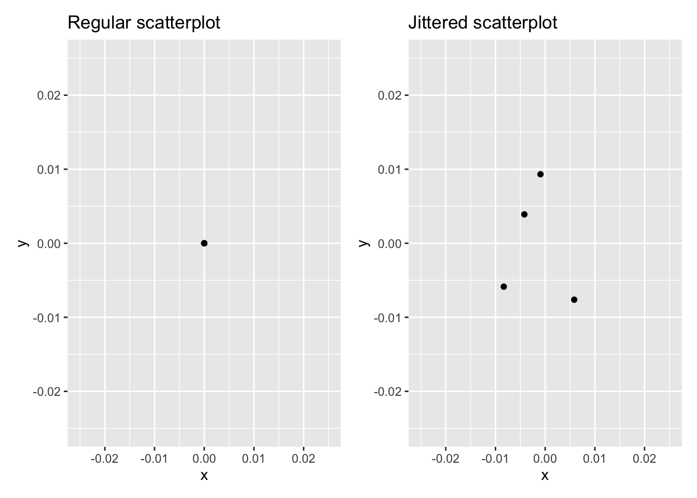

```{r setup, include=FALSE}
knitr::opts_chunk$set(echo = FALSE)
```


# Outline for the week

## By the end of the week:  


- Control Structures in R
- R Markdown
- Data Visualization 


# Control Structures in R

## Control Structures in R

`R` executes statements/commands sequentially. If you want to control the flow of statement execution, you need to use **control structures**. 
     
- The basic component of most control structures is the **conditional statement**. 

- A conditional statement is an `R` statement that is evaluated as either TRUE or FALSE. They use relational operators such as
     
     - `==` for testing equality of R objects,
    - `!=` for testing if two `R` objects are not equal, <,> ,<= and >=. 
    
As an example, look at the following R commands:


## Conditional Statement

\small
```{r echo=TRUE, warning=FALSE, message=FALSE,out.height = '50%',out.width = '80%', fig.align='center'}
x<-c(1,2,3)  #creates a vector named x
y<-c(1,2,4)
x==y
```
\normalsize


- The result of executing the last command is a vector containing the logical values TRUE, TRUE and FALSE since the only elements of the vectors $x$ and $y$ that are not equal are the 3rd elements.

Similarly, 
\small
```{r echo=TRUE, warning=FALSE, message=FALSE,out.height = '50%',out.width = '80%', fig.align='center'}
x!=y
```
\normalsize


## Conditional Statement and Logical Operators

- Conditional statements can be combined using logical operators &, | and !. 

    - The operator & means AND. 
    - The operator | means OR 
    - and the operator ! means NOT.

As an example of the use of &, the following will yield TRUE since both conditions are TRUE.

\small
```{r echo=TRUE, warning=FALSE, message=FALSE,out.height = '50%',out.width = '80%', fig.align='center'}
(x[1]==y[1]) & (x[2]==y[2])
```
\normalsize

On the other hand,
\small
```{r echo=TRUE, warning=FALSE, message=FALSE,out.height = '50%',out.width = '80%', fig.align='center'}
(x[1]==y[1]) & (x[3]==y[3])
```
\normalsize

## Conditional Statement and Logical Operators

However, the following will yield TRUE since at least one condition is TRUE. That is, the | operator will yield TRUE if at least one of the conditions is TRUE.

\small
```{r echo=TRUE, warning=FALSE, message=FALSE,out.height = '50%',out.width = '80%', fig.align='center'}
(x[1]==y[1]) | (x[3]==y[3])
```
\normalsize

To negate the truth value of the above statement, use !:

\small
```{r echo=TRUE, warning=FALSE, message=FALSE,out.height = '50%',out.width = '80%', fig.align='center'}
!((x[1]==y[1]) | (x[3]==y[3]))
```
\normalsize

Note the use of parentheses. 


## Conditional Statement and Logical Operators

To see the effect of parentheses, let’s remove the parentheses in the previous statement. 
\small
```{r echo=TRUE, warning=FALSE, message=FALSE,out.height = '50%',out.width = '80%', fig.align='center'}
!(x[3]==y[3]) | (x[1]==y[1])
```
\normalsize

A control structure that uses conditional statement(s) is the **if statement** and its variant **if else** and **if else if**.

- The if statement will perform an R command or a series of R commands only if the conditional statement is TRUE.

Lets see an example.


## If Statement

The following will display the value of the sum of the first two elements of the vector $x$ since the conditional statement is TRUE.

\small
```{r echo=TRUE, warning=FALSE, message=FALSE,out.height = '50%',out.width = '80%', fig.align='center'}
if (x[1]==y[1])
{sumx<-x[1]+x[2]
  sumx}
```
\normalsize

Similarly, the following code will not display anything since the conditional statement is FALSE and hence R will not execute the R statements within the square brackets.

\small
```{r echo=TRUE, warning=FALSE, message=FALSE,out.height = '50%',out.width = '80%', fig.align='center'}
if (x[1]!=y[1])
{sumy<-y[1]+y[2]
sumy}
```
\normalsize


## If Statement

Note that the syntax of an if statement is as follows

- if (conditional statement) {R statements} 

    - brackets are optional if there is only one R statement

- If you want R to perform either a series of R statements 

     - (say A) when the conditional statement is TRUE or 
     - another series of R statements (say B) when the conditional statement is FALSE
     - use the **if else** structure which is as follows:

- if (condition) {R statements A }else{ R statements B} }


## If Else Statement

As an example, the following will display the sum of the elements of $x$ since the conditional statement is TRUE:

\small
```{r echo=TRUE, warning=FALSE, message=FALSE,out.height = '50%',out.width = '80%', fig.align='center'}
if (x[1]==y[1])
{sumx<-sum(x)
sumx
}else{
  sumy<-sum(y)
  sumy}
```
\normalsize


## If Else Statement

On the other hand, the following will display the sum of the elements of $y$ since the conditional statement is FALSE:

\small
```{r echo=TRUE, warning=FALSE, message=FALSE,out.height = '50%',out.width = '80%', fig.align='center'}
if (x[1]!=y[1])
{sumx<-sum(x)
sumx
}else{
  sumy<-sum(y)
  sumy}
```
\normalsize


## If Else If Statement

The other variant of the if statement is the **if else if** structure which has the following syntax:

- if (condition 1) {R statements A }else if (condition 2) {R statement B }else if (condition 3) {R statement C }else{ R statement D}

- You can have more than 3 conditions to test so the structure could be longer.


## If Else If Statement


As an example, the following code will display the sum of the elements of $y$ since the 1st condition is FALSE and 2nd condition is TRUE. It will not evaluate the 3rd condition.


\small
```{r echo=TRUE, warning=FALSE, message=FALSE,out.height = '50%',out.width = '80%', fig.align='center'}
if (x[1]!=y[1])
  {sumx<-sum(x)
   sumx
  }else if (x[2]==y[2])
   {sumy<-sum(y)
   sumy
   }else if (x[3]!=y[3])
   {prodx<-x[1]*x[2]*x[3]
   prodx
   }else{
   prody<-y[1]*y[2]*y[3]
   prody}
```
\normalsize


## If Else If Statement

On the other hand, the following will display the product of the elements of y (the content of the object prody) since the 3 conditions are FALSE:


\small
```{r echo=TRUE, warning=FALSE, message=FALSE,out.height = '50%',out.width = '80%', fig.align='center'}
if (x[1]!=y[1])
  {sumx<-sum(x)
   sumx
  }else if (x[2]!=y[2])
   {sumy<-sum(y)
   sumy
   }else if (x[3]==y[3])
   {prodx<-x[1]*x[2]*x[3]
   prodx
   }else{
   prody<-y[1]*y[2]*y[3]
   prody}
```
\normalsize


## For Loop Statement

The for loop is one of the most useful control structures in R. Its syntax is as follows

- for (index variable in sequence) {R statements}

The index variable is usually a dummy integer variable (can have any name) but $i, j, k,$ etc are often used. For example, the following code will display the text “HELLO” ten times.


\tiny
```{r echo=TRUE, warning=FALSE, message=FALSE,out.height = '50%',out.width = '80%', fig.align='center'}
for (i in 1:10)
{print("HELLO")}
```
\normalsize


## For Loop Statement

Similarly, the following code will do the same thing:

\tiny
```{r echo=TRUE, warning=FALSE, message=FALSE,out.height = '50%',out.width = '80%', fig.align='center'}
for (j in 2:11)
{print("HELLO")}
```
\normalsize

The for loop is useful when you want to repeat a command and you know exactly how many times you want the command repeated.


## For Loop Statement

- The following code will display the contents of the vector $z$ in reverse order. 

    - Note that the first statement is needed so R will recognize that you are creating a numeric object within the loop. 
    - Without the revers.z<-numeric() command, R will display an error message saying object reverse.z not found.

\small
```{r echo=TRUE, warning=FALSE, message=FALSE,out.height = '50%',out.width = '80%', fig.align='center'}
reverse.z<-numeric()
z<-1:10
for (k in 1:10)
{reverse.z[k]<-z[10-k+1]
}
reverse.z
```
\normalsize


# R Markdown

## R Markdown


**R Markdown** provides an easy way to produce rich, fully-documented, reproducible analyses. 

- It allows users to share a single file containing 

    - all of the comments, 
    - R code, and 
    - metadata needed to reproduce the analysis from beginning to end. 
    
- R Markdown allows you to 

    - combine chunks of R code with Markdown text and produce a nicely formatted HTML, PDF, or Word file, 
    - without having to know any HTML or LaTeX code or fuss with getting the formatting just right in a Microsoft Word DOCX file.

I think you’ll be pleasantly surprised at how easy it is to write an R Markdown document once you get the hang of it.


## Create New R Markdown File 


To open a new file, click on the little green plus on the upper left hand and select R Markdown; see Figure below. 


\small
```{r echo=TRUE, warning=FALSE, message=FALSE,out.height = '50%',out.width = '50%', fig.align='center'}
knitr::include_graphics("how_to_open_rmd.png")
```
\normalsize


## Create New R Markdown File 

Let's make some changes to the R Markdown file you just opened

- First, change the title of the lab at the top to "Getting to Know RStudio."
- Second, add an author line, and insert your name. You need quotation marks!
- Third, delete everything in the document after line 6.
- Forth, let's save this as **first_rmarkdown.Rmd**. 
- Edit the file to recreate the last three pages of this lecture slides. Note: Use ## for headers. 

After editing the file you **Knit** to your desired output format (HTML, PDF, or Word file).  


## The Components of an R Markdown File: YAML 

The top part of the file is called the YAML header. 

- YAML is a recursive acronym that stands for “YAML Ain’t Markup Language”

- It is defined on its official website at http://yaml.org as: a human friendly data serialization standard for all programming languages.

- Essentially, the YAML header stores the metadata needed for the document

- You can see an example of a YAML header from our **first_rmarkdown.Rmd** file

```{r warning=FALSE, message=FALSE,out.height = '20%',out.width = '80%', fig.align='center'}
knitr::include_graphics("yaml.png")
```


## The Components of an R Markdown File: Headers


You can create many different sized headers by simply adding one or more # in front of the text you’d like to denote the header.


\text{\# Top level header}

\text{\#\# Second level header}

\text{\#\#\# Third level header}

\text{\#\#\#\# Fourth level header}


- Now let us change the last header in our **first_rmarkdown.Rmd** file to ###


## The Components of an R Markdown File: Empasis 

- We can add italics by surrounding the word by 

    - a single underscore or 
    - a single asterisk.
    
- As we have seen from our **first_rmarkdown.Rmd** file we can can bold a word by surrounding the word by 
  
    - two underscores or
    - two asterisks.
    

- Now let us italicize one word in our **first_rmarkdown.Rmd**. 


## The Components of an R Markdown File: Links


- To add a link to a URL, 

    - you simply enclose the text you’d like displayed in the resulting HTML file inside [ ] and 
    - then the link itself inside ( ) right next to each other with no space in between.


- Now let us do the following in our **first_rmarkdown.Rmd** file. 
    
    - Add another second level header: Links 
    - Type: `This is the link to R Studio download page. Here is the`
    - Type: `Link` and put it inside [ ]
    - Put: https://www.rstudio.com/products/rstudio/download/#download inside ( ) right next to `[Link]` with no space in between


## The Components of an R Markdown File: Lists

- As we saw in our **first_rmarkdown.Rmd** file, you create an unordered list by using `-` in front of the lists. 

- But we can also create ordered list by using numbers, letters or roman numerals. 

- Now let us do the following in our **first_rmarkdown.Rmd** file. 

  - Under the `For Loop Statement` header, let us change the sub-list to letters (i, ii).
  - Under the `R Markdown` header, let us change main lists to numbers (1, 2)


## Equations 

- If you’d like nice mathematical formulas in your document, you can add them between **two dollar signs**. 

- Now let us do the following in our **first_rmarkdown.Rmd** file. 
    
    - Add another second level header: Equations 
    - Type: \$y = mx + b\$


## Inline R code

- We’ve seen that we can add R code and have that run in an R chunk of code enclosed by three backticks. 

- However, what if we wanted to include the results of a simple calculation directly in the text of our document? R Markdown can do that as well:

- Now let us do the following in our **first_rmarkdown.Rmd** file.

   - Under the Equations header
   - Type: Multiply 7 by 14 gives us the result r 7*14 (enclosed by one backtick). 


## R Markdown Chunk Options

You can set many options on a chunk by chunk basis. The most common R chunk options are `echo`, `eval`, and `include`. By default, all three of these options are set to TRUE,


- `echo` dictates whether the code that produces the result should be printed before the corresponding R output.
- `eval` specifies whether the code should be evaluated or just displayed without its output.

- `include` specifies whether the code AND its output should be included in the resulting knitted document. If it is set to FALSE the code is run, but neither the code or its output are included in the resulting document.


- Now let us do the following in our **first_rmarkdown.Rmd** file. 

    - Create New R Markdown File header, in the R chunk, set `echo`=FALSE,
    
    
    
## Spell Check 

- Near the top of your R Markdown editor window sits one of the more useful tools for writing documents: 

    - the spell-check button. 
    - It is the green check-mark with “ABC” above it:

- Before you submit a document or share it with someone else, you should spell check your document. 

- Finally let us spell check our **first_rmarkdown.Rmd** file


# Data Visualization

## Data Visualization

We begin the development of your data science toolbox with **data visualization**


- By visualizing data, we gain valuable insights we couldn’t initially obtain from just looking at the raw data values

- At their most basic, graphics/plots/charts (we use these terms interchangeably) provide a nice way to explore the patterns in data, such as 

    - the presence of outliers, 
    - distributions of individual variables, and 
    - relationships between groups of variables
    
- Graphics are designed to emphasize the findings and insights you want your audience to understand.


## Needed packages

Let’s load all the packages needed for this chapter. You need to install them if you haven't already. 

\small
```{r echo=TRUE, warning=FALSE, message=FALSE,out.height = '50%',out.width = '50%', fig.align='center'}
library(nycflights13)
library(ggplot2)
library(moderndive)
```
\normalsize


## The grammar of graphics

We start with a discussion of a theoretical framework for data visualization known as “**the grammar of graphics**.”

- This framework serves as the foundation for the `ggplot2` package which we’ll use extensively in this class. 

- Think of how we construct and form sentences in English by combining different elements, like nouns, verbs, articles, subjects, objects, etc. 

    - We can’t just combine these elements in any arbitrary order; 
    - we must do so following a set of rules known as a linguistic grammar. 

- Similarly to a linguistic grammar, “the grammar of graphics” defines a set of rules for constructing statistical graphics by combining different types of layers. 


## Components of the grammar

In short, the grammar tells us that

\begin{tcolorbox}
A statistical graphic is a mapping of data variables to aesthetic attributes of geometric objects.

\end{tcolorbox}

Specifically, we can break a graphic into the following three essential components:

1. `data`: the dataset containing the variables of interest.

2. `geom`: the geometric object in question. This refers to the type of object we can observe in a plot. For example: points, lines, and bars.

3. `aes`: aesthetic attributes of the geometric object. For example, x/y position, color, shape, and size. Aesthetic attributes are mapped to variables in the dataset.


## Other components


There are other components of the grammar of graphics we can control as well. In this class, we’ll keep things simple and only work with these two additional components:

- `facet`ing breaks up a plot into several plots split by the values of another variable

- `position` adjustments for barplots.


## Five named graphs - the 5NG

We will only focus on five different types of graphics, each with a commonly given name. 
- We term these “five named graphs” or in abbreviated form, the 5NG:

1. scatterplots
2. linegraphs
3. histograms
4. boxplots
5. barplots


- We’ll also present some variations of these plots
- Note that: 

    - certain plots are only appropriate for categorical variables, 
    - while others are only appropriate for numerical variables.
    

## 5NG#1: Scatterplots

The simplest of the 5NG are **scatterplots**, also called bivariate plots. They allow you to visualize the relationship between two numerical variables. 

- Let’s view them through the lens of the grammar of graphics we presented earlier. 

- Specifically, we will visualize the relationship between the following two numerical variables in the `alaska_flights` data frame included in the `moderndive` package:

1. `dep_delay`: departure delay on the horizontal “x” axis and

2. `arr_delay`: arrival delay on the vertical “y” axis


## Scatterplots via `geom_point`

\tiny
```{r echo=TRUE, warning=FALSE, message=FALSE,out.height = '50%',out.width = '70%', fig.align='center'}
ggplot(data = alaska_flights, mapping = aes(x = dep_delay, y = arr_delay)) + 
  geom_point()
```
\normalsize

We observe that a **positive** relationship exists between `dep_delay` and `arr_delay`: as departure delays increase, arrival delays tend to also increase. 


## Scatterplots via `geom_point`

- Within the `ggplot()` function, we specify two of the components of the grammar of graphics as arguments (i.e., inputs):

1. The `data` as the `alaska_flights` data frame via `data = alaska_flights`.

2. The `aes`thetic `mapping` by setting `mapping = aes(x = dep_delay, y = arr_delay)`. 


- We then add a layer to the `ggplot()` function call using the `+` sign. 

   - The added layer in question specifies the third component of the grammar: the `geom`etric object. 
   - In this case, the geometric object is set to be points by specifying `geom_point()`.
   

## Scatterplots via `geom_point`

\tiny
```{r warning=FALSE, message=FALSE,out.height = '40%',out.width = '80%', fig.align='center'}
knitr::include_graphics("Week2_1.png")
```
\normalsize

Note that the `+` sign comes at the end of lines, and not at the beginning. You’ll get an error in R if you put it at the beginning of a line. 


## Overplotting

From the scatterplot from the `alaska_flights`, the large mass of points near $(0, 0)$, can cause some confusion since it is hard to tell the true number of points that are plotted. 

- This is the result of a phenomenon called **overplotting**. 

   - This corresponds to points being plotted on top of each other over and over again. 
   - When this occurs, it is difficult to know the number of points being plotted. 
   
   
- There are two methods to address the issue of overplotting. Either by

    - Adjusting the transparency of the points or
    - Adding a little random “jitter”, or random “nudges”, to each of the points.


## Method 1: Changing the transparency

- Change the transparency/opacity of the points by setting the `alpha` argument in `geom_point()`. 

- We can change the `alpha` argument to be any value between `0` and `1`, 

    - where `0` sets the points to be 100% transparent and 
    - `1` sets the points to be 100% opaque. 

- By default, `alpha` is set to 1. In other words, if we don’t explicitly set an alpha value, R will use `alpha = 1`.


Note how the following code is identical to the earlier code that created the scatterplot with overplotting, but with `alpha = 0.2` added to the geom_point() function. 


## Method 1: Changing the transparency

\tiny
```{r echo=TRUE, warning=FALSE, message=FALSE,out.height = '50%',out.width = '70%', fig.align='center'}
ggplot(data = alaska_flights, mapping = aes(x = dep_delay, y = arr_delay)) + 
  geom_point(alpha = 0.2)
```
\normalsize


Now areas with a high-degree of overplotting are darker, whereas areas with a lower degree are less dark.


## Method 2: Jittering the points

The second way of addressing overplotting is by **jittering** all the points. 

- This means giving each point a small “nudge” in a random direction. 

    - You can think of “jittering” as shaking the points around a bit on the plot.
    
-  Example: Say we have a data frame with 4 identical rows of x and y values: (0,0), (0,0), (0,0), and (0,0)

   - scatterplot of these 4 points (on the left)
   - and its jittered counterpart (on the right)
   
\tiny
```{r warning=FALSE, message=FALSE,out.height = '30%',out.width = '70%', fig.align='center'}

```
\normalsize


## Method 2: Jittering the points


\tiny
```{r echo=TRUE, warning=FALSE, message=FALSE,out.height = '50%',out.width = '70%', fig.align='center'}
ggplot(data = alaska_flights, mapping = aes(x = dep_delay, y = arr_delay)) + 
  geom_jitter(width = 30, height = 30)
```
\normalsize

Which method was better? 

- Keep in mind, that jittering is strictly a visualization tool; the original values saved in the data frame remain unchanged.


## 5NG#2: Linegraphs

The next of the five named graphs are **linegraphs**.

- Linegraphs show the relationship between two numerical variables when the variable on the x-axis, also called the explanatory variable, is of a **sequential nature**. In other words, there is an inherent ordering to the variable.

- The most common examples of linegraphs have some notion of time on the x-axis: hours, days, weeks, years, etc.

    - Since time is sequential, we connect consecutive observations of the variable on the y-axis with a **line**. 
    - Linegraphs that have some notion of time on the x-axis are also called **time series plots**. 
    
Lets explore the `early_january_weather` data frame included in the `moderndive` package, which contains hourly weather observations. 

## Linegraphs via `geom_line`

\tiny
```{r echo=TRUE, warning=FALSE, message=FALSE,out.height = '50%',out.width = '70%', fig.align='center'}
ggplot(data = early_january_weather, 
       mapping = aes(x = time_hour, y = temp)) +
  geom_line()
```
\normalsize

We observe an upward trend and seasonality.


## 5NG#3: Histograms

Let’s consider the `temp` variable in the `weather` data frame from the `nycflights13` package. 


- Here,  we only care about how the values of `temp` distribute. In other words:

1. What are the smallest and largest values?
2. What is the “center” or “most typical” value?
3. How do the values spread out?
4. What are frequent and infrequent values?
    

## 5NG#3: Histograms


One way to do that is by producing a **histogram**. 

- A histogram is a plot that visualizes the distribution of a numerical value as follows:


1. We first cut up the x-axis into a series of **bins**, where each bin represents a range of values.

2. For each bin, we count the number of observations that fall in the range corresponding to that bin.

3. Then for each bin, we draw a bar whose height marks the corresponding count.


## Histograms via `geom_histogram`


\tiny
```{r echo=TRUE, warning=FALSE, message=FALSE,out.height = '50%',out.width = '70%', fig.align='center'}
ggplot(data = weather, mapping = aes(x = temp)) +
  geom_histogram()
```
\normalsize


- Note that: 

    - The y-aesthetic of a histogram, the count of the observations in each bin, gets computed for you automatically.
    - The histogram was constructed using `bins = 30` (Default value).


## Histograms via `geom_histogram`

Now let’s unpack the resulting histogram

- Observe that values less than $25^{\circ}F$ as well as values above $80^{\circ}F$ are rather rare.

- However, because of the large number of bins, it’s hard to get a sense for which range of temperatures is spanned by each bin

    - let’s add white vertical borders demarcating the bins by adding a `color = "white"` argument to `geom_histogram()`.
    
    
## Histograms via `geom_histogram`


\tiny
```{r echo=TRUE, warning=FALSE, message=FALSE,out.height = '50%',out.width = '70%', fig.align='center'}
ggplot(data = weather, mapping = aes(x = temp)) +
  geom_histogram(color = "white")
```
\normalsize

- We now have an easier time associating ranges of temperatures to each of the bins.

- We can also vary the color of the bars by setting the `fill` argument.


## Histograms via `geom_histogram`


\tiny
```{r echo=TRUE, warning=FALSE, message=FALSE,out.height = '50%',out.width = '70%', fig.align='center'}
ggplot(data = weather, mapping = aes(x = temp)) +
  geom_histogram(color = "white", fill = "steelblue")
```
\normalsize


- Run `colors()` to see all 657 possible choice of colors in R!
- Note that in the 50-75$^{\circ}$F range there appear to be roughly 8 bins. Thus each bin has width 25 divided by 8 or 3.125$^{\circ}$F.

## Adjusting the bins

**Method 1**: By adjusting the number of bins via the bins argument to `geom_histogram()`.

\tiny
```{r echo=TRUE, warning=FALSE, message=FALSE,out.height = '50%',out.width = '70%', fig.align='center'}
ggplot(data = weather, mapping = aes(x = temp)) +
  geom_histogram(bins = 40, color = "white")
```
\normalsize


## Adjusting the bins

**Method 2**: By adjusting the width of the bins via the binwidth argument to `geom_histogram()`

\tiny
```{r echo=TRUE, warning=FALSE, message=FALSE,out.height = '50%',out.width = '70%', fig.align='center'}
ggplot(data = weather, mapping = aes(x = temp)) +
  geom_histogram(binwidth = 10, color = "white")
```
\normalsize


## Facets

Before continuing with the next of the 5NG, let’s briefly introduce a new concept called **faceting**. 

- Faceting is used when we’d like to split a particular visualization by the values of another variable. 

- This will create multiple copies of the same type of plot with matching x and y axes, but whose content will differ.

Example: lets Looking at how the histogram of hourly **temperature** recordings at the three NYC airports we saw earlier differed in each **month**.

## Facets

\tiny
```{r echo=TRUE, warning=FALSE, message=FALSE,out.height = '70%',out.width = '70%', fig.align='center'}
ggplot(data = weather, mapping = aes(x = temp)) +
  geom_histogram(binwidth = 5, color = "white") +
  facet_wrap(~ month)
```
\normalsize


## Facets

We can also specify the number of rows and columns in the grid by using the `nrow` and `ncol` arguments inside of `facet_wrap()`.


\tiny
```{r echo=TRUE, warning=FALSE, message=FALSE,out.height = '60%',out.width = '70%', fig.align='center'}
ggplot(data = weather, mapping = aes(x = temp)) +
  geom_histogram(binwidth = 5, color = "white") +
  facet_wrap(~ month, nrow = 4)
```
\normalsize


## 5NG#4: Boxplots


Another type of visualization that can be used to compare the distribution of a numerical variable split by the values of another variable is a **side-by-side boxplot**.

- A **boxplot** is constructed from the information provided in the **five-number summary** of a numerical variable. 

- Let's see an example of a boxplot using hourly temperature recordings for the month of November.
  - Minimum: 21$^{\circ}$F
  - First quartile (25th percentile):36$^{\circ}$F
  - Median (second quartile, 50th percentile): 45$^{\circ}$F
  - Third quartile (75th percentile): 52$^{\circ}$F
  - Maximum: 71$^{\circ}$F
  


## 5NG#4: Boxplots


- From the figure below: 

    - In the leftmost plot let’s mark these 5 values with dashed horizontal lines on top of the 2141 points(observations). 
    - In the middle plot, let’s add the boxplot. 
    - In the rightmost plot, let’s remove the points and the dashed horizontal lines for clarity’s sake.

   
\tiny
```{r warning=FALSE, message=FALSE,out.height = '50%',out.width = '70%', fig.align='center'}
knitr::include_graphics("Week2_3.png")
```
\normalsize


## 5NG#4: Boxplots

From the Boxplot:

-  25% of observations were below 36$^{\circ}$F.

- 25% of observations were between 36$^{\circ}$F and 45$^{\circ}$F and 50% of observations were below 45$^{\circ}$F.

- 25% of observations were between 45$^{\circ}$F and 52$^{\circ}$F and 75% of observations were below 52$^{\circ}$F.

- 25% of observations were above 52$^{\circ}$F.

- The middle 50% of points lie within the interquartile range (IQR) between the first and third quartile. 

    - IQR for this example is 52 - 36 = 16$^{\circ}$F.
    
    
- The whiskers stick out from either end of the box all the way to the **minimum**(21$^{\circ}$F) and **maximum** observed temperatures (71$^{\circ}$F).

    - However, extend no more than $1.5 \times$ IQR from either end of the box. 
    - Any observed values outside this range get marked with points called **outliers**. 


## Boxplots via `geom_boxplot`: Invalid specification

\tiny
```{r echo=TRUE, warning=FALSE, message=FALSE,out.height = '50%',out.width = '40%', fig.align='center'}
ggplot(data = weather, mapping = aes(x = month, y = temp)) +
  geom_boxplot()
```
\normalsize


- Observe that this plot does not provide information about temperature separated by month.

   - Boxplots, require a categorical variable to be mapped to the x-position aesthetic. But the `month` variable is numerical variable.  


## Boxplots via `geom_boxplot` 
   
\tiny
```{r echo=TRUE, warning=FALSE, message=FALSE,out.height = '50%',out.width = '90%', fig.align='center'}
ggplot(data = weather, mapping = aes(x = factor(month), y = temp)) +
  geom_boxplot()
```
\normalsize


Thus the 12 separate boxplots are shown “side-by-side.”


## 5NG#5: Barplots

- Both histograms and boxplots are tools to visualize the distribution of numerical variables.

- Another commonly desired task is to visualize the distribution of a categorical variable.

    - we are simply counting different categories within a categorical variable, also known as the levels of the categorical variable


- Often the best way to visualize these different counts, also known as **frequencies**, is with **barplots** (also called barcharts).


## 5NG#5: Barplots

- One complication, however, is how your data is represented. 

    - Is the categorical variable of interest “pre-counted” or not? 
    
- For example, run the following code that manually creates two data frames representing a collection of fruit: 3 apples and 2 oranges.

\tiny
```{r echo=TRUE, warning=FALSE, message=FALSE,out.height = '50%',out.width = '90%', fig.align='center'}
library(dplyr)
fruits <- tibble(
  fruit = c("apple", "apple", "orange", "apple", "orange")
)
fruits_counted <- tibble(
  fruit = c("apple", "orange"),
  number = c(3, 2)
)
```
\normalsize


## 5NG#5: Barplots

\tiny
```{r echo=TRUE, warning=FALSE, message=FALSE,out.height = '50%',out.width = '90%', fig.align='center'}
fruits 
fruits_counted 
```
\normalsize

Depending on how your categorical data is represented, you’ll need to add a different `geom`etric layer type to your ggplot() to create a barplot.


## Barplots via `geom_bar`

\tiny
```{r echo=TRUE, warning=FALSE, message=FALSE,out.height = '50%',out.width = '90%', fig.align='center'}
ggplot(data = fruits, mapping = aes(x = fruit)) +
  geom_bar()
```
\normalsize

When the categorical variable whose distribution you want to visualize **is not pre-counted** in your data frame, we use **geom_bar()**.


## Barplots via `geom_col`

\tiny
```{r echo=TRUE, warning=FALSE, message=FALSE,out.height = '50%',out.width = '90%', fig.align='center'}
ggplot(data = fruits_counted, mapping = aes(x = fruit, y = number)) +
  geom_col()
```
\normalsize


When the categorical variable whose distribution you want to visualize **is pre-counted** in your data frame, we use **geom_col()**.


## Barplots for `flights` data

Let’s now go back to the `flights` data frame in the `nycflights13` package and visualize the distribution of the categorical variable `carrier`.

- Because the `flights` have **not been pre-counted** by `carrier`, we use `geom_bar()`.


## Barplots for `flights` data

\tiny
```{r echo=TRUE, warning=FALSE, message=FALSE,out.height = '50%',out.width = '90%', fig.align='center'}
ggplot(data = flights, mapping = aes(x = carrier)) +
  geom_bar()
```
\normalsize


## Pie charts


- One of the most common plots used to visualize the distribution of categorical data is the **pie chart**. 

- A pie chart presents each category as a slice of a circle so that each slice has a size that is proportional to the whole in each category.

- While they may seem harmless enough, pie charts actually present a problem in that humans are unable to judge angles well. 

    - In other words, it is difficult for us to determine the relative size of one piece of the pie compared to another.

- This makes barplots preferred in certain situations. 


## Cases Were Barplots are Preferred


```{r  echo=FALSE, out.height = '70%',out.width = '80%', fig.pos="h", fig.align='center'}
knitr::include_graphics("week2_4.png")
```


It is hard to see the pattern in the pie chart but the bar chart makes it
easier to compare frequencies in groups.


## Two categorical variables

- Barplots are a very common way to visualize the frequency of different categories, or levels, of a single categorical variable. 


- Another use of barplots is to visualize the joint distribution of **two categorical variables** at the same time. 


Let’s examine the joint distribution of outgoing domestic flights from NYC by `carrier` as well as `origin`.


## Two categorical variables: Stacked barplot

\tiny
```{r echo=TRUE, warning=FALSE, message=FALSE,out.height = '50%',out.width = '90%', fig.align='center'}
ggplot(data = flights, mapping = aes(x = carrier, fill = origin)) +
  geom_bar()
```
\normalsize

- This is an example of a **stacked** barplot. 
- The `fill` aesthetic corresponds to the color used to fill the bars

## Two categorical variables: Stacked barplot

\tiny
```{r echo=TRUE, warning=FALSE, message=FALSE,out.height = '50%',out.width = '90%', fig.align='center'}
ggplot(data = flights, mapping = aes(x = carrier, color = origin)) +
  geom_bar()
```
\normalsize

- The `color` aesthetic corresponds to the color of the outline of the bars.


## Two categorical variables: side-by-side barplots

While simple to make, in certain aspects it is not ideal. 

- For example, it is difficult to compare the heights of the different colors between the bars, corresponding to comparing the number of flights from each origin airport between the carriers.

- An alternative to stacked barplots are **side-by-side barplots**, also known as **dodged barplots**. 


- The code to create a side-by-side barplot is identical to the code to create a stacked barplot, but with a `position = "dodge"` argument added to `geom_bar()`.
    
    - we are overriding the default barplot type, which is a stacked barplot.
    
    
## Two categorical variables: side-by-side barplots


\tiny
```{r echo=TRUE, warning=FALSE, message=FALSE,out.height = '50%',out.width = '90%', fig.align='center'}
ggplot(data = flights, mapping = aes(x = carrier, fill = origin)) +
  geom_bar(position = "dodge")
```
\normalsize


- Note the width of the bars for AS, F9, FL, HA and YV is different than the others
- To be the same size in terms of width as the other bars we use a more robust `position_dodge()` function.


## Two categorical variables: side-by-side barplots


\tiny
```{r echo=TRUE, warning=FALSE, message=FALSE,out.height = '50%',out.width = '90%', fig.align='center'}
ggplot(data = flights, mapping = aes(x = carrier, fill = origin)) +
  geom_bar(position = position_dodge(preserve = "single"))
```
\normalsize


## Two categorical variables: side-by-side barplots

Change order: 

\tiny
```{r echo=TRUE, warning=FALSE, message=FALSE,out.height = '50%',out.width = '90%', fig.align='center'}

flights1<-flights
flights1$origin1 <- factor(flights1$origin, ordered = TRUE,
levels = c("JFK", "EWR","LGA"))

ggplot(data = flights1, mapping = aes(x = carrier, fill = origin1)) +
  geom_bar(position = position_dodge(preserve = "single"))

```
\normalsize


## Two categorical variables:  faceted barplot

\tiny
```{r echo=TRUE, warning=FALSE, message=FALSE,out.height = '60%',out.width = '70%', fig.align='center'}
ggplot(data = flights, mapping = aes(x = carrier)) +
  geom_bar() +
  facet_wrap(~ origin, ncol = 1)
```
\normalsize


## Summary table


```{r  echo=FALSE, out.height = '70%',out.width = '80%', fig.pos="h", fig.align='center', fig.cap="Summary of Five Named Graphs"}

```
