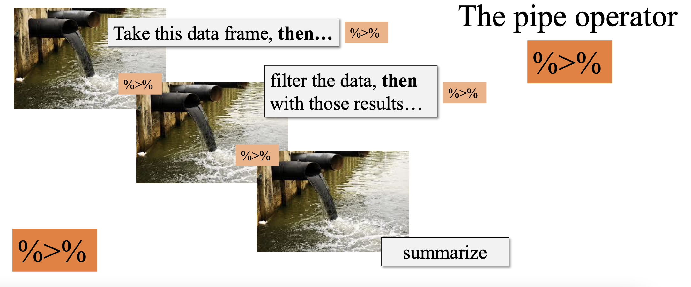
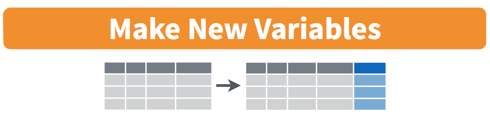
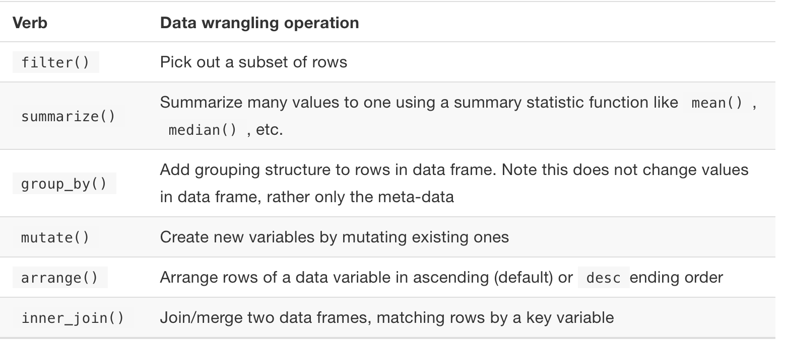
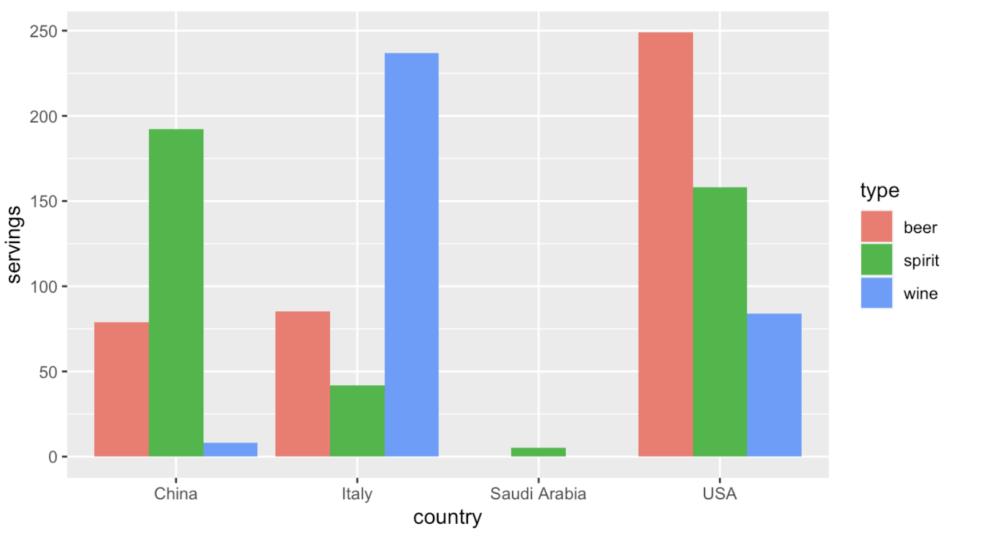
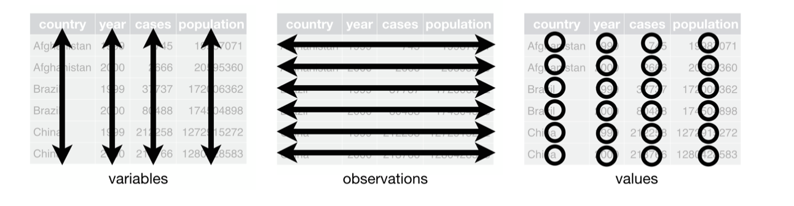
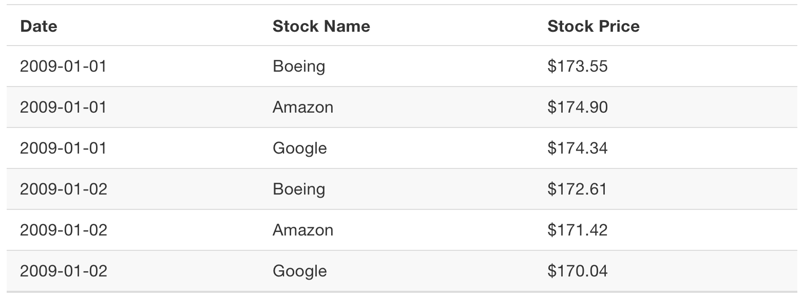

```{r setup, include=FALSE}
knitr::opts_chunk$set(echo = FALSE)
```


# Outline for the week

## By the end of the week:  

- Data Wrangling 
- "Tidy" data

# Data Wrangling 

## Data Wrangling 

In this chapter,  we’ll introduce a series of functions from the `dplyr` package for data wrangling 

- We will be able to take a data frame and **“wrangle” it (transform it)** to suit your needs. Such functions include:

1. `filter()` a data frame’s existing rows to only pick out a subset of them. 

2. `summarize()` one or more of its columns/variables with a summary statistic.

3. `group_by()` its rows. In other words, assign different rows to be part of the same group. 

   - We can then combine `group_by(`) with `summarize()` to report summary statistics for each group separately. 


## Data Wrangling 


4. `mutate()` its existing columns/variables to create new ones. For example, convert hourly temperature recordings from degrees Fahrenheit to degrees Celsius.

5. `arrange()` its rows. For example, sort the rows of weather in ascending or descending order of temp.

6. `join()` it with another data frame by matching along a “key” variable. In other words, merge these two data frames together.


The  further benefit to learning to use the `dplyr` package for data wrangling is its its similarity to the **SQL** (database querying language). 


## Needed packages 

Let’s load all the packages needed for this chapter. You need to install them if you haven't already. 

\small
```{r echo=TRUE, warning=FALSE, message=FALSE,out.height = '50%',out.width = '50%', fig.align='center'}
library(nycflights13)
library(ggplot2)
library(dplyr)
```
\normalsize

## The pipe operator: %>%

Before we start, let’s first introduce a nifty tool that gets loaded with the `dplyr` package: **the pipe operator %>%**. 


- The pipe operator allows us to combine multiple operations in R into a single sequential chain of actions.

- Let’s start with a hypothetical example: 

    - Say you would like to perform a hypothetical sequence of operations on a hypothetical data frame $x$ 
    - using hypothetical functions f(), g(), and h():

1. Take $x$ then
2. Use $x$ as an input to a function $f()$ then
3. Use the output of $f(x)$ as an input to a function $g()$ then
4. Use the output of $g(f(x))$ as an input to a function $h()$


## The pipe operator: %>%

One way to achieve this sequence of operations is by using nesting parentheses as follows:

\small
```{r echo=TRUE,eval=FALSE,warning=FALSE, message=FALSE,out.height = '50%',out.width = '50%', fig.align='center'}
h(g(f(x)))
```
\normalsize

You can obtain the same output as the hypothetical sequence of functions as follows:

\tiny
```{r echo=TRUE,eval=FALSE,warning=FALSE, message=FALSE,out.height = '50%',out.width = '50%', fig.align='center'}
x%>%              # take x
  f() %>%         # Use this output as the input to the next function f() then
  g() %>%         # Use this output as the input to the next function g() then
  h()             # Use this output as the input to the next function h()
```
\normalsize


This is much more human-readable because you can clearly read the sequence of operations line-by-line.


## The pipe operator: %>%

```{r warning=FALSE, message=FALSE,out.height = '60%',out.width = '80%', fig.align='center'}

```

## The pipe operator: %>%

For example:

\small
```{r echo=TRUE,warning=FALSE, message=FALSE,out.height = '50%',out.width = '50%', fig.align='center'}
alaska_flights <- flights %>% 
  filter(carrier == "AS")
```
\normalsize

Note that the pipe operator %>% has to come at the end of lines. 


## `filter` rows 


```{r warning=FALSE, message=FALSE,out.height = '40%',out.width = '70%', fig.align='center'}
knitr::include_graphics("week3_1.png")
```


The `filter()` function allows you to specify criteria about the values of a variable in your dataset and then filters out only the rows that match that criteria.


## `filter` rows 

- We begin by focusing only on flights from New York City to Portland, Oregon. 

    - The dest destination code (or airport code) for Portland, Oregon is "PDX". 
    - Run the following and look at the results in RStudio’s spreadsheet viewer to ensure that only flights heading to Portland are chosen here:


\small
```{r echo=TRUE,warning=FALSE, message=FALSE,out.height = '50%',out.width = '50%', fig.align='center'}
portland_flights <- flights %>% 
  filter(dest == "PDX")
#View(portland_flights)
```
\normalsize

We test for equality using the double equal sign `==` and not a single equal sign `=`. 


## `filter` rows 


- You can use other operators beyond just the `==` operator that tests for equality:

    - `>` corresponds to “greater than”
    - `<` corresponds to “less than”
    - `>=` corresponds to “greater than or equal to”
    - `<=` corresponds to “less than or equal to”
    - `!=` corresponds to “not equal to.” The ! is used in many programming languages to indicate “not.”


- Furthermore, you can combine multiple criteria using operators that make comparisons:

   - `|` corresponds to “or”
   - `&` corresponds to “and”


## `filter` rows 

- We filter flights for all rows that
    
    - departed from JFK and 
    - were heading to Burlington, Vermont ("BTV") or Seattle, Washington ("SEA") and
    - departed in the months of October, November, or December.
    
\tiny
```{r echo=TRUE,warning=FALSE, message=FALSE,out.height = '50%',out.width = '50%', fig.align='center'}
btv_sea_flights_fall <- flights %>% 
  filter(origin == "JFK" & (dest == "BTV" | dest == "SEA") & month >= 10)
#View(btv_sea_flights_fall)
```
\normalsize


We can often skip the use of & and just separate our conditions with a comma

\tiny
```{r echo=TRUE,warning=FALSE, message=FALSE,out.height = '50%',out.width = '50%', fig.align='center'}
btv_sea_flights_fall <- flights %>% 
  filter(origin == "JFK", (dest == "BTV" | dest == "SEA"), month >= 10)
#View(btv_sea_flights_fall)
```
\normalsize


## `filter` rows 


Lets filter rows corresponding to flights that didn’t go to Burlington, VT or Seattle, WA.

\tiny
```{r echo=TRUE,warning=FALSE, message=FALSE,out.height = '50%',out.width = '50%', fig.align='center'}
not_BTV_SEA <- flights %>% 
  filter(!(dest == "BTV" | dest == "SEA"))
#View(not_BTV_SEA)
```
\normalsize

Note note the careful use of parentheses. The code below will produce different results. 
\tiny
```{r echo=TRUE,eval=FALSE,warning=FALSE, message=FALSE,out.height = '50%',out.width = '50%', fig.align='center'}
flights %>% filter(!dest == "BTV" | dest == "SEA")
```
\normalsize


## `filter` rows 

Say we have a larger number of airports we want to filter for. We could continue to use the `|` (or) operator:

\tiny
```{r echo=TRUE,eval=FALSE,warning=FALSE, message=FALSE,out.height = '50%',out.width = '50%', fig.align='center'}
many_airports <- flights %>% 
  filter(dest == "SEA" | dest == "SFO" | dest == "PDX" | 
         dest == "BTV" | dest == "BDL")
```
\normalsize

A shorter approach will be to use `%in%` operator along with the `c()` function.

\tiny
```{r echo=TRUE,eval=FALSE,warning=FALSE, message=FALSE,out.height = '50%',out.width = '50%', fig.align='center'}
many_airports <- flights %>% 
  filter(dest %in% c("SEA", "SFO", "PDX", "BTV", "BDL"))
#View(many_airports)
```
\normalsize

The `%in%` operator is useful for looking for matches commonly in one vector/variable compared to another.


## `summarize` variables

The next common task when working with data frames is to compute **summary statistics**. Summary statistics are single numerical values that summarize a large number of values. 

- Commonly known examples of summary statistics include 

    - the mean (also called the average) , 
    - the median (the middle value),
    - the sum, 
    - the smallest value also called the minimum, 
    - the largest value also called the maximum, and
    - the standard deviation.

```{r warning=FALSE, message=FALSE,out.height = '20%',out.width = '60%', fig.align='center'}
knitr::include_graphics("week3_2.png")
```


## `summarize` variables

Let’s calculate two summary statistics (mean and standard deviation) of the `temp` temperature variable in the `weather` data frame from `nycflights13` package. 

\small
```{r echo=TRUE,warning=FALSE, message=FALSE,out.height = '50%',out.width = '50%', fig.align='center'}
summary_temp <- weather %>% 
  summarize(mean = mean(temp), std_dev = sd(temp))
summary_temp
```
\normalsize


`NA` values returned because there are missing values in the `temp` data. 


## `summarize` variables

- To work around this fact:

    - you can set the `na.rm` argument to TRUE, 
    - where `rm` is short for “remove”; this will ignore any NA missing values and only return the summary value for all non-missing values.


\small
```{r echo=TRUE,warning=FALSE, message=FALSE,out.height = '50%',out.width = '50%', fig.align='center'}
summary_temp <- weather %>% 
  summarize(mean = mean(temp, na.rm = TRUE), 
            std_dev = sd(temp, na.rm = TRUE))
summary_temp
```
\normalsize


## `summarize` variables

Other summary functions we can use inside the `summarize()`:

- `mean()`: the average
- `sd()`: the standard deviation, which is a measure of spread
- `min()` and `max()`: the minimum and maximum values, respectively
- `IQR()`: interquartile range
- `sum()`: the total amount when adding multiple numbers
- `n()`: a count of the number of rows in each group. This particular summary function will make more sense when `group_by()`. 


## `group_by` rows


- Say instead of a single mean temperature for the whole year, you would like 12 mean temperatures, one for each of the 12 months separately. 

    - We would like to compute the mean temperature split by month. 
    - We can do this by “grouping” temperature observations by the values of another variable, in this case by the 12 values of the variable month. 
    


```{r warning=FALSE, message=FALSE,out.height = '40%',out.width = '80%', fig.align='center'}
knitr::include_graphics("week3_3.png")
```


## `group_by` rows

\tiny
```{r echo=TRUE,warning=FALSE, message=FALSE,out.height = '50%',out.width = '50%', fig.align='center'}
summary_monthly_temp <- weather %>% 
  group_by(month) %>% 
  summarize(mean = mean(temp, na.rm = TRUE), 
            std_dev = sd(temp, na.rm = TRUE),
            count = n())
summary_monthly_temp
```
\normalsize


## Grouping by more than one variable

We can also group by more than one variable
 
 \tiny
```{r echo=TRUE,warning=FALSE, message=FALSE,out.height = '50%',out.width = '50%', fig.align='center'}
by_origin_monthly <- flights %>% 
  group_by(origin, month) %>% 
  summarize(count = n())
by_origin_monthly
```
\normalsize


Observe that there are 36 rows to `by_origin_monthly` because there are 12 months for 3 airports (`EWR`, `JFK`, and `LGA`).


 
## Grouping by more than one variable

Why do we `group_by(origin, month)` and not `group_by(origin)` and then `group_by(month)`? Let’s investigate:

 \tiny
```{r echo=TRUE,warning=FALSE, message=FALSE,out.height = '50%',out.width = '50%', fig.align='center'}
by_origin_monthly_incorrect <- flights %>% 
  group_by(origin) %>% 
  group_by(month) %>% 
  summarize(count = n())
by_origin_monthly_incorrect
```
\normalsize

The second `group_by(month)` overwrote `group_by(origin)`. 


## `mutate` existing variables

Another common transformation of data is to create/compute new variables based on existing ones. 

```{r warning=FALSE, message=FALSE,out.height = '40%',out.width = '80%', fig.align='center'}

```


For example, we can create a new variable by converting temperatures from $^\circ$F to $^\circ$C using the formula
$$\text{temp in C}=\frac{\text{temp in F}-32}{1.8}$$

## `mutate` existing variables

We can apply this formula to the `temp` variable using the `mutate()` function from the `dplyr` package.

\tiny
```{r echo=TRUE,warning=FALSE, message=FALSE,out.height = '50%',out.width = '50%', fig.align='center'}
weather <- weather %>% 
  mutate(temp_in_C = (temp - 32) / 1.8)
```
\normalsize


- In this code:

   - we `mutate()` the `weather` data frame by creating a new variable `temp_in_C = (temp - 32) / 1.8` and 
   - then overwrite the original weather data frame.


## `mutate` existing variables

Let’s now compute monthly average temperatures in both $^\circ$F and $^\circ$C. 


\tiny
```{r echo=TRUE,warning=FALSE, message=FALSE,out.height = '50%',out.width = '50%', fig.align='center'}
summary_monthly_temp <- weather %>% 
  group_by(month) %>% 
  summarize(mean_temp_in_F = mean(temp, na.rm = TRUE), 
            mean_temp_in_C = mean(temp_in_C, na.rm = TRUE))
summary_monthly_temp
```
\normalsize


## `mutate` existing variables


Let’s consider another example. 

- Passengers are often frustrated when their flight departs late, but aren’t as annoyed if, in the end, pilots can make up some time during the flight. 

- This is known in the airline industry as `gain`, and we will create this variable using the `mutate()` function:


\tiny
```{r echo=TRUE,warning=FALSE, message=FALSE,out.height = '50%',out.width = '50%', fig.align='center'}
flights <- flights %>% 
  mutate(gain = dep_delay - arr_delay)
flights  %>% select(dep_delay, arr_delay, gain)%>% head()
```
\normalsize


## `mutate` existing variables

Let’s look at some summary statistics of the `gain` variable

\tiny
```{r echo=TRUE,warning=FALSE, message=FALSE,out.height = '50%',out.width = '50%', fig.align='center'}
gain_summary <- flights %>% 
  summarize(
    min = min(gain, na.rm = TRUE),
    q1 = quantile(gain, 0.25, na.rm = TRUE),
    median = quantile(gain, 0.5, na.rm = TRUE),
    q3 = quantile(gain, 0.75, na.rm = TRUE),
    max = max(gain, na.rm = TRUE),
    mean = mean(gain, na.rm = TRUE),
    sd = sd(gain, na.rm = TRUE),
    missing = sum(is.na(gain))
  )
gain_summary
```
\normalsize


## `mutate` existing variables

Since `gain` is a numerical variable, we can visualize its distribution using a histogram.

\tiny
```{r echo=TRUE,warning=FALSE, message=FALSE,out.height = '50%',out.width = '70%', fig.align='center'}
ggplot(data = flights, mapping = aes(x = gain)) +
  geom_histogram(color = "white", bins = 20)
```
\normalsize


## `arrange` and sort rows

- One of the most commonly performed data wrangling tasks is to sort a data frame’s rows in the alphanumeric order of one of the variables. 

- The `dplyr` package’s `arrange()` function allows us to sort/reorder a data frame’s rows according to the values of the specified variable.


## `arrange` and sort rows


Suppose we are interested in determining the most frequent destination airports for all domestic flights departing from New York City in 2013. 


\tiny
```{r echo=TRUE,warning=FALSE, message=FALSE,out.height = '50%',out.width = '70%', fig.align='center'}
freq_dest <- flights %>% 
  group_by(dest) %>% 
  summarize(num_flights = n())
freq_dest
```
\normalsize


Observe that by default the rows of the resulting `freq_dest` data frame are sorted in alphabetical order of destination. 


## `arrange` and sort rows


Say instead we would like to see the same data, but sorted from the most to the least number of flights (`num_flights`) instead

\tiny
```{r echo=TRUE,warning=FALSE, message=FALSE,out.height = '50%',out.width = '70%', fig.align='center'}
freq_dest %>% 
  arrange(num_flights)
```
\normalsize

This is, however, the opposite of what we want. The rows are sorted with the least frequent destination airports displayed first.


## `arrange` and sort rows

To switch the ordering to be in “descending” order instead, we use the `desc()` function as so:

\tiny
```{r echo=TRUE,warning=FALSE, message=FALSE,out.height = '50%',out.width = '70%', fig.align='center'}
freq_dest %>% 
  arrange(desc(num_flights))
```
\normalsize


## `join` data frames

Another common data transformation task is “joining” or “merging” two different datasets. 

- For example, in the `flights` data frame, the variable carrier lists the carrier code for the different flights.
    
- While the corresponding airline names for "UA" and "AA" might be somewhat easy to guess (United and American Airlines), what airlines have codes "VX", "HA", and "B6"?

- This information is provided in a separate data frame `airlines`. 
    


## `join` data frames


Lets see the data relationships from the `nycflights13` package. 


```{r warning=FALSE, message=FALSE,out.height = '50%',out.width = '70%', fig.align='center'}
knitr::include_graphics("week3_5.png")
```


## Matching “key” variable names

In both the `flights` and `airlines` data frames, the key variable we want to join/merge/match the rows by has the same name: **carrier**. 


- Let’s use the `inner_join()` function to join the two data frames, where the rows will be matched by the variable carrier, and then compare the resulting data frames:


\tiny
```{r echo=TRUE,warning=FALSE, message=FALSE,out.height = '50%',out.width = '70%', fig.align='center'}
flights_joined <- flights %>% 
  inner_join(airlines, by = "carrier")
#View(flights)
#View(flights_joined)
```
\normalsize

Observe that the `flights` and `flights_joined` data frames are identical except that `flights_joined` has an additional variable name. 


## Matching “key” variable names

A visual representation of the `inner_join()` is shown below


```{r warning=FALSE, message=FALSE,out.height = '40%',out.width = '60%', fig.align='center'}
knitr::include_graphics("week3_6.png")
```

- There are other types of joins available, 

   - such as left_join(), right_join(), outer_join(), and anti_join()), 
   - but the inner_join() will solve nearly all of the problems you’ll encounter in this class. 
   


## Different “key” variable names


- Say instead you are interested in the destinations of all domestic flights departing NYC in 2013, 

    - and you ask yourself questions like: “What cities are these airports in?”, or “Is "ORD" Orlando?”, or “Where is "FLL"?”


- The `airports` data frame contains the airport codes for each airport:

\small
```{r echo=TRUE,warning=FALSE, message=FALSE,out.height = '50%',out.width = '70%', fig.align='center'}
#View(airports)
```
\normalsize


- However, if you look at both the `airports` and `flights` data frames, you’ll find that the airport codes are in variables that have different names. 
    
    - In `airports` the airport code is in `faa`. 
    - whereas in `flights` the destination airport codes are in `dest`. 
    - This fact is further highlighted in the visual representation of the relationships between these data frames. 


## Different “key” variable names

In order to join these two data frames by airport code, our `inner_join()` operation will use the `by = c("dest" = "faa")` argument:

\small
```{r echo=TRUE,warning=FALSE, message=FALSE,out.height = '50%',out.width = '70%', fig.align='center'}
flights_with_airport_names <- flights %>% 
  inner_join(airports, by = c("dest" = "faa"))
#View(flights_with_airport_names)
```
\normalsize


## Different “key” variable names

Let’s construct the chain of pipe operators `%>%` that computes the number of flights from NYC to each destination, but also includes information about each destination airport:

\tiny
```{r echo=TRUE,warning=FALSE, message=FALSE,out.height = '50%',out.width = '70%', fig.align='center'}
named_dests <- flights %>%
  group_by(dest) %>%
  summarize(num_flights = n()) %>%
  arrange(desc(num_flights)) %>%
  inner_join(airports, by = c("dest" = "faa")) %>%
  rename(airport_name = name)
named_dests
```
\normalsize


## Multiple “key” variables

- Say instead we want to join two data frames by multiple key variables. 

- For example, from the visual representation of the relationships between the data frame: 

    - we see that in order to join the `flights` and `weather` data frames, we need more than one key variable: `year`, `month`, `day`, `hour`, and `origin`. 
    - This is because the combination of these 5 variables act to uniquely identify each observational unit in the weather data frame: hourly weather recordings at each of the 3 NYC airports.


- We achieve this by specifying a vector of key variables to join by using the `c()` function.

    - Recall, this function is is short for “combine” or “concatenate.”
    


## Multiple “key” variables


\tiny
```{r echo=TRUE,warning=FALSE, message=FALSE,out.height = '50%',out.width = '70%', fig.align='center'}
flights_weather_joined <- flights %>%
  inner_join(weather, by = c("year", "month", "day", "hour", "origin"))
#View(flights_weather_joined)
```
\normalsize


## `select` variables

```{r warning=FALSE, message=FALSE,out.height = '50%',out.width = '70%', fig.align='center'}
knitr::include_graphics("week3_8.png")
```

We’ve seen that the `flights` data frame in the `nycflights13` package contains 19 different variables. 

\tiny
```{r echo=TRUE,warning=FALSE, message=FALSE,out.height = '50%',out.width = '70%', fig.align='center'}
#glimpse(flights)
```
\normalsize


## `select` variables

However, say you only need two of these 19 variables, say `carrier` and `flight`. You can `select()` these two variables:

\tiny
```{r echo=TRUE,warning=FALSE, message=FALSE,out.height = '50%',out.width = '70%', fig.align='center'}
flights_sub <-flights %>% 
  select(carrier, flight)
```
\normalsize

Let’s say instead you want to drop, or de-select, certain variables. For example, lets say we want to remove the `year` in the `flights` data frame. We can deselect year by using the `-` sign:

\tiny
```{r echo=TRUE,warning=FALSE, message=FALSE,out.height = '50%',out.width = '70%', fig.align='center'}
flights_no_year <- flights %>% select(-year)
```
\normalsize


## `select` variables

Another way of selecting columns/variables is by specifying a range of columns:

\tiny
```{r echo=TRUE,warning=FALSE, message=FALSE,out.height = '50%',out.width = '70%', fig.align='center'}
flight_arr_times <- flights %>% select(month:day, arr_time:sched_arr_time)
#flight_arr_times
```
\normalsize


This will `select()` all columns between `month` and `day`, as well as between `arr_time` and `sched_arr_time`, and drop the rest.

## `select` variables

The `select()` function can also be used to reorder columns when used with the `everything()` helper function. 

- For example, suppose we want the `hour`, `minute`, and `time_hour` variables to appear immediately after the `year`, `month`, and `day` variables, while not discarding the rest of the variables. 

- In the following code, `everything()` will pick up all remaining variables:

\tiny
```{r echo=TRUE,warning=FALSE, message=FALSE,out.height = '50%',out.width = '70%', fig.align='center'}
flights_reorder <- flights %>% 
  select(year, month, day, hour, minute, time_hour, everything())
#glimpse(flights_reorder)
```
\normalsize


## `select` variables

Lastly, the helper functions `starts_with()`, `ends_with()`, and `contains(`) can be used to select variables/columns that match those conditions. As examples,

\tiny
```{r echo=TRUE,warning=FALSE, message=FALSE,out.height = '50%',out.width = '70%', fig.align='center'}
flights_sub1<-flights %>% select(starts_with("a"))
flights_sub2<-flights %>% select(ends_with("delay"))
flights_sub3<-flights %>% select(contains("time"))
```
\normalsize


## Summary table


```{r warning=FALSE, message=FALSE,out.height = '60%',out.width = '80%', fig.align='center'}

```


# "Tidy" data

## "Tidy" data

Let’s now learn about the concept of **"tidy"** data format. 


- We focus on the `drinks` data frame in the `fivethirtyeight` package. 

\tiny
```{r echo=TRUE, warning=FALSE, message=FALSE,out.height = '50%',out.width = '80%', fig.align='center'}
library(fivethirtyeight)
drinks_smaller <- drinks %>% 
  filter(country %in% c("USA", "China", "Italy", "Saudi Arabia")) %>% 
  select(-total_litres_of_pure_alcohol) %>% 
  rename(beer = beer_servings, spirit = spirit_servings, wine = wine_servings)
drinks_smaller
```
\normalsize


## "Tidy" data

The `drinks_smaller` data frame, cannot be used to create the side-by-side barplot show below.

\small
```{r  echo=FALSE,out.height = '50%' ,out.width = '70%', fig.pos="h", fig.align='center'}

```
\normalsize

why? 


## "Tidy" data

- Let’s break down the grammar of graphics we introduced earlier:

    - The categorical variable country with four levels (China, Italy, Saudi Arabia, USA) would have to be mapped to the x-position of the bars.

    - The numerical variable servings would have to be mapped to the y-position of the bars (the height of the bars).

    - The categorical variable type with three levels (beer, spirit, wine) would have to be mapped to the fill color of the bars.


- To recreate the barplot above, our data frame should be in the **"tidy"** format. 


## "Tidy" data: Definition

The word “tidy” in data science means that your data follows a standardized format. 

- "Tidy" data is a standard way of mapping the meaning of a dataset to its structure. A dataset is messy or tidy depending on how rows, columns and tables are matched up with observations, variables and types.

- In tidy data:

    - Each variable forms a column.
    - Each observation forms a row.
    - Each type of observational unit forms a table.


\small
```{r  echo=FALSE,out.height = '25%' ,out.width = '60%', fig.pos="h", fig.align='center'}

```
\normalsize


## "Tidy" data: Definition

Stock prices (non-tidy format):
\small
```{r  echo=FALSE,out.height = '25%' ,out.width = '70%', fig.pos="h", fig.align='center'}
knitr::include_graphics("week3new3.png")
```
\normalsize

Stock prices (tidy format):

\small
```{r  echo=FALSE,out.height = '40%' ,out.width = '60%', fig.pos="h", fig.align='center'}

```
\normalsize


## "Tidy" data: Definition

- Observe that:

    - The non-tidy format of the stock prices is what’s known as "wide" format, whereas     - the tidy format is known as "long/narrow" format.

- In the context of doing data science, **long/narrow** format is also known as **"tidy"** format. 

- In order to use the ggplot2 and dplyr packages for data visualization and data wrangling, your input data frames must be in "tidy" format. 

- Thus, all non-"tidy" data must be converted to "tidy" format first. 


## Coverting to "Tidy" format


We convert the `drinks_smaller` data to "tidy" format by using the `pivot_longer()` function from the `tidyr` package:

\tiny
```{r echo=TRUE, warning=FALSE, message=FALSE,out.height = '50%',out.width = '80%', fig.align='center'}
library(tidyr)
drinks_smaller_tidy <- drinks_smaller %>% 
  pivot_longer(names_to = "type", 
               values_to = "servings", 
               cols = -country)
drinks_smaller_tidy
```
\normalsize


## Coverting to "Tidy" format

These will produce same results
\tiny
```{r echo=TRUE,eval=FALSE, warning=FALSE, message=FALSE,out.height = '50%',out.width = '80%', fig.align='center'}
library(tidyr)
drinks_smaller %>% 
  pivot_longer(names_to = "type", 
               values_to = "servings", 
               cols = c(beer, spirit, wine))


drinks_smaller %>% 
  pivot_longer(names_to = "type", 
               values_to = "servings", 
               cols = beer:wine)
```
\normalsize


## Coverting to "Tidy" format

\tiny
```{r echo=TRUE, warning=FALSE, message=FALSE,out.height = '50%',out.width = '80%', fig.align='center'}
library(tidyr)
ggplot(drinks_smaller_tidy, aes(x = country, y = servings, fill = type)) +
  geom_col(position = "dodge")
```
\normalsize

