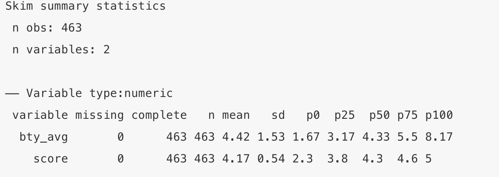
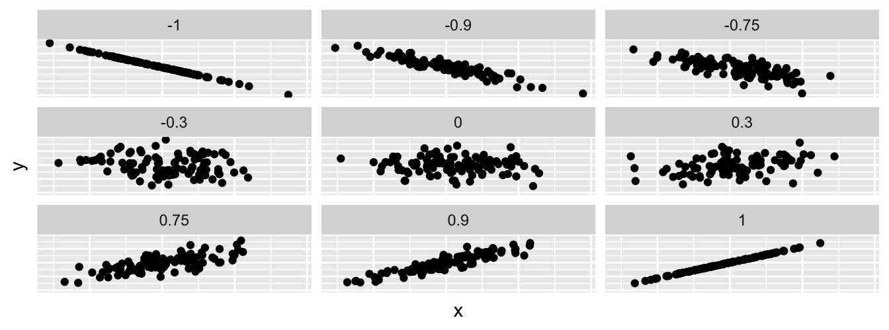
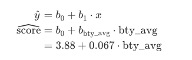
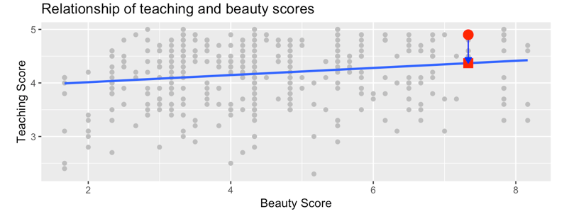
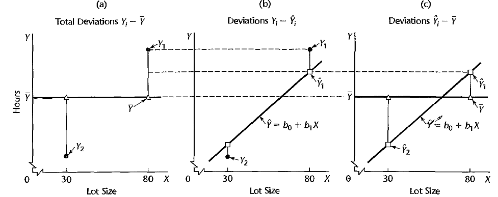
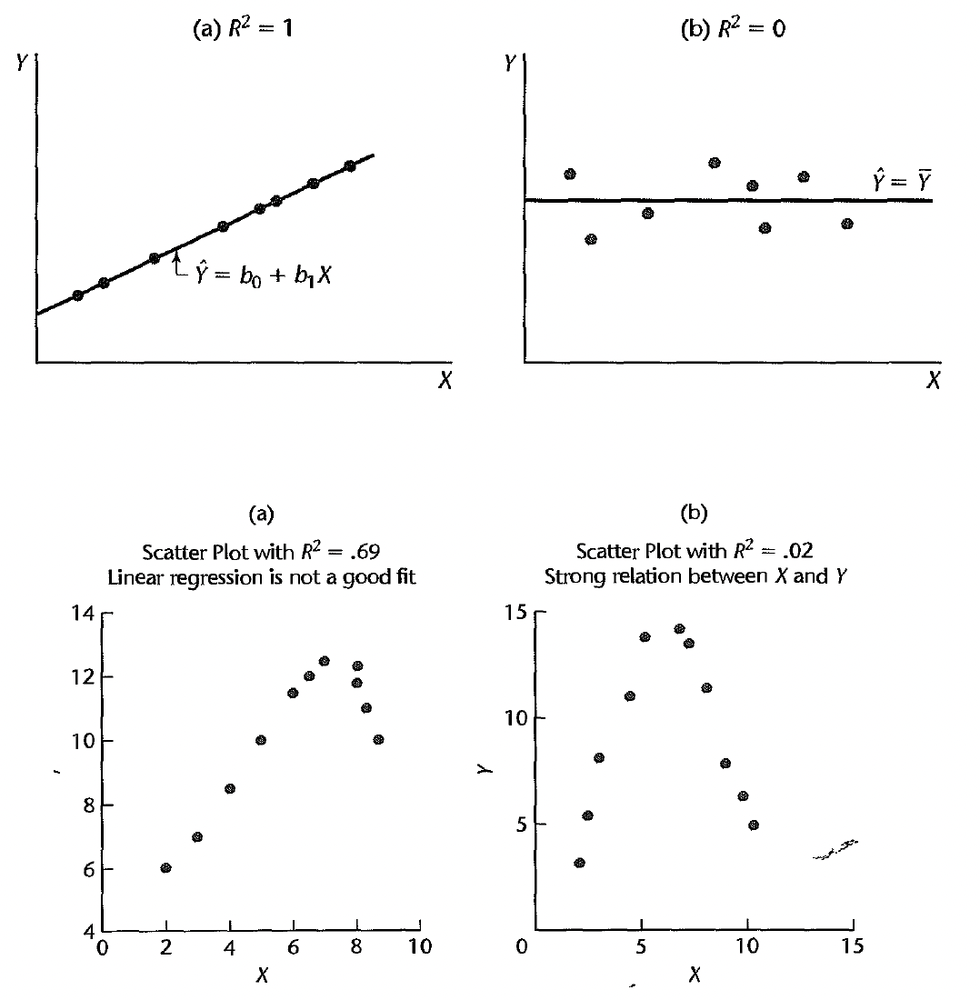
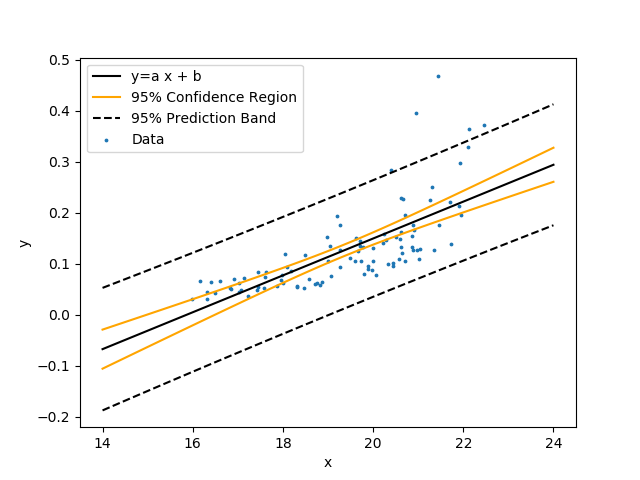
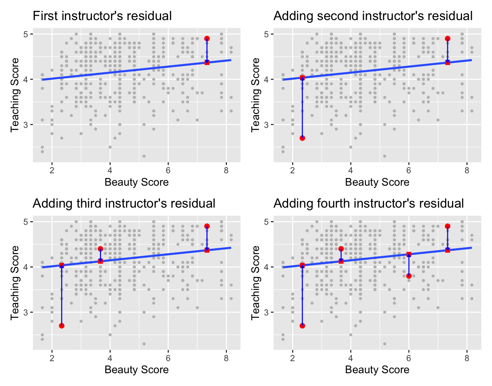

```{r, MEDskip, echo = FALSE}
library(knitr)
knit_hooks$set(document = function(x){
gsub("\\begin{tabular}", "\\medskip{}\\begin{tabular}", x, fixed = TRUE)
})
```


```{r setup, include = FALSE}
knitr::opts_chunk$set(echo = TRUE, comment = NA, warning = FALSE, message = FALSE, fig.align = 'center')
```


# Outline for the week

## By the end of the week:  Basic Regression

- Data Modeling
- Exploratory data analysis
- Linear regression 


# Basic Regression

## Basic Regression

- Now that we are equipped with 

    - an understanding of how to import data
    - data visualization and
    - data wrangling skill

-  Let’s now proceed with **data modeling**. 

- The fundamental premise of data modeling is to make explicit the relationship between:

    - an **outcome variable** $y$, also called a **dependent variable** or **response variable**, and
    - an e**xplanatory/predictor** variable $x$, also called an **independent variable** or **covariate**.


## Data Modeling

Data modeling serves one of two purposes:

1. Modeling for explanation:

    - Describe and quantify the relationship between the outcome variable $y$ and a set of explanatory variables $x$. 
    - Determine the significance of any relationships. 
    - Have measures summarizing these relationships.
    - Possibly identify any causal relationships between the variables.
    
2. Modeling for prediction:

     - Predict an outcome variable $y$ based on the information contained in a set of predictor variables $x$. 
     - Here, you don’t care so much about understanding how all the variables relate and interact with one another. 
     

## Data Modeling

- For example, say you are interested in 

    - an outcome variable $y$ of whether patients develop lung cancer and 
    - information $x$ on their risk factors, such as smoking habits, age, and socioeconomic status. 
    
- If we are modeling for explanation, 

    - we would be interested in both describing and quantifying the effects of the different risk factors. 
    - One reason could be that you want to design an intervention to reduce lung cancer incidence in a population, such as targeting smokers of a specific age group with advertising for smoking cessation programs. 
    
- If we are modeling for prediction, 

    - we wouldn’t care so much about understanding how all the individual risk factors contribute to lung cancer, 
    - but rather only whether we can make good predictions of which people will contract lung cancer. 


## Linear regression

- There are many techniques for modeling, such as 

    - tree-based models and 
    - neural networks, 
    
- But in this class, we’ll focus on one particular technique: **linear regression**. 

- Linear regression involves a numerical outcome variable $y$ and explanatory variables $x$ that are either numerical or categorical. 

    - the relationship between $y$ and $x$ is assumed to be linear, or in other words, a line. 
    - However, we’ll see that what constitutes a “line” will vary depending on the nature of your explanatory variables $x$. 
    - Linear regression is one of the most commonly-used and easy-to-understand approaches to modeling.


## Needed packages

Let’s now load all the packages needed

\normalsize
```{r}
library(ggplot2)    #  for data visualization
library(dplyr)      #  for data wrangling
library(readr)      # for importing spreadsheet data into R
library(moderndive) # package of datasets and regression functions
library(skimr)      # provides simple-to-use functions 
                    # for summary statistics
```
\normalsize


## One numerical explanatory variable

- Researchers at the University of Texas in Austin, Texas (UT Austin) tried to answer the following research question: 

    - what factors explain differences in instructor teaching evaluation scores?


- To this end, they collected instructor and course information on 463 courses. 

- A full description of the study can be found at <https://openintro.org>.

- The data on the `463` courses at UT Austin can be found in the `evals` data frame included in the `moderndive` package. 


## One numerical explanatory variable


Let’s fully describe the 4 variables we will focus on: 

1. `ID`: An identification variable used to distinguish between the 1 through 463 courses in the dataset.

2. `score`: A numerical variable of the course instructor’s average teaching score, where the average is computed from the evaluation scores from all students in that course. Teaching scores of 1 are lowest and 5 are highest. This is the outcome variable $y$ of interest.

3. `bty_avg`: A numerical variable of the course instructor’s average “beauty” score, where the average is computed from a separate panel of six students. “Beauty” scores of 1 are lowest and 10 are highest. This is the explanatory variable $x$ of interest.

4. `age`: A numerical variable of the course instructor’s age. This will be another explanatory variable  $x$ that we’ll use later. 


## One numerical explanatory variable

We’ll answer these questions by modeling the relationship between teaching scores and “beauty” scores using simple linear regression where we have:

1. A numerical outcome variable $y$ (the instructor’s teaching score) and

2. A single numerical explanatory variable $x$ (the instructor’s “beauty” score).


## Exploratory data analysis

- A crucial step before doing any kind of analysis or modeling is performing an exploratory data analysis, or EDA for short. 


    - Get distributions of the individual variables in your data, 
    - Find out any potential relationships exist between variables, 
    - Find out any outliers and/or missing values, and 
    - (most importantly) helps you to decide how to build your model. 
    
- Here are three common steps in EDA:

    1. Examine the raw data values.
    2. Compute summary statistics, such as means, medians, and interquartile ranges.
    3. Create data visualizations.


## Step 1: Examine the raw data values


\normalsize
```{r}
evals_ch5 <- evals %>%
  select(ID, score, bty_avg, age)   # take subset
glimpse(evals_ch5)
```
\normalsize

An alternative way to look at the raw data values is by choosing a random sample of the rows. 

\normalsize
```{r}
evals_ch5 %>%
  sample_n(size = 5)
```
\normalsize


## Step 2: summary statistics

\normalsize
```{r}
evals_ch5 %>%
  summarize(mean_bty_avg = mean(bty_avg),
            mean_score = mean(score),
            median_bty_avg = median(bty_avg), 
            median_score = median(score))
```
\normalsize

## Step 2: summary statistics

The `skim()` function from the `skimr` package, "skims" the data, and returns commonly used summary statistics


\normalsize
```{r}
library(skimr)
evals_ch5 %>% 
  select(score, bty_avg) %>% 
  skim()
```
\normalsize

```{r echo = FALSE, out.height = '30%',out.width = '70%'}

```

## Correlation coefficient $r$

When the two variables are numerical, we can compute the **correlation coefficient**. 

-  The correlation coefficient, denoted by $r$ , measures the direction and strength of the linear relationship between two numerical variables. Is is given by the equation
$$r=\frac{1}{(n-1)}\sum_{i=1}^n \left(\frac{x_i-\bar{x}}{s_x}\right)\left(\frac{y_i-\bar{y}}{s_y}\right)=\frac{\sum z_x z_y}{n-1}$$

where $\bar{x}$ and $\bar{y}$ represents the mean of the $x$ and $y$ variables. Also, $s_x$ and $s_y$ denotes the standard deviation of the $x$ and $y$ variables respectively. $z_x$ and $z_y$ are the $z$-scores for the $x$ and $y$ variables respectively. 

## Properties of $r$

- sign of $r$ gives direction of association
- $-1\leq r \leq 1$

    - -1 indicates a perfect negative relationship: As one variable increases, the value of the other variable tends to go down, following a straight line.
    - 0 indicates no relationship: The values of both variables go up/down independently of each other.
    - +1 indicates a perfect positive relationship: As the value of one variable goes up, the value of the other variable tends to go up as well in a linear fashion.
- $r_{x,y}= r_{y,x}$
- Correlation has no units. 
- Correlation is not affected by multiplying or shifting data
- Correlation measures LINEAR association only
- Outliers affect correlation greatly

## Correlation coefficient and scatterplot 


```{r echo = FALSE, out.height = '85%', out.width = '80%'}

```


## Correlation coefficien: GPA Example

Following are the high school GPAs and the college GPAs at the end of the freshman year for ten different students from the `Gpa` data set of the `BSDA` package.

\normalsize
```{r}
library(BSDA) 
head(Gpa)
```
\normalsize


## Correlation coefficient: GPA Example


\normalsize
```{r out.height = '50%',out.width = '50%'}
ggplot(data = Gpa, aes(x = hsgpa, y = collgpa)) + 
  labs(x = "High School GPA", y = "College GPA") +
  geom_point() + 
  theme_bw()
```
\normalsize

The scatterplot shows that the college GPA increases as the high school GPA increases

## Correlation coefficien: GPA Example

\normalsize
```{r}
values <- Gpa %>% 
  mutate(y_ybar = collgpa - mean(collgpa), x_xbar = hsgpa - mean(hsgpa),
         zx = x_xbar/sd(hsgpa), zy = y_ybar/sd(collgpa))
values
```
\normalsize

$$r=\frac{1}{(n-1)}\sum_{i=1}^n \left(\frac{x_i-\bar{x}}{s_x}\right)\left(\frac{y_i-\bar{y}}{s_y}\right)=\frac{\sum z_x z_y}{n-1}$$

## Correlation coefficient: GPA Example


\normalsize
```{r}
values %>% 
  summarize(r = (1/9)*sum(zx*zy))
```
\normalsize


Using the build in `cor()` function:

\normalsize
```{r}
Gpa %>% 
  summarize(r = cor(collgpa, hsgpa))
```
\normalsize

Using `get_correlation()` function in the `moderndive` package.

\normalsize
```{r}
Gpa %>% 
  get_correlation(formula = collgpa ~ hsgpa)
```
\normalsize


## Correlation coefficient: GPA Example


\normalsize
```{r}
p1 <- ggplot(data = Gpa, aes(x = hsgpa, y = collgpa)) + 
  geom_point() + 
  theme_bw()
p2 <- ggplot(data = values, aes(x = zx, y = zy)) + 
  geom_point() + 
  theme_bw()
library(gridExtra)
grid.arrange(p1, p2, ncol = 1, nrow = 2)
```
\normalsize


## Correlation coefficient: Teaching Evaluations Example

\normalsize
```{r}
evals_ch5 %>% 
  get_correlation(formula = score ~ bty_avg)
```
\normalsize

\normalsize
```{r}
evals_ch5 %>% 
  summarize(correlation = cor(score, bty_avg))
```
\normalsize


## Step 3: create data visualizations


\normalsize
```{r}
ggplot(evals_ch5, aes(x = bty_avg, y = score)) +
  geom_jitter() +
  labs(x = "Beauty Score", y = "Teaching Score",
       title = "Scatterplot of relationship of teaching and beauty scores")
```
\normalsize


## Step 3: creating data visualizations

Add “best-fitting” line (regression line).

\tiny
```{r echo=TRUE,warning=FALSE, message=FALSE,out.height = '50%',out.width = '50%', fig.align='center'}
ggplot(evals_ch5, aes(x = bty_avg, y = score)) +
  geom_point() +
  labs(x = "Beauty Score", y = "Teaching Score",
       title = "Relationship between teaching and beauty scores") +  
  geom_smooth(method = "lm", se = FALSE)
```
\normalsize


# Simple linear regression

## Simple linear regression

You may recall from secondary/high school algebra that the equation of a line is:
$$y=a+b\cdot x$$

- The intercept coefficient is $a$ is the value of $y$ when $x=0$. 

- The slope coefficient $b$ for $x$ is the increase in $y$ for every increase in $x$. 

However, when defining regression equation line, we use slightly different notation. 


## Simple linear regression

The regression equation is given by:
$$y=\beta_0+\beta_1x+\epsilon$$

- where $\beta_0$ is the intercept 

- $\beta_1$ is the slope. 

- For the $i$th trial, we have:

$$y_i=\beta_0+\beta_1x_i+\epsilon_i$$

## Simple linear regression


The line that best fits the data is given by,
$$\hat{y}=b_0+b_1x$$
where $b_0$ and $b_1$ are estimates for the population parameters $\beta_0$ and $\beta_1$. 

- Form the best fit line, we can compute the:

    - predicted $\hat{y}$ for each $x$ and 
    - measure the error of prediction. 


- The error of prediction, $e_i$ (also called residual) is the difference in the actual $y_i$ and the predicted $\hat{y}_i$. 
$$e_i=y_i-\hat{y}_i.$$

## The least squares regression line


The least squares regression line is:

$$\hat{y}=b_0+b_1x$$

where 
$$b_1=\frac{\sum(x_i-\bar{x})(y_i-\bar{y})}{\sum(x_i-\bar{x})^2}=r \frac{s_y}{s_x}$$
and 
$$b_0=\bar{y}-b_1\bar{x}.$$


## Regression: Teaching Evaluations Example

\tiny
```{r echo=FALSE,warning=FALSE, message=FALSE,out.height = '50%',out.width = '50%', fig.align='center'}
ggplot(evals_ch5, aes(x = bty_avg, y = score)) +
  geom_point() +
  labs(x = "Beauty Score", y = "Teaching Score",
       title = "Relationship between teaching and beauty scores") +  
  geom_smooth(method = "lm", se = FALSE)
```
\normalsize

- We know that the regression line has a positive slope $b_1$ corresponding to our explanatory $x$ variable `bty_avg`. 

- However, what is the numerical value of the slope $b_1$? What about the intercept $b_0$?


## Regression: Teaching Evaluations Example

We obtain the regression line parameters in two steps:

1. We "fit" the linear regression model using the `lm()` function and save it, lets call it `score_model`.

2. We get the regression table by applying the `get_regression_table()` function from the `moderndive package` to `score_model`.


## Regression: Teaching Evaluations Example


\tiny
```{r echo=TRUE,warning=FALSE, message=FALSE,out.height = '50%',out.width = '50%', fig.align='center'}
# Fit regression model:
score_model <- lm(score ~ bty_avg, data = evals_ch5)
# Get regression table:
get_regression_table(score_model)

# Use formula

evals_ch5 %>% 
  summarize(b1 = cor(bty_avg, score)*sd(score)/sd(bty_avg),
            b0 = mean(score) - b1*mean(bty_avg))

```
\normalsize


## Regression: Teaching Evaluations Example


Lets interpret the regression table. The equation of the regression line:

```{r warning=FALSE, message=FALSE,out.height = '20%',out.width = '40%', fig.align='center'}

```


- The intercept $b_0=3.88$ 

    - is the average teaching score $\hat{y}=\widehat{score}$ for those courses where the instructor had a “beauty” score `bty_avg` of 0. 
    - Note however that `bty_avg` of 0 is impossible since the beauty scores ranges from 1 to 10. 
    

- The slope $b_1$ of `bty_avg` is 0.067. 

    - The sign is positive, suggesting a positive relationship between these two variables, meaning teachers with higher “beauty” scores also tend to have higher teaching scores.
    - For every increase of 1 unit in `bty_avg`, there is an associated increase of, on average, 0.067 units of `score`.


## Observed/fitted values and residuals

Now we are interested in information on individual observations.  For example, let’s focus on the 21st of the 463 courses in the `evals_ch5` dataframe

\small
```{r echo=TRUE,warning=FALSE, message=FALSE,out.height = '50%',out.width = '50%', fig.align='center'}
# Fit regression model:
evals_ch5[21,]
```
\normalsize

- We want to know what is the value $\hat{y}$ on the regression line corresponding to instructor's `bty_avg` "beauty" score of 7.333.

## Observed/fitted values and residuals


```{r warning=FALSE, message=FALSE,out.height = '45%',out.width = '80%', fig.align='center'}

```


- Square: The fitted value $\hat{y}_i$ is given by
$$\hat{y}_i=b_0+b_1\cdot x=3.88+0.067\cdot 7.333=4.369$$
- Circle: The observed value $y_i=4.9$.
- Arrow: The length of the arrow is the residual or error and is given by
$$e_i=y_i-\hat{y}_i=4.9-4.369=0.531.$$


## Observed/fitted values and residuals

 To compute both the fitted value and residual for all observations in the data we use the `get_regression_points()` function.
 
 \tiny
```{r echo=TRUE,warning=FALSE, message=FALSE,out.height = '50%',out.width = '50%', fig.align='center'}
regression_points <- get_regression_points(score_model)
regression_points
```
\normalsize

Let’s repeat the calculations for the instructor of the 1st course.


## Assessing the fit


- The regression model is a good model if the scatterplot of residual
vs. $x$-values or scatterplot of residual vs. $\hat{y}$-values has no interesting
features.

    - No direction
    - No shape
    - No bends
    - No outliers
    - No identifiable pattern
    - Equal or constant variance (homoscedasticity)


- In addition, for a good model, the residuals are approximately normally
distributed. Check histogram of the residuals.


## Assessing the fit

```{r echo=FALSE, out.width = '90%', fig.pos="h", fig.align='center'}
#library(gridExtra)
rl <- lapply(list("week6_3a.png", "week6_3b.png","week6_3c.png","week6_3d.png"), png::readPNG)
gl <- lapply(rl, grid::rasterGrob)
do.call(gridExtra::grid.arrange, gl)
#par(mfrow=c(2,2))


#grid.arrange(p1,p2, nrow=1,ncol=2)
```


## Assessing the fit: Teaching Evaluations Example

\tiny
```{r echo=TRUE,warning=FALSE, message=FALSE,out.height = '50%',out.width = '80%', fig.align='center'}
library(ggfortify)
autoplot(score_model, ncol = 2, nrow = 1, which = 1:2) + theme_bw()
```
\normalsize


# Confidence Intervals and Tests

## Estimating $\sigma^2$

The regression equations give the mean of the group. What is the standard deviation of this group? That is, we have to estimate $\sigma$. 
$$ y_i=\beta_0+\beta_1x_i+\epsilon_i, \quad \quad Var(\epsilon_i)=\sigma^2.$$
A natural estimator for $\sigma^2$ is: 
$$\frac{1}{n}\sum_{i=1}^n(\epsilon_i-E(\epsilon))^2=\frac{1}{n}\sum_{i=1}^n(\epsilon_i)^2=\frac{1}{n}\sum_{i=1}^n(y_i-\beta_0-\beta_1x_i)^2.$$
Since, $\beta_0$ and $\beta_1$ are unknown, we use the estimates: 
$$ \frac{1}{n}\sum_{i=1}^ne_i^2=\frac{1}{n}\sum_{i=1}^n(y_i-b_0-b_1x_i)^2=\frac{SSE}{n}$$

## Estimating $\sigma^2$


Since $b_0$, $b_1$ are estimated, $\hat{e}_i^2$ are no longer independent, we use the following estimator:
$$ s^2=\frac{SSE}{n-2}=MSE,$$
where $n-2$ is the degree of freedom (df) (why?), and MSE stands for error mean
square or residual mean square. Generally, $df=\text{number of cases - number of parameters}$. 


- The residual standard error, $s=\sqrt{MSE}$, gives the average error the model predicts. 


## Properties of OLS

If we assume that $\epsilon_i \sim N(0, \sigma^2)$, then the OLS estimates are also maximum likelihood estimates (MLE). Under the normal assumption,
$$b_1\sim N\left(\beta_1 , \frac{\sigma^2}{\sum(x_i-\bar{x})^2}\right),$$
$$b_0\sim N\left(\beta_0 , \sigma^2\left(\frac{1}{n}+\frac{\bar{x}^2}{\sum(x_i-\bar{x})^2}\right)\right),$$
These quantities will be used to construct confidence intervals, testing, and other
statistical inferences.


## Confidence Intervals 

Linear model assumptions:
$$y_i=\beta_0+\beta_1 x_i+\epsilon_i, \quad \quad \epsilon_i \sim N(0, \sigma^2)$$

Under this model:
$$\frac{b_0-\beta_0}{S(b_0)}\sim t_{n-2}, \quad \quad \frac{b_1-\beta_1}{S(b_1)}\sim t_{n-2}$$

- Hence, $100(1-\alpha)\%$ confidence interval for $\beta_0$ is 
$$b_0\pm t_{n-2, \alpha/2}S(b_0);$$
- $100(1-\alpha)\%$ confidence interval for $\beta_1$ is 
$$b_1\pm t_{n-2, \alpha/2}S(b_1);$$


## Hypothesis Tests

- A hypothesis test of: $H_0: \beta_0=0\quad vs \quad H_a: \beta_0\neq 0$, 

is obtained  by computing
$$ t=\frac{b_0-0}{S(b_0)}=\frac{b_0}{S(b_0)}\sim t_{n-2}, \quad \text{under } H_0$$

Then, reject $H_0$ if $|t|>t_{n-2, \alpha/2}$. P-values can be computed as:
$$\text{P-value}=2\Pr(T>t)$$
reject $H_0$ if $\text{P-value}<\alpha$. 


## Hypothesis Tests

Similarly, a hypothesis test of $H_0: \beta_1=0\quad vs \quad H_a: \beta_1\neq0$, 

is obtained  by computing
$$ t=\frac{b_1-0}{S(b_1)}=\frac{b_1}{S(b_1)}\sim t_{n-2}, \quad \text{under } H_0$$

Then, reject $H_0$ if $|t|>t_{n-2, \alpha/2}$. P-values can be computed as:
$$\text{P-value}=2\Pr(T>t)$$
reject $H_0$ if $\text{P-value}<\alpha$. 


## Regression: Teaching Evaluations Example


\tiny
```{r echo=TRUE,warning=FALSE, message=FALSE,out.height = '50%',out.width = '50%', fig.align='center'}
# Fit regression model:
score_model <- lm(score ~ bty_avg, data = evals_ch5)
# Get regression table:
get_regression_table(score_model,conf.level = 0.95) # conf.level = 0.95 is default
```
\normalsize


## Regression: Teaching Evaluations Example


\tiny
```{r echo=TRUE,warning=FALSE, message=FALSE,out.height = '50%',out.width = '50%', fig.align='center'}
summary(score_model)
```
\normalsize


## Regression: Teaching Evaluations Example


To obtain the `residuals` for `score_model` use the function `resid` on a linear model object.
\tiny
```{r echo=TRUE,warning=FALSE, message=FALSE,out.height = '50%',out.width = '50%', fig.align='center'}
eis <- resid(score_model)
RSS <- sum(eis^2)
RSS

RSE <- sqrt(RSS/(dim(evals_ch5)[1]-2))
RSE

# Or
summary(score_model)$sigma
```
\normalsize


## Regression: Teaching Evaluations Example


\tiny
```{r echo=TRUE,warning=FALSE, message=FALSE,out.height = '50%',out.width = '50%', fig.align='center'}
b0<-coef(score_model)[1]
b1<-coef(score_model)[2]
c(b0,b1)
XTXI <- summary(score_model)$cov.unscaled
MSE <- summary(score_model)$sigma^2
var.cov.b <- MSE*XTXI
var.cov.b

seb0 <- sqrt(var.cov.b[1, 1])
seb1 <- sqrt(var.cov.b[2, 2])
c(seb0,seb1)

```
\normalsize


## Regression: Teaching Evaluations Example


\tiny
```{r echo=TRUE,warning=FALSE, message=FALSE,out.height = '50%',out.width = '50%', fig.align='center'}
# confidence interval
df<-dim(evals_ch5)[1]-2
df
##b0
t_critical<-qt(0.975, df)
c(b0-t_critical*seb0,b0+t_critical*seb0)
##b1
c(b1-t_critical*seb1,b1+t_critical*seb1)
# Or
confint(score_model, level = 0.95)
```
\normalsize


## Regression: Teaching Evaluations Example


\tiny
```{r echo=TRUE,warning=FALSE, message=FALSE,out.height = '50%',out.width = '50%', fig.align='center'}
tb0 <- b0/seb0
tb1 <- b1/seb1
c(tb0, tb1)

pvalues <- c(pt(tb0, df, lower = FALSE)*2, pt(tb1, df, lower = FALSE)*2)
pvalues
```
\normalsize


## Partition of Total sum of squares

- For the linear regression model: $y_i=\beta_0+\beta_1x_i+\epsilon_i,$

- We have fitted the line: $\hat{y}_i=\beta_0+\beta_1x_i.$

Partition of Total sum of squares: 

\small
```{r  echo=FALSE, out.width = '65%', fig.pos="h", fig.align='center'}

```
\normalsize


- Total sum of squares (SST): $SST=\sum(y_i-\bar{y})^2.$

- Error sum of squares (SSE): $SSE=\sum (y_i-\hat{y}_i)^2.$ 

- Regression sum of squares (SSR): $SSR=\sum (\hat{y}_i-\bar{y})^2$

## Partition of Total sum of squares

Then we have the following relation:
$$\sum(y_i-\bar{y})^2=\sum (\hat{y}_i-\bar{y})^2+\sum (y_i-\hat{y}_i)^2$$
That is: $SST=SSR+SSE$


## Coefficient of Determination

A natural measure of the effect of $x$ in reducing in variation in $y$ is to express the reduction in variation as a proportion of the total variation:
$$R^2=\frac{SSR}{SST}=1-\frac{SSE}{SST}.$$

We can also write: 

$$R^2=\frac{var(\hat{y})}{var(y)}$$

Thus, we have: 
$$0\leq R^2 \leq 1$$


## Coefficient of Determination


Some misunderstanding of $R^2$:

- A high coefficient of determination indicates the useful predictions can be made. 

- A high coefficient of determination indicates the estimated regression line is a
good fit.
- A coefficient of determination near zero indicates that $x$ and $y$ are not related.


## Coefficient of Determination

\small
```{r  echo=FALSE, out.width = '60%', fig.pos="h", fig.align='center'}

```
\normalsize


## Regression: Teaching Evaluations Example

\tiny
```{r echo=TRUE,warning=FALSE, message=FALSE,out.height = '50%',out.width = '50%', fig.align='center'}

TSS <- sum((evals_ch5$score - mean(evals_ch5$score))^2)
c(RSS, TSS)

R2 <- (TSS - RSS)/TSS
R2

# Or
summary(score_model)$r.squared
```
\normalsize


## Regression: Teaching Evaluations Example

\tiny
```{r echo=TRUE,warning=FALSE, message=FALSE,out.height = '50%',out.width = '50%', fig.align='center'}

get_regression_points(score_model) 
Summarytable<-get_regression_points(score_model) %>% 
  summarize(var_y = var(score), 
                      var_y_hat = var(score_hat), 
                      var_residual = var(residual))
Summarytable
```
\normalsize


## Regression: Teaching Evaluations Example

\tiny
```{r echo=TRUE,warning=FALSE, message=FALSE,out.height = '50%',out.width = '50%', fig.align='center'}

## Calculate R2
Summarytable[2]/Summarytable[1]
```
\normalsize


## Regression: Teaching Evaluations Example

\tiny
```{r echo=TRUE,warning=FALSE, message=FALSE,out.height = '50%',out.width = '50%', fig.align='center'}
get_regression_table(score_model)
summary(score_model)
```
\normalsize


# Prediction intervals

## Interval Estimation for Mean Response and a Single Response

1. Estimating the mean of $y$ at a given value of $x$, that is, $E(y|x)=\mu_{y|x}$

**Example**: A power company may want to estimate the mean daily power consumption for a given temperature. They need this estimate for a report. 


2. Predicting a single value of $y$ for a given value of $x$. 

**Example**: The power company want to predict power consumption on a single day for a given temperature. 

- They might know a hot day is coming up the next day and have good idea of what the high temperature will be, so what to predict the power consumption.
- We want to be $99.99\%$ confident that they have enough access to power to cover demand. 


## Interval Estimation of Mean Response

Let $x_h$ denote the level of $x$ for which we wish to estimate the mean response. Then, by the regression equation we have: 
$$E(y_h|x_h)=\hat{y}_h=b_0+b_1x_h$$
Variance: 

$$Var(\hat{y}_h)=\sigma^2\left[\frac{1}{n}+\frac{(x_h-\bar{x})^2}{\Sigma(x_i-\bar{x})^2}\right].$$

Estimated Variance: 
$$S^2(\hat{y}_h)=MSE\left[\frac{1}{n}+\frac{(x_h-\bar{x})^2}{\Sigma(x_i-\bar{x})^2}\right].$$

## Interval Estimation of Mean Response


- t-distribution

$$\frac{y_h-\hat{y}_h}{S(\hat{y}_h)}\sim t_{n-2}.$$

So, the $100(1-\alpha)\%$ confidence interval is:
$$\hat{y}_h\pm t_{\alpha/2, n-2}S(\hat{y}_h).$$

## Prediction Intervals for a Single Response


In prediction of a single response, we can use the estimated mean function to predict it. Let $x_*$ denote the level of $x$, then we have:
$$ y_*=\beta_0+\beta_1x_*+\epsilon_*, \quad \quad Var(\epsilon_*)=\sigma^2.$$
A natural estimation is: 
$$ \hat{y}_*=b_0+b_1x_*.$$

- The variance of prediction error: 
$$ Var(pred)=\sigma^2+\sigma^2\left(\frac{1}{n}+\frac{(x_* -\bar{x})^2}{\sum (x_* -\bar{x})^2}\right)$$
- The estimated standard error of prediction at $x_*$:
$$S(pred)=\sqrt{MSE}\left(1+\frac{1}{n}+\frac{(x_* -\bar{x})^2}{\sum (x_* -\bar{x})^2}\right)$$


## Prediction Intervals for a Single Response


Hence, 

$$\frac{y_*-\hat{y}_*}{S(pred)}\sim t_{n-2}.$$

So, the prediction interval for $y_*$ is:
$$\hat{y}_*\pm t_{\alpha/2, n-2}S(pred).$$


## Interval Estimation for Mean Response and a Single Response

\small
```{r  echo=FALSE, out.width = '80%',out.height = '60%', fig.pos="h", fig.align='center'}

```
\normalsize


## Regression: Teaching Evaluations Example

\tiny
```{r echo=TRUE,warning=FALSE, message=FALSE,out.height = '50%',out.width = '50%', fig.align='center'}
# Using the build in function
predict(score_model, newdata = data.frame(bty_avg = 7.333))
predict(score_model, newdata = data.frame(bty_avg = 7.333), interval = "conf", level = 0.90)
predict(score_model, newdata = data.frame(bty_avg = 7.333), interval = "pred", level = 0.90)
```
\normalsize


# Related topics

## Correlation is not necessarily causation


- Throughout this chapter we’ve been cautious when interpreting regression slope coefficients. 

    - We always discussed the "associated" effect of an explanatory variable $x$ on an outcome variable $y$. 
    - We include the term "associated" to be extra careful not to suggest we are making a **causal** statement.

- For example when we looked at the teaching score and "beauty" example:

    - For every increase of 1 unit in `bty_avg` there is an associated increase of on average 0.067 units of `score`. 
    
    - while "beauty" score of `bty_avg` is positively correlated with teaching score, we can’t necessarily make any statements about "beauty" scores' direct causal effect on teaching score without more information on how this study was conducted. 
    

## Correlation is not necessarily causation

Here is another example: 

- A not-so-great medical doctor goes through medical records and finds that patients who slept with their shoes on tended to wake up more with headaches. 

  - So this doctor declares, "Sleeping with shoes on causes headaches!"

```{r warning=FALSE, message=FALSE,out.height = '35%',out.width = '80%', fig.align='center'}
knitr::include_graphics("week4_7.png")
```


## Correlation is not necessarily causation
 
- However, there is a good chance that if someone is sleeping with their shoes on, it’s potentially because they are intoxicated from alcohol. 

    - Higher levels of drinking leads to more hangovers, and hence more headaches. 
    - The amount of alcohol consumption here is what’s known as a confounding/lurking variable. 
    -  It "lurks" behind the scenes, confounding the causal relationship (if any) of "sleeping with shoes on" with "waking up with a headache". 


```{r warning=FALSE, message=FALSE,out.height = '30%',out.width = '60%', fig.align='center'}
knitr::include_graphics("week4_8.png")
```

$Z$ is a confounding variable. 


## Correlation is not necessarily causation

- Establishing **causation** is a tricky problem

    - frequently takes either carefully designed experiments or methods to control for the effects of confounding variables. 
    - Both these approaches attempt, as best they can, either to take all possible confounding variables into account or negate their impact. 
    - This allows researchers to focus only on the relationship of interest: the relationship between the outcome variable $Y$ and the treatment variable $X$.


- As you read news stories, be careful not to fall into the trap of thinking that correlation necessarily implies causation. 


## Best-fitting line

Regression lines are also known as “best-fitting” lines. But what do we mean by “best”?

- Lets use the Teaching Evaluations Example. 


```{r warning=FALSE, message=FALSE,out.height = '50%',out.width = '80%', fig.align='center'}

```


we mark the observed value $y$ with a circle, the fitted value $\hat{y}$ with a square and the residual $y-\hat{y}$. 


## Best-fitting line

- Now say we repeated this process of computing residuals for all 463 courses’ instructors, 

    - then we squared all the residuals, and 
    - then we summed them. 
    - We call this quantity the sum of squared residuals; 
    
- The **sum of squared residuals** is a measure of the lack of fit of a model. 

    - Larger values of the sum of squared residuals indicate a bigger lack of fit. This corresponds to a worse fitting model.
    - If the regression line fits all the points perfectly, then the sum of squared residuals is 0

- The regression line minimizes the sum of the squared residuals:
$$\sum_{i=1}^n(y_i-\hat{y}_i)^2$$


## Best-fitting line

\tiny
```{r echo=TRUE,warning=FALSE, message=FALSE,out.height = '50%',out.width = '80%', fig.align='center'}
# Fit regression model:
score_model <- lm(score ~ bty_avg, 
                  data = evals_ch5)

# Get regression points:
regression_points <- get_regression_points(score_model)
regression_points
```
\normalsize


## Best-fitting line

Any other straight line drawn in the figure would yield a sum of squared residuals greater than 132. 

\tiny
```{r echo=TRUE,warning=FALSE, message=FALSE,out.height = '50%',out.width = '80%', fig.align='center'}
# Compute sum of squared residuals
regression_points %>%
  mutate(squared_residuals = residual^2) %>%
  summarize(sum_of_squared_residuals = sum(squared_residuals))
```
\normalsize


You can also get the residuals using the function `resid` on a linear model object.

\tiny
```{r echo=TRUE,warning=FALSE, message=FALSE,out.height = '50%',out.width = '80%', fig.align='center'}
# Compute sum of squared residuals
eis <- resid(score_model)
RSS <- sum(eis^2)
RSS
```
\normalsize


