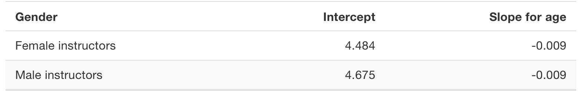

```{r, MEDskip, echo = FALSE}
library(knitr)
knit_hooks$set(document = function(x){
gsub("\\begin{tabular}", "\\medskip{}\\begin{tabular}", x, fixed = TRUE)
})
```


```{r setup, include = FALSE}
knitr::opts_chunk$set(echo = TRUE, comment = NA, warning = FALSE, message = FALSE, fig.align = 'center')
```


# Outline for the week

## By the end of the week:  Multiple Linear Regression

- Simple Linear Regression (One categorical explanatory variable)
- Multiple Regression (One numerical and one categorical explanatory variable)
- Interaction model
- Two numerical explanatory variables


# One categorical explanatory variable

## One categorical explanatory variable


- It’s an unfortunate truth that life expectancy is not the same across all countries in the world. 

    - International development agencies are interested in studying these differences in life expectancy in the hopes of identifying where governments should allocate resources to address this problem. 
    

- In this section, we’ll explore differences in life expectancy in two ways:

    - Differences between continents: Are there significant differences in average life expectancy between the five populated continents of the world: Africa, the Americas, Asia, Europe, and Oceania?
    - Differences within continents: How does life expectancy vary within the world’s five continents? For example, is the spread of life expectancy among the countries of Africa larger than the spread of life expectancy among the countries of Asia?
    


## One categorical explanatory variable

- To answer such questions, we’ll use the `gapminder` data frame included in the `gapminder` package


  - This dataset has international development statistics such as life expectancy, GDP per capita, and population for 142 countries for 5-year intervals between 1952 and 2007. 

  - Recall we visualized some of this data earlier.


- We’ll use this data for basic regression again, but now using an explanatory variable $x$ that is **categorical**. 

    - A numerical outcome variable $y$ (a country’s life expectancy) and
    - A single categorical explanatory variable $x$ (the continent that the country is a part of).


## Needed packages

Loading needed packages.


```{r}
library(tidyverse)   # loading collection of packages
library(moderndive)  # datasets and regression functions
library(skimr)       # provides a simple-to-use functions 
                     # for summary statistics
library(gapminder)   # datasets
```


## Exploratory data analysis

- The data on the 142 countries can be found in the `gapminder` data frame included in the `gapminder` package. 

  - However, to keep things simple, let’s `filter()` for only those observations/rows corresponding to the year 2007. 
  - Additionally, let’s `select()` only the subset of the variables we’ll consider in this chapter. We’ll save this data in a new data frame called `gapminder2007`:


\small
```{r}
gapminder2007 <- gapminder |> 
  filter(year == 2007) |>
  select(country, lifeExp, continent, gdpPercap)
glimpse(gapminder2007)
```
\normalsize


## Exploratory data analysis

- A full description of all the variables included in `gapminder` can be found by reading the associated help file (run `?gapminder` in the console). 

- However, let’s fully describe the 4 variables we selected in `gapminder2007`:

  1. `country`: An identification variable of type character/text used to distinguish the 142 countries in the dataset.

  2. `lifeExp`: A numerical variable of that country’s life expectancy at birth. This is the outcome variable  $y$ of interest.

  3. `continent`: A categorical variable with five levels. Here “levels” correspond to the possible categories: Africa, Asia, Americas, Europe, and Oceania. This is the explanatory variable $x$ of interest.

  4. `gdpPercap`: A numerical variable of that country’s GDP per capita in US inflation-adjusted dollars.


## Exploratory data analysis


Let’s look at a random sample of five out of the 142 countries

```{r}
gapminder2007 |> 
  sample_n(size = 5)
```


## Exploratory data analysis

Let's compute the summary statistics using the `skim()` function

\normalsize
```{r, eval = FALSE}
gapminder2007 |> 
  select(lifeExp, continent) |>
  skim()
```
\normalsize

```{r}
# Or using summary()
gapminder2007 |> 
  select(lifeExp, continent) |>
  summary()
```


## Exploratory data analysis

Why is the mean life expectancy lower than the median?

\small
```{r out.height = '30%', out.width = '40%'}
ggplot(gapminder2007, aes(x = lifeExp)) +
  geom_histogram(binwidth=5, color = "blue", fill = "lightblue") +
  labs(x = "Life expectancy", y = "Number of countries",
       title = "Histogram of distribution of worldwide 
       life expectancies") +
  theme_bw()
```
\normalsize

We see that this data is skewed to the left $\rightarrow$ mean < median.


## Exploratory data analysis

\small
```{r out.height = '45%', out.width = '80%'}
ggplot(gapminder2007, aes(x = lifeExp)) +
  geom_histogram(binwidth = 5, color = "blue",
                 fill = "lightblue") +
  labs(x = "Life expectancy", 
       y = "Number of countries",
       title = "Histogram of distribution of worldwide 
       life expectancies") +
  facet_wrap(vars(continent), nrow = 2) + 
  theme_bw()
```
\normalsize


## Exploratory data analysis


\small
```{r out.height = '50%',out.width = '80%'}
ggplot(gapminder2007, aes(x = continent, y = lifeExp)) +
  geom_boxplot(fill = "lightblue") +
  labs(x = "Continent", y = "Life expectancy",
       title = "Life expectancy by continent") + 
  theme_bw()
```
\normalsize


## Exploratory data analysis


\normalsize
```{r}
lifeExp_by_continent <- gapminder2007 |>
  group_by(continent) |>
  summarize(median = median(lifeExp), 
            mean = mean(lifeExp)) |> 
  mutate(`Difference versus Africa` = mean - mean[1])
knitr::kable(lifeExp_by_continent)
```
\normalsize


## Linear regression

In our life expectancy example, we now instead have a **categorical** explanatory variable `continent`:

\tiny
```{r}
lifeExp_model <- lm(lifeExp ~ continent, data = gapminder2007)
knitr::kable(get_regression_table(lifeExp_model))
```
\normalsize


Our model will not yield a “best-fitting” regression line like when the $x$ is continuous, but rather offsets relative to a baseline for comparison.


## Linear regression

Let’s break the 5 estimates down one-by-one:

- `intercept` corresponds to the mean life expectancy of countries in Africa of 54.8 years.

- `continent: Americas` corresponds to countries in the Americas and the value +18.8 is the same difference in mean life expectancy relative to Africa we displayed earlier. In other words, the mean life expectancy of countries in the Americas is $54.8+18.8=73.6$.

- `continent: Asia`  the mean life expectancy of countries in Asia is $54.8+ 15.9=70.7$.

- `continent: Europe` the mean life expectancy of countries in Europe is $54.8+22.8=77.6$.

- `continent: Oceania` the mean life expectancy of countries in Oceania is $54.8+25.9=80.7$.


## Linear regression

We can change the baseline group to be another continent.  In what follows the baseline is changed to be `Americas` instead of `Africa`. 

\tiny
```{r}
gapminder2007$continent <- relevel(gapminder2007$continent, ref='Americas')
lifeExp_model1 <- lm(lifeExp ~ continent, data = gapminder2007)
knitr::kable(get_regression_table(lifeExp_model1))
```
\normalsize


## Linear regression

The equation for our fitted values for model (`lifeExp_model`) is written as:

$$\begin{array}{ll}
\hat{y}&=\widehat{\text{life exp}}=b_0+b_{\text{Amer}}\cdot1_{\text{Amer}}(x)+b_{\text{Asia}}\cdot1_{\text{Asia}}(x)\\
&+b_{\text{Euro}}\cdot1_{\text{Euro}}(x)+b_{\text{Ocean}}\cdot1_{\text{Ocean}}(x)\\
&=54.8+18.8\cdot1_{\text{Amer}}(x)+15.9\cdot 1_{\text{Asia}}(x)\\
&+22.8\cdot 1_{\text{Euro}}(x)+25.9\cdot 1_{\text{Ocean}}(x).
\end{array}$$

where for example:
$$1_{\text{Amer}}(x)=\left\{\begin{array}{ll} 1 & \text{if country } x \text{ is in the Americas }\\
0 & \text{if otherwise} \end{array}\right.$$


## Linear regression

Let’s put this all together and compute the fitted value $\hat{y}=\widehat{\text{life exp}}$ for a country in Africa. 

- Since the country is in Africa, all four indicator functions $1_{\text{Euro}}(x)=1_{\text{Amer}}(x)=1_{\text{Asia}}(x)=1_{\text{Ocean}}(x)=0$.

$$\begin{array}{ll}
\hat{y}=\widehat{\text{life exp}}&=54.8+18.8\cdot1_{\text{Amer}}(x)+15.9\cdot 1_{\text{Asia}}(x)\\
&+22.8\cdot 1_{\text{Euro}}(x)+25.9\cdot 1_{\text{Ocean}}(x).\\
&=54.8+18.8\cdot0+15.9\cdot 0+22.8\cdot 0+25.9\cdot 0\\
&=54.8
\end{array}$$


## Linear regression


For a country in in the Americas, in this case, only the indicator function $1_{\text{Amer}}(x)=1$. 

$$\begin{array}{ll}
\hat{y}=\widehat{\text{life exp}}&=54.8+18.8\cdot1_{\text{Amer}}(x)+15.9\cdot 1_{\text{Asia}}(x)\\
&+22.8\cdot 1_{\text{Euro}}(x)+25.9\cdot 1_{\text{Ocean}}(x).\\
&=54.8+18.8\cdot1+15.9\cdot 0+22.8\cdot 0+25.9\cdot 0\\
&=73.6
\end{array}$$


In general, if we fit a linear regression model using a categorical explanatory variable $x$ that has $k$ possible categories, the regression table will return an intercept and $k-1$ offsets. 


## Observed/fitted values and residuals


\normalsize
```{r}
regression_points <- get_regression_points(lifeExp_model, 
                                           ID = "country") 
knitr::kable(regression_points |> head(n = 9))
```
\normalsize


#  Multiple Regression

##  Multiple Regression

In the previous chapter, we introduced ideas related to modeling for **explanation.**

- In particular that the goal of modeling is to make explicit the relationship between some outcome variable $y$ and some explanatory variable $x$.

- We focused on linear regression, where we only considered one explanatory $x$ variable that is either numeric or categorical. 

- Now, we we’ll start considering models that include more than one explanatory variable $x$. 

  - NOTE: the interpretation of the associated effect of any one explanatory variable must be made in conjunction with the other explanatory variables included in your model.


## Needed packages

Let’s load all the packages needed for this chapter. 

\normalsize
```{r}
library(tidyverse) 
library(moderndive)
library(skimr)
library(ISLR)
```
\normalsize


## One numerical and one categorical explanatory variable

Let’s revisit the instructor evaluation data we introduced earlier. 

- We studied the relationship between teaching evaluation scores as given by students and “beauty” scores. 

    - The variable teaching score was the numerical outcome variable $y$, and the variable "beauty" score (`bty_avg`) was the numerical explanatory $x$ variable.


- In this section, we are going to consider a different model

  - Our outcome variable will still be teaching score, but 
  - we’ll now include two different explanatory variables: `age` and `gender`.
  - Could it be that instructors who are older receive better teaching evaluations from students?
  - Or could it instead be that younger instructors receive better evaluations?
  - Are there differences in evaluations given by students for instructors of different genders?


## Exploratory data analysis

Let’s `select()` only the subset of the variables we’ll consider in this chapter. 


\normalsize
```{r}
evals_ch6 <- evals |>
  select(ID, score, age, gender)
```
\normalsize


Recall the three common steps in an exploratory data analysis: 

1. Looking at the raw data values.
2. Computing summary statistics.
3. Creating data visualizations.


## Exploratory data analysis

Let’s first look at the raw data values. 

\small
```{r}
glimpse(evals_ch6)
# Or
evals_ch6 |> 
  sample_n(size = 2)
```
\normalsize


## Exploratory data analysis


\normalsize
```{r eval = FALSE}
evals_ch6 |> 
  select(score, age, gender) |> 
  skim()
```
\normalsize

```{r}
# Or
evals_ch6 |> 
  select(score, age, gender) |> 
  summary()
```


## Exploratory data analysis

Let's compute the correlation coefficient between our two numerical variables: `score` and `age`:


\small
```{r}
evals_ch6 |> 
  summarize(r = cor(score, age))
# or using the get_correlation wrapper
# from moderndive
evals_ch6 |> 
  get_correlation(score ~ age)
```
\normalsize


## Exploratory data analysis

\normalsize
```{r eval = FALSE}
ggplot(evals_ch6, aes(x = age, y = score, color = gender)) +
  geom_point() +
  labs(x = "Age", y = "Teaching Score", color = "Gender",
       title = "Interaction Model") +
  geom_smooth(method = "lm", se = FALSE) + 
  theme_bw() -> int_mod
int_mod
```
\normalsize

## Exploratory data analysis

\normalsize
```{r echo = FALSE, label = "interaction", fig.cap = "Interaction Model", out.height = '90%', out.width = '90%'}
ggplot(evals_ch6, aes(x = age, y = score, color = gender)) +
  geom_point() +
  labs(x = "Age", y = "Teaching Score", color = "Gender",
       title = "Interaction Model") +
  geom_smooth(method = "lm", se = FALSE) + 
  theme_bw() -> int_mod
int_mod
```
\normalsize


## Interaction model


- Let’s now quantify the relationship of our outcome variable $y$ and the two explanatory variables using one type of multiple regression model known as an **interaction model**.
  
  
- Going back to our multiple regression model for teaching `score` using `age` and `gender` in the figure above, we generate the regression table using the same two-step approach.

  1. First, "fit" a model using the `lm()` (linear model) function of the form `y ~x1 + x2 + x1:x2` which is the same as `y ~ x1*x2` in R's modeling notation.
  2. Second, apply `get_regression_table()` or `summary()` to the linear model object created in 1. 
    

## Interaction model

\small
```{r}
# Fit regression model:
score_model_interaction <- lm(score ~ age + gender + age:gender, 
                              data = evals_ch6)
# Get regression table:
knitr::kable(get_regression_table(score_model_interaction))
```
\normalsize


## Interaction model


Female instructors are the "baseline for comparison" group. 
    
- The estimate for `intercept` is the intercept for only the `female` instructors.
- The estimate for `age` is the slope for age for only the female instructors. 
- Thus, the red regression line in Figure 1 has an intercept of 4.883 and slope for `age` of -0.018. 
- Note: The intercept has no practical interpretation since instructors can not have a **zero** age.


## Interaction model

What about the intercept and slope for age of the male instructors in the blue line of Figure 1?

- The value for `gender: male` that appears in the Table (-0.446) is not the intercept for the male instructors but rather the offset in intercept for male instructors relative to female instructors. 
    
    - The intercept for the male instructors is `intercept + gender:male` = $4.883 + (-0.446) = 4.883 - 0.446 = 4.437$.

- Similarly, `age:gendermale` = 0.014 is not the slope for age for the male instructors, but rather the offset in slope for the male instructors. 

    - Therefore, the slope for `age` for the male instructors is `age + age:gendermale` =$-0.018 + 0.014 = -0.004$. 
    

## Interaction model

```{r echo = FALSE, out.height = '30%', out.width = '60%'}

```


- Since the slope for age for the female instructors was -0.018, it means that on average, a female instructor who is a year older would have a teaching score that is 0.018 units **lower**. 

- For the male instructors, the associated decrease in score is 0.004 units. 

- While both slopes for `age` were negative, the slope for `age` for the female instructors is **larger** in magnitude.


## Interaction model: Prediction 

Let’s now write the equation for our regression lines, which we can use to compute our fitted values 

$$\begin{array}{ll}
\hat{y}&=\widehat{\text{score}}=b_0+b_{\text{age}}\cdot \text{age}+b_{\text{male}}\cdot 1_{\text{is male}}(x)+b_{\text{age:gender}}\cdot \text{age}\cdot 1_{\text{is male}}(x)\\
&=4.883-0.018\cdot \text{age}-0.446\cdot 1_{\text{is male}}(x)+0.014\cdot \text{age}\cdot1_{\text{is male}}(x).
\end{array}$$


where: 

$$1_{\text{is male}}(x)=\left\{\begin{array}{ll} 1 & \text{if instructor } x \text{ is male }\\
0 & \text{otherwise} \end{array}\right.$$


## Interaction model: Prediction 

Let’s put this all together and compute the fitted value$\hat{y}=\widehat{\text{score}}$ for female instructors. 


- Since for female instructors $1_{\text{is male}}(x)=0$. 

$$\begin{array}{ll}
\hat{y}=\widehat{\text{score}}&=4.883-0.018\cdot \text{age}-0.446\cdot 0+0.014\cdot \text{age}\cdot 0.\\
&=4.883-0.018\cdot \text{age}
\end{array}$$

- For male instructors $1_{\text{is male}}(x)=1$.

$$\begin{array}{ll}
\hat{y}=\widehat{\text{score}}&=4.883-0.018\cdot \text{age}-0.446\cdot 1+0.014\cdot \text{age}\cdot 1.\\
&=(4.883-0.446)+(-0.018+0.014)\cdot \text{age}\\
&=4.437-0.004\cdot \text{age}
\end{array}$$


## Interaction model: Explanation

- The term $b_{\text{age:gender}}$ in the equation for the fitted value $\hat{y}=\widehat{\text{score}}$ is what’s known in statistical modeling as an **interaction effect**. 


- We say there is an interaction effect if the associated effect of one variable depends on the value of another variable.

    - Here, the associated effect of the variable age depends on the value of the other variable gender.
    - The difference in slopes for age of +0.014 of male instructors relative to female instructors shows this.


## Parallel slopes model


With one numerical and one categorical explanatory variable, another type of model we can use is known as a **parallel slopes** model. 


- Unlike interaction models, parallel slopes models still allow for different intercepts but force all lines to have the same slope.

\normalsize
```{r eval = FALSE}
ggplot(evals_ch6, aes(x = age, y = score, color = gender)) +
  geom_point() +
  labs(x = "Age", y = "Teaching Score", color = "Gender",
       title = "Parallel Slopes Model") +
  geom_parallel_slopes(se = FALSE) + 
  theme_bw() -> ps_mod
ps_mod
```
\normalsize

## Parallel slopes model

\normalsize
```{r echo = FALSE, out.height = '90%', out.width = '90%'}
ggplot(evals_ch6, aes(x = age, y = score, color = gender)) +
  geom_point() +
  labs(x = "Age", y = "Teaching Score", color = "Gender",
       title = "Parallel Slopes Model") +
  geom_parallel_slopes(se = FALSE) + 
  theme_bw() -> ps_mod
ps_mod
```
\normalsize


## Parallel slopes model

\small
```{r}
# Fit regression model:
score_model_parallel_slopes <- lm(score ~ age + gender, 
                                  data = evals_ch6)
# Get regression table:
knitr::kable(get_regression_table(score_model_parallel_slopes))
```
\normalsize

```{r echo = FALSE, out.height = '20%', out.width = '60%'}

```


## Parallel slopes model: Prediction


Let’s now write the equation for our regression lines, which we can use to compute our fitted values 

$$\begin{array}{ll}
\hat{y}=\widehat{\text{score}}&=b_0+b_{\text{age}}\cdot \text{age}+b_{\text{male}}\cdot 1_{\text{is male}}(x)\\
&=4.484-0.009\cdot \text{age}+0.191\cdot 1_{\text{is male}}(x).
\end{array}$$


## Parallel slopes model: Prediction

Let’s put this all together and compute the fitted value$\hat{y}=\widehat{\text{score}}$ for female instructors. 


- Since for female instructors $1_{\text{is male}}(x)=0$. 

$$\begin{array}{ll}
\hat{y}=\widehat{\text{score}}&=4.484-0.009\cdot \text{age}+0.191\cdot 0\\
&=4.484-0.009\cdot \text{age}
\end{array}$$

- For male instructors $1_{\text{is male}}(x)=1$.

$$\begin{array}{ll}
\hat{y}=\widehat{\text{score}}&=4.484-0.009\cdot \text{age}+0.191\cdot 1\\
&=(4.484+0.191)-(0.009)\cdot \text{age}\\
&=4.675-0.009\cdot \text{age}
\end{array}$$


## Interaction Model and Parallel Slopes Model


```{r, echo = FALSE, out.height = '90%', out.width = '90%'}
library(patchwork)
int_mod + ps_mod
```


## Observed/fitted values and residuals


- We'll compute the observed values, fitted values, and residuals for the interaction model which we saved in `score_model_interaction`. 

    - Say, you have an instructor who identifies as female and is 36 years old. What fitted value $\hat{y}=\widehat{\text{score}}$ would our model yield?
    - Say, you have another instructor who identifies as male and is 59 years old. What would their fitted value $\hat{y}$ be?


- See if you can answer this question visually.


```{r echo = FALSE, out.height = '45%',out.width = '80%', fig.align='center'}
# 
int_mod +
  geom_vline(xintercept = 36, linetype = "dashed") + 
  geom_vline(xintercept = 59, linetype = "dashed")
```


## Observed/fitted values and residuals


- For female instructors, we have. 

$$\begin{array}{ll}
\hat{y}=\widehat{\text{score}}&=4.883-0.018\cdot \text{age}\\
&=4.883-0.018\cdot 36=4.24
\end{array}$$

- For male instructors.

$$\begin{array}{ll}
\hat{y}=\widehat{\text{score}}&=4.437-0.004\cdot \text{age}\\
&=4.437-0.004\cdot 59=4.20
\end{array}$$


## Observed/fitted values and residuals

Note: It is better to let R compute the values and round at the end.

\normalsize
```{r}
predict(score_model_interaction, 
        newdata = data.frame(age = 36, gender = "female"))
predict(score_model_interaction, 
        newdata = data.frame(age = 59, gender = "male"))
```
\normalsize


## Example: One numerical and one categorical explanatory variable


\begin{tcolorbox}
Suppose a realtor wants to model the appraised price of an apartment as a function of the predictors living area (in $\text{m}^2$) and the presence or absence of elevators. Consider the data frame `VIT2005`, which contains data about apartments in Vitoria, Spain, including \textbf{totalprice}, \textbf{area}, and \textbf{elevator}, which are the appraised apartment value in Euros, living space in square meters, and the absence or presence of at least one elevator in the building, respectively. The realtor first wants to know if there is any relationship between appraised price ($Y$) and living area ($x_1$). Next, the realtor wants to know how adding a dummy variable for whether or not an elevator is present changes the relationship: Are the lines the same? Are the slopes the same? Are the intercepts the same?
\end{tcolorbox}


## Solution (is there a realationship between `totalprice` and `area`?):

\normalsize
```{r out.height = '40%', out.width = '70%'}
library(PASWR2)
VIT2005 <- VIT2005 |> 
  mutate(elevator = factor(elevator, labels = c("No", "Yes")))
ggplot(data = VIT2005, aes(x = area, y = totalprice)) + 
  geom_point() + 
  theme_bw() +
  geom_smooth(method = "lm", se = FALSE)
```
\normalsize


## Solution (is there a realationship between `totalprice` and `area`?):

\scriptsize
```{r}
mod_simple <- lm(totalprice ~ area, data = VIT2005)
summary(mod_simple)
```
\normalsize


## Solution (is there a realationship between `totalprice` and `area`?):

\normalsize
```{r}
knitr::kable(get_regression_table(mod_simple))
```
\normalsize


## Solution (does adding a dummy variable (`elevator`) change the relationship?):

\scriptsize
```{r out.height = '50%', out.width = '80%'}
ggplot(VIT2005, aes(x = area, y = totalprice, color = elevator)) +
  geom_point() +
  labs(x = "Area (sq meters)", y = "Total Price (euros)", 
       color = "Elevator") +
  geom_smooth(method = "lm", se = FALSE) + 
  theme_bw()
```
\normalsize


## Solution (does adding a dummy variable (`elevator`) change the relationship?):

\scriptsize
```{r}
mod_int <- lm(totalprice ~ area + elevator + area:elevator, data = VIT2005)
summary(mod_int)
```
\normalsize


## Solution (does adding a dummy variable (`elevator`) change the relationship?):

\scriptsize
```{r}
mod_ps <- lm(totalprice ~ area + elevator, data = VIT2005)
summary(mod_ps)
```
\normalsize


## Diagnostic Plots
\small
```{r out.height = '50%', out.width = '80%'}
library(ggfortify)
autoplot(mod_int, ncol = 2, nrow = 1, which = 1:2) + 
  theme_bw()
```
\normalsize


# Two numerical explanatory variables

## Two numerical explanatory variables

- Let's switch gears and consider multiple regression models where instead of one numerical and one categorical explanatory variable, we have two numerical explanatory variables. 


- The `Credit` dataset we will use is from the `ISLR` package. 

  - The outcome variable of interest is the credit card debt of 400 individuals. 
  - Other variables like income, credit limit, credit rating, and age are included as well. 
    


- Note that the `Credit` data is not based on real individuals’ financial information, but rather is a simulated dataset used for educational purposes.


## Exploratory data analysis

Use `select()` to create a subset of the variables we’ll consider in this chapter.
 
\small
```{r}
library(ISLR)
credit_ch6 <- Credit |> 
  as_tibble() |> 
  select(ID, debt = Balance, credit_limit = Limit, 
         income = Income, credit_rating = Rating, age = Age)
glimpse(credit_ch6)
```
\normalsize


## Exploratory data analysis

\normalsize
```{r}
credit_ch6 |> 
  sample_n(size = 5)
```
\normalsize

\normalsize
```{r, eval = FALSE}
credit_ch6 |> 
  select(debt, credit_limit, income) |> 
  skim()
```

## Exploratory data analysis

\normalsize
```{r}
credit_ch6 |> 
  select(debt, credit_limit, income) |> 
  summary()
```
\normalsize


## Exploratory data analysis

We can compute the correlation coefficient between the different possible pairs of these variables. 

\normalsize
```{r}
credit_ch6 |> 
  select(debt, credit_limit, income) |> 
  cor()
```
\normalsize


## Exploratory data analysis


\small
```{r out.height = '45%', out.width = '60%'}
library(psych)
pairs.panels(credit_ch6[, 2:4],  # select debt (2), credit_limit (3), 
             # income (4)
             method = "pearson", # correlation method
             hist.col = "lightblue",
             density = TRUE,  # show density plots
             ellipses = FALSE # show correlation ellipses
             )
```
\normalsize


 
## Exploratory data analysis: Collinearity


- We say there is a high degree of collinearity between the `credit_limit` and `income` explanatory variables.

- Collinearity (or multicollinearity) is a phenomenon where one explanatory variable in a multiple regression model is **highly correlated with another**.

- So in our case since `credit_limit` and `income` are highly correlated.

  - If we knew a persons' `credit_limit`, we could make a pretty good guess about their `income`.
  - Thus, these two variables provide somewhat redundant information. 

- We will leave discussion on how to work with collinear explanatory variables for another course. 


## Exploratory data analysis: visualization 
Let’s visualize the relationship of the outcome variable with each of the two explanatory variables in two separate plots

\normalsize
```{r eval = FALSE}
ggplot(data = credit_ch6, aes(x = credit_limit, y = debt)) + 
  geom_point() + 
  labs(x= "Credit limit (in$)", y = "Credit card debt (in$)", 
       title = "Debt and Credit Limit") + 
  geom_smooth(method = "lm", se = FALSE) + 
  theme_bw() -> p1
ggplot(data = credit_ch6, aes(x = income, y = debt)) + 
  geom_point() + 
  labs(x = "Income (in $1000)", y = "Credit card debt (in $)",
       title = "Debt and Income") +
  geom_smooth(method = "lm", se = FALSE) + 
  theme_bw() -> p2
library(patchwork)
p1 + p2
```
\normalsize

## Exploratory data analysis: visualization 

```{r echo = FALSE, out.height = '90%', out.width = '90%'}
ggplot(data = credit_ch6, aes(x = credit_limit, y = debt)) + 
  geom_point() + 
  labs(x= "Credit limit (in$)", y = "Credit card debt (in$)", 
       title = "Debt and Credit Limit") + 
  geom_smooth(method = "lm", se = FALSE) + 
  theme_bw() -> p1
ggplot(data = credit_ch6, aes(x = income, y = debt)) + 
  geom_point() + 
  labs(x = "Income (in $1000)", y = "Credit card debt (in $)",
       title = "Debt and Income") +
  geom_smooth(method = "lm", se = FALSE) + 
  theme_bw() -> p2
library(patchwork)
p1 + p2
```


## Exploratory data analysis: visualization 

To visualize the joint relationship of all three variables simultaneously, we need a 3-dimensional (3D) scatterplot.  The following code will create a 3-dimensional scatterplot.

```{r eval = FALSE}
library(plotly)
p <- plot_ly(data = credit_ch6, z = ~debt, x = ~credit_limit, 
             y = ~income) |> add_markers()
mod <- lm(debt ~ credit_limit + income, data = credit_ch6)
x <- seq(min(credit_ch6$credit_limit), 
         max(credit_ch6$credit_limit), length = 70)
y <- seq(min(credit_ch6$income), 
         max(credit_ch6$income), length = 70) 
plane <- outer(x, y, function(a, b){coef(mod)[1] + 
               coef(mod)[2]*a + coef(mod)[3]*b})
# draw the plane
p |> 
  add_surface(x = ~x, y = ~y, z = ~plane)
```

## Exploratory data analysis: visualization 

```{r echo = FALSE, warning=FALSE, message=FALSE,out.height = '50%',out.width = '70%', fig.align='center'}

```

The regression plane is the “best-fitting” plane that similarly minimizes the sum of squared residuals. 


## Regression plane


\footnotesize
```{r}
# Fit regression model:
debt_model <- lm(debt ~ credit_limit + income, 
                 data = credit_ch6)
# Get regression table:
knitr::kable(get_regression_table(debt_model))     
```
\normalsize


## Regression plane: Interpretation

- First, the intercept value is $-\$385.179$. 
  
  - This intercept represents the credit card debt for an individual who has `credit_limit` of $\$0$ and income of $\$0$. 
  - In our data, the intercept has no practical interpretation since no individuals had both `credit_limit` an `income` values of $\$0$. 
  - Rather, the intercept is used to situate the regression plane in 3D space.

- Second, the `credit_limit` value is $\$0.264$. 

  - Taking into account all the other explanatory variables in our model, for every increase of one dollar in `credit_limit`, there is an associated increase of on average $\$0.26$ in credit card debt. 
  - Just as we earlier, we are cautious not to imply causality. We do this merely stating there was an associated increase.

- Third, income = $-\$7.66$. 

  - Taking into account all other explanatory variables in our model, for every increase of one unit of income ($\$1000$ in actual income), there is an associated decrease of, on average, $\$7.66$ in credit card debt.


## Regression plane: Prediction 

Putting these results together, the equation of the regression plane that gives us fitted values $\hat{y}=\widehat{\text{debt}}$ is:

$$\begin{array}{ll}
\hat{y}&=b_0+b_1\cdot x_1+b_2\cdot x_2\\
\widehat{\text{debt}}&=b_0+b_{limit}\cdot \text{limit}+b_{income}\cdot \text{income}\\
&=-385.179+0.263 \cdot \text{limit}- 7.663\cdot \text{income}
\end{array}$$


## Diagnostic Plots
\normalsize
```{r out.height = '50%', out.width = '80%'}
autoplot(debt_model, ncol = 2, nrow = 1, which = 1:2) + 
  theme_bw()
```
\normalsize


## Simpson’s Paradox

\tiny
```{r echo=TRUE,warning=FALSE, message=FALSE,out.height = '40%',out.width = '80%', fig.align='center'}
library(ISLR)
credit_paradox <- Credit |> 
  select(ID, debt = Balance, credit_limit = Limit, 
         credit_rating = Rating, income = Income, age = Age)
ggplot(data = credit_paradox, aes(x = credit_limit, y = debt)) + 
  geom_point() + 
  geom_smooth(method = "lm", se = FALSE) + 
  theme_bw() -> p1
ggplot(data = credit_paradox, aes(x = income, y = debt)) + 
  geom_point() + 
  geom_smooth(method = "lm", se = FALSE) + 
  theme_bw() -> p2
library(patchwork)
p1 + p2
```
\normalsize


## Simpson’s Paradox


\small
```{r}
mod <- lm(debt ~ credit_limit + income, data = credit_paradox)
summary(mod)$coef
```
\normalsize


## Simpson’s Paradox


\small
```{r}
qs <- quantile(credit_paradox$credit_limit, probs = seq(0, 1, .25))
credit_paradox <- credit_paradox |> 
  mutate(credit_cats = cut(credit_limit, breaks = qs, 
                           include.lowest = TRUE))
knitr::kable(head(credit_paradox))
```
\normalsize


## Simpson’s Paradox


\small
```{r out.height = '50%', out.width = '80%'}
ggplot(data = credit_paradox, aes(x = credit_limit)) +
  geom_density(fill = "pink", color = "black") + 
  geom_vline(xintercept = qs, color = "blue", 
             linetype = "dashed") + 
  theme_bw()
```
\normalsize


## Simpson’s Paradox


\normalsize
```{r}
credit_paradox |> 
  group_by(credit_cats) |> 
  summarize(n())

```
\normalsize


## Simpson’s Paradox


\normalsize
```{r eval = FALSE}
p1 <- ggplot(data = credit_paradox, aes(x = income, y = debt)) + 
  geom_point() +
  geom_smooth(method = "lm", se = FALSE) + 
  theme_bw() + 
  labs(y = "Credit card debt (in $)",
       x = "Income (in $1000)")
p2 <- ggplot(data = credit_paradox, aes(x = income, y = debt, 
                                        color = credit_cats)) + 
  geom_point() +
  geom_smooth(method = "lm", se = FALSE) + 
  theme_bw() + 
  labs(y = "Credit card debt (in $)",
       x = "Income (in $1000)",
       color = "Credit limit bracket")
p1 + p2
```
\normalsize

## Simpson's Paradox


```{r echo = FALSE, out.height = '90%', out.width = '90%'}
p1 <- ggplot(data = credit_paradox, aes(x = income, y = debt)) + 
  geom_point() +
  geom_smooth(method = "lm", se = FALSE) + 
  theme_bw() + 
  labs(y = "Credit card debt (in $)",
       x = "Income (in $1000)")
p2 <- ggplot(data = credit_paradox, aes(x = income, y = debt, color = credit_cats)) + 
  geom_point() +
  geom_smooth(method = "lm", se = FALSE) + 
  theme_bw() + 
  labs(y = "Credit card debt (in $)",
       x = "Income (in $1000)",
       color = "Credit limit bracket")
p1 + p2
```
