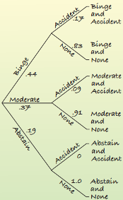

```{r, MEDskip, echo = FALSE}
library(knitr)
knit_hooks$set(document = function(x){
gsub("\\begin{tabular}", "\\medskip{}\\begin{tabular}", x, fixed = TRUE)
})
```


```{r setup, include = FALSE}
knitr::opts_chunk$set(echo = TRUE, comment = NA, warning = FALSE, message = FALSE, fig.align = 'center')
```


# Outline for the week

## By the end of the week:  Foundations of Probability

- Laws of probability
- Conditional probability
- Law of Total Probability 
- Bayes' Rule


#  Laws of probability

##  Basics of probability

- The set of all possible outcomes of a random experiment is called the sample space, $\Omega$. An event $E$ is a subset of $\Omega$. 

- Note: event $E$ can be an outcome or a combination of outcomes. 

- The probability of an event,$E$, is its **long term relative frequency**.


##  Basics of probability


- If the probability is based on repeatedly observing the event’s outcome,
this probability is called **empirical probability** and given by:
$$P(\text{E})=\frac{\text{Number of times E occurs}}{\text{Total number of trails}}$$
- When the probability comes from a mathematical model and not from
observations, it is called **theoretical probability**. This is given by:
$$P(\text{E})=\frac{\text{Number of outcomes in E}}{\text{Number of possible outcomes}}$$

##  Axioms of probability


1. For any event $E$: $0\leq P(E) \leq 1.$
      

2. $P(\Omega)=1$


3.  $P(E)+P(E^{c})=1$ so $P(E^c)=1-P(E)$

We define $E^{c}$ as a complement of $E$.  $E^{c}$ is the event of $E$ not happening. 

4. If E and F can not happen happen at the same time (mutually exclusive or disjoint), then
$$P(E \cup F)=P(E \text{ or } F)=P(E) + P(F)$$

In general, for any sequence of mutually exclusive events $E_1, E_2, \ldots$ (that is $E_i \cap E_j \neq 0$) for all ($i\neq j$)
$$P\left(\cup_{i=1}^{\infty} E_i\right)=\sum_{i=1}^{\infty} P(E_i)$$

## Example 1


\begin{tcolorbox}

In a dresser, there are 7 blue shirts, 5 red shirts,and 8 black shirts.

(a) What is the probability of randomly selecting a red shirt?

(b) What is the probability that a randomly selected shirt is not black?

\end{tcolorbox}

. . .

\begin{tcolorbox}
Solution.

(a) $P(\text{Red Shirt})=\frac{5}{7+5+8}=\frac{5}{20}=\frac{1}{4}$

(b) $P( \text{Not black})=1 - P(\text{Black})=1 - \left(\frac{8}{20}\right)=\frac{12}{20}=\frac{3}{5}$

\end{tcolorbox}


## Example 2: Birthday Problem


\begin{tcolorbox}

Suppose that a room contains $m$ students. What is the probability that at least two of them have the same birthday? Start by assuming every day of the year is equally likely to be a birthday, and disregard leap years. That is, assume there are always $n=365$ days to a year.

\end{tcolorbox}


## Example 2: Birthday Problem

\begin{tcolorbox}
Solution: Let the event $E$ denote two or more students with the same birthday. In this problem, it is easier to find $E^c$, as there are a number of ways that $E$ can take place. There are a total of $365^m$ possible outcomes in the sample space. $E^c$ can occur in $365\times364\times \cdots \times (365-m+1)$ ways. Consequently,
 
 $$P(E^c)=\frac{365\times 364\times\cdots \times(365-m+1)}{365^m}$$
 and 
 $$P(E)=1-\frac{365\times 364\times \cdots\times(365-m+1)}{365^m}$$
\end{tcolorbox}


## Some R


\scriptsize
```{r, out.width = '30%',out.height = '50%'}
m <- 1:60             # vector of number of students
p <- numeric(60)      # initialize vector to 0's
for(i in m){          # index value for loop
 q = prod((365:(365 - i + 1))/365)
 p[i] = 1 - q
}
plot(m, p, pch = 19,ylab = "P(at least two students with the same birthday)",
     xlab = "m = number of students in the room")
abline(h = 0.5, lty = 2, col = "blue")
abline(v = 23, lty = 2, col = "blue")
```
\normalsize


##  Addition Rules for Probability


- If E and F can not happen happen at the same time (mutually exclusive or disjoint), then
$$P(E \cup F)=P(E \text{ or } F)=P(E)+ P(F)$$

In general, for any sequence of mutually exclusive events $E_1, E_2, \ldots$ (that is $E_i \cap E_j \neq 0$) for all ($i\neq j$)
$$P\left(\cup_{i=1}^{\infty} E_i\right)=\sum_{i=1}^{\infty} P(E_i)$$


-  For any two events $E$ and $F$,
$$P(E \cup F)=P(E \text{ or } F)=P(E)+ P(F)-P(E\cap F)$$

## Example 3

\begin{tcolorbox}
What is the probability of drawing a diamond or a spade from a standard card deck?
\end{tcolorbox}

\begin{tcolorbox}
Solution:
Let $D$=event of drawing a diamond and $S$ = event of drawing a spade 

$$P(D\cup S)=P(D)+P(S) =\frac{13}{52} + \frac{13}{52} = \frac{26}{52} = 0.5 = 50\%$$
\end{tcolorbox}


## Example 4

\begin{tcolorbox}
What is the probability of drawing a diamond or an ace from a standard card deck?
\end{tcolorbox}

\begin{tcolorbox}
Solution:
Let $D$=event of drawing a diamond and $A$ = event of drawing an ace

$$P(D\cup A)=P(D)+P(A)-P(D\cap A) = \frac{13}{52} + \frac{4}{52}-\frac{1}{52} = \frac{15}{52} = 30.77\%$$
\end{tcolorbox}


## Example 5


\begin{tcolorbox}
A class with 30 students consists of 16 Math majors, 21 CS majors and 8 double CS and Math majors. If a student is randomly selected, what is the probability that the student is a Math major or a CS major?
\end{tcolorbox}

\begin{tcolorbox}
Solution:
Let $M$=math major and $C$ = CS major

$$P(M \cup C) = P(M)+P(C)-P(M \cap C) = \frac{16}{30}+\frac{21}{30}-\frac{8}{30} = \frac{29}{30}=96.67\%$$
\end{tcolorbox}


##  Multiplication Rules

- If $E$ and $F$ are independent

$$P(E \cap F) =P(E \text{ and } F)= P(E)\times P(F)$$

## Example 6

\begin{tcolorbox}
What is the probability of selecting 2 aces if 2 cards are randomly selected with replacement?
\end{tcolorbox}

\begin{tcolorbox}
Solution:
Let $A_1$ = $1^{\text{st}}$ card is an ace and $A_2$ = $2^{\text{nd}}$ card is an ace

$$P(A_1 \cap A_2) = P(A_1)\times P(A_2) = \frac{4}{52}\times\frac{4}{52} = `r (4/52)^2`$$
\end{tcolorbox}


## Conditional Probability and the General Multiplication Rule

- Another probability we want to be able to find is of the form "given $F$, what is the probability of $E$?" This is known as a **conditional probability** and is written
$$P(E | F)=\frac{P( E \cap  F)}{P( F)}$$


- Rearranging the conditional probability equation, we get the **General Multiplication Rule**:
$$P(E \cap F)=P( F)\times P(E| F)$$

Equivalently,
$$P(E \cap F)=P( E)\times P(F|E)$$


## Definition of Independence

- Events $E$ and $F$ are independent if knowing $E$ happened does not change the probability of $F$.  


$$P( E \cap  F)=P( E)\times P( F)$$
Then: 
$$P( E|  F)=\frac{P( E \cap  F)}{P( F)}=\frac{P( E)\times P( F)}{P( F)}=P( E)$$

- If $E$ and $F$ are independent then $P( E|  F)=P( E)$


- Equivalently

$$P(F|E)=P( F)$$


## Example 7

\begin{tcolorbox}
What is the probability of selecting 2 aces if 2 cards are randomly selected without replacement?
\end{tcolorbox}

\begin{tcolorbox}
Solution:
Let $A_1$= $1^{\text{st}}$ card is an ace and $A_2$ = $2^{\text{nd}}$ card is an ace

$$P(A_1 \cap A_2) = P(A_1)\times P(A_2|A_1) = \frac{4}{52}\times\frac{3}{51} = `r 4/52*3/51`$$
\end{tcolorbox}


## Example 8

\begin{tcolorbox}
Suppose two fair dice are rolled where each of the 36 possible outcomes is equally likely to occur. Knowing that the first die shows a 3, what is the probability that the sum of the two dice equals 6?
\end{tcolorbox}


\begin{tcolorbox}
Solution: 
Define "the sum of the dice equals 6" to be event $A$ and "3 on the first toss" to be event $B$. 
$$P(A|B)=\frac{P(A\cap B)}{P(B)}=\frac{1/36}{6/36}=\frac{1}{6}$$
\end{tcolorbox}


# Law of Total Probability and Bayes' Rule


## Example 1


\begin{tcolorbox}

According to a study by the Harvard School of Public Health, $44\%$ of college students engage in binge drinking, $37\%$ drink moderately, and $19\%$ abstain entirely. Another study, published in the American Journal of Health Behavior, finds that among binge drinkers aged 21 to 34, $17\%$ have been involved in an alcohol-related automobile accident, while among non-bingers of the same age, only $9\%$ have been involved in such accidents. $\textbf{Use a tree diagram}$. Find (a) $P(\text{none|binge})$ (b) $P(\text{moderate and accident})$ (c) $P(\text{none})$
(d) $P(\text{binge|accident})$
\end{tcolorbox}


## Example 1

\begin{tcolorbox}
Solution. 

```{r  echo=FALSE, out.width = '30%',out.height = '50%', fig.pos="h", fig.align='center'}

``` 

(a) $P(\text{none|binge})=0.83$

(b) $P(\text{moderate and accident})=0.37\times 0.09=0.0333$

(c) $P(\text{none})=(0.44\times0.83)+(0.37\times0.91)+(0.19\times1.0)=0.8919$


\end{tcolorbox}


## Example 1

\begin{tcolorbox}
Solution. 

(d) Work backwards


$$\begin{array}{ll}
 P(\text{binge|accident})&=\frac{P(\text{binge and accident})}{P(\text{accident})}\\
&=\frac{0.44\times 0.17}{(0.44\times0.17)+(0.37\times0.09)+(0.19\times 0)}\\
&=\frac{0.075}{0.108}\approx0.694
\end{array}$$ 


\end{tcolorbox}


## Law of Total Probability and Bayes' Rule

- Bayes’ Rule is used for reversing the condition

  - The formula is easier with the tree!
  
  
- In general: Let $F_1, F_2, \ldots F_n$ be such that $\cup_{i=1}^{\infty} F_i=\Omega$ and $F_i\cap F_j=0$ for all $i\neq j$, with $P(F_i)>0$ for all $i$. Then, for any event $E$

$$P(E)=\sum_{i=1}^n P(E \cap F_i)=\sum_{i=1}^n P(E|F_i)P(F_i)$$

$$P(F_i|E)=\frac{P(E \cap F_i)}{P(E)}=\frac{P(E|F_i)P(F_i)}{\sum_{i=1}^nP(E|F_i)P(F_i)}.$$


## Example 2

\begin{tcolorbox}
Dan's Diner employs three dishwashers. Al washes $20\%$ of the dishes and breaks only $1\%$ of those he handles. Betty and Chuck each wash $40\%$ of the dishes, and Betty breaks only $1\%$ of hers, but Chuck breaks $5\%$ of the dishes he washes. You go to Dan's for supper one night and hear a dish break at the sink. What's the probability that Chuck is on the job?


\end{tcolorbox}


## Example 2

\begin{tcolorbox}
Solution:  Let $A$= Al washes dishes, $B$= Betty washes dishes, and $C$ Chuck washes the dishes. Let $Br$= Breaking a dish. Then, we want to find $P(C|Br)$

$$\begin{array}{ll}
P(C|Br)=\frac{P(C\cap Br)}{P(Br)}&=\frac{P(Br|C)P(C)}{P(Br|A)P(A)+P(Br|B)P(B)+P(Br|C)P(C)}\\
&=\frac{0.05(0.4)}{0.01(0.2)+0.01(0.4)+0.05(0.4)}=0.769\end{array}$$
\end{tcolorbox}


## Choose a Door


\begin{tcolorbox}
The television show Let's Make a Deal hosted by Monty Hall, gave contestants the opportunity to choose one of three doors. Contestants hoped to choose the one that concealed the grand prize. Behind the other two doors were much less valuable prizes. After the contestant chose one of the doors, say Door 1, Monty opened one of the other two doors, say Door 3, containing a much less valuable prize. The contestant was then asked whether he or she wished to stay with the original choice (Door 1) or switch to the other closed door (Door 2). What should the contestant do? Is it better to stay with original choice of switch to the other closed door? (a) What is the probability of winning by switching doors when given the opportunity? (b) What is the probability of winning by staying with the initial selection?


\end{tcolorbox}


## Choose a Door: `R` Code

\small
```{r echo=TRUE, warning=FALSE, message=FALSE,out.height = '40%',out.width = '70%', fig.align='center'}
set.seed(13)
n <- 10000
actual <- sample(1:3, size = n, replace = TRUE)
aguess <- sample(1:3, size = n, replace = TRUE)
equals <- (actual == aguess)
not.eq <- (actual != aguess)
PnoSwitch <- mean(equals)
PwiSwitch <- mean(not.eq)
probs <- c(PnoSwitch, PwiSwitch)
names(probs) <- c("P(Win no Switch)", "P(Win Switch)")
probs
```
\normalsize


## Choose a Door: Solution

\begin{tcolorbox}
Solution: To solve with Bayes' Rule start by assuming the contestant initially guesses Door 1 and that Monty opens Door 3. The the event $D_i=$ Door $i$ conceals the prize and
$O_j=$ Monty opens Door $j$ after the contestant selects Door 1. When a contestant initially selects a door, $P(D_1)=P(D_2)=P(D_3)=1/3$. Once Monty show the grand prize is not behind Door 3, the probability of winning the grand prize is now one of $P(D_1|O_3)$ or $P(D_2|O_3)$. Note that $P(D_1|O_3)$ corresponds to the strategy of sticking with the initial guess and $P(D_2|O_3)$ corresponds to the strategy of switching doors.
\end{tcolorbox}


## Choose a Door: Solution

\begin{tcolorbox}
Solution: Based on how the show is designed, the following are known:

\begin{itemize}
\item  $P(O_3|D_1)=1/2$ since Monty can open one of either Door 3 or Door 2 without revealing the grand prize.

\item $P(O_3|D_2)=1$ since the only door Monty can open without revealing the grand prize is Door 3.

\item $P(O_3|D_3)=0$ since Monty will not open Door 3 if it contains the grand prize. 
\end{itemize}
\end{tcolorbox}


## Choose a Door: Solution

\begin{tcolorbox}
Solution: 

$$\begin{array}{ll}P(D_1|O_3)&=\frac{P(O_3|D_1)P(D_1)}{P(O_3|D_1)P(D_1)+P(O_3|D_2)P(D_2)+P(O_3|D_3)P(D_3)}\\
&=\frac{1/2 \cdot 1/3}{1/2 \cdot 1/3+1\cdot 1/3+0 \cdot 1/3}=\frac{1}{3}\end{array}.$$


$$\begin{array}{ll}
P(D_2|O_3)&=\frac{P(O_3|D_2)P(D_2)}{P(O_3|D_1)P(D_1)+P(O_3|D_2)P(D_2)+P(O_3|D_3)P(D_3)}\\
&=\frac{1 \cdot 1/3}{1/2 \cdot 1/3+1\cdot 1/3+0 \cdot 1/3}=\frac{2}{3}\end{array}.$$

\end{tcolorbox}


## Monte Hall Problem with $n$ Doors

- Consider the case with $n$ Doors and just one grand prize

    - The probability of winning the grand prize on the first choice is $\frac{1}{n}$. 
    - This is the same probability of winning if you were to use the "stay" strategy. 
    
- You will win the grand prize if both of the following events occur:

    - You choose a door that does not have the grand prize. Note: $P(G)=\frac{n-1}{n}$. 
    - You choose the door with the grand prize by switching doors $P(C|G)=\frac{1}{n-2}$.


## Monte Hall Problem with $n$ Doors

In other words, the probability of winning using the "switch" strategy is
$$P(G \cap C)=P(G)\cdot P(C|G)=\frac{n-1}{n}\cdot \frac{1}{n-2}=\frac{n-1}{n(n-2)}$$
For $n=3$ doors, the probability of winning with the "switch" strategy is:
$$\frac{n-1}{n(n-2)}=\frac{3-1}{3(3-2)}=\frac{2}{3}$$
Note:
$$\frac{n-1}{n(n-2)}> \frac{1}{n}$$
This implies switching is always better. 


