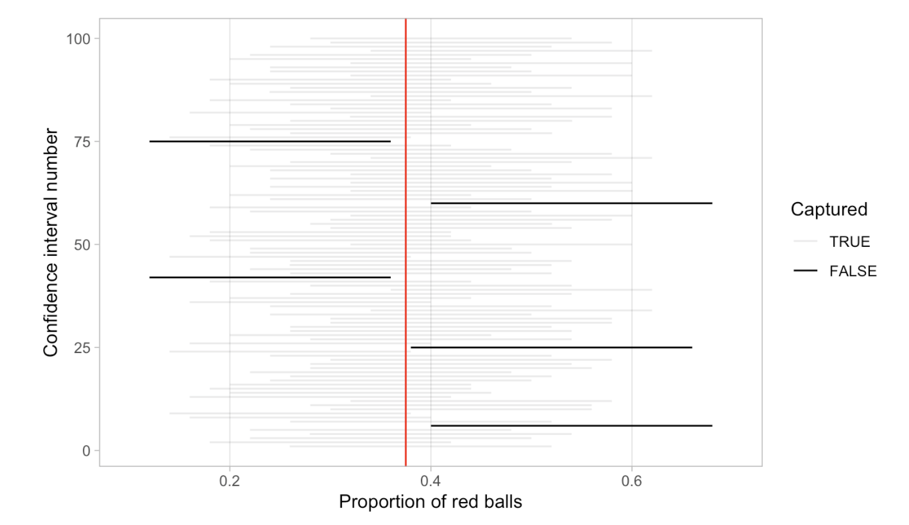
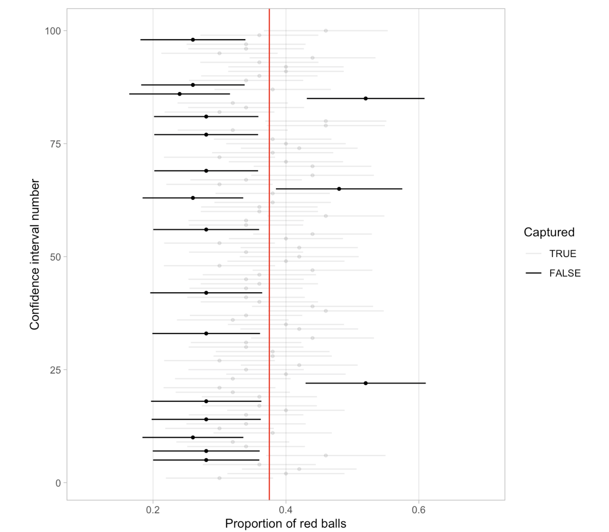

```{r, MEDskip, echo = FALSE}
library(knitr)
knit_hooks$set(document = function(x){
gsub("\\begin{tabular}", "\\medskip{}\\begin{tabular}", x, fixed = TRUE)
})
```


```{r setup, include = FALSE}
knitr::opts_chunk$set(echo = TRUE, comment = NA, warning = FALSE, message = FALSE, fig.align = 'center')
```


# Outline for the week

## By the end of the week:  Bootstrapping and Confidence Intervals


- Key features of the Bootstrap and understanding confidence intervals

- Constructing and interpreting confidence intervals

- Two sample bootstrap

- Theory-based confidence intervals (mean (sigma known) , mean (sigma unknown), assumptions underlying t-confidence interval)

# Key features of the Bootstrap


## Needed packages

\small
```{r}
library(tidyverse)
library(moderndive)
library(infer)
library(resampledata)
```
\normalsize


## Key features of the Bootstrap: Example 1


To highlight some key features of the bootstrap distribution:

- Consider two examples in which the theoretical sampling distributions of the mean are known.

- Example 1: Consider a random sample of size 49 drawn from a $N(25, 7)$. 

  - Theory tells us that that the sampling distribution of the sample means is normal with mean 25 and standard error $\sigma_{\bar{x}}=7/\sqrt{49}=1$. 
    
    

## Key features of the Bootstrap: Example 1

\tiny
```{r, eval = FALSE}
set.seed(11)
par(mfrow = c(3, 2))
curve(dnorm(x, 25, 7), from = 25 - 2.5*7, 25 + 2.5*7, col = "blue", main = "N(25, 7)", ylab = "", xlab = "")
abline(v = 25, col = "red")
curve(dnorm(x, 25, 1), from = 25 - 2.5*7, 25 + 2.5*7, col = "blue", main = "N(25, 1)", ylab = "", xlab = "")
abline(v = 25, col = "red")
rs1 <- rnorm(49, 25, 7)
rs2 <- rnorm(49, 25, 7)
hist(rs1, xlab = "", main = "n = 49")
abline(v = mean(rs1), col = "red")
B <- 10000
my.boot.stat1 <- numeric(B)
my.boot.stat2 <- numeric(B)
for (i in 1:B){
  x1 <- sample(rs1, size = 49, replace = TRUE) 
  x2 <- sample(rs2, size = 49, replace = TRUE) 
  my.boot.stat1[i] <- mean(x1)
  my.boot.stat2[i] <- mean(x2)
}
hist(my.boot.stat1, breaks = "Scott",  main ="Bootstrap Distribution", freq= FALSE, xlab = "", 
xlim = c(25 - 2.5*7, 25 + 2.5*7))
abline(v = mean(rs1), col = "red")
hist(rs2, xlab = "", main = "n = 49")
abline(v = mean(rs2), col = "red")
hist(my.boot.stat2, breaks = "Scott",  main ="Bootstrap Distribution", freq= FALSE, xlab = "", 
xlim = c(25 - 2.5*7, 25 + 2.5*7))
abline(v = mean(rs2), col = "red")
c(mean(rs1), sd(rs1), mean(rs2), sd(rs2), 
  mean(my.boot.stat1), sd(my.boot.stat1), mean(my.boot.stat2), sd(my.boot.stat2))
```
\normalsize


## Key features of the Bootstrap: Example 1


\tiny
```{r, echo = FALSE, out.height = '75%', out.width = '90%'}
set.seed(11)
par(mfrow = c(3, 2))
curve(dnorm(x, 25, 7), from = 25 - 2.5*7, 25 + 2.5*7, col = "blue", main = "N(25, 7)", ylab = "", xlab = "")
abline(v = 25, col = "red")
curve(dnorm(x, 25, 1), from = 25 - 2.5*7, 25 + 2.5*7, col = "blue", main = "N(25, 1)", ylab = "", xlab = "")
abline(v = 25, col = "red")
rs1 <- rnorm(49, 25, 7); rs2 <- rnorm(49, 25, 7)
hist(rs1, xlab = "", main = "n = 49")
abline(v = mean(rs1), col = "red")
B <- 10000
my.boot.stat1 <- numeric(B); my.boot.stat2 <- numeric(B)
for (i in 1:B){
  x1 <- sample(rs1, size = 49, replace = TRUE) 
  x2 <- sample(rs2, size = 49, replace = TRUE) 
  my.boot.stat1[i] <- mean(x1)
  my.boot.stat2[i] <- mean(x2)
}
hist(my.boot.stat1, breaks = "Scott",  main ="Bootstrap Distribution", freq= FALSE, xlab = "", 
xlim = c(25 - 2.5*7, 25 + 2.5*7))
abline(v = mean(rs1), col = "red")
hist(rs2, xlab = "", main = "n = 49")
abline(v = mean(rs2), col = "red")
hist(my.boot.stat2, breaks = "Scott",  main ="Bootstrap Distribution", freq= FALSE, xlab = "", 
xlim = c(25 - 2.5*7, 25 + 2.5*7))
abline(v = mean(rs2), col = "red")
c(mean(rs1), sd(rs1), mean(rs2), sd(rs2), 
  mean(my.boot.stat1), sd(my.boot.stat1), mean(my.boot.stat2), sd(my.boot.stat2))
```
\normalsize


## Key features of the Bootstrap: Example 1

- The previous code shows the distributions of two such random samples with sample means:

    - $\bar{x}_1=`r mean(rs1)`$ and, $\bar{x}_2=`r mean(rs2)`$
    - $s_1= `r sd(rs1)`$ and, $s_2= `r sd(rs2)`$

- Based on the graphs above, we can see that the bootstrap distribution:

    - has roughly the same spread and shape as the theoretical sampling distribution,
    - but the centers are different compared to the theoretical sampling distribution. 


## Key features of the Bootstrap: Example 1


- This example illustrates some important features of the bootstrap that hold for other statistics besides the mean: 

  - the bootstrap distribution of a particular statistic $\hat{\theta}$ has approximately the same spread and shape as the sampling distribution of the statistic $\hat{\theta}$, but 
  - the center of the bootstrap distribution is at the center of the original sample. 

- Hence we do not use the center of the bootstrap distribution in its own right, but we do compare the center of the bootstrap distribution with the observed statistic; if they differ, it indicates bias.

- For most statistics, bootstrap distributions approximate the spread, bias, and shape of the actual sampling distribution.


## Key features of the Bootstrap: Example 2

We now consider an example where neither the population nor the sampling distribution is normal. 
 
- A random variable $X$ that has a Gamma distribution is written $X\sim \Gamma(\alpha, \lambda)$. 

- If $X$ is a Gamma random variable, then:
$$E[X]=\alpha/\lambda \quad \quad \text{and} \quad \quad Var[X]=\alpha/\lambda^2.$$
 
 
- Let $X_1, \ldots, X_n\sim \Gamma(\alpha, \lambda)$. 

  - It is a fact that the sampling distribution of the mean $\bar{X}$ is $\Gamma(n\alpha, n\lambda)$. 
      
- We draw a random sample of size $n=16$ from a $\Gamma(\alpha=1, \lambda=1/2)$ (population mean 2, standard deviation 0.5).


## Key features of the Bootstrap: Example 2

\tiny
```{r echo = TRUE, eval = FALSE}
set.seed(281)
par(mfrow = c(3, 2))
curve(dgamma(x, 1, 1/2), from = 0, to = 8, col = "blue", main = "Gamma(1, 1/2)", ylab = "", xlab = "")
abline(v = 2, col = "red")
curve(dgamma(x, 16, 8), from = 0, 8, col = "blue", main = "Gamma(16, 8)", ylab = "", xlab = "")
abline(v = 2, col = "red")
rsg1 <- rgamma(16, 1, 1/2)
rsg2 <- rgamma(16, 1, 1/2)
hist(rsg1, xlab = "", main = "n = 16", xlim = c(0, 8))
abline(v = mean(rsg1), col = "red")
B <- 10000
my.boot.statg1 <- numeric(B)
my.boot.statg2 <- numeric(B)
for (i in 1:B){
  xg1 <- sample(rsg1, size = 16, replace = TRUE)
  xg2 <- sample(rsg2, size = 16, replace = TRUE)
  my.boot.statg1[i] <- mean(xg1)
  my.boot.statg2[i] <- mean(xg2)
}
hist(my.boot.statg1, breaks = "Scott",  main ="Bootstrap Distribution", freq= FALSE, xlab = "", 
xlim = c(0, 8))
abline(v = mean(rsg1), col = "red")
hist(rsg2, xlab = "", main = "n = 16", xlim = c(0, 8))
abline(v = mean(rsg2), col = "red")
hist(my.boot.statg2, breaks = "Scott",  main ="Bootstrap Distribution", freq= FALSE, xlab = "", 
xlim = c(0, 8))
abline(v = mean(rsg2), col = "red")
```
\normalsize


## Key features of the Bootstrap: Example 2


\tiny
```{r echo = FALSE, out.height = '75%', out.width = '90%'}
set.seed(281)
par(mfrow = c(3, 2))
curve(dgamma(x, 1, 1/2), from = 0, to = 8, col = "blue", main = "Gamma(1, 1/2)", ylab = "", xlab = "")
abline(v = 2, col = "red")
curve(dgamma(x, 16, 8), from = 0, 8, col = "blue", main = "Gamma(16, 8)", ylab = "", xlab = "")
abline(v = 2, col = "red")
rsg1 <- rgamma(16, 1, 1/2)
rsg2 <- rgamma(16, 1, 1/2)
hist(rsg1, xlab = "", main = "n = 16", xlim = c(0, 8))
abline(v = mean(rsg1), col = "red")
B <- 10000
my.boot.statg1 <- numeric(B)
my.boot.statg2 <- numeric(B)
for (i in 1:B){
  xg1 <- sample(rsg1, size = 16, replace = TRUE)
  xg2 <- sample(rsg2, size = 16, replace = TRUE)
  my.boot.statg1[i] <- mean(xg1)
  my.boot.statg2[i] <- mean(xg2)
}
hist(my.boot.statg1, breaks = "Scott",  main ="Bootstrap Distribution", freq= FALSE, xlab = "", 
xlim = c(0, 8))
abline(v = mean(rsg1), col = "red")
hist(rsg2, xlab = "", main = "n = 16", xlim = c(0, 8))
abline(v = mean(rsg2), col = "red")
hist(my.boot.statg2, breaks = "Scott",  main ="Bootstrap Distribution", freq= FALSE, xlab = "", 
xlim = c(0, 8))
abline(v = mean(rsg2), col = "red")
```
\normalsize


## Key features of the Bootstrap: Example 2


- The first graph in the second and third rows shows the distribution of a random sample with sample means and standard deviations

    - $\bar{x}_1= `r mean(rsg1)`$ and, $\bar{x}_2=`r mean(rsg2)`$
    - $s_1= `r sd(rsg1)`$ and, $s_2=`r sd(rsg2)`$

- Based on the graphs above, we can see that the bootstrap distribution:

  - has roughly the same spread and shape as the theoretical sampling distribution,
  - but the centers are different compared to the theoretical sampling distribution. 


## Key features of the Bootstrap

For most common estimators and under fairly general distribution assumptions, the following need to be noted:


- **Center**: The center of the bootstrap distribution is not an accurate approximation for the center of the sampling distribution. 

    - For example, the center of the bootstrap distribution for $\bar{X}$ is centered at approximately $\bar{x}=\mu_{\hat{F}}$, the mean of the sample, whereas 
    - the sampling distribution is centered at $\mu$.

- **Spread**: The spread of the bootstrap distribution does reflect the spread of the sampling distribution.

- **Bias**: The bootstrap bias estimate does reflect the bias of the sampling distribution. Bias occurs if a sampling distribution is not centered at the parameter.

- **Skewness**: The skewness of the bootstrap distribution does reflect the skewness of the sampling distribution.


## Key features of the Bootstrap


- The first point bears emphasis. 

    - It means that the bootstrap is not used to get better parameter estimates because the bootstrap distributions are centered around statistics $\hat{\theta}$ calculated from the data rather than unknown population values. 
    - Drawing thousands of bootstrap observations from the original data is not like drawing observations from the underlying population, it does not create new data.

- Instead, the bootstrap distribution is useful for quantifying the behavior of a parameter estimate such as its :

    - standard error, 
    - skewness, bias, or 
    - for calculating confidence intervals.


## Key features of the Bootstrap: Example 3


\begin{tcolorbox}
Arsenic is a naturally occurring element in the groundwater of Bangladesh. However, much of this groundwater is used for drinking water by rural populations, so arsenic poisoning is a serious health issue. Figure 1a displays the distribution of arsenic concentrations from 271 wells in Bangladesh. The sample mean and standard deviation are $\bar{x}=`r round(mean(Bangladesh$Arsenic),2)`$ and $s =`r round(sd(Bangladesh$Arsenic), 2)`$, respectively (measured in micrograms per liter). We draw resamples of size 271 with replacement from the data and compute the mean for each resample.
\end{tcolorbox}


## Key features of the Bootstrap: Example 3


\tiny
```{r eval=FALSE}
par(mfrow = c(2, 2))
Bang <- Bangladesh
Arsenic <- Bang$Arsenic
hist(Arsenic, breaks = "Scott", main = "Figure 1a", col = "lightblue")
qqnorm(Arsenic, main = "Figure 1b")
qqline(Arsenic, col = "red")
B <- 10000
n <- sum(!is.na(Arsenic))
arsenic.mean <- numeric(B)
set.seed(7)
for (i in 1:B){
  x <- sample(Arsenic, size = n, replace = TRUE)
  arsenic.mean[i] <- mean(x)
}
hist(arsenic.mean, main = "Figure 2a", col = "lightblue", breaks = "Scott", 
     xlab = substitute(paste(bar(X),"*")))
qqnorm(arsenic.mean, main = "Figure 2b")
qqline(arsenic.mean, col = "red")
```
\normalsize


## Key features of the Bootstrap: Example 3


\tiny
```{r echo = FALSE, out.height = '85%',out.width = '90%'}
par(mfrow = c(2, 2))
Bang <- Bangladesh
Arsenic <- Bang$Arsenic
hist(Arsenic, breaks = "Scott", main = "Figure 1a", col = "lightblue")
qqnorm(Arsenic, main = "Figure 1b")
qqline(Arsenic, col = "red")
B <- 10000
n <- sum(!is.na(Arsenic))
arsenic.mean <- numeric(B)
set.seed(7)
for (i in 1:B){
  x <- sample(Arsenic, size = n, replace = TRUE)
  arsenic.mean[i] <- mean(x)
}
hist(arsenic.mean, main = "Figure 2a", col = "lightblue", breaks = "Scott", xlab = substitute(paste(bar(X),"*")))
qqnorm(arsenic.mean, main = "Figure 2b")
qqline(arsenic.mean, col = "red")
```
\normalsize


## Key features of the Bootstrap: Example 3


- Figures 2a and 2b show a histogram and a normal quantile plot of the bootstrap distribution, respectively. 

- The bootstrap distribution looks quite normal, with some skewness. 

- This is the central limit theorem at work—when the sample size is large enough, the sampling distribution for the mean is approximately normal, even if the population is not normal.


# Understanding confidence intervals

## Understanding confidence intervals

- Let’s start this section with an analogy involving fishing. Say you are trying to catch a fish. 

  - On one hand, you could use a spear, while on the other 
  - you could use a net. Using the net will probably allow you to catch more fish!


- Now think back to our pennies exercise where you are trying to estimate the true population mean year $\mu$ of all US pennies. 

  - Think of the value of $\mu$ as a fish.
    

## Understanding confidence intervals

- On the one hand, we could use the appropriate point estimate/sample statistic to estimate $\mu$, with the sample mean $\bar{x}$.


- Based on our sample of 50 pennies from the bank (using the tibble `pennies_sample`), the sample mean of `year` was `r mean(pennies_sample$year)`. 

  - Think of using this value as “fishing with a spear.”

- What would “fishing with a net” correspond to?

  - The bootstrap distribution. 
  - Between which two years would you say that “most” sample means lie? 
  - While this question is somewhat subjective, saying that most sample means lie between 1992 and 2000 would not be unreasonable. 
  - Think of this interval as the “net.”
 
 
 - What we’ve just illustrated is the concept of a confidence interval, which we’ll abbreviate with “CI”.
 
 
## Understanding confidence intervals
 
 
- As opposed to a point estimate/sample statistic that estimates the value of an unknown population parameter with a single value, a **confidence interval** gives what can be interpreted as a range of plausible values. 

- Going back to our analogy, point estimates/sample statistics can be thought of as spears, whereas confidence intervals can be thought of as nets.
 

```{r echo = FALSE, out.height = '40%',out.width = '70%'}

```


## Percentile method

\small
```{r}
pennies_sample %>% 
  specify(response = year) %>% 
  generate(reps = 1000, type = "bootstrap") %>% 
  calculate(stat = "mean") -> bs_dist
bs_dist %>% 
  summarize(lci = quantile(stat, probs = 0.025), 
            uci = quantile(stat, probs = 0.975)) -> CI
CI
```
\normalsize

## Percentile method
\small
```{r, label = "bsci", fig.cap = "Bootstrap Distribution with percentile CI limits", out.height = '40%', out.width = '50%'}
get_confidence_interval(bs_dist, level = 0.95)
visualize(bs_dist) + 
  shade_confidence_interval(endpoints = CI)
```
\normalsize


## Percentile method


One method to construct a confidence interval 

- To get the middle $95\%$ of values of the bootstrap distribution: 
    
    - We can do this by computing the 2.5th and 97.5th percentiles, 
    - which are `r round(CI$lci,0)` and `r round(CI$uci,0)`, respectively. 
    - This is known as the percentile method for constructing confidence intervals.


## Standard error method


- Given that our bootstrap distribution based on 1000 resamples with replacement in Figure \@ref(fig:bsci) is normally shaped, 

  - let’s use this fact about normal distributions to construct a confidence interval in a different way.

- First, note that the bootstrap distribution has a mean equal to `r round(mean(bs_dist$stat),2)`. 

    - This value almost coincides exactly with the value of the sample mean $\bar{x}$  of our original 50 pennies of 1995.44.

- Second, let’s compute the standard deviation of the bootstrap distribution using the values of `mean_year` in the `virtual_resampled_means` data frame:


## Standard error method


```{r echo = TRUE}
set.seed(10)
virtual_resampled_means <- pennies_sample %>% 
  rep_sample_n(size = 50, replace = TRUE, reps = 1000) %>% 
  group_by(replicate) %>% 
  summarize(mean_year = mean(year))
virtual_resampled_means %>% summarize(SE = sd(mean_year))
```


## Standard error method 

Recall that for a normal distribution, roughly $95\%$ of values fall between $\pm1.96$ standard deviations of the mean.


- Thus, using our $95\%$ rule of thumb about normal distributions, we can use the following formula to determine the lower and upper endpoints of a 95% confidence interval for $\mu$.


$$\begin{array}{ll}
\bar{x}\pm1.96\cdot SE&=(\bar{x}-1.96\cdot SE, \bar{x}+1.96\cdot SE)\\
&=(1995.44-1.96\cdot 2.14, 1995.44+1.96\cdot2.14)\\
&=(1991.25,1999.63)
\end{array}$$


## Standard error method vs. Percentile method


- We see that both methods produce nearly identical $95\%$ confidence intervals for  $\mu$ 

  - with the percentile method yielding $(1991, 2000)$
  - while the standard error method produces $(1991.25, 1999.63)$

- However, we can only use the standard error rule when the bootstrap distribution is roughly normally shaped.


# Constructing confidence intervals

## Percentile method example: Pennies Activity

Using `rep_sample_n` from the `infer` package. 

\tiny
```{r echo = TRUE, out.height = '40%',out.width = '60%'}
set.seed(10)
virtual_resampled_means <- pennies_sample %>% 
  rep_sample_n(size = 50, replace = TRUE, reps = 1000) %>% 
  group_by(replicate) %>% 
  summarize(mean_year = mean(year))
ggplot(virtual_resampled_means, aes(x = mean_year)) +
  geom_histogram(binwidth = 1, color = "white", boundary = 1990) +
  labs(x = "sample mean") +
  theme_bw()
```
\normalsize


## Percentile method example: Pennies Activity

Using `rep_sample_n` from the `infer` package. 


```{r}
quantile(virtual_resampled_means$mean_year, prob = c(0.025, 0.975))
```


## Percentile method example: Pennies Activity

Using the `infer` pipeline

\tiny
```{r echo=TRUE, warning=FALSE, message=FALSE,out.height = '50%',out.width = '70%', fig.align='center'}
set.seed(10)
bootstrap_distribution <- pennies_sample %>% 
  specify(response = year) %>% 
  generate(reps = 1000) %>% 
  calculate(stat = "mean")
visualize(bootstrap_distribution)
```
\normalsize


## Percentile method example: Pennies Activity

Using the `infer` pipeline

\tiny
```{r echo=TRUE, warning=FALSE, message=FALSE,out.height = '40%',out.width = '70%', fig.align='center'}
percentile_ci <- bootstrap_distribution %>% 
  get_confidence_interval(level = 0.95, type = "percentile")
percentile_ci
visualize(bootstrap_distribution) + 
  shade_confidence_interval(endpoints = percentile_ci)
```
\normalsize


## Standard error example: Pennies Activity

Using the `infer` pipeline

\tiny
```{r out.height = '40%', out.width = '70%'}
x_bar <- pennies_sample %>% summarize(mean_year = mean(year))
standard_error_ci <- bootstrap_distribution %>% 
  get_confidence_interval(type = "se", point_estimate = x_bar, level = 0.95)
standard_error_ci
visualize(bootstrap_distribution) + 
  shade_confidence_interval(endpoints = standard_error_ci)
```
\normalsize


## Percentile method example: Birth weight of a baby

Using the `infer` pipeline


\tiny
```{r out.height = '45%', out.width = '70%'}
library(resampledata)
Babies <- NCBirths2004
set.seed(13)
bsd <- Babies %>% 
  specify(response = Weight) %>% 
  generate(reps = 10^4, type = "bootstrap") %>% 
  calculate(stat = "mean")
visualize(bsd)
```
\normalsize


## Percentile method example: Birth weight of a baby

Using the `infer` pipeline


\tiny
```{r out.height = '45%', out.width = '70%'}
percentile_ci <- bsd %>% 
  get_confidence_interval(level = 0.95, type = "percentile")
percentile_ci
visualize(bsd) + 
  shade_confidence_interval(endpoints = percentile_ci)
```
\normalsize


## Standard error example: Birth weight of a baby

Using the `infer` pipeline

\tiny
```{r echo=TRUE, warning=FALSE, message=FALSE,out.height = '40%',out.width = '70%', fig.align='center'}
x_bar_babies<-Babies %>% summarize(Mean = mean(Weight))
standard_error_ci <- bsd %>% 
  get_confidence_interval(type = "se", point_estimate = x_bar_babies, level = 0.95)
standard_error_ci
visualize(bsd) + 
  shade_confidence_interval(endpoints = standard_error_ci)
```
\normalsize


# Interpreting confidence intervals

## Interpreting confidence intervals


- Now that we’ve shown you how to construct confidence intervals using a sample drawn from a population, let’s now focus on how to interpret their effectiveness. 

- The effectiveness of a confidence interval is judged by whether or not it contains the true value of the population parameter. 

- Going back to our fishing analogy, this is like asking, “Did our net capture the fish?”.

  - So, for example, does our percentile-based confidence interval of (1991.24, 1999.42) "capture” the true mean year $\mu$ of all US pennies? 
  - Alas, we’ll never know, because we don’t know what the true value of $\mu$ is. 
  - After all, we’re sampling to estimate it!


## Interpreting confidence intervals

- In order to interpret a confidence interval’s effectiveness, we need to know what the value of the population parameter is. 

  - That way we can say whether or not a confidence interval “captured” this value.


- Let’s revisit our sampling bowl example. What proportion of the bowl’s 2400 balls are red? Let’s compute this:


```{r}
bowl %>% summarize(p_red = mean(color == "red"))
```


In this case we know that the population proportion $p$ is 0.375. In other words, we know that $37.5\%$ of the bowl’s balls are red.


## Interpreting confidence intervals

- Recall that we had 33 groups of friends each take samples of size 50 from the bowl and then compute the sample proportion of red balls $\hat{p}$. 

  - Let's use the `bowl_sample_1` data frame in the `moderndive` package

\tiny
```{r echo=TRUE, warning=FALSE, message=FALSE,out.height = '40%',out.width = '70%', fig.align='center'}
bowl_sample_1
```
\normalsize


- They observed 21 red balls out of 50 and thus their sample proportion  $\hat{p}=21/50 = 0.42 = 42\%$. 

  - Think of this as the “spear” from our fishing analogy.
    

## Percentile method example: sampling bowl example

Using the `infer` pipeline


```{r}
set.seed(10)
sample_1_bootstrap <- bowl_sample_1 %>% 
  specify(response = color, success = "red") %>% 
  generate(reps = 1000, type = "bootstrap") %>% 
  calculate(stat = "prop")
percentile_ci_1 <- sample_1_bootstrap %>% 
  get_confidence_interval(level = 0.95, type = "percentile")
percentile_ci_1
```


## Percentile method example: sampling bowl example

Using the `infer` pipeline


\tiny
```{r echo=TRUE, warning=FALSE, message=FALSE,out.height = '45%',out.width = '70%', fig.align='center'}
sample_1_bootstrap %>% 
  visualize(bins = 15) + 
  shade_confidence_interval(endpoints = percentile_ci_1) +
  geom_vline(xintercept = 0.42, linetype = "dashed")
```
\normalsize

In this case the $95\%$ confidence interval for $p$, (0.3,0.56),  contains the true value of 0.375. 


## Interpreting confidence intervals: Sampling bowl example

- However, will every $95\%$ confidence interval for $p$ capture this value?

- Let’s now repeat this process 100 more times: we take 100 virtual samples from the bowl and construct 100 $95\%$ confidence intervals.


 \tiny
```{r echo = FALSE, out.height = '40%',out.width = '60%'}

```
\normalsize


- Of the 100 $95\%$ confidence intervals, 95 of them captured the true value $p=0.375$, whereas 5 of them didn’t. 

  - This is where the “$95\%$ confidence level” comes into play. 


## Interpreting confidence intervals: Sampling bowl example

- Below is a graph for 100 $80\%$ confidence intervals.

 \tiny
```{r echo = FALSE, out.height = '50%', out.width = '60%'}

```
\normalsize

- Of the 100 $80\%$ confidence intervals, 82 of them captured the true value $p=0.375$, whereas 18 of them didn’t. 
 


## Interpreting confidence intervals


The precise and mathematically correct interpretation of a $95\%$ confidence interval is a little long-winded:


\begin{tcolorbox}
Precise interpretation: If we repeated our sampling procedure a large number of times, we expect about $95\%$ of the resulting confidence intervals to capture the value of the population parameter.
\end{tcolorbox}


The shorthand summary of the precise interpretation:

\begin{tcolorbox}
Short-hand interpretation: We are $95\%$ “confident” that a $95\%$ confidence interval captures the value of the population parameter.
\end{tcolorbox}


## Width of confidence intervals


Let’s go over some factors that determine their width.

1. Impact of confidence level.

2. Impact of sample size.


# Two Sample Boostrap

## Two Sample Boostrap

We now turn to the problem of comparing two samples. 

- In general, bootstrapping should mimic how the data were obtained. 

  - So the data correspond to independent samples from two populations, we should draw the samples that way. 
    
- Then we proceed to compute the same statistic comparing the samples as per the original data, for example, difference in means or ratio of proportions.


## Two Sample Boostrap

Given independent samples of sizes $m$ and $n$ from two populations,

1. Draw a resample of size $m$ with replacement from the first sample and a separate resample of size $n$ for the second sample. Compute a statistic that compares the two groups, such as the difference between the two sample means.

2. Repeat this resampling process many times say 10,000.

3. Construct the bootstrap distribution of the statistic. Inspect its spread, bias, and shape.


## TV example


\begin{tcolorbox}
A high school student was curious about the total number of minutes devoted to commercials during any given half-hour time period on basic and extended cable TV channels.
\end{tcolorbox}


Lets use the `TV` dataset from the `resampledata` package. 
\small
```{r}
library(resampledata)
library(tidyverse)
library(moderndive)
library(infer)
head(TV)
```
\normalsize


## TV example

\small
```{r}
ct <- tapply(TV$Times, TV$Cable, mean)
ct
# Tidy approach
TV %>%
  group_by(Cable) %>%
  summarize(Means = mean(Times), n = n())
```
\normalsize

- The means of the basic and extended channel commercial times are 9.21 and 6.87 min.

  - Is this difference of 2.34 min. statistically significant?


## TV example

- The original data are simple random samples of size 10 from two populations. 

    - We draw a bootstrap sample from the basic channel data and independently draw a bootstrap sample from the extended channel data, 
    - compute the means for each sample, and take the difference.


## TV example

\tiny
```{r}
times.Basic <- subset(TV, select = Times, 
                      subset = Cable == "Basic", drop = TRUE)
times.Ext <- subset(TV, select = Times, 
                    subset = Cable == "Extended", drop = TRUE)
B <- 10^4
times.diff.mean <- numeric(B)
set.seed(5)
for (i in 1:B){
  Basic.sample <- sample(times.Basic, 
                  size = sum(!is.na(times.Basic)), replace = TRUE)
  Ext.sample <- sample(times.Ext,
                  size = sum(!is.na(times.Ext)), replace = TRUE)
  times.diff.mean[i] <- mean(Basic.sample) - mean(Ext.sample)
}
opar <- par(no.readonly = TRUE)
par(mfrow=c(1, 2))
CI <- quantile(times.diff.mean, prob = c(0.025, 0.975))
CI
```
\normalsize


## TV example

\tiny
```{r echo=TRUE, warning=FALSE, message=FALSE,out.height = '43%',out.width = '70%', fig.align='center'}
par(mfrow = c(1, 2))
hist(times.diff.mean, breaks = "Scott", freq=FALSE, 
     main = "Bootstrap Distribution \n (Figure a)", 
     xlab = substitute(paste(bar(x)[1],"*", - bar(x)[2],"*")), 
     col = "lightblue")
abline(v = c(0, CI), col = c("blue", "red", "red"), lwd = 2, 
       lty = c("solid", "dashed", "dashed"))
qqnorm(times.diff.mean, main = "Normal Q-Q Plot \n (Figure b)")
qqline(times.diff.mean, col = "red")
sd(times.diff.mean)
```
\normalsize


## TV example

- Figure a shows the bootstrap distribution of the difference of sample means. 

    - As in the single sample case, we see that the bootstrap distribution is approximately normal and centered at the original statistics (the difference in sample means). 
    - We also get a quick idea of how much the difference in sample means varies due to random sampling. 
    - We may quantify this variation by computing the bootstrap standard error, which is 0.7552861. Again, the bootstrap standard error is the standard error of the sampling distribution.

- The right panel of Figure b shows a normal-quantile plot for the bootstrap distribution: the distribution is very close to normal.


- The $95\%$ bootstrap percentile confidence interval for the difference in means (basic- extended) is (0.9, 3.86). 

    - Thus, we are $95\%$ confident that commercial times on basic channels are, on average, between 0.9 and 3.86 min. 
    - longer than on extended channels (per half-hour time periods).


## TV example

Using the `infer` pipeline


\tiny
```{r echo=TRUE, warning=FALSE, message=FALSE,out.height = '45%',out.width = '70%', fig.align='center'}
set.seed(5)
TV %>% 
  specify(Times ~ Cable) %>% 
  generate(reps = 10^4 - 1, type = "bootstrap") %>% 
  calculate(stat = "diff in means", order = c("Basic", "Extended")) -> bootdist
visualize(bootdist) + theme_bw() +
  labs(x = substitute(paste(bar(x)[basic],"*", - bar(x)[extended],"*")))
```
\normalsize


## TV example

Using the `infer` pipeline


\tiny
```{r echo=TRUE, warning=FALSE, message=FALSE,out.height = '38%',out.width = '60%', fig.align='center'}
get_confidence_interval(bootdist, level = 0.95) -> CI2
CI2
###
visualize(bootdist) + theme_bw() +
  labs(x = substitute(paste(bar(x)[basic],"*", - bar(x)[extended],"*"))) + 
  shade_confidence_interval(endpoints = CI2) + 
  geom_vline(xintercept = 0, color = "purple", size = 2)
```
\normalsize


## Verizon example


\begin{tcolorbox}
Verizon is the primary local telephone company (incumbent local exchange carrier, ILEC) for a large area of the eastern United States. As such it is responsible for providing repair service for the customers of other telephone companies known as competing local exchange carriers (CLECs) in this region. Verizon is subject to fines if the repair times (the time it takes to fix a problem) for CLEC customers are substantially worse than those for Verizon customers. The data set Verizon contains a random sample of repair times for 1664 ILEC and 23 CLEC customers.
\end{tcolorbox}


## Verizon example

\tiny
```{r echo=TRUE, warning=FALSE, message=FALSE,out.height = '38%',out.width = '60%', fig.align='center'}
Phone <- Verizon
rt <- tapply(Phone$Time, Phone$Group, mean)
rt
# Tidy approach
Phone %>% 
  group_by(Group) %>% 
  summarize(Mean = mean(Time), n = n(), SD = sd(Time))
```
\normalsize


## Verizon example

\tiny
```{r echo=TRUE, warning=FALSE, message=FALSE,out.height = '40%',out.width = '60%', fig.align='center'}
par(mfrow = c(1, 2))
times.ILEC <- subset(Phone, select = Time, subset = Group == "ILEC", drop = TRUE)
B <- 10^4
ILECmean <- numeric(B)
set.seed(3)
for (i in 1:B){
 ILECmean[i] <- mean(sample(times.ILEC, size = length(times.ILEC), replace = TRUE)) 
}
opar <- par(no.readonly = TRUE)
par(mfrow=c(1, 2))
hist(ILECmean, breaks = "Scott", col = "lightblue", 
     main = "Bootstrap Distribution \n Figure a", 
     freq= FALSE, xlab = substitute(paste(bar(x),"*")))
qqnorm(ILECmean, main = "Normal Q-Q Plot \n Figure b")
qqline(ILECmean, col = "red")
```
\normalsize

## Verizon example


- The bootstrap distribution for the larger ILEC data set ($n=1664$) is shown in Figure a. 

    - The distribution is centered around the sample mean of 8.4151654, 
    - has a relatively narrow spread primarily due to the large sample size, 
    - with the bootstrap standard error of 0.361873 and 
    - a $95\%$ bootstrap percentile interval of (7.725662, 9.1467858). 
    - The distribution is roughly symmetric, with little skewness.

\tiny
```{r echo=TRUE, warning=FALSE, message=FALSE,out.height = '40%',out.width = '60%', fig.align='center'}
sd(ILECmean)
CI <- quantile(ILECmean, prob = c(0.025, 0.975))
CI
```
\normalsize


## Verizon example
The bootstrap distribution for the smaller CLEC data set (n=23) 

\tiny
```{r echo=TRUE, warning=FALSE, message=FALSE,out.height = '35%',out.width = '60%', fig.align='center'}
par(mfrow = c(1, 2))
times.CLEC <- subset(Phone, select = Time, subset = Group == "CLEC", drop = TRUE)
B <- 10^4
CLECmean <- numeric(B)
set.seed(2)
for (i in 1:B){
 CLECmean[i] <- mean(sample(times.CLEC, size = length(times.CLEC), replace = TRUE)) 
}
opar <- par(no.readonly = TRUE)
par(mfrow=c(1, 2))
hist(CLECmean, breaks = "Scott", col = "lightblue", 
     main = "Bootstrap Distribution \n Figure a", 
     freq= FALSE, xlab = substitute(paste(bar(x),"*")))
qqnorm(CLECmean, main = "Normal Q-Q Plot \n Figure b")
qqline(CLECmean, col = "red")
```
\normalsize


## Verizon example


- The bootstrap distribution for the smaller CLEC data set (n=23) is shown in Figure a. 

    - The distribution is centered around the sample mean of 16.5726391, 
    - has a much larger spread due to the small sample size, 
    - with the bootstrap standard error of 4.022913 and 
    - a $95\%$ bootstrap percentile interval of (10.1947717, 25.4882826). 
    - The distribution is very skewed.

\tiny
```{r echo=TRUE, warning=FALSE, message=FALSE,out.height = '40%',out.width = '60%', fig.align='center'}
sd(CLECmean)
CIC <- quantile(CLECmean, prob = c(0.025, 0.975))
CIC
```
\normalsize


## Verizon example

Distribution of the difference: 

\tiny
```{r echo=TRUE, warning=FALSE, message=FALSE,out.height = '40%',out.width = '60%', fig.align='center'}
B <- 10^4
diffmeans <- numeric(B)
set.seed(1)
for (i in 1:B){
  ILEC.sample <- sample(times.ILEC, size = length(times.ILEC), replace = TRUE)
  CLEC.sample <- sample(times.CLEC, size = length(times.CLEC), replace = TRUE)
  diffmeans[i] <- mean(ILEC.sample) - mean(CLEC.sample)
}
CIdiff <- quantile(diffmeans, prob = c(0.025, 0.975))
CIdiff
```
\normalsize


## Verizon example

Distribution of the difference: 

\tiny
```{r echo=TRUE, warning=FALSE, message=FALSE,out.height = '40%',out.width = '60%', fig.align='center'}
par(mfrow=c(1, 2))
hist(diffmeans, breaks = "Scott", col = "lightblue", 
     main = "Bootstrap Distribution \n Figure a", 
     freq= FALSE, xlab = substitute(paste(bar(x)[ILEC],"*", - bar(x)[CLEC],"*")))
abline(v = c(CIdiff, 0), col = c("blue", "blue", "red"), lwd = 2, 
       lty = c("dashed", "dashed", "solid"))
qqnorm(diffmeans, main = "Normal Q-Q Plot \n Figure b")
qqline(diffmeans, col = "red")
sd(diffmeans)
```
\normalsize


## Verizon example

- The bootstrap distribution for the difference in means is shown in Figure a. 

    - Note the strong skewness in the distribution. 
    - The mean of the bootstrap distribution is -8.0760517 with a standard error of 4.016385. 
    - A $95\%$ bootstrap percentile confidence interval for the difference in means (ILEC-CLEC) is given by (-17.1817594, -1.6712775).
    - and so we would say that with $95\%$ confidence, the repair times for ILEC customers are, on average, 1.6712775 to 17.1817594 hours shorter than the repair times for CLEC customers.
    
    
## Other Statistics 

- When bootstrapping, we are not limited to simple statistics like the simple mean. 

    - Once we have drawn a bootstrap sample, we can calculate any statistic for that sample.
    - means, medians, trimmed means, correlation coefficients, and so on.
    - For example, instead of the sample mean, we can use more robust statistics that are less sensitive to extreme observations. 
    - It allows statistical inferences such as confidence intervals to be calculated even for statistics for which there are no easy formulas.
    
-  Bootstrapping offers hope of reforming statistical practice:

    - away from simple but non-robust estimators like a sample mean or least-squares regression, in favor of robust alternatives.
    
## Verizon example


- Figure below shows the bootstrap distribution for the difference in trimmed means, in this case $25\%$ trimmed means, also known as the mid-mean, the mean of the middle $50\%$ of observations. 

- Compared to the bootstrap difference in ordinary means (Figure above), this distribution has a much smaller spread. 


\tiny
```{r echo=TRUE, warning=FALSE, message=FALSE,out.height = '40%',out.width = '60%', fig.align='center'}
B <- 10^4
diffmeans.25 <- numeric(B)
set.seed(3)
for (i in 1:B){
  ILEC.sample <- sample(times.ILEC, size = length(times.ILEC), replace = TRUE)
  CLEC.sample <- sample(times.CLEC, size = length(times.CLEC), replace = TRUE)
  diffmeans.25[i] <- mean(ILEC.sample, trim = .25) - mean(CLEC.sample, trim = .25)
}
CIdiff.25 <- quantile(diffmeans.25, prob = c(0.025, 0.975))
CIdiff.25
```
\normalsize


## Verizon example


\tiny
```{r echo=TRUE, warning=FALSE, message=FALSE,out.height = '40%',out.width = '60%', fig.align='center'}
par(mfrow=c(1, 2))
hist(diffmeans.25, breaks = "Scott", col = "lightblue", 
     main = "Bootstrap Distribution \n Figure 14a \n 0.25 Trimmed Means", 
     freq= FALSE, xlab = substitute(paste(bar(x)[1],"*", - bar(x)[2],"*")))
abline(v = c(CIdiff.25, 0), col = c("blue", "blue", "red"), 
       lty = c("dashed", "dashed", "solid"))
qqnorm(diffmeans.25, main = "Normal Q-Q Plot \n Figure 14b")
qqline(diffmeans.25, col = "red")
sd(diffmeans.25)
```
\normalsize


## Mythbusters example 


\begin{tcolorbox}
Fifty adult participants who thought they were being considered for an appearance on the show were interviewed by a show recruiter. In the interview, the recruiter either yawned or did not. Participants then sat by themselves in a large van and were asked to wait. While in the van, the Mythbusters team watched the participants using a hidden camera to see if they yawned. 
\end{tcolorbox}

- The data frame containing the results of their experiment is available in the `mythbusters_yawn` data frame included in the `moderndive` package:

    - the "control" group participants who were not exposed to yawning.
    - the "seed" group participants who were exposed to yawning.


## Mythbusters example 

\tiny
```{r echo=TRUE, warning=FALSE, message=FALSE,out.height = '40%',out.width = '60%', fig.align='center'}
library(moderndive)
library(tidyverse)
library(infer)
mythbusters_yawn %>% 
  group_by(group, yawn) %>% 
  summarize(count = n())
```
\normalsize


## Mythbusters example 

Here, we are interested in $p_{seed}-p_{control}$. Let's use `infer` pipeline to obtain the bootstrap distribution. 

\tiny
```{r echo=TRUE, warning=FALSE, message=FALSE,out.height = '40%',out.width = '60%', fig.align='center'}
set.seed(10)
bootstrap_distribution_yawning <- mythbusters_yawn %>% 
  specify(formula = yawn ~ group, success = "yes") %>% 
  generate(reps = 1000, type = "bootstrap") %>% 
  calculate(stat = "diff in props", order = c("seed", "control"))
visualize(bootstrap_distribution_yawning) +
  geom_vline(xintercept = 0)
```
\normalsize


## Mythbusters example 

Let’s compute the $95\%$ confidence interval for $p_{seed}-p_{control}$ using percentile method. 

\tiny
```{r echo=TRUE, warning=FALSE, message=FALSE,out.height = '40%',out.width = '60%', fig.align='center'}
percentile_ci<-bootstrap_distribution_yawning %>% 
  get_confidence_interval(type = "percentile", level = 0.95)
percentile_ci
obs_diff_in_props <- mythbusters_yawn %>% 
  specify(formula = yawn ~ group, success = "yes") %>% 
  # generate(reps = 1000, type = "bootstrap") %>% 
  calculate(stat = "diff in props", order = c("seed", "control"))
obs_diff_in_props
myth_ci_se <- bootstrap_distribution_yawning %>% 
  get_confidence_interval(type = "se", point_estimate = obs_diff_in_props,level = 0.95)
```
\normalsize


## Mythbusters example 

Let’s compute the $95\%$ confidence interval for $p_{seed}-p_{control}$ using standard error method. 

\tiny
```{r echo=TRUE, warning=FALSE, message=FALSE,out.height = '40%',out.width = '60%', fig.align='center'}
obs_diff_in_props <- mythbusters_yawn %>% 
  specify(formula = yawn ~ group, success = "yes") %>% 
  # generate(reps = 1000, type = "bootstrap") %>% 
  calculate(stat = "diff in props", order = c("seed", "control"))
obs_diff_in_props
myth_ci_se <- bootstrap_distribution_yawning %>% 
  get_confidence_interval(type = "se", point_estimate = obs_diff_in_props,level = 0.95)
```
\normalsize


## Mythbusters example 


\tiny
```{r echo=TRUE, warning=FALSE, message=FALSE,out.height = '40%',out.width = '60%', fig.align='center'}
visualize(bootstrap_distribution_yawning) +
shade_confidence_interval(endpoints = percentile_ci)
```
\normalsize

- We’re $95\%$ “confident” that the true difference in proportions $p_{seed}-p_{control}$ is between (-0.235, 0.276).

    - Since the interval includes 0, we cannot conclusively say if either proportion is larger.
    - This would suggest that there is no associated effect of being exposed to a yawning recruiter on whether you yawn yourself.


# Theory-based confidence intervals

## Theory-based confidence intervals

- So far, we’ve constructed confidence intervals using two methods: 

    - the percentile method and the standard error method.
    
- Recall also we can only use the standard-error method if the bootstrap distribution is bell-shaped (i.e., normally distributed).

- In a similar vein, if the sampling distribution is normally shaped, there is another method for constructing confidence intervals that does not involve using your computer.

    - You can use a theory-based method involving mathematical formulas!
    
    
## Confidence intervals for a Mean, $\sigma$ known


\begin{tcolorbox}
The Centers for Disease Control maintains growth charts for infants and children (http://cdc.gov/growthcharts/zscore.html). For 13-year-old girls, the mean weight is 101 pounds with a standard deviation of 24.6 pounds. We assume the weights are normally distributed. The public health officials in Sodor are interested in the weights of the teens in their town: they suspect that the mean weight of their girls might be different from the mean weight in the growth chart but are willing to assume that the variation is the same. If they survey a random sample of 150 thirteen-year-old girls and find their mean weight – an estimate of the population mean weight – is 95 pounds, how accurate will this estimate be?
\end{tcolorbox}


## Confidence intervals for a Mean, $\sigma$ known

We assume the 150 sample values are from a normal distribution, $N(\mu, 24.6)$. 

- Then the sampling distribution of mean weights is 
$$N(\mu,\frac{24.6}{\sqrt{150}})$$


- Let $\bar{X}$ denote the mean of the 150 weights, so standardizing gives
$$Z=\frac{\bar{X}-\mu}{\frac{24.6}{\sqrt{150}}}\sim N(0,1)$$


## Confidence intervals for a Mean, $\sigma$ known

-  For a standard normal random variable $Z$, we have:
$$1-\alpha=P(z_{\alpha/2}<Z<z_{1-\alpha/2})$$
Then:
$$0.95=P(z_{0.025}<\frac{\bar{X}-\mu}{\frac{24.6}{\sqrt{150}}}<z_{0.975})$$
$$0.95=P(\bar{X}+z_{0.025}*\frac{24.6}{\sqrt{150}}<\mu<\bar{X}+z_{0.975}*\frac{24.6}{\sqrt{150}})$$
$$0.95=P(\bar{X}-1.96*\frac{24.6}{\sqrt{150}}<\mu<\bar{X}+1.96*\frac{24.6}{\sqrt{150}})$$
$$0.95=P(\bar{X}-3.937<\mu<\bar{X}+3.937)$$

This means that, the random interval $\bar{X}-3.937<\mu<\bar{X}+3.937$ has a probability of 0.95 of containing the mean $\mu$. 


## Confidence intervals for a Mean, $\sigma$ known

- Now, the random variable $\bar{X}$ is replaced by the (observed) sample mean weight of $\bar{x}=95$, we obtain:
$$\begin{array}{ll}
(\bar{X}-3.937<\mu<\bar{X}+3.937)=(95-3.937<\mu<95+3.937)\\
=(91.1, 98.9)\end{array}$$

Which is no longer a random interval. 

- We interpret this interval by stating that we are $95\%$ confident that the population mean weight of 13-year-old girls in Sodor is between 91.9 and 98.9 pounds.


## Confidence intervals for a Mean, $\sigma$ known

More generally, for a sample of size $n$ drawn from a normal distribution with unknown $\mu$, and known $\sigma$, a $(1-\alpha)\times 100\%$ confidence interval for the mean of $\mu$ is:

$$CI_{1-\alpha}(\mu)=(\bar{X}-z_{1-\alpha/2}\frac{\sigma}{\sqrt{n}},\bar{X}+z_{1-\alpha/2}\frac{\sigma}{\sqrt{n}})$$

If we draw thousands of random samples from a normal distribution with parameters $\mu$, $\sigma$ and compute the $95\%$ confidence interval for each sample, then about $95\%$ of the intervals would contain $\mu$. 


## Confidence intervals for a Mean, $\sigma$ known

\tiny
```{r echo=TRUE, eval=FALSE,warning=FALSE, message=FALSE,out.height = '30%',out.width = '40%', fig.align='center'}
set.seed(13)
counter <- 0 # set counter to 0
mu <- 25
sigma <- 4
n <- 30
sims <- 10^4
plot(x = c(mu - 4*sigma/sqrt(n), mu + 4*sigma/sqrt(n)), y = c(1, 100), type = "n", xlab = "", ylab = "")
for (i in 1:sims){
 x <- rnorm(n, mu, sigma)
 L <- mean(x) - qnorm(0.975)*sigma/sqrt(n)
 U <- mean(x) - qnorm(0.025)*sigma/sqrt(n)
 if(L < mu && mu < U){counter <- counter + 1}
 if(i <= 100){
 segments(L, i, U, i, col = "blue")
 }
}
abline(v = mu, col = "red")
```
\normalsize


## Confidence intervals for a Mean, $\sigma$ known

\tiny
```{r echo=FALSE, warning=FALSE, message=FALSE,out.height = '70%',out.width = '60%', fig.align='center'}
set.seed(13)
counter <- 0 # set counter to 0
mu <- 25
sigma <- 4
n <- 30
sims <- 10^4
plot(x = c(mu - 4*sigma/sqrt(n), mu + 4*sigma/sqrt(n)), y = c(1, 100), type = "n", xlab = "", ylab = "")
for (i in 1:sims){
 x <- rnorm(n, mu, sigma)
 L <- mean(x) - qnorm(0.975)*sigma/sqrt(n)
 U <- mean(x) - qnorm(0.025)*sigma/sqrt(n)
 if(L < mu && mu < U){counter <- counter + 1}
 if(i <= 100){
 segments(L, i, U, i, col = "blue")
 }
}
abline(v = mu, col = "red")
```
\normalsize


\tiny
```{r echo=TRUE, warning=FALSE, message=FALSE,out.height = '30%',out.width = '40%', fig.align='center'}
ACL <- counter/sims*100
ACL
```
\normalsize


## Confidence intervals for a Mean, $\sigma$ known

\tiny
```{r echo=TRUE, warning=FALSE, message=FALSE,out.height = '40%',out.width = '60%', fig.align='center'}
library(PASWR2)
set.seed(11)
cisim(samples = 100, n = 30, parameter = 25, sigma = 4, type = "Mean")
```
\normalsize


## Example 2

\begin{tcolorbox}
An engineer test the gas mileage of a random sample of $n=30$ of his company cars ready to be sold. The $95\%$ confidence interval for the mean mileage of all the cars is $(29.5, 33.4)$ miles per gallon. Evaluate the following statements:

1. We are $95\%$ confident that the gas mileage for cars in this company is between 29.5 and 33.4 mpg.

2. $95\%$ of all samples will give an average mileage between 29.5 and 33.4 mpg.

3. There is a $95\%$ chance that the true mean is between 29.5 and 33.4 mpg.
\end{tcolorbox}


## Example 2

\begin{tcolorbox}
Solution: 

\vspace{30mm}

\end{tcolorbox}


## Example 3

\begin{tcolorbox}
 Suppose the sample 3.4, 2.9, 2.8, 5.1, 6.3, 3.9 is drawn from the normal distribution with unknown $\mu$ and known $\sigma=2.5$. Find a $90\%$ confidence interval for $\mu$.
\end{tcolorbox}


\begin{tcolorbox}
Solution: 

\vspace{30mm}


\end{tcolorbox}


## Example 3

\tiny
```{r echo=TRUE, warning=FALSE, message=FALSE,out.height = '40%',out.width = '60%', fig.align='center'}
xs <- c(3.4, 2.9, 2.8, 5.1, 6.3, 3.9)
n <- length(xs)
SIGMA <- 2.5
alpha <- 0.10
LL <- mean(xs) - qnorm(1 - alpha/2)*SIGMA/sqrt(n)
UL <- mean(xs) + qnorm(1 - alpha/2)*SIGMA/sqrt(n)
CI <- c(LL, UL)
CI
# or use z.test() from PASWR2
z.test(x = xs, sigma.x = SIGMA, conf.level = 0.90)$conf
```
\normalsize


- The term $z_{1-\alpha/2}\times \sigma/\sqrt{n}$ is called the margin of error (we abbreviate this as ME). 

    - The margin of error for a symmetric confidence interval is the distance from the estimate to either end. 
    
    
## Example 4

\begin{tcolorbox}
Suppose researchers want to estimate the mean weight of girls in Sodor. They assume that the distribution of weights is normal with unknown mean $\mu$, but with known $\sigma=24.6$. How many girls should they sample if they want, with $95\%$ confidence, their margin of error to be at most 5 pounds?
\end{tcolorbox}

\begin{tcolorbox}


\vspace{30mm}

\end{tcolorbox}


## Example 4

\tiny
```{r echo=TRUE, warning=FALSE, message=FALSE,out.height = '40%',out.width = '60%', fig.align='center'}
n <- ceiling((qnorm(.975)*24.6/5)^2)
n
# Using nsize from PASWR2
nsize(b = 5, sigma = 24.6, conf.level = 0.95, type = "mu")
```
\normalsize

- Note: To make the confidence interval narrower, analysts can either

    - increase the sample size $n$ or 
    - decrease the size of the quantile $z_{1-\alpha/2}$, which amounts to decreasing the confidence level.
    
    

## Confidence intervals for a Mean, $\sigma$ unknown

In most real-life settings, a data analyst will not know the mean or the standard deviation of the population of interest. 

- How then would we get an interval estimate of the mean $\mu$?

    - we have used the sample mean $\bar{X}$ as an estimate of $\mu$.
    - so it seems natural to consider the sample standard deviation $S$  as an estimate of $\sigma$. 


- However, in deriving the confidence interval for $\mu$, we used the fact that 
$$\frac{(\bar{X}-\mu)}{\sigma/\sqrt{n}}$$

follows a standard normal distribution. 


- Does changing $\sigma$ to $S$, the sample standard deviation, change the distribution?

    - We will use simulation to investigate the distribution of $\frac{(\bar{X}-\mu)}{\sigma/\sqrt{n}}$ for random samples drawn from a $N(\mu, \sigma)$. 

## Confidence intervals for a Mean, $\sigma$ unknown


\tiny
```{r echo=TRUE, warning=FALSE, message=FALSE,out.height = '40%',out.width = '60%', fig.align='center'}
set.seed(1)
N <- 10^4
TS <- numeric(N)
n <- 16
for(i in 1:N){
  x <- rnorm(n, 25, 7)
  xbar <- mean(x)
  s <- sd(x)
  TS[i] <- (xbar - 25)/(s/sqrt(n))
}
par(mfrow=c(1, 2))
hist(TS, breaks = "Scott", freq = FALSE, col = "pink", main = "", xlab = expression(t))
qqnorm(TS, col = rgb(1, 0, 0, .1))
abline(a = 0, b = 1)
```
\normalsize


## Confidence intervals for a Mean, $\sigma$ unknown

Consider qq plot for $t_{24}$

\tiny
```{r echo=TRUE, warning=FALSE, message=FALSE,out.height = '40%',out.width = '60%', fig.align='center'}
# Consider qq plot for t_24
ggplot(data = data.frame(x = TS), aes(sample = x)) + 
  geom_qq(distribution = stats::qt, dparams = list(df = 24), size = 0.1, color = "blue") + 
  geom_abline(intercept = 0, slope = 1, color = "pink") + 
  theme_bw()
```
\normalsize


- This distribution does have slightly longer tails than the normal distribution; you could never tell this from a histogram, but it is apparent in the normal quantile plot. 


## Confidence intervals for a Mean, $\sigma$ unknown

- In effect, having to estimate $\sigma$ using $S$ adds variability. 

- It turns out that 
$$T=\frac{(\bar{X}-\mu)}{S/\sqrt{n}}$$

has a Students $t$ distribution with $n-1$ degrees of freedom.


- The density of a $t$ distribution with $k$ degrees of freedom is bell shaped and symmetric about 0, with heavier (longer) tails than that of the standard normal. 

    - As $k$ tends toward infinity, the density of the $t$ distribution tends toward the density of the standard normal.
    

## Confidence intervals for a Mean, $\sigma$ unknown

\tiny
```{r echo=TRUE, warning=FALSE, message=FALSE,out.height = '40%',out.width = '60%', fig.align='center'}
curve(dnorm(x, 0, 1), -4, 4, col = "black", ylab = "", xlab = "")
curve(dt(x, 1), add = TRUE, lty = 2, col = "green")
curve(dt(x, 4), add = TRUE, lty = 3, col = "pink")
curve(dt(x, 9), add = TRUE, lty = 4, col = "red")
curve(dt(x, 36), add = TRUE, lty = 5, col = "blue")
abline(h = 0, lwd=2)
legend("topright", legend = c("N(0, 1)", "t_1", "t_4", "t_9", "t_36"), lty = c(1, 2, 3, 4, 5), col =c("black", "green", "pink", "red", "blue"), lwd = 1.5)
```
\normalsize


## Confidence intervals for a Mean, $\sigma$ unknown

with ggplot2

\tiny
```{r echo=TRUE, warning=FALSE, message=FALSE,out.height = '40%',out.width = '60%', fig.align='center'}
ggplot(data = data.frame(x = c(-5, 5)), aes(x = x)) + 
  theme_bw() +
  labs(x = "", y = "") +
  stat_function(fun = dt, args = list(df = 1), n = 200, color = "green", linetype = "dashed") + 
  stat_function(fun = dt, args = list(df = 4), n = 200, color = "pink", linetype = "dashed") + 
  stat_function(fun = dt, args = list(df = 9), n = 200, color = "red", linetype = "dashed") + 
  stat_function(fun = dt, args = list(df = 36), n = 200, color = "blue", linetype = "dashed") + 
  stat_function(fun = dnorm, n = 200, color = "black", linetype = "dashed") +
  geom_hline(yintercept = 0)
```
\normalsize


## Confidence intervals for a Mean, $\sigma$ unknown

We derive the confidence interval for $\mu$ when $\sigma$ is unknown in the same way as when $\sigma$ is known. 


- Let $t_{1-\alpha/2;n-1}$ denote the $(1-\alpha/2)$ quantile of the $t$ distribution with $n-1$ degrees of freedom. Then:
$$1-\alpha/2=P(T_{n-1}<t_{1-\alpha/2;n-1})$$

for $0<\alpha<1$. Then using the symmetry of the $t$ distribution, we have:
$$\begin{array}{ll}
1-\alpha&=P\left(-t_{1-\alpha/2;n-1}< \frac{\bar{X}-\mu}{S/\sqrt{n}}<t_{1-\alpha/2;n-1}\right)\\
&=P\left(\bar{X}-t_{1-\alpha/2;n-1}\times S/\sqrt{n}<\mu<\bar{X}+t_{1-\alpha/2;n-1}\times S/\sqrt{n}\right)
\end{array}$$


## Confidence intervals for a Mean, $\sigma$ unknown

If $N(\mu, \sigma)$, $i=1,\ldots, n$, with $\sigma$ unknown then a $(1-\alpha)\times 100\%$ confidence interval for $\mu$ is given by:
$$\begin{array}{ll}
CI_{1-\alpha}(\mu)=P\left(\bar{X}-t_{1-\alpha/2;n-1}\times S/\sqrt{n}<\mu<\bar{X}+t_{1-\alpha/2;n-1}\times S/\sqrt{n}\right).
\end{array}$$


## Example 5

\begin{tcolorbox}
The distribution of weights of boys in Sodor is normal with unknown mean $\mu$. From a random sample of 28 boys, we find a sample mean of 110 pounds and a sample standard deviation of 7.5 pounds. Compute a $90\%$ confidence interval. 
\end{tcolorbox}

To compute a $90\%$ confidence interval, find the 0.95 quantile of the $t$ distribution with 27 degrees of freedom. That is quantile $t_{0.95;27}$ satisfying $P(T_{27}<t_{0.95;27})$

\tiny
```{r echo=TRUE, warning=FALSE, message=FALSE,out.height = '40%',out.width = '60%', fig.align='center'}
qt(.95, 27)
```
\normalsize

## Example 5

The interval is
$$\begin{array}{ll}
(110-1.7033\times 7.5/\sqrt{28},110+1.7033\times 7.5/\sqrt{28})=(107.6, 112.4).
\end{array}$$


\tiny
```{r echo=TRUE, warning=FALSE, message=FALSE,out.height = '40%',out.width = '60%', fig.align='center'}
# Using function from PASWR2
tsum.test(mean.x = 110, s.x = 7.5, n.x = 28, conf.level = 0.90)$conf
```
\normalsize


## Example 5: Birth weight of a baby

\begin{tcolorbox}
The birth weight of a baby is of interest to health officials since many studies have shown possible links between this weight and conditions in later life, such as obesity or diabetes. Researchers look for possible relationships between the birth weight of a baby and age of the mother or whether or not she smokes cigarettes or drink alcohol during her pregnancy. The centers for disease control and prevention CDC, using data provided by the U.S. Department of Health and Human Services, National Center for Health Statistics, the Division of Vital Statistics as well as the CDC, maintain a database on all babies born in a given year. We will investigate different samples taken from the CDC’s database of births. Find a $99\%$ confidence interval for the mean weight of baby girls born in North Carolina in 2004.
\end{tcolorbox}

We will use the `NCBirths2004` data from the `resampledata` package.


## Example 5: Birth weight of a baby

\tiny
```{r echo=TRUE, warning=FALSE, message=FALSE,out.height = '50%',out.width = '70%', fig.align='center'}
library(resampledata)
head(NCBirths2004)
NCBirths2004 %>%group_by(Gender)%>% 
  summarize(Mean = mean(Weight),SD=sd(Weight), n = n())

```
\normalsize


## Example 5: Birth weight of a baby

A normal quantile plot shows that the weights are approximately normally distributed, so $t$ interval is reasonable.
\tiny
```{r echo=TRUE, warning=FALSE, message=FALSE,out.height = '50%',out.width = '70%', fig.align='center'}
# Using lattice
qqmath(~Weight|Gender,data = NCBirths2004, col = rgb(1,0,0,.1))
```
\normalsize


## Example 5: Birth weight of a baby


\tiny
```{r echo=TRUE, warning=FALSE, message=FALSE,out.height = '50%',out.width = '70%', fig.align='center'}
ggplot(data = NCBirths2004, aes(sample = Weight)) + 
  stat_qq(color = rgb(1,0,0,.1)) + 
  stat_qq_line() +
  facet_grid(cols = vars(Gender)) + 
  theme_bw()
```
\normalsize


## Example 5: Birth weight of a baby

Since $1-\alpha=0.99$, then $\alpha/2=0.005$. The 0.995 quantile for the $t$ distribution with 520 df, $t_{0.995;520}$ is

\tiny
```{r echo=TRUE, warning=FALSE, message=FALSE,out.height = '40%',out.width = '60%', fig.align='center'}
qt(.995, 520)
```
\normalsize


The interval is
$$\begin{array}{ll}
(3398.3166987-2.585317\times 485.6911149/\sqrt{521},\\
3398.3166987+2.585317\times 485.6911149/\sqrt{521})\\
=(3343.3049953g, 3453.328402g).
\end{array}$$


## Example 5: Birth weight of a baby

\tiny
```{r echo=TRUE, warning=FALSE, message=FALSE,out.height = '40%',out.width = '60%', fig.align='center'}
# t.test() to find confidence intervals.
t.test(NCBirths2004$Weight[NCBirths2004$Gender=="Female"], conf = 0.99)$conf
# Or
JG <- NCBirths2004 %>% 
  filter(Gender == "Female") 
t.test(JG$Weight, conf = 0.99)
```
\normalsize


## Example 5: Birth weight of a baby

Compare to $99\%$ bootstrap standard error confidence intervals
\tiny
```{r echo=TRUE, warning=FALSE, message=FALSE,out.height = '40%',out.width = '60%', fig.align='center'}
girls <- subset(NCBirths2004, select = Weight, subset = Gender =="Female", drop = TRUE)
B <- 10^4
bsmean <- numeric(B)
for(i in 1:B){
  bss <- sample(girls, size = length(girls), replace = TRUE)
  bsmean[i] <- mean(bss)
}
(CIperc <- quantile(bsmean, probs = c(0.005, 0.995)))
#
(CIse <- c(mean(girls) + c(-1, 1)*qt(.995, length(girls) - 1)*sd(bsmean)))
```
\normalsize


## Assumptions underlying $t$-confidence interval

Recall: If $N(\mu, \sigma)$, $i=1,\ldots, n$, with $\sigma$ unknown then a $(1-\alpha)\times 100\%$ confidence interval for $\mu$ is given by:
$$\begin{array}{ll}
CI_{1-\alpha}(\mu)=P\left(\bar{X}-t_{1-\alpha/2;n-1}\times S/\sqrt{n}<\mu<\bar{X}+t_{1-\alpha/2;n-1}\times S/\sqrt{n}\right).
\end{array}$$

The $t$ confidence interval assumes that the underlying population is normal, so what happens if that is not the case?


## Assumptions underlying $t$-confidence interval

- When the population has a normal distribution, the $t$ interval is exact: a $(1-\alpha)\times 100\%$ interval covers $\mu$ with probability $1-\alpha$. 

    - Equivalently, misses $\mu$ on either side with probability $\alpha/2$; 
    - that is, the interval is completely above $\mu$ with probability $\alpha/2$ or is completely below with probability $\alpha/2$. 
    
- Let us check this for a non-normal population by running a simulation.


## Assumptions underlying $t$-confidence interval


\begin{tcolorbox}
We draw random samples from the right-skewed gamma distribution with $\alpha=5$ and $\lambda=2$ and count the number of times the $95\%$ confidence interval misses the mean $\mu=5/2$ on each side.
\end{tcolorbox}

\tiny
```{r echo=TRUE, warning=FALSE, message=FALSE,out.height = '40%',out.width = '60%', fig.align='center'}
set.seed(13)
x <- rgamma(n=1000, shape=5, rate=2)
#create histogram to view distribution of values
hist(x, main="")
```
\normalsize


## Assumptions underlying $t$-confidence interval


\tiny
```{r echo=TRUE, warning=FALSE, message=FALSE,out.height = '40%',out.width = '60%', fig.align='center'}
set.seed(13)
tooLow <- 0       # set counter to 0
tooHigh <- 0      # set counter to 0
n <- 20           # sample size
q <- qt(0.975, n - 1)
N <- 10^5
for(i in 1:N){
  x <- rgamma(n, shape = 5, rate = 2)
  xbar <- mean(x)
  s <- sd(x)
  L <- xbar - q*s/sqrt(n)
  U <- xbar + q*s/sqrt(n)
  if(U < 5/2){tooLow <- tooLow + 1}
  if(L > 5/2){tooHigh <- tooHigh + 1}
}
TL <- tooLow/N*100
TH <- tooHigh/N*100
c(TL, TH)
```
\normalsize

- In one run of this simulation, 

    - about $4.34\%$ of the time, the interval was too low and below 5/2, and 
    - about $1.328\%$ of the time, the interval was too high and above 5/2.


## Assumptions underlying $t$-confidence interval

- When the population is non-normal but symmetric and the sample size is moderate or large, the $t$ interval is very accurate.


- The main weakness of the $t$ confidence interval occurs when the population is skewed.

    - The simulation illustrated this problem. 
    
    
- To see this from another point of view, we will look at the distributions of the $t$
 statistics,
 $$T=\frac{\bar{X}-\mu}{S/\sqrt{n}}$$
 
since accuracy of $t$ intervals depends on how close the $t$ statistic is to having a $t$ distribution.
 
 
## Assumptions underlying $t$-confidence interval

\tiny
```{r echo=TRUE, eval=FALSE,warning=FALSE, message=FALSE,out.height = '40%',out.width = '60%', fig.align='center'}
set.seed(13); library(gridExtra)
n <- 10           # sample size
q <- qt(0.975, n - 1)
N <- 10^5
TSU <- numeric(N)
for(i in 1:N){
  x <- runif(n, 0, 1)
  xbar <- mean(x)
  s <- sd(x)
  TSU[i] <- (xbar - 0.5)/(s/sqrt(n))
}
TSE10 <- numeric(N)
for(i in 1:N){
  x <- rexp(n, 1)
  xbar <- mean(x)
  s <- sd(x)
  TSE10[i] <- (xbar - 1)/(s/sqrt(n))
}
n <- 10
p1<-qqmath(~TSU, col = "red", xlim = c(-3,3), ylim = c(-3,3), distribution = function(p){qt(p, df = n - 1)}, 
       xlab = "Theoretical t quantiles", ylab = "Sample quantiles", main = "Uniform, n = 10", 
       panel = function(x,...){
  panel.qqmath(x, pch = ".", ...)
  panel.abline(a = 0, b =1, ...)})
p2<-qqmath(~TSE10, col = "red", xlim = c(-3,3), ylim = c(-3,3), distribution = function(p){qt(p, df = n - 1)}, 
       xlab = "Theoretical t quantiles", ylab = "Sample quantiles", main = "Exponential, n = 10", 
       panel = function(x,...){
  panel.qqmath(x, pch = ".", ...)
  panel.abline(a = 0, b = 1, ...)})
gridExtra::grid.arrange(p1, p2, ncol = 2)
```
\normalsize


## Assumptions underlying $t$-confidence interval

\tiny
```{r echo=FALSE,warning=FALSE, message=FALSE,out.height = '50%',out.width = '80%', fig.align='center'}
set.seed(13); library(gridExtra)
n <- 10           # sample size
q <- qt(0.975, n - 1)
N <- 10^5
TSU <- numeric(N)
for(i in 1:N){
  x <- runif(n, 0, 1)
  xbar <- mean(x)
  s <- sd(x)
  TSU[i] <- (xbar - 0.5)/(s/sqrt(n))
}
TSE10 <- numeric(N)
for(i in 1:N){
  x <- rexp(n, 1)
  xbar <- mean(x)
  s <- sd(x)
  TSE10[i] <- (xbar - 1)/(s/sqrt(n))
}
n <- 10
p1<-qqmath(~TSU, col = "red", xlim = c(-3,3), ylim = c(-3,3), distribution = function(p){qt(p, df = n - 1)}, 
       xlab = "Theoretical t quantiles", ylab = "Sample quantiles", main = "Uniform, n = 10", 
       panel = function(x,...){
  panel.qqmath(x, pch = ".", ...)
  panel.abline(a = 0, b =1, ...)})
p2<-qqmath(~TSE10, col = "red", xlim = c(-3,3), ylim = c(-3,3), distribution = function(p){qt(p, df = n - 1)}, 
       xlab = "Theoretical t quantiles", ylab = "Sample quantiles", main = "Exponential, n = 10", 
       panel = function(x,...){
  panel.qqmath(x, pch = ".", ...)
  panel.abline(a = 0, b = 1, ...)})
gridExtra::grid.arrange(p1, p2, ncol = 2)
```
\normalsize


- Notice that for the uniform population, the distribution of the $t$ statistic is close to the $t$ distribution, except in the tails. 

- For exponential populations, the discrepancy is much larger, and the discrepancy decreases only slowly as the sample size increases. 


## Assumptions underlying $t$-confidence interval

\tiny
```{r echo=TRUE,eval=FALSE,warning=FALSE, message=FALSE,out.height = '35%',out.width = '40%', fig.align='center'}
set.seed(13); library(gridExtra)
n <- 10           # sample size
q <- qt(0.975, n - 1)
N <- 10^5
n <- 100
TSE100 <- numeric(N)
for(i in 1:N){
  x <- rexp(n, 1)
  xbar <- mean(x)
  s <- sd(x)
  TSE100[i] <- (xbar - 1)/(s/sqrt(n))}
n <- 5000
TSE5000 <- numeric(N)
for(i in 1:N){
  x <- rexp(n, 1)
  xbar <- mean(x)
  s <- sd(x)
  TSE5000[i] <- (xbar - 1)/(s/sqrt(n))}
n <- 100
p1<-qqmath(~TSE100,col = "red", xlim = c(-3,3), ylim = c(-3,3), distribution = function(p){qt(p, df = n - 1)}, 
       xlab = "Theoretical t quantiles", ylab = "Sample quantiles", main = "Exponential, n = 100", 
       panel = function(x,...){
  panel.qqmath(x, pch = ".", ...)
  panel.abline(a = 0, b = 1, ...)})
n <- 100
p2<-qqmath(~TSE5000,col = "red", xlim = c(-3,3), ylim = c(-3,3), distribution = function(p){qt(p, df = n - 1)}, 
       xlab = "Theoretical t quantiles", ylab = "Sample quantiles", main = "Exponential, n = 5000", 
       panel = function(x,...){
  panel.qqmath(x, pch = ".", ...)
  panel.abline(a = 0, b = 1, ...)})
gridExtra::grid.arrange(p1, p2, ncol = 2)
```
\normalsize


## Assumptions underlying $t$-confidence interval

\tiny
```{r echo=FALSE,warning=FALSE, message=FALSE,out.height = '50%',out.width = '80%', fig.align='center'}
set.seed(13); library(gridExtra)
n <- 10           # sample size
q <- qt(0.975, n - 1)
N <- 10^5
n <- 100
TSE100 <- numeric(N)
for(i in 1:N){
  x <- rexp(n, 1)
  xbar <- mean(x)
  s <- sd(x)
  TSE100[i] <- (xbar - 1)/(s/sqrt(n))}
n <- 5000
TSE5000 <- numeric(N)
for(i in 1:N){
  x <- rexp(n, 1)
  xbar <- mean(x)
  s <- sd(x)
  TSE5000[i] <- (xbar - 1)/(s/sqrt(n))}
n <- 100
p1<-qqmath(~TSE100,col = "red", xlim = c(-3,3), ylim = c(-3,3), distribution = function(p){qt(p, df = n - 1)}, 
       xlab = "Theoretical t quantiles", ylab = "Sample quantiles", main = "Exponential, n = 100", 
       panel = function(x,...){
  panel.qqmath(x, pch = ".", ...)
  panel.abline(a = 0, b = 1, ...)})
n <- 100
p2<-qqmath(~TSE5000,col = "red", xlim = c(-3,3), ylim = c(-3,3), distribution = function(p){qt(p, df = n - 1)}, 
       xlab = "Theoretical t quantiles", ylab = "Sample quantiles", main = "Exponential, n = 5000", 
       panel = function(x,...){
  panel.qqmath(x, pch = ".", ...)
  panel.abline(a = 0, b = 1, ...)})
gridExtra::grid.arrange(p1, p2, ncol = 2)
```
\normalsize


- For an exponential population, we must have $n>5000$

 
## Assumptions underlying $t$-confidence interval


- Before using a $t$ confidence interval, you should create a normal quantile plot to see whether the data are skewed. 

- The larger the sample size, the more skew can be tolerated. 

- However, be particularly careful with outliers: since $\bar{x}$ is sensitive to extreme values; 

    - If the outliers cannot be removed, then advanced, more robust techniques may be required.