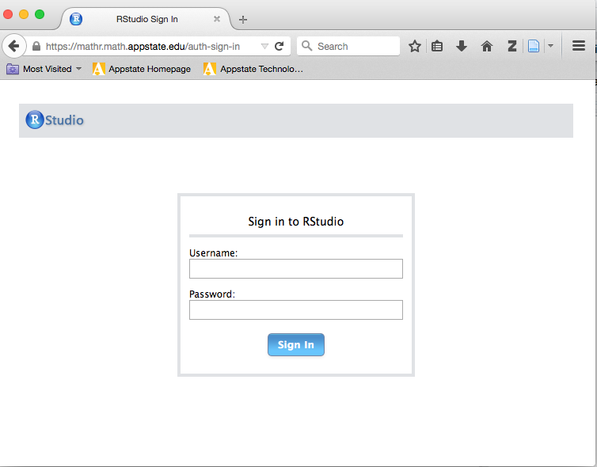

**Instructor:**  Dr. Alan T. Arnholt    
**Office:** Walker Hall 237      
**Office Hours:** 10-11:30 M, W, and F

Make an appointment to see me by clicking https://arnholtat.youcanbook.me/.

Course related questions should be addressed with the [piazza account for STT 5811](https://piazza.com/class/iq8iqvom1771j4). 

**Course Description:**  

This course introduces students at the post-calculus level to statistical concepts, applications, and theory. Topics include: comparisons with categorical and numerical data, statistical significance, sampling and sampling distributions, and randomized experiments. Statistical concepts will be developed through simulations, and applications will focus on statistical problem-solving.  Students will complete three research projects using principles of reproducible research.

**Course Objectives:**

1.  Students will learn how to use a reproducible research work flow.
2.  Students will improve their technology expertise.
3.  Students will learn to work with large data sets.
4.  Students will learn to create and present graphs for both univariate and multivariate data.
5.  Students will learn how to construct and test hypotheses using both classical and randomization approaches.
6.  Students will learn how to construct confidence intervals using both classical and bootstrap approaches.
7.  Students will learn how to generate random and simple random samples and their relationships to permutation and bootstrap distributions.
8.  Students will learn how to work with named sampling distributions (*t*, *F*, binomial, chi-square, hypergeometric, and normal).
9.  Students will learn the scope of inferential conclusions for numerous scenarios (experiments, observational studies, etc.). 

**Course Texts:**

[_OpenIntro Statistics, 3rd Edition_](https://www.openintro.org/stat/textbook.php?stat_book=os)

[_Passion Driven Statistics_](https://alanarnholt.github.io/PDS-BookDown/BookDownTry/book/overview.html) also available on [Rpubs](http://rpubs.com/arnholt/193630). 

[_Reproducible Research with R and RStudio, Second Edition_](https://github.com/christophergandrud/Rep-Res-Book) by Christopher Gandrud

**Course Grading:**

* 54% of the course grade will come from the nine course labs (6% each lab)

* 30% of the course grade will come from the three course projects (10% each project) 

* 16% of the course grade will come from the Midterm exam

If you know you will be absent at any point in the semester for any reason, please let me know beforehand; and make sure to submit your work via [CrowdGrader](http://www.crowdgrader.org/) before the due date.  

      

**How To Get Unstuck**

Please ask questions on the [STT 5811 piazza account](https://piazza.com/class/iq8iqvom1771j4). Your classmates may have the same question or may answer your question before I can provide an answer.  Well constructed questions will elicit answers more rapidly than poorly constructed questions.  This [video](https://www.youtube.com/watch?v=ZFaWxxzouCY&list=PLjTlxb-wKvXNSDfcKPFH2gzHGyjpeCZmJ&index=3) provides some background on asking questions.  This stackoverflow thread details how to create a [minimal R reproducible example](http://stackoverflow.com/questions/5963269/how-to-make-a-great-r-reproducible-example/5963610#5963610). Please read [How To Ask Questions The Smart Way](http://www.catb.org/~esr/faqs/smart-questions.html) by Eric Raymond and Rick Moen and heed their advice.

**University Policies**

This course conforms with all Appalachian State University policies with respect to academic integrity, disability services, and class attendance.  The details of the policies may be found at <http://academicaffairs.appstate.edu/resources/syllabi>.

**Computers and Software**

This course will use the RStudio server  (https://mathr.math.appstate.edu/) that has the programs listed below and more installed.

* [R](http://cran.r-project.org) 
* [Git](http://git-scm.com/downloads) 
* [RStudio](http://www.rstudio.com/products/rstudio/download/)
* [LaTeX](http://www.ctan.org/starter)

You must have an active internet connection and be registered in the course to access the server. To access the server, point any web browser to <https://mathr.math.appstate.edu/>.  You will need to acknowledge the connection is unsecure and possibly add a security exception to your web browser. Use your Appstate Username and Password to access the server.  A screen shot of the RStudio server is shown below.

If you have problems with your Appstate Username or Password visit [IT Support Services](http://support.appstate.edu/) or call 262-6266.  

